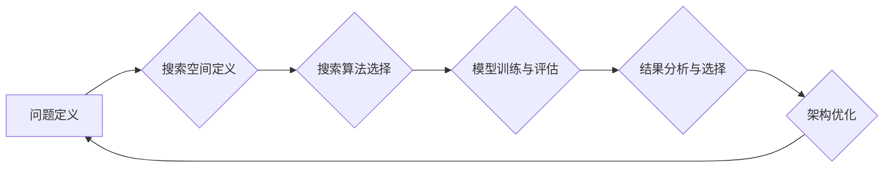

> 神经网络架构搜索 (NAS)，自动机器学习 (AutoML)，深度学习，卷积神经网络 (CNN)，循环神经网络 (RNN)，强化学习，遗传算法，深度学习框架

## 1. 背景介绍

深度学习近年来取得了令人瞩目的成就，在图像识别、自然语言处理、语音识别等领域取得了突破性的进展。然而，设计高效、准确的神经网络架构仍然是一个复杂且耗时的过程，通常需要人工经验和大量的试错。

神经网络架构搜索 (NAS) 作为自动机器学习 (AutoML) 的重要分支，旨在自动搜索最优或接近最优的神经网络架构，从而解放人类从繁琐的架构设计中解放出来，提高深度学习模型的效率和性能。

## 2. 核心概念与联系

NAS的核心思想是利用搜索算法自动探索可能的网络结构，并根据预设的评估指标选择最优的架构。

**NAS流程图:**



**核心概念:**

* **搜索空间:** 包含所有可能的网络结构，包括层数、层类型、通道数、激活函数等参数。
* **搜索算法:** 用于探索搜索空间，例如遗传算法、强化学习、进化算法等。
* **评估指标:** 用于衡量模型性能，例如准确率、损失函数值、训练时间等。

## 3. 核心算法原理 & 具体操作步骤

### 3.1  算法原理概述

NAS算法通常分为以下几个步骤：

1. **定义搜索空间:** 确定网络结构的搜索范围，例如层数、层类型、通道数等参数的取值范围。
2. **选择搜索算法:** 根据搜索空间的特性和资源限制选择合适的搜索算法，例如遗传算法、强化学习、进化算法等。
3. **训练和评估模型:** 使用搜索算法生成的网络结构训练模型，并根据预设的评估指标评估模型性能。
4. **选择最优架构:** 选择性能最好的网络结构作为最终的模型架构。

### 3.2  算法步骤详解

**遗传算法:**

1. **初始化种群:** 生成初始的网络结构集合，称为种群。
2. **评估适应度:** 计算每个网络结构的适应度，即模型性能。
3. **选择:** 根据适应度选择部分网络结构作为父代，进行交叉和变异操作。
4. **交叉和变异:** 将父代网络结构进行交叉和变异操作，生成新的网络结构。
5. **重复步骤2-4:** 重复上述步骤，直到达到终止条件，例如最大迭代次数或最佳适应度达到目标值。

**强化学习:**

1. **定义环境:** 将网络架构搜索问题定义为一个强化学习环境，其中状态表示当前网络结构，动作表示对网络结构进行修改，奖励表示模型性能。
2. **训练代理:** 使用强化学习算法训练一个代理，代理可以根据环境状态选择动作，并学习如何选择最优网络结构。
3. **评估代理:** 使用训练好的代理搜索网络结构，并评估代理选择的网络结构的性能。

### 3.3  算法优缺点

**遗传算法:**

* **优点:** 易于实现，并行性好。
* **缺点:** 容易陷入局部最优解，搜索效率较低。

**强化学习:**

* **优点:** 可以探索更广阔的搜索空间，找到更优的网络结构。
* **缺点:** 训练复杂，需要大量的训练数据和计算资源。

### 3.4  算法应用领域

NAS算法广泛应用于以下领域:

* **图像识别:** 自动搜索高效的卷积神经网络架构，提高图像识别精度。
* **自然语言处理:** 自动搜索高效的循环神经网络架构，提高文本分类、机器翻译等任务的性能。
* **语音识别:** 自动搜索高效的循环神经网络架构，提高语音识别准确率。

## 4. 数学模型和公式 & 详细讲解 & 举例说明

### 4.1  数学模型构建

NAS算法通常使用数学模型来表示网络结构和搜索空间。例如，可以使用树结构或图结构来表示网络架构，并使用数学公式来定义搜索空间的边界条件。

### 4.2  公式推导过程

NAS算法的搜索过程通常可以看作是一个优化问题，目标是找到最优的网络结构，使得模型性能达到最大。可以使用梯度下降等优化算法来求解这个优化问题。

### 4.3  案例分析与讲解

例如，可以使用遗传算法来搜索卷积神经网络的架构。

* **种群:** 初始的网络结构集合。
* **适应度函数:** 模型在测试集上的准确率。
* **交叉操作:** 将两个父代网络结构的某些部分进行交换。
* **变异操作:** 对网络结构中的某些参数进行随机修改。

通过重复上述步骤，可以逐渐找到性能最好的网络结构。

## 5. 项目实践：代码实例和详细解释说明

### 5.1  开发环境搭建

* Python 3.6+
* TensorFlow/PyTorch
* CUDA/cuDNN

### 5.2  源代码详细实现

```python
# 遗传算法实现NAS

import random

# 定义网络结构
class Network:
    def __init__(self, layers):
        self.layers = layers

    def evaluate(self):
        # 模型训练和评估
        pass

# 定义种群
population = [Network(random.sample(layers, random.randint(1, 5))) for _ in range(population_size)]

# 迭代搜索
for generation in range(num_generations):
    # 评估适应度
    fitness = [network.evaluate() for network in population]

    # 选择父代
    parents = random.choices(population, weights=fitness, k=num_parents)

    # 交叉和变异
    offspring = []
    for i in range(0, len(parents), 2):
        parent1, parent2 = parents[i], parents[i+1]
        # 交叉操作
        child1 = Network(random.sample(parent1.layers, random.randint(1, 5)))
        # 变异操作
        child2 = Network(random.sample(parent2.layers, random.randint(1, 5)))
        offspring.extend([child1, child2])

    # 更新种群
    population = offspring

# 选择最优架构
best_network = max(population, key=lambda network: network.evaluate())
```

### 5.3  代码解读与分析

* 代码首先定义了网络结构和评估函数。
* 然后，使用遗传算法进行搜索，包括初始化种群、评估适应度、选择父代、交叉和变异等步骤。
* 最后，选择性能最好的网络结构作为最终的模型架构。

### 5.4  运行结果展示

运行代码后，可以得到最优网络结构和相应的模型性能。

## 6. 实际应用场景

NAS技术在实际应用中具有广泛的应用场景，例如：

* **图像分类:** 自动搜索高效的卷积神经网络架构，提高图像分类精度。
* **目标检测:** 自动搜索高效的目标检测网络架构，提高目标检测的准确率和速度。
* **自然语言处理:** 自动搜索高效的循环神经网络架构，提高文本分类、机器翻译等任务的性能。

### 6.4  未来应用展望

随着深度学习技术的不断发展，NAS技术将发挥越来越重要的作用。未来，NAS技术将应用于更多领域，例如：

* **药物研发:** 自动搜索高效的药物分子结构。
* **材料科学:** 自动搜索具有特定性能的材料结构。
* **金融预测:** 自动搜索高效的金融预测模型。

## 7. 工具和资源推荐

### 7.1  学习资源推荐

* **论文:**
    * Zoph, B., & Le, Q. V. (2016). Neural architecture search with reinforcement learning. arXiv preprint arXiv:1611.01578.
    * Real, E., et al. (2019). Searching for efficient architectures. arXiv preprint arXiv:1905.09747.
* **书籍:**
    * Deep Learning with Python by Francois Chollet
    * Hands-On Machine Learning with Scikit-Learn, Keras & TensorFlow by Aurélien Géron

### 7.2  开发工具推荐

* **TensorFlow:** https://www.tensorflow.org/
* **PyTorch:** https://pytorch.org/
* **AutoML-Zero:** https://github.com/google-research/automl-zero

### 7.3  相关论文推荐

* **AutoML-Zero:** https://arxiv.org/abs/1806.09431
* **ENAS:** https://arxiv.org/abs/1802.03268
* **DARTS:** https://arxiv.org/abs/1806.09072

## 8. 总结：未来发展趋势与挑战

### 8.1  研究成果总结

NAS技术取得了显著的进展，在图像识别、自然语言处理等领域取得了突破性的成果。

### 8.2  未来发展趋势

* **更有效的搜索算法:** 研究更有效的搜索算法，例如基于强化学习的NAS算法。
* **更广泛的应用场景:** 将NAS技术应用于更多领域，例如药物研发、材料科学等。
* **可解释性:** 研究NAS算法的可解释性，以便更好地理解NAS算法的决策过程。

### 8.3  面临的挑战

* **计算资源:** NAS算法通常需要大量的计算资源，这限制了其应用范围。
* **搜索空间:** 深度学习模型的搜索空间非常庞大，搜索效率仍然是一个挑战。
* **可解释性:** NAS算法的决策过程通常难以解释，这限制了其在一些领域中的应用。

### 8.4  研究展望

未来，NAS技术将继续发展，并取得更大的突破。随着计算资源的不断增加和算法的不断改进，NAS技术将更加广泛地应用于各个领域，推动深度学习技术的进一步发展。

## 9. 附录：常见问题与解答

* **Q: NAS算法的搜索空间如何定义？**
* **A:** 搜索空间可以根据具体的应用场景和模型类型进行定义，通常包括网络层数、层类型、通道数、激活函数等参数的取值范围。

* **Q: NAS算法的效率如何？**
* **A:** NAS算法的效率取决于搜索算法、搜索空间的大小和计算资源等因素。

* **Q: NAS算法的应用场景有哪些？**
* **A:** NAS技术广泛应用于图像识别、自然语言处理、语音识别等领域。

作者：禅与计算机程序设计艺术 / Zen and the Art of Computer Programming


<end_of_turn>