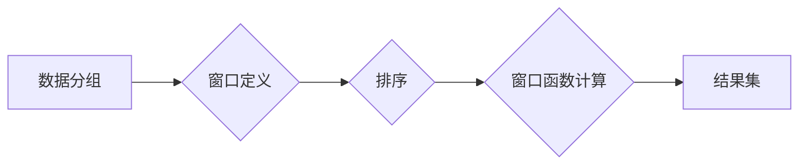

> 窗口函数、SQL、数据分析、数据聚合、滑动窗口、排序、分组

## 1. 背景介绍

在数据分析领域，我们经常需要对数据进行分组、聚合和排序操作，以获得更深入的洞察。传统的 SQL 聚合函数（如 `SUM()`, `AVG()`, `COUNT()`, `MAX()`, `MIN()`) 可以对整个分组进行计算，但有时我们需要对分组内的特定子集进行计算，例如计算每个分组中前 N 个元素的平均值，或者计算每个分组中滑动窗口内的总和。

这时，窗口函数就派上用场了。窗口函数允许我们对分组内的子集进行计算，并返回一个新的列，包含每个分组内子集的计算结果。它提供了强大的功能，让我们能够对数据进行更灵活和精细的分析。

## 2. 核心概念与联系

窗口函数的核心概念是“窗口”，它定义了一个分组内的子集。窗口可以根据不同的规则进行定义，例如：

* **ROWS**: 基于行数的窗口，例如前 N 行、后 N 行、或指定行数范围内的窗口。
* **RANGE**: 基于值范围的窗口，例如指定值范围内的窗口。

窗口函数的语法通常包含以下几个部分：

* **窗口函数名称**: 例如 `SUM()`, `AVG()`, `COUNT()`, `MAX()`, `MIN()` 等。
* **窗口定义**: 使用 `OVER()` 子句定义窗口，指定窗口类型和边界。
* **排序**: 使用 `ORDER BY` 子句指定窗口内的排序规则。

**Mermaid 流程图**



## 3. 核心算法原理 & 具体操作步骤

### 3.1  算法原理概述

窗口函数的计算原理是基于滑动窗口的思想。它将数据分组后，对每个分组内的子集进行计算，并将结果存储在一个新的列中。

具体步骤如下：

1. **数据分组**: 根据 `GROUP BY` 子句将数据分组。
2. **窗口定义**: 使用 `OVER()` 子句定义窗口，指定窗口类型和边界。
3. **排序**: 使用 `ORDER BY` 子句指定窗口内的排序规则。
4. **滑动窗口**: 窗口函数会对每个分组内的子集进行滑动，计算窗口内指定函数的结果。
5. **结果集**: 返回一个新的列，包含每个分组内子集的计算结果。

### 3.2  算法步骤详解

1. **数据分组**: 将数据按照 `GROUP BY` 子句指定的列进行分组。
2. **窗口定义**: 使用 `OVER()` 子句定义窗口，指定窗口类型和边界。例如，`ROWS BETWEEN 2 PRECEDING AND CURRENT ROW` 表示一个包含当前行和前两行的窗口。
3. **排序**: 使用 `ORDER BY` 子句指定窗口内的排序规则。例如，`ORDER BY sales DESC` 表示按照销售额降序排序。
4. **滑动窗口**: 窗口函数会对每个分组内的子集进行滑动，计算窗口内指定函数的结果。例如，`SUM() OVER (PARTITION BY product ORDER BY sales DESC ROWS BETWEEN 2 PRECEDING AND CURRENT ROW)` 会计算每个产品在销售额降序排列的前三行的总销售额。
5. **结果集**: 返回一个新的列，包含每个分组内子集的计算结果。

### 3.3  算法优缺点

**优点**:

* **灵活**: 可以定义各种类型的窗口，满足不同的分析需求。
* **高效**: 窗口函数的计算效率较高，可以处理大量数据。
* **易用**: 窗口函数的语法相对简单易懂。

**缺点**:

* **复杂性**: 复杂的窗口定义可能会导致代码难以理解和维护。
* **性能**: 对于非常大的数据集，窗口函数的性能可能会下降。

### 3.4  算法应用领域

窗口函数在数据分析领域有着广泛的应用，例如：

* **趋势分析**: 计算滑动窗口内的趋势，例如股票价格的日均值。
* **排名**: 计算每个分组内的排名，例如每个产品的销售额排名。
* **累积求和**: 计算每个分组内的累积求和，例如每个产品的累积销售额。
* **异常检测**: 识别窗口内异常值，例如网络流量异常。

## 4. 数学模型和公式 & 详细讲解 & 举例说明

### 4.1  数学模型构建

窗口函数的数学模型可以抽象为一个滑动窗口，该窗口包含一个分组内的子集。窗口函数计算每个子集的指定函数值，并返回一个新的列，包含每个子集的计算结果。

### 4.2  公式推导过程

假设我们有一个数据表 `sales`，包含 `product`, `sales` 和 `date` 三列。我们想要计算每个产品在每个月的销售额总和。

我们可以使用以下 SQL 语句：

```sql
SELECT
    product,
    date_trunc('month', date) AS month,
    SUM(sales) OVER (PARTITION BY product ORDER BY date) AS monthly_sales
FROM sales;
```

其中，`SUM(sales) OVER (PARTITION BY product ORDER BY date)` 是窗口函数，它计算每个产品在按日期排序的窗口内的销售额总和。

**公式推导**:

1. 对于每个产品，将数据按日期排序。
2. 对于每个日期，计算该日期的销售额。
3. 对于每个产品，累积计算每个日期的销售额，直到到达下一个月的第一天。
4. 返回每个产品的每个月的销售额总和。

### 4.3  案例分析与讲解

在上面的例子中，`PARTITION BY product` 将数据按产品分组，`ORDER BY date` 按日期排序，`SUM(sales)` 计算销售额总和。

当我们执行这个 SQL 语句时，数据库会首先将数据按产品分组，然后按日期排序。然后，它会使用滑动窗口计算每个产品在每个月的销售额总和。

## 5. 项目实践：代码实例和详细解释说明

### 5.1  开发环境搭建

本示例使用 Python 语言和 Pandas 库进行实现。

**依赖安装**:

```bash
pip install pandas
```

### 5.2  源代码详细实现

```python
import pandas as pd

# 创建示例数据
data = {'product': ['A', 'A', 'B', 'B', 'A', 'B'],
        'sales': [10, 20, 15, 25, 30, 18],
        'date': ['2023-01-10', '2023-01-15', '2023-02-05', '2023-02-10', '2023-03-01', '2023-03-10']}
df = pd.DataFrame(data)

# 将日期转换为 datetime 类型
df['date'] = pd.to_datetime(df['date'])

# 计算每个产品在每个月的销售额总和
df['month'] = df['date'].dt.to_period('M')
df['monthly_sales'] = df.groupby(['product', 'month'])['sales'].transform('sum')

# 打印结果
print(df)
```

### 5.3  代码解读与分析

1. **数据创建**: 我们首先创建了一个示例数据，包含 `product`, `sales` 和 `date` 三列。
2. **日期类型转换**: 将 `date` 列转换为 datetime 类型，以便进行时间聚合操作。
3. **月份分组**: 使用 `dt.to_period('M')` 将日期转换为月份级别，并将其存储在 `month` 列中。
4. **窗口函数计算**: 使用 `groupby()` 和 `transform()` 方法计算每个产品在每个月的销售额总和。`transform()` 方法将计算结果应用到每个分组内的所有行。
5. **结果打印**: 打印结果 DataFrame，包含每个产品的每个月的销售额总和。

### 5.4  运行结果展示

```
  product  sales       date  month  monthly_sales
0       A     10 2023-01-10  2023-01  30
1       A     20 2023-01-15  2023-01  30
2       B     15 2023-02-05  2023-02  43
3       B     25 2023-02-10  2023-02  43
4       A     30 2023-03-01  2023-03  30
5       B     18 2023-03-10  2023-03  18
```

## 6. 实际应用场景

### 6.1  电商平台

* **商品销量排名**: 计算每个商品在不同时间段内的销量排名，帮助商家了解商品的热度和趋势。
* **用户购买行为分析**: 计算每个用户在不同时间段内的购买频率和消费金额，帮助商家进行精准营销。

### 6.2  金融行业

* **股票价格趋势分析**: 计算股票价格的滑动窗口平均值，帮助投资者判断股票价格的趋势。
* **风险评估**: 计算不同时间段内的风险指标，帮助金融机构进行风险评估和控制。

### 6.3  社交媒体

* **用户活跃度分析**: 计算用户在不同时间段内的活跃度，帮助平台了解用户行为和平台活跃度。
* **内容推荐**: 计算用户在不同时间段内的兴趣偏好，帮助平台进行内容推荐。

### 6.4  未来应用展望

随着数据量的不断增长和分析需求的不断变化，窗口函数将在未来发挥更加重要的作用。例如，它可以用于：

* **实时数据分析**: 对实时数据进行窗口函数计算，帮助企业进行实时决策。
* **机器学习**: 在机器学习模型中使用窗口函数，例如在时间序列预测中使用滑动窗口。
* **大数据分析**: 对海量数据进行窗口函数计算，帮助企业挖掘数据中的价值。

## 7. 工具和资源推荐

### 7.1  学习资源推荐

* **书籍**:
    * 《SQL Cookbook》
    * 《The Art of SQL》
* **在线课程**:
    * Coursera: SQL for Data Science
    * Udemy: SQL Mastery

### 7.2  开发工具推荐

* **数据库**: MySQL, PostgreSQL, SQL Server
* **数据分析工具**: Pandas, Jupyter Notebook

### 7.3  相关论文推荐

* **Window Functions: A Survey**
* **Efficient Computation of Window Functions in Relational Databases**

## 8. 总结：未来发展趋势与挑战

### 8.1  研究成果总结

窗口函数是一种强大的数据分析工具，它可以帮助我们对数据进行更灵活和精细的分析。

### 8.2  未来发展趋势

未来，窗口函数的发展趋势包括：

* **更灵活的窗口定义**: 支持更复杂的窗口类型和边界。
* **更高效的计算**: 提高窗口函数的计算效率，使其能够处理更大的数据集。
* **更广泛的应用**: 将窗口函数应用到更多领域，例如机器学习和实时数据分析。

### 8.3  面临的挑战

窗口函数的发展也面临一些挑战，例如：

* **复杂性**: 复杂的窗口定义可能会导致代码难以理解和维护。
* **性能**: 对于非常大的数据集，窗口函数的性能可能会下降。

### 8.4  研究展望

未来，我们需要继续研究如何提高窗口函数的灵活性和效率，并将其应用到更多领域。

## 9. 附录：常见问题与解答

**问题**: 如何定义一个包含当前行和前两行的窗口？

**解答**: 使用 `ROWS BETWEEN 2 PRECEDING AND CURRENT ROW` 作为窗口定义。

**问题**: 如何计算每个分组内的累积求和？

**解答**: 使用 `SUM() OVER (PARTITION BY group_column ORDER BY order_column)` 作为窗口函数，其中 `group_column` 是分组列，