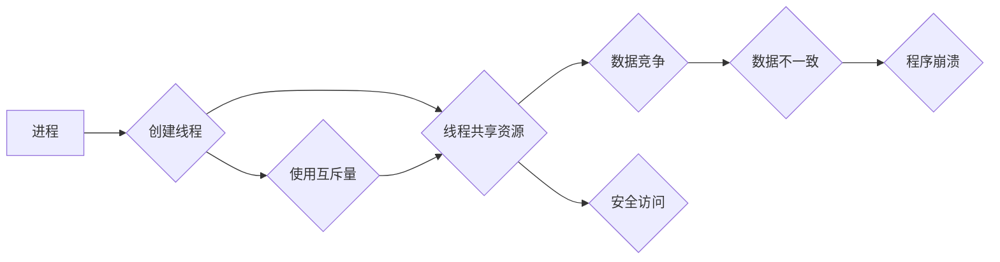

> 线程安全，LLM，并发，数据一致性，锁机制，互斥量，条件变量，生产者消费者问题

## 1. 背景介绍

大型语言模型 (LLM) 正在迅速发展，并在各个领域展现出强大的应用潜力。从文本生成、翻译到代码编写，LLM 正在改变着我们与信息交互的方式。然而，随着 LLM 的规模和复杂度不断提升，其安全性和可靠性也面临着新的挑战。其中，线程安全问题尤为突出。

线程安全是指在多线程环境下，程序能够正确地访问和修改共享资源，避免数据竞争和不可预期的行为。对于 LLM 而言，由于其处理海量数据和复杂的计算任务，通常需要采用多线程技术来提高效率。然而，如果线程安全问题没有得到妥善解决，可能会导致数据损坏、程序崩溃甚至安全漏洞。

## 2. 核心概念与联系

**2.1 线程与进程**

* **进程 (Process):** 进程是操作系统分配资源的基本单位，它拥有独立的内存空间、文件描述符等资源。进程之间相互隔离，无法直接访问对方的内存。
* **线程 (Thread):** 线程是进程内部的执行单元，它共享进程的资源，包括内存空间、文件描述符等。多个线程可以同时运行在同一个进程中，并共享进程的资源。

**2.2 数据竞争**

数据竞争是指多个线程同时访问和修改共享资源的情况。如果这些线程没有采取适当的同步机制，可能会导致数据不一致，甚至程序崩溃。

**2.3 线程安全问题**

线程安全问题是指在多线程环境下，程序无法正确地访问和修改共享资源，导致数据竞争、数据不一致等问题。

**2.4 线程同步机制**

线程同步机制是解决线程安全问题的关键技术。常用的线程同步机制包括：

* **互斥量 (Mutex):** 互斥量是一种同步机制，它允许只有一个线程同时访问共享资源。
* **条件变量 (Condition Variable):** 条件变量是一种同步机制，它允许线程等待特定条件的满足，然后才能访问共享资源。
* **信号量 (Semaphore):** 信号量是一种同步机制，它控制多个线程对共享资源的访问次数。

**2.5 Mermaid 流程图**



## 3. 核心算法原理 & 具体操作步骤

**3.1 算法原理概述**

线程安全算法的核心原理是通过同步机制来控制多个线程对共享资源的访问，避免数据竞争和数据不一致。常用的线程安全算法包括：

* **互斥锁算法:** 使用互斥锁来保证只有一个线程可以同时访问共享资源。
* **条件变量算法:** 使用条件变量来协调多个线程的访问，确保线程在特定条件下才能访问共享资源。
* **信号量算法:** 使用信号量来控制多个线程对共享资源的访问次数，避免资源被过度使用。

**3.2 算法步骤详解**

**3.2.1 互斥锁算法**

1. 创建一个互斥锁对象。
2. 在访问共享资源之前，获取互斥锁。
3. 在获取互斥锁成功后，访问共享资源。
4. 访问共享资源完成后，释放互斥锁。

**3.2.2 条件变量算法**

1. 创建一个条件变量对象。
2. 在访问共享资源之前，获取互斥锁。
3. 检查条件是否满足。
4. 如果条件满足，访问共享资源。
5. 如果条件不满足，释放互斥锁，等待条件变量通知。
6. 条件变量通知后，再次获取互斥锁，访问共享资源。

**3.2.3 信号量算法**

1. 创建一个信号量对象，初始值设置为资源的可用数量。
2. 在访问共享资源之前，获取信号量。
3. 如果信号量大于0，则访问共享资源，并减小信号量值。
4. 访问共享资源完成后，释放信号量。

**3.3 算法优缺点**

| 算法 | 优点 | 缺点 |
|---|---|---|
| 互斥锁 | 简单易用，保证了资源的互斥访问 | 容易造成死锁，性能较低 |
| 条件变量 | 可以实现更复杂的同步逻辑，避免死锁 | 编程复杂度较高 |
| 信号量 | 可以控制多个线程对资源的访问次数，提高资源利用率 | 编程复杂度较高 |

**3.4 算法应用领域**

线程安全算法广泛应用于各种领域，例如：

* **数据库系统:** 保证多个用户并发访问数据库时数据的一致性。
* **网络服务器:** 保证多个客户端并发访问服务器时数据的一致性。
* **多媒体处理:** 保证多个线程并发处理多媒体数据时数据的一致性。

## 4. 数学模型和公式 & 详细讲解 & 举例说明

**4.1 数学模型构建**

我们可以用一个简单的数学模型来描述线程安全问题。假设有n个线程，共享一个资源，资源的状态可以用一个变量x表示。每个线程都试图修改x的值。

**4.2 公式推导过程**

如果线程之间没有采取任何同步机制，那么每个线程都可能在同一时间修改x的值，导致数据不一致。我们可以用以下公式来描述这种情况：

```
x = x_1 + x_2 + ... + x_n
```

其中，x_i表示第i个线程修改x的值。

如果线程之间采取了同步机制，例如互斥锁，那么只有一个线程可以同时修改x的值，可以保证数据的一致性。

**4.3 案例分析与讲解**

**案例：生产者消费者问题**

生产者消费者问题是一个经典的线程同步问题。生产者线程负责生成数据，消费者线程负责消费数据。数据存储在共享缓冲区中。

**分析：**

* 如果没有同步机制，生产者线程可能会在缓冲区已满的情况下继续生产数据，消费者线程可能会在缓冲区为空的情况下继续消费数据，导致数据丢失或缓冲区溢出。
* 使用互斥锁和条件变量可以解决这个问题。互斥锁保证只有一个线程可以访问缓冲区，条件变量可以使生产者线程在缓冲区满时等待，使消费者线程在缓冲区空时等待。

## 5. 项目实践：代码实例和详细解释说明

**5.1 开发环境搭建**

* 操作系统：Linux
* 编程语言：Python
* 框架：threading

**5.2 源代码详细实现**

```python
import threading

class Producer(threading.Thread):
    def __init__(self, buffer):
        threading.Thread.__init__(self)
        self.buffer = buffer

    def run(self):
        for i in range(10):
            data = f"Data {i}"
            self.buffer.append(data)
            print(f"Producer produced: {data}")

class Consumer(threading.Thread):
    def __init__(self, buffer):
        threading.Thread.__init__(self)
        self.buffer = buffer

    def run(self):
        while True:
            if self.buffer:
                data = self.buffer.pop(0)
                print(f"Consumer consumed: {data}")
            else:
                print("Buffer is empty, waiting...")

# 创建缓冲区
buffer = []

# 创建生产者和消费者线程
producer = Producer(buffer)
consumer = Consumer(buffer)

# 启动线程
producer.start()
consumer.start()
```

**5.3 代码解读与分析**

* 两个线程分别实现了生产者和消费者功能。
* 缓冲区是一个列表，用于存储数据。
* 生产者线程循环生成数据并添加到缓冲区。
* 消费者线程循环从缓冲区获取数据并消费。
* 使用 `threading.Thread` 类创建线程，并使用 `start()` 方法启动线程。

**5.4 运行结果展示**

程序运行后，会输出生产者和消费者线程的日志，显示数据生产和消费的过程。

## 6. 实际应用场景

**6.1 LLM 数据处理**

LLM 的训练和推理过程通常需要处理海量数据，可以使用多线程技术提高效率。

**6.2 LLM 模型部署**

LLM 模型的部署通常需要处理多个用户的请求，可以使用多线程技术提高响应速度。

**6.3 LLM 应用开发**

LLM 应用开发中，例如聊天机器人、文本生成器等，也需要使用多线程技术来处理用户交互和数据处理。

**6.4 未来应用展望**

随着 LLM 的发展，线程安全问题将变得更加重要。未来，我们将看到更多针对 LLM 的线程安全解决方案，例如：

* 基于硬件的线程安全机制
* 基于软件的智能线程管理
* 基于机器学习的线程安全分析

## 7. 工具和资源推荐

**7.1 学习资源推荐**

* 《操作系统导论》
* 《并发编程艺术》
* 《深入理解Java虚拟机》

**7.2 开发工具推荐**

* Python
* Java
* C++

**7.3 相关论文推荐**

* "The Art of Multiprocessor Programming" by Maurice Herlihy and Nir Shavit
* "Concurrent Programming in Java" by Brian Goetz

## 8. 总结：未来发展趋势与挑战

**8.1 研究成果总结**

线程安全问题是一个长期存在且具有挑战性的问题。近年来，研究人员提出了许多解决方案，例如互斥锁、条件变量、信号量等。这些解决方案在一定程度上解决了线程安全问题，但也存在一些局限性。

**8.2 未来发展趋势**

未来，线程安全研究将朝着以下方向发展：

* 更高效的线程同步机制
* 基于硬件的线程安全机制
* 基于机器学习的线程安全分析

**8.3 面临的挑战**

线程安全问题仍然是一个具有挑战性的问题，未来还面临着以下挑战：

* 随着硬件和软件的复杂性不断提高，线程安全问题也变得更加复杂。
* 多核处理器和分布式系统等新技术也带来了新的线程安全挑战。
* 如何在保证线程安全的同时，提高程序的性能和效率，也是一个重要的研究方向。

**8.4 研究展望**

未来，我们将看到更多针对线程安全问题的创新研究成果，并最终实现更加安全、可靠的并发程序。

## 9. 附录：常见问题与解答

**9.1 什么是死锁？**

死锁是指两个或多个线程互相等待对方释放资源，导致所有线程都无法继续执行的情况。

**9.2 如何避免死锁？**

* 使用资源请求的顺序规则
* 使用超时机制
* 使用死锁检测和恢复机制

**9.3 什么是条件变量？**

条件变量是一种同步机制，它允许线程等待特定条件的满足，然后才能访问共享资源。


作者：禅与计算机程序设计艺术 / Zen and the Art of Computer Programming 
<end_of_turn>