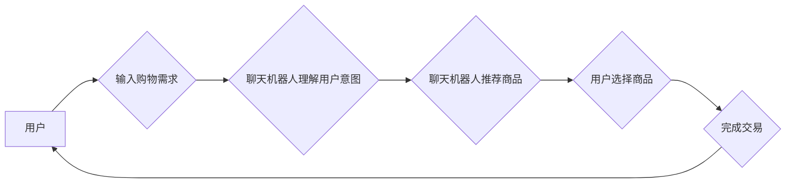

> 聊天机器人、自然语言处理、购物体验、人工智能、机器学习、对话系统

## 1. 背景介绍

在当今数字时代，购物体验已成为消费者关注的焦点。传统线下购物模式逐渐被线上购物所取代，而线上购物平台也日益竞争激烈。为了提升用户体验，商家纷纷寻求创新手段，其中人工智能（AI）技术扮演着越来越重要的角色。

聊天机器人作为AI技术的代表，凭借其能够模拟人类对话的能力，在电商领域展现出巨大的潜力。它可以为用户提供24/7的在线服务，解答购物疑问，推荐商品，甚至完成订单支付等操作，极大地提升了购物的便捷性和效率。

## 2. 核心概念与联系

### 2.1 聊天机器人

聊天机器人是一种能够通过自然语言与用户进行对话的软件程序。它通常基于规则或机器学习算法，能够理解用户的意图，并提供相应的回复。

### 2.2 自然语言处理（NLP）

自然语言处理是人工智能的一个分支，致力于使计算机能够理解、处理和生成人类语言。NLP技术是聊天机器人实现自然对话的关键技术之一。

### 2.3 购物体验

购物体验是指消费者在购物过程中所感受到的整体感受，包括商品质量、服务态度、购物环境等方面。

**核心概念与联系流程图**

## 3. 核心算法原理 & 具体操作步骤

### 3.1 算法原理概述

聊天机器人通常采用以下几种算法实现对话功能：

* **规则型聊天机器人:** 基于预设的规则和知识库，根据用户输入匹配相应的回复。
* **基于统计的聊天机器人:** 利用统计模型，例如n-gram模型，预测用户下一个词的可能性，从而生成回复。
* **深度学习型聊天机器人:** 基于深度神经网络，例如循环神经网络（RNN）和Transformer，学习用户对话模式，生成更自然流畅的回复。

### 3.2 算法步骤详解

以深度学习型聊天机器人为例，其训练过程如下：

1. **数据收集:** 收集大量对话数据，例如聊天记录、问答对等。
2. **数据预处理:** 对数据进行清洗、格式化和标记，例如分词、词性标注等。
3. **模型训练:** 使用深度学习框架，例如TensorFlow或PyTorch，训练深度神经网络模型。
4. **模型评估:** 使用测试数据评估模型的性能，例如准确率、流畅度等。
5. **模型部署:** 将训练好的模型部署到线上环境，供用户使用。

### 3.3 算法优缺点

**深度学习型聊天机器人:**

* **优点:** 能够生成更自然流畅的回复，适应性强。
* **缺点:** 训练数据量大，训练时间长，需要强大的计算资源。

### 3.4 算法应用领域

* **电商:** 提供在线客服、商品推荐、订单查询等服务。
* **金融:** 提供理财咨询、贷款申请、账户查询等服务。
* **医疗:** 提供疾病咨询、预约挂号、药品信息等服务。

## 4. 数学模型和公式 & 详细讲解 & 举例说明

### 4.1 数学模型构建

深度学习型聊天机器人通常采用循环神经网络（RNN）或Transformer模型。

**RNN模型:**

RNN模型能够处理序列数据，例如文本，并捕捉文本中的上下文信息。其核心结构是循环单元，能够将前一个时间步的输出作为当前时间步的输入，从而实现对序列信息的记忆。

**Transformer模型:**

Transformer模型是一种更先进的序列模型，它摒弃了RNN模型中的循环结构，而是使用注意力机制来捕捉文本中的长距离依赖关系。

### 4.2 公式推导过程

由于篇幅限制，此处不再详细推导RNN和Transformer模型的公式。

### 4.3 案例分析与讲解

假设用户输入“我想买一件红色的T恤”，聊天机器人可以使用RNN或Transformer模型分析用户输入，识别出用户意图是购买红色T恤，并根据商品数据库推荐相应的商品。

## 5. 项目实践：代码实例和详细解释说明

### 5.1 开发环境搭建

* Python 3.x
* TensorFlow或PyTorch深度学习框架
* NLTK自然语言处理库
* 其他必要的库，例如requests、beautifulsoup等

### 5.2 源代码详细实现

由于篇幅限制，此处不再提供完整的源代码。

### 5.3 代码解读与分析

* 数据预处理部分：对用户输入进行分词、词性标注等处理，以便模型理解。
* 模型训练部分：使用深度学习框架训练RNN或Transformer模型，并使用测试数据评估模型性能。
* 模型部署部分：将训练好的模型部署到线上环境，供用户使用。

### 5.4 运行结果展示

聊天机器人能够根据用户的输入，理解用户的意图，并提供相应的回复，例如推荐商品、回答问题等。

## 6. 实际应用场景

### 6.1 电商平台客服

聊天机器人可以作为电商平台的在线客服，解答用户关于商品、订单、物流等方面的疑问，提高用户满意度。

### 6.2 商品推荐

聊天机器人可以根据用户的购物历史、浏览记录等信息，推荐个性化的商品，提升用户购物体验。

### 6.3 个性化营销

聊天机器人可以根据用户的兴趣爱好、购买习惯等信息，进行个性化的营销推广，提高营销效果。

### 6.4 未来应用展望

随着人工智能技术的不断发展，聊天机器人将在更多领域得到应用，例如教育、医疗、金融等。

## 7. 工具和资源推荐

### 7.1 学习资源推荐

* **书籍:**
    * 《深度学习》
    * 《自然语言处理》
* **在线课程:**
    * Coursera
    * edX
* **开源项目:**
    * Rasa
    * Dialogflow

### 7.2 开发工具推荐

* **Python:** 
* **TensorFlow:** 
* **PyTorch:** 
* **NLTK:** 

### 7.3 相关论文推荐

* 《Attention Is All You Need》
* 《BERT: Pre-training of Deep Bidirectional Transformers for Language Understanding》

## 8. 总结：未来发展趋势与挑战

### 8.1 研究成果总结

聊天机器人技术近年来取得了显著进展，能够实现更自然、更智能的对话。

### 8.2 未来发展趋势

* **更强大的语言理解能力:** 聊天机器人将能够更好地理解用户的复杂意图和情感。
* **更个性化的对话体验:** 聊天机器人将能够根据用户的个人喜好和需求，提供更个性化的服务。
* **更广泛的应用场景:** 聊天机器人将应用于更多领域，例如教育、医疗、金融等。

### 8.3 面临的挑战

* **数据标注问题:** 训练高质量的聊天机器人模型需要大量的标注数据，而数据标注工作成本高、效率低。
* **对话流畅度问题:** 尽管深度学习技术取得了进展，但聊天机器人的对话仍然缺乏自然流畅度。
* **伦理问题:** 聊天机器人可能会被用于欺骗、传播虚假信息等恶意目的，需要关注其伦理问题。

### 8.4 研究展望

未来，研究者将继续致力于提升聊天机器人的语言理解能力、对话流畅度和安全性，使其能够更好地服务于人类。

## 9. 附录：常见问题与解答

* **Q: 如何训练一个聊天机器人？**
* **A:** 训练一个聊天机器人需要收集大量对话数据，对数据进行预处理，选择合适的模型，并使用深度学习框架进行训练。

* **Q: 聊天机器人有哪些应用场景？**
* **A:** 聊天机器人可以应用于电商、金融、医疗、教育等多个领域。

* **Q: 聊天机器人的未来发展趋势是什么？**
* **A:** 聊天机器人的未来发展趋势是更强大的语言理解能力、更个性化的对话体验和更广泛的应用场景。

作者：禅与计算机程序设计艺术 / Zen and the Art of Computer Programming 
<end_of_turn>