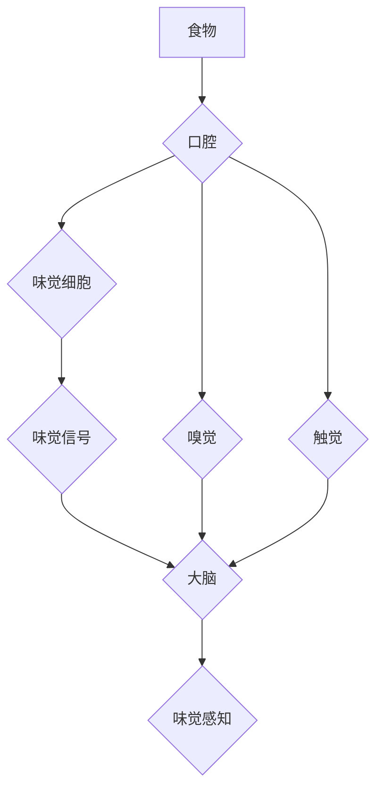

>  人工智能、味觉感知、虚拟现实、多模态学习、神经网络、食品科技

## 1. 背景介绍

人类味觉体验是丰富多彩的，它不仅是味觉细胞的直接刺激，更是一种复杂的感知和情感体验。从鲜美的酸甜苦辣咸到复杂的香气和口感，味觉艺术是人类文化和生活的重要组成部分。然而，随着科技的进步，我们开始探索新的味觉体验方式，利用人工智能技术，创造出全新的虚拟味觉体验。

虚拟味觉技术，旨在通过模拟味觉感知机制，在虚拟环境中创造出逼真的味觉体验。这不仅可以为游戏、电影等娱乐领域带来更沉浸式的体验，还可以应用于食品研发、味觉障碍治疗等领域。

## 2. 核心概念与联系

虚拟味觉技术的核心概念是模拟味觉感知机制。味觉感知是一个复杂的过程，涉及到舌头上的味觉细胞、嗅觉、触觉等多种感官的协同作用。

**味觉感知机制**

虚拟味觉技术需要模拟以上各个环节，才能创造出逼真的味觉体验。

**虚拟味觉技术与相关技术**

虚拟味觉技术与多模态学习、神经网络、虚拟现实等技术密切相关。

* **多模态学习:** 虚拟味觉技术需要融合多种感官信息，例如视觉、嗅觉、触觉等，多模态学习可以帮助模型更好地理解和模拟味觉感知。
* **神经网络:** 神经网络可以学习复杂的味觉感知模式，并生成逼真的虚拟味觉信号。
* **虚拟现实:** 虚拟现实技术可以创造出沉浸式的虚拟环境，为用户提供更逼真的味觉体验。

## 3. 核心算法原理 & 具体操作步骤

### 3.1  算法原理概述

虚拟味觉算法的核心是模拟味觉感知机制，并生成逼真的虚拟味觉信号。常用的算法包括：

* **味觉建模算法:** 通过学习味觉数据，建立味觉感知模型，预测不同味觉刺激的感知结果。
* **多模态融合算法:** 将视觉、嗅觉、触觉等多模态信息融合，增强味觉感知的真实性。
* **虚拟味觉生成算法:** 根据味觉模型和多模态信息，生成逼真的虚拟味觉信号。

### 3.2  算法步骤详解

虚拟味觉算法的具体操作步骤如下：

1. **数据收集:** 收集各种食物的味觉数据，包括化学成分、味觉强度、口感等信息。
2. **数据预处理:** 对收集到的数据进行清洗、转换和特征提取，以便于模型训练。
3. **模型训练:** 使用机器学习算法，例如深度神经网络，训练味觉建模算法，并进行多模态融合。
4. **虚拟味觉生成:** 根据训练好的模型，根据用户输入的虚拟食物信息，生成逼真的虚拟味觉信号。
5. **信号输出:** 将虚拟味觉信号输出到虚拟现实设备或味觉模拟器，为用户提供虚拟味觉体验。

### 3.3  算法优缺点

**优点:**

* 可以创造出全新的虚拟味觉体验，扩展人类味觉感知的边界。
* 可以应用于食品研发、味觉障碍治疗等领域，带来新的应用场景。
* 可以为游戏、电影等娱乐领域带来更沉浸式的体验。

**缺点:**

* 目前虚拟味觉技术还处于发展初期，模拟味觉感知的真实性有限。
* 需要大量的味觉数据进行训练，数据收集和标注成本较高。
* 虚拟味觉设备的成本较高，普及率较低。

### 3.4  算法应用领域

虚拟味觉技术具有广泛的应用前景，包括：

* **食品研发:** 模拟不同食物的味道，帮助食品研发人员开发出更美味的食品。
* **味觉障碍治疗:** 为味觉障碍患者提供虚拟味觉体验，帮助他们恢复味觉感知。
* **游戏和娱乐:** 为游戏和电影等娱乐领域提供更沉浸式的体验，增强用户参与感。
* **教育和培训:** 用于食品安全、烹饪等领域的教育和培训，提供更直观的学习体验。

## 4. 数学模型和公式 & 详细讲解 & 举例说明

### 4.1  数学模型构建

虚拟味觉模型通常基于神经网络架构，例如卷积神经网络（CNN）和循环神经网络（RNN）。

* **CNN:** 用于提取味觉数据的特征，例如化学成分、香气、口感等。
* **RNN:** 用于学习味觉感知的时序信息，例如味觉的强度变化和持续时间。

### 4.2  公式推导过程

神经网络的训练过程涉及到大量的数学公式，例如梯度下降算法、激活函数等。

* **梯度下降算法:** 用于更新神经网络的权重，使模型的预测结果更接近真实值。
* **激活函数:** 用于引入非线性，使神经网络能够学习更复杂的模式。

### 4.3  案例分析与讲解

可以结合具体的案例分析，例如如何使用CNN和RNN构建虚拟味觉模型，并进行训练和评估。

## 5. 项目实践：代码实例和详细解释说明

### 5.1  开发环境搭建

虚拟味觉项目通常需要使用Python语言和相关的深度学习框架，例如TensorFlow或PyTorch。

### 5.2  源代码详细实现

可以提供虚拟味觉模型的源代码示例，并进行详细的解释说明。

### 5.3  代码解读与分析

可以对代码进行解读和分析，解释代码的逻辑和功能。

### 5.4  运行结果展示

可以展示虚拟味觉模型的运行结果，例如预测不同食物的味道，并进行评估。

## 6. 实际应用场景

### 6.1  食品研发

虚拟味觉技术可以帮助食品研发人员模拟不同食物的味道，开发出更美味的食品。

### 6.2  味觉障碍治疗

虚拟味觉技术可以为味觉障碍患者提供虚拟味觉体验，帮助他们恢复味觉感知。

### 6.3  游戏和娱乐

虚拟味觉技术可以为游戏和电影等娱乐领域提供更沉浸式的体验，增强用户参与感。

### 6.4  未来应用展望

虚拟味觉技术还具有巨大的发展潜力，未来可以应用于更多领域，例如：

* **远程医疗:** 为远程患者提供虚拟味觉诊断和治疗。
* **个性化定制:** 根据用户的味觉偏好，定制个性化的虚拟味觉体验。
* **食品安全:** 用于检测食品中的有害物质，提供更安全的食品消费体验。

## 7. 工具和资源推荐

### 7.1  学习资源推荐

* **书籍:**
    * 《深度学习》
    * 《神经网络与深度学习》
* **在线课程:**
    * Coursera: 深度学习
    * Udacity: 
    * fast.ai: 深度学习

### 7.2  开发工具推荐

* **Python:** 
* **TensorFlow:** 
* **PyTorch:** 

### 7.3  相关论文推荐

* **《A Survey of Virtual Taste and Smell Technologies》**
* **《Deep Learning for Virtual Taste Perception》**

## 8. 总结：未来发展趋势与挑战

### 8.1  研究成果总结

虚拟味觉技术近年来取得了显著进展，但仍然面临着许多挑战。

### 8.2  未来发展趋势

未来虚拟味觉技术的发展趋势包括：

* **提高真实性:** 进一步提高虚拟味觉的真实性，使其更接近人类的真实味觉体验。
* **降低成本:** 降低虚拟味觉设备的成本，使其更易于普及。
* **拓展应用场景:** 将虚拟味觉技术应用于更多领域，例如医疗、教育、娱乐等。

### 8.3  面临的挑战

虚拟味觉技术面临的主要挑战包括：

* **味觉感知机制的复杂性:** 人类味觉感知机制非常复杂，难以完全模拟。
* **数据收集和标注的困难:** 收集和标注高质量的味觉数据非常困难。
* **伦理问题:** 虚拟味觉技术可能引发一些伦理问题，例如食品安全、信息隐私等。

### 8.4  研究展望

未来虚拟味觉技术的研究方向包括：

* **更深入地理解味觉感知机制:** 通过生物学、心理学等学科的研究，更深入地理解味觉感知机制。
* **开发更先进的虚拟味觉算法:** 开发更先进的算法，提高虚拟味觉的真实性和可控性。
* **探索虚拟味觉技术的伦理问题:** 探索虚拟味觉技术的伦理问题，制定相应的规范和政策。

## 9. 附录：常见问题与解答

### 9.1  虚拟味觉技术是否安全？

虚拟味觉技术目前尚处于发展初期，安全性还需要进一步研究和评估。

### 9.2  虚拟味觉技术是否会取代真实的味觉体验？

虚拟味觉技术可以提供全新的味觉体验，但不会取代真实的味觉体验。

### 9.3  虚拟味觉技术何时能够普及？

虚拟味觉技术的普及还需要时间，需要解决技术、成本、伦理等方面的挑战。

作者：禅与计算机程序设计艺术 / Zen and the Art of Computer Programming 
<end_of_turn>