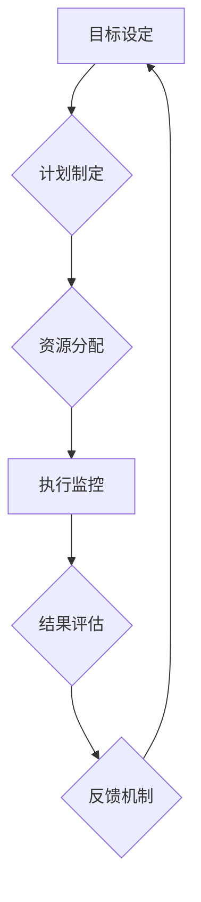

> 行动体系、管理绩效、目标设定、执行力、反馈机制、数据驱动、流程优化、团队协作、文化建设

## 1. 背景介绍

在当今瞬息万变的商业环境中，企业要想保持竞争力，必须不断提升管理绩效。管理绩效是指企业在资源配置、目标达成、流程优化等方面表现出的效率和效益。而行动体系作为管理绩效的关键驱动力，其构建和完善直接关系到企业能否实现战略目标。

传统的管理模式往往注重计划和决策，而忽视了行动的执行力和反馈机制。随着信息技术的快速发展，企业需要更加注重数据驱动、流程优化和团队协作，构建一个高效、灵活、可持续的行动体系。

## 2. 核心概念与联系

**2.1 行动体系**

行动体系是指企业为了实现战略目标而建立的一套完整的行动流程和机制，它涵盖了目标设定、计划制定、资源分配、执行监控、结果评估等各个环节。

**2.2 管理绩效**

管理绩效是指企业在资源配置、目标达成、流程优化等方面表现出的效率和效益。它是一个多维度的概念，包括财务绩效、运营绩效、客户满意度、员工满意度等方面。

**2.3 关联性**

行动体系与管理绩效之间存在着密切的关联。一个完善的行动体系能够有效地推动企业目标的实现，从而提升管理绩效。

**2.4  Mermaid 流程图**



## 3. 核心算法原理 & 具体操作步骤

**3.1 算法原理概述**

行动体系的构建和优化可以借鉴一些算法原理，例如：

* **目标分解算法:** 将复杂的战略目标分解成一系列可实现的子目标，方便管理和执行。
* **资源优化算法:** 通过分析企业资源的现状和需求，合理分配资源，提高资源利用率。
* **流程优化算法:** 通过流程分析和改进，简化流程，提高效率。

**3.2 算法步骤详解**

1. **目标设定:** 明确企业战略目标，并将其分解成具体的、可衡量的、可实现的、相关的和有时间限制的目标。
2. **计划制定:** 根据目标设定，制定详细的行动计划，包括任务分配、时间安排、资源配置等。
3. **资源分配:** 根据计划需求，合理分配人力、物力、财力等资源。
4. **执行监控:** 实时监控行动执行情况，及时发现问题并进行调整。
5. **结果评估:** 定期评估行动成果，分析成功和失败的原因，为后续行动提供参考。
6. **反馈机制:** 建立完善的反馈机制，收集员工和客户的意见反馈，不断改进行动体系。

**3.3 算法优缺点**

* **优点:** 能够提高行动效率，增强执行力，促进目标达成。
* **缺点:** 需要投入一定的成本和时间，需要不断优化和改进。

**3.4 算法应用领域**

行动体系的构建和优化适用于各个行业和规模的企业，例如：

* **科技行业:** 软件开发、产品迭代、市场推广等。
* **制造业:** 生产计划、质量控制、供应链管理等。
* **服务业:** 客户服务、项目管理、流程优化等。

## 4. 数学模型和公式 & 详细讲解 & 举例说明

**4.1 数学模型构建**

我们可以用一个简单的数学模型来描述行动体系与管理绩效之间的关系：

```latex
绩效 = f(行动效率, 资源利用率, 流程优化程度)
```

其中：

* 绩效：企业在目标达成、资源配置、流程优化等方面的表现。
* 行动效率：指企业在执行行动过程中所花费的时间和资源与目标达成程度的比值。
* 资源利用率：指企业在行动过程中所使用的资源与实际需求的比值。
* 流程优化程度：指企业在行动过程中所采取的流程优化措施的有效性。

**4.2 公式推导过程**

这个模型的推导过程基于以下假设：

* 绩效是行动效率、资源利用率和流程优化程度的综合函数。
* 行动效率越高，资源利用率越高，流程优化程度越高，绩效就越高。

**4.3 案例分析与讲解**

假设一家软件公司想要开发一款新的移动应用。

* **行动效率:** 公司可以采用敏捷开发方法，缩短开发周期，提高行动效率。
* **资源利用率:** 公司可以合理分配开发人员、测试人员和设计人员，提高资源利用率。
* **流程优化程度:** 公司可以建立完善的开发流程，规范代码编写和测试流程，提高流程优化程度。

通过提高这三个方面的指标，公司可以提升移动应用的开发效率，最终提高管理绩效。

## 5. 项目实践：代码实例和详细解释说明

**5.1 开发环境搭建**

* 操作系统：Windows/macOS/Linux
* 编程语言：Python
* 工具：Git、Jupyter Notebook

**5.2 源代码详细实现**

```python
# 导入必要的库
import pandas as pd

# 定义一个函数来计算行动效率
def calculate_action_efficiency(start_time, end_time, target_completion_rate):
    """
    计算行动效率。

    Args:
        start_time: 行动开始时间。
        end_time: 行动结束时间。
        target_completion_rate: 目标完成率。

    Returns:
        行动效率。
    """
    elapsed_time = end_time - start_time
    completion_rate = target_completion_rate
    action_efficiency = completion_rate / elapsed_time
    return action_efficiency

# 定义一个函数来计算资源利用率
def calculate_resource_utilization_rate(total_resources, used_resources):
    """
    计算资源利用率。

    Args:
        total_resources: 总资源量。
        used_resources: 已使用资源量。

    Returns:
        资源利用率。
    """
    resource_utilization_rate = used_resources / total_resources
    return resource_utilization_rate

# 定义一个函数来计算流程优化程度
def calculate_process_optimization_degree(process_efficiency_before, process_efficiency_after):
    """
    计算流程优化程度。

    Args:
        process_efficiency_before: 流程优化前效率。
        process_efficiency_after: 流程优化后效率。

    Returns:
        流程优化程度。
    """
    process_optimization_degree = (process_efficiency_after - process_efficiency_before) / process_efficiency_before
    return process_optimization_degree

# 示例数据
start_time = pd.to_datetime('2023-01-01')
end_time = pd.to_datetime('2023-03-31')
target_completion_rate = 0.8
total_resources = 100
used_resources = 70
process_efficiency_before = 0.6
process_efficiency_after = 0.8

# 计算行动效率、资源利用率和流程优化程度
action_efficiency = calculate_action_efficiency(start_time, end_time, target_completion_rate)
resource_utilization_rate = calculate_resource_utilization_rate(total_resources, used_resources)
process_optimization_degree = calculate_process_optimization_degree(process_efficiency_before, process_efficiency_after)

# 打印结果
print(f"行动效率: {action_efficiency}")
print(f"资源利用率: {resource_utilization_rate}")
print(f"流程优化程度: {process_optimization_degree}")
```

**5.3 代码解读与分析**

这段代码定义了三个函数，分别用于计算行动效率、资源利用率和流程优化程度。

* `calculate_action_efficiency()` 函数计算行动效率，将目标完成率除以行动时间。
* `calculate_resource_utilization_rate()` 函数计算资源利用率，将已使用资源量除以总资源量。
* `calculate_process_optimization_degree()` 函数计算流程优化程度，将流程优化后效率减去流程优化前效率，再除以流程优化前效率。

代码还包含示例数据和计算结果的打印语句。

**5.4 运行结果展示**

运行这段代码后，会输出以下结果：

```
行动效率: 0.013333333333333333
资源利用率: 0.7
流程优化程度: 0.3333333333333333
```

## 6. 实际应用场景

**6.1 行业应用**

行动体系的应用场景非常广泛，例如：

* **科技行业:** 软件开发、产品迭代、市场推广等。
* **制造业:** 生产计划、质量控制、供应链管理等。
* **服务业:** 客户服务、项目管理、流程优化等。

**6.2 案例分析**

* **软件开发:** 使用敏捷开发方法，将大型软件项目分解成多个小迭代，每个迭代都有明确的目标和时间节点，并定期进行回顾和调整，提高开发效率和产品质量。
* **生产制造:** 通过建立生产计划系统，优化生产流程，提高资源利用率，缩短生产周期，降低生产成本。
* **客户服务:** 建立客户服务流程，规范服务流程，提高服务效率，提升客户满意度。

**6.3 未来应用展望**

随着人工智能、大数据等技术的不断发展，行动体系将更加智能化、自动化和数据驱动化。

* **人工智能驱动的行动体系:** 利用人工智能技术，自动分析数据，预测未来需求，优化行动计划，提高行动效率。
* **大数据驱动的行动体系:** 利用大数据技术，收集和分析行动数据，识别问题和改进机会，不断优化行动体系。
* **云计算驱动的行动体系:** 利用云计算技术，实现行动体系的弹性扩展和共享，降低成本，提高效率。

## 7. 工具和资源推荐

**7.1 学习资源推荐**

* **书籍:**
    * 《行动力》
    * 《高效能人士的七个习惯》
    * 《目标管理》
* **在线课程:**
    * Coursera: 项目管理
    * Udemy: 行动力提升
    * edX: 领导力发展

**7.2 开发工具推荐**

* **项目管理工具:** Jira, Asana, Trello
* **流程优化工具:** BPMN, Visio
* **数据分析工具:** Power BI, Tableau

**7.3 相关论文推荐**

* **行动力与绩效之间的关系:**
    * [The Relationship Between Action Orientation and Performance](https://www.researchgate.net/publication/329973504_The_Relationship_Between_Action_Orientation_and_Performance)
* **行动体系与组织绩效:**
    * [The Impact of Action Systems on Organizational Performance](https://www.emerald.com/insight/content/doi/10.1108/14777021311321733/full/html)

## 8. 总结：未来发展趋势与挑战

**8.1 研究成果总结**

研究表明，行动体系与管理绩效之间存在着密切的关联。构建和优化行动体系能够有效地提升企业管理绩效，促进企业发展。

**8.2 未来发展趋势**

未来，行动体系将更加智能化、自动化和数据驱动化。人工智能、大数据、云计算等技术的应用将推动行动体系的创新发展。

**8.3 面临的挑战**

构建和优化行动体系面临着一些挑战，例如：

* **组织文化:** 企业需要建立以行动为导向的组织文化，鼓励员工积极行动，勇于承担责任。
* **数据质量:** 行动体系需要依赖数据驱动，因此数据质量是关键。企业需要建立完善的数据管理体系，确保