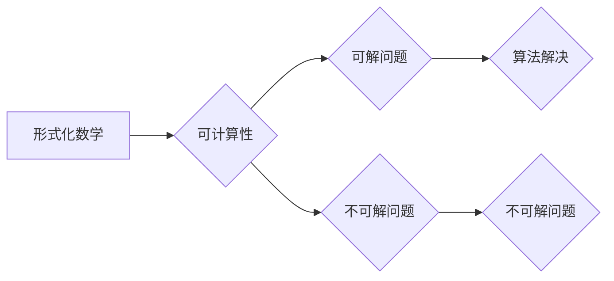

> 计算理论，希尔伯特，希尔伯特问题，形式化，数学逻辑，可计算性，不可解性

## 1. 背景介绍

20世纪初，数学领域掀起了深刻的变革。从传统的几何学、代数学转向了更抽象、更形式化的数学逻辑和集合论。这一时期，德国数学家大卫·希尔伯特（David Hilbert）成为了数学界的领军人物，他提出了著名的“希尔伯特计划”，旨在将数学完全形式化，并通过逻辑推理来解决数学中的所有问题。

希尔伯特计划的提出，对计算理论的发展产生了深远的影响。它强调了数学的逻辑性和形式化，为计算理论的建立奠定了基础。同时，希尔伯特计划也引发了关于计算能力的本质问题，即哪些问题可以通过算法解决，哪些问题无法解决。

## 2. 核心概念与联系

**2.1  形式化数学**

希尔伯特认为，数学的本质是逻辑推理，而逻辑推理需要建立在形式化的基础上。他倡导将数学概念和定理用符号语言表达，并通过严格的逻辑规则进行推导。

**2.2  可计算性**

可计算性是指一个问题是否可以通过一个算法在有限时间内得到解决。希尔伯特计划试图通过形式化数学来确定哪些问题是可计算的，哪些问题是不可计算的。

**2.3  不可解性**

1931年，英国逻辑学家艾伦·图灵（Alan Turing）证明了希尔伯特提出的“全域性公理”是不可证的，这意味着存在一些数学问题无法通过逻辑推理得到解决。这一发现震惊了数学界，也为计算理论的发展指明了方向。

**Mermaid 流程图**



## 3. 核心算法原理 & 具体操作步骤

**3.1  算法原理概述**

算法是一种解决特定问题的步骤序列。一个好的算法应该具有以下特点：

* **确定性:** 对于给定的输入，算法应该始终产生相同的输出。
* **有效性:** 算法的每一步操作都可以在有限时间内完成。
* **终结性:** 算法最终会结束，不会陷入无限循环。

**3.2  算法步骤详解**

1. **输入:** 算法接受一些初始数据作为输入。
2. **处理:** 算法根据预先定义的规则对输入数据进行处理。
3. **输出:** 算法生成最终结果作为输出。

**3.3  算法优缺点**

* **优点:** 算法可以自动化解决问题，提高效率和准确性。
* **缺点:** 算法的效率和准确性取决于算法的设计和实现。

**3.4  算法应用领域**

算法广泛应用于各个领域，例如：

* **计算机科学:** 算法是计算机程序的基础，用于实现各种功能，例如排序、搜索、加密等。
* **数据科学:** 算法用于数据分析、机器学习、人工智能等领域。
* **生物学:** 算法用于基因组分析、蛋白质结构预测等领域。

## 4. 数学模型和公式 & 详细讲解 & 举例说明

**4.1  数学模型构建**

可计算性问题可以用数学模型来描述。一个常见的模型是图灵机，它是一种抽象的计算模型，可以模拟任何算法。图灵机由以下几个部分组成：

* **无限长的带:** 用于存储数据。
* **读写头:** 可以读取和写入带上的数据。
* **状态机:** 控制读写头的动作和状态转移。

**4.2  公式推导过程**

图灵机的状态转移可以用状态转移函数来描述。状态转移函数接受当前状态和当前读入符号作为输入，输出下一个状态和写入符号。

**4.3  案例分析与讲解**

例如，一个简单的图灵机可以用来计算一个数的加法。该图灵机可以接受两个数作为输入，并输出它们的和。

## 5. 项目实践：代码实例和详细解释说明

**5.1  开发环境搭建**

可以使用Python语言和相应的库来实现图灵机的模拟。

**5.2  源代码详细实现**

```python
class TuringMachine:
    def __init__(self, states, alphabet, transition_function, initial_state, initial_tape):
        self.states = states
        self.alphabet = alphabet
        self.transition_function = transition_function
        self.current_state = initial_state
        self.tape = initial_tape

    def step(self):
        # 根据当前状态和读入符号，获取下一个状态和写入符号
        next_state, write_symbol, move = self.transition_function[self.current_state][self.tape[self.head]]
        # 更新状态和写入符号
        self.current_state = next_state
        self.tape[self.head] = write_symbol
        # 移动读写头
        if move == 'R':
            self.head += 1
        elif move == 'L':
            self.head -= 1

    def run(self):
        while self.current_state not in self.halt_states:
            self.step()

# 定义状态、字母表、转移函数等
states = {'q0', 'q1', 'q2', 'qhalt'}
alphabet = {'0', '1', 'B'}
transition_function = {
    'q0': {'0': ('q1', '1', 'R'), '1': ('q2', '0', 'R'), 'B': ('qhalt', 'B', 'R')},
    'q1': {'0': ('q1', '0', 'R'), '1': ('q2', '1', 'R'), 'B': ('qhalt', 'B', 'R')},
    'q2': {'0': ('q2', '0', 'R'), '1': ('q1', '1', 'R'), 'B': ('qhalt', 'B', 'R')}
}
initial_state = 'q0'
initial_tape = ['0'] * 10 + ['B']

# 创建图灵机实例
tm = TuringMachine(states, alphabet, transition_function, initial_state, initial_tape)

# 运行图灵机
tm.run()

# 打印最终状态和带内容
print(tm.current_state)
print(tm.tape)
```

**5.3  代码解读与分析**

代码实现了图灵机的基本功能，包括状态转移、读写操作和读写头移动。

**5.4  运行结果展示**

运行代码后，可以观察到图灵机的状态和带内容的变化，最终达到终止状态。

## 6. 实际应用场景

**6.1  人工智能**

图灵机的概念为人工智能的发展奠定了基础。图灵机可以模拟任何算法，因此也可以模拟智能行为。

**6.2  密码学**

图灵机可以用于设计和实现加密算法。

**6.3  自动机理论**

图灵机是自动机理论中的一个重要模型，用于研究计算能力和可计算性问题。

**6.4  未来应用展望**

随着计算能力的不断提升，图灵机的应用范围将会更加广泛。例如，可以利用图灵机来模拟复杂的生物系统，或者设计更智能的机器学习算法。

## 7. 工具和资源推荐

**7.1  学习资源推荐**

* **《计算理论导论》** by Michael Sipser
* **《图灵机与可计算性》** by Martin Davis
* **《人工智能：现代方法》** by Stuart Russell and Peter Norvig

**7.2  开发工具推荐**

* **Python:** 广泛用于人工智能和计算理论研究。
* **Jupyter Notebook:** 用于编写和运行Python代码，并可视化结果。

**7.3  相关论文推荐**

* **On Computable Numbers, with an Application to the Entscheidungsproblem** by Alan Turing
* **The Undecidability of the Entscheidungsproblem** by Alan Turing

## 8. 总结：未来发展趋势与挑战

**8.1  研究成果总结**

希尔伯特计划和图灵机的概念为计算理论的发展奠定了基础，并揭示了计算能力的本质。

**8.2  未来发展趋势**

未来，计算理论的研究将继续深入，探索更复杂的计算模型和算法，并应用于更广泛的领域。

**8.3  面临的挑战**

* **量子计算:** 量子计算的出现挑战了传统的计算模型，需要重新思考计算能力的定义。
* **人工智能:** 人工智能的发展需要解决许多计算理论问题，例如如何实现通用人工智能。

**8.4  研究展望**

未来，计算理论的研究将继续探索计算能力的极限，并为人工智能、量子计算等新兴领域提供理论基础。

## 9. 附录：常见问题与解答

**9.1  什么是图灵机？**

图灵机是一种抽象的计算模型，可以模拟任何算法。

**9.2  什么是可计算性？**

可计算性是指一个问题是否可以通过一个算法在有限时间内得到解决。

**9.3  什么是不可解性？**

不可解性是指存在一些问题无法通过任何算法在有限时间内得到解决。


作者：禅与计算机程序设计艺术 / Zen and the Art of Computer Programming 
<end_of_turn>