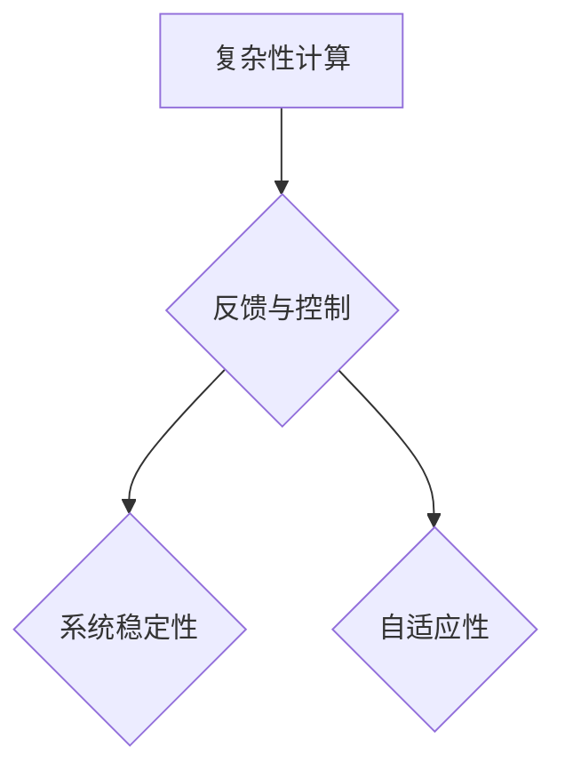

> 复杂性计算、反馈控制、系统稳定性、递归算法、动态规划、人工智能、机器学习

## 1. 背景介绍

在计算领域，我们不断追求更高效、更智能的算法和系统。然而，随着计算任务的复杂性不断增加，传统的计算方法面临着越来越大的挑战。复杂性计算，作为一种新的计算范式，旨在解决这些挑战，并开辟新的计算可能性。

反馈与控制是复杂性计算的核心概念之一。反馈机制允许系统根据自身状态和外部环境的变化进行调整，从而实现稳定性和自适应性。在自然界中，反馈机制广泛存在，例如生物体的体温调节、生态系统的平衡等。将反馈机制引入计算系统，可以使系统更加智能、更加适应复杂环境。

## 2. 核心概念与联系

**2.1 复杂性计算**

复杂性计算是指处理复杂系统和问题的一种计算方法。这些系统通常具有以下特征：

* **非线性:** 系统的输出与输入之间存在非线性的关系。
* **动态性:** 系统的状态会随着时间不断变化。
* **随机性:** 系统的行为可能受到随机因素的影响。

传统计算方法难以有效处理这类复杂系统，而复杂性计算则提供了一种新的视角和工具。

**2.2 反馈与控制**

反馈与控制是复杂系统调节和稳定性的关键机制。反馈机制是指系统根据自身状态或外部环境的变化，对自身行为进行调整的过程。控制则是指通过反馈机制，使系统达到预期的状态或目标的过程。

**2.3 联系**

复杂性计算利用反馈与控制机制，构建能够适应复杂环境的智能系统。通过反馈机制，系统可以感知环境变化，并根据变化进行调整，从而实现稳定性和自适应性。



## 3. 核心算法原理 & 具体操作步骤

**3.1 算法原理概述**

复杂性计算中常用的算法包括递归算法和动态规划。

* **递归算法:** 将问题分解成若干个子问题，每个子问题与原问题相似，通过重复调用自身实现问题的解决。
* **动态规划:** 将问题分解成若干个子问题，并存储子问题的解，避免重复计算。

**3.2 算法步骤详解**

**3.2.1 递归算法**

1. **定义递归关系:** 将问题分解成若干个子问题，并定义子问题与原问题的关系。
2. **设置边界条件:** 定义递归算法的终止条件，避免无限递归。
3. **实现递归调用:** 将问题分解成子问题，并通过递归调用自身解决子问题。
4. **组合子问题解:** 将子问题的解组合起来，得到原问题的解。

**3.2.2 动态规划**

1. **定义状态转移方程:** 描述子问题解与原问题解之间的关系。
2. **初始化状态:** 设置初始状态的解。
3. **迭代计算:** 从初始状态开始，依次计算每个状态的解。
4. **回溯解:** 从最终状态回溯，得到原问题的解。

**3.3 算法优缺点**

**3.3.1 递归算法**

* **优点:** 算法简洁易懂，能够有效解决某些问题。
* **缺点:** 可能会导致栈溢出，效率较低。

**3.3.2 动态规划**

* **优点:** 避免重复计算，效率较高。
* **缺点:** 算法复杂度较高，需要存储大量中间结果。

**3.4 算法应用领域**

* **递归算法:** 分治算法、树形结构遍历、数学归纳法等。
* **动态规划:** 最短路径问题、背包问题、序列对齐等。

## 4. 数学模型和公式 & 详细讲解 & 举例说明

**4.1 数学模型构建**

复杂性计算中的数学模型通常基于图论、代数和微分方程。

* **图论:** 用于表示系统中的节点和边，以及节点之间的关系。
* **代数:** 用于描述系统中的变量和关系，以及系统行为的数学表达式。
* **微分方程:** 用于描述系统状态随时间的变化。

**4.2 公式推导过程**

例如，在控制理论中，系统稳定性的分析通常使用哈密顿-雅可比方程。该方程描述了系统状态随时间的变化，并可以用来判断系统是否稳定。

**4.3 案例分析与讲解**

例如，在机器学习中，神经网络的训练过程可以看作是一个复杂性计算问题。神经网络的结构可以表示为一个图，其中节点代表神经元，边代表连接。神经网络的训练过程可以通过反向传播算法实现，该算法利用微分方程来更新神经元的权重，从而使神经网络的输出与目标值尽可能接近。

## 5. 项目实践：代码实例和详细解释说明

**5.1 开发环境搭建**

可以使用Python语言和相关的库来实现复杂性计算的项目。例如，可以使用NumPy库进行数值计算，Scikit-learn库进行机器学习，TensorFlow库进行深度学习。

**5.2 源代码详细实现**

以下是一个简单的递归算法实现的代码示例：

```python
def factorial(n):
  if n == 0:
    return 1
  else:
    return n * factorial(n-1)

# 计算5的阶乘
result = factorial(5)
print(result)  # 输出: 120
```

**5.3 代码解读与分析**

该代码实现了一个计算阶乘的递归算法。函数`factorial(n)`接受一个整数`n`作为参数，并返回`n`的阶乘值。

* 当`n`等于0时，函数返回1，这是递归算法的边界条件。
* 当`n`大于0时，函数返回`n`乘以`factorial(n-1)`的结果。

**5.4 运行结果展示**

运行该代码，输出结果为120，即5的阶乘值。

## 6. 实际应用场景

复杂性计算在各个领域都有广泛的应用，例如：

* **人工智能:** 机器学习、深度学习、自然语言处理等。
* **金融:** 风险管理、投资策略、欺诈检测等。
* **生物医学:** 药物发现、基因组分析、疾病诊断等。
* **环境科学:** 气候模型、生态系统模拟、污染控制等。

## 7. 工具和资源推荐

**7.1 学习资源推荐**

* **书籍:**
    * 《复杂系统》
    * 《人工智能：现代方法》
    * 《深度学习》
* **在线课程:**
    * Coursera: 复杂系统、机器学习、深度学习
    * edX: 复杂系统、人工智能

**7.2 开发工具推荐**

* **Python:** 广泛用于复杂性计算的编程语言。
* **NumPy:** 用于数值计算的Python库。
* **Scikit-learn:** 用于机器学习的Python库。
* **TensorFlow:** 用于深度学习的Python库。

**7.3 相关论文推荐**

* 《复杂系统理论》
* 《深度学习》
* 《机器学习》

## 8. 总结：未来发展趋势与挑战

**8.1 研究成果总结**

复杂性计算在过去几十年取得了显著进展，为解决复杂问题提供了新的工具和方法。

**8.2 未来发展趋势**

* **更强大的计算能力:** 量子计算、神经形态计算等新兴计算技术将为复杂性计算提供更强大的计算能力。
* **更智能的算法:** 基于深度学习、强化学习等技术的算法将更加智能，能够更好地处理复杂问题。
* **更广泛的应用:** 复杂性计算将应用于更多领域，例如医疗、能源、交通等。

**8.3 面临的挑战**

* **算法复杂度:** 复杂性计算算法的复杂度较高，需要不断优化算法效率。
* **数据需求:** 复杂性计算通常需要大量的训练数据，数据获取和处理是一个挑战。
* **解释性:** 复杂性计算模型的解释性较差，难以理解模型的决策过程。

**8.4 研究展望**

未来，复杂性计算的研究将继续深入，探索更强大的算法、更智能的系统，并将其应用于更多领域，为人类社会带来更多福祉。

## 9. 附录：常见问题与解答

**9.1 什么是复杂性计算？**

复杂性计算是指处理复杂系统和问题的一种计算方法。

**9.2 反馈与控制在复杂性计算中的作用是什么？**

反馈与控制是复杂性计算中实现系统稳定性和自适应性的关键机制。

**9.3 复杂性计算有哪些应用领域？**

复杂性计算在人工智能、金融、生物医学、环境科学等各个领域都有广泛的应用。


作者：禅与计算机程序设计艺术 / Zen and the Art of Computer Programming 
<end_of_turn>