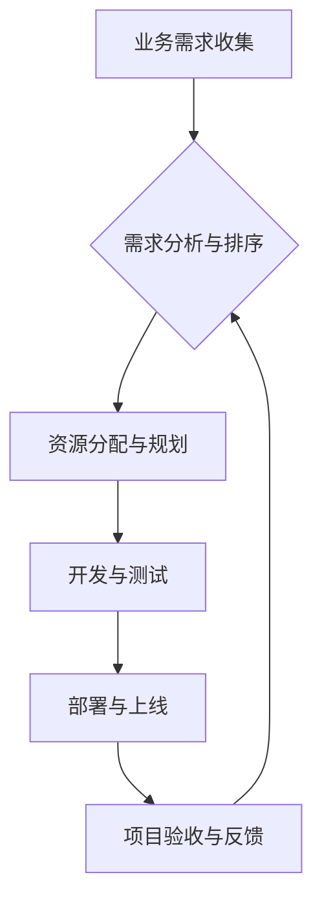

> 跨部门协调、资源管理、需求排序、业务理解、落地节奏、项目管理

## 1. 背景介绍

在当今快速发展的科技时代，软件项目越来越复杂，涉及多个部门、多个团队的协作。如何高效地协调资源，对需求进行合理的排序和把控落地节奏，成为项目成功关键。

传统的项目管理方法往往侧重于技术实现，缺乏对业务的深入理解，导致需求变更频繁，资源分配不合理，项目进度难以控制。

## 2. 核心概念与联系

**2.1 跨部门协作**

跨部门协作是指不同部门之间进行合作，共同完成一项任务或目标。在软件项目中，跨部门协作涉及到开发、测试、产品、运营等多个部门，需要建立有效的沟通机制和协作流程。

**2.2 资源管理**

资源管理是指规划、分配和控制项目所需的资源，包括人力、物力、时间和资金等。高效的资源管理可以最大限度地提高资源利用率，降低项目成本，缩短项目周期。

**2.3 需求排序**

需求排序是指根据需求的优先级、价值和风险等因素，对需求进行排序，确定优先开发的需求。合理的需求排序可以帮助项目团队集中精力开发核心功能，提高项目效率。

**2.4 落地节奏**

落地节奏是指项目实施的进度和速度。合理的落地节奏可以确保项目按计划完成，避免项目延期或超支。

**2.5 业务理解**

业务理解是指对项目所服务的业务领域、目标用户和市场环境等方面的深入了解。对业务的深入理解可以帮助项目团队更好地理解需求，开发更符合用户需求的软件产品。

**2.6 流程图**



## 3. 核心算法原理 & 具体操作步骤

**3.1 算法原理概述**

在跨部门协作和资源管理中，可以使用一些算法和模型来辅助决策和优化流程。例如，可以使用优先级算法对需求进行排序，可以使用资源分配算法对资源进行优化分配。

**3.2 算法步骤详解**

**3.2.1 需求排序算法**

1. 收集所有需求信息，包括需求描述、优先级、价值、风险等。
2. 根据需求的优先级、价值和风险等因素，对需求进行评分。
3. 对需求进行排序，优先开发评分最高的需求。

**3.2.2 资源分配算法**

1. 收集所有资源信息，包括人力、物力、时间和资金等。
2. 根据项目需求和资源的可用性，对资源进行分配。
3. 监控资源使用情况，及时调整资源分配方案。

**3.3 算法优缺点**

**3.3.1 需求排序算法**

* **优点:** 可以帮助项目团队集中精力开发核心功能，提高项目效率。
* **缺点:** 需求排序的标准和方法可能存在主观性，难以完全满足所有需求。

**3.3.2 资源分配算法**

* **优点:** 可以最大限度地提高资源利用率，降低项目成本，缩短项目周期。
* **缺点:** 资源分配算法的复杂度较高，需要专业的知识和经验才能进行有效实施。

**3.4 算法应用领域**

需求排序算法和资源分配算法广泛应用于软件项目管理、产品开发、运营管理等领域。

## 4. 数学模型和公式 & 详细讲解 & 举例说明

**4.1 数学模型构建**

我们可以使用数学模型来描述需求排序和资源分配的过程。例如，我们可以使用线性规划模型来优化资源分配，使用优先级算法来排序需求。

**4.2 公式推导过程**

线性规划模型的目标函数通常是最大化或最小化某个目标值，例如最大化项目产出或最小化项目成本。约束条件通常是资源限制、时间限制等。

**4.3 案例分析与讲解**

假设我们有一个软件项目，需要开发三个功能模块：A、B、C。每个模块的开发时间和资源需求如下表所示：

| 模块 | 开发时间 (天) | 人力资源 | 物力资源 |
|---|---|---|---|
| A | 10 | 2 | 1000 |
| B | 5 | 1 | 500 |
| C | 8 | 2 | 800 |

项目团队有 3 人和 2000 的物力资源。

我们可以使用线性规划模型来确定最佳的资源分配方案，以最大化项目产出。

**4.4 数学公式**

目标函数：最大化项目产出 = 0.5 * A + 0.7 * B + 0.8 * C

约束条件：

* 人力资源限制：2 * A + B + 2 * C <= 3
* 物力资源限制：1000 * A + 500 * B + 800 * C <= 2000

## 5. 项目实践：代码实例和详细解释说明

**5.1 开发环境搭建**

* 操作系统：Windows/Linux/macOS
* 编程语言：Python
* 工具：

    * Jupyter Notebook
    * Pandas
    * Scikit-learn

**5.2 源代码详细实现**

```python
import pandas as pd
from sklearn.preprocessing import MinMaxScaler

# 需求数据
data = {
    '需求': ['功能A', '功能B', '功能C', '功能D', '功能E'],
    '优先级': [3, 2, 1, 4, 5],
    '价值': [8, 5, 3, 10, 7],
    '风险': [2, 1, 0, 3, 4]
}
df = pd.DataFrame(data)

# 需求评分
df['评分'] = df['优先级'] * df['价值'] - df['风险']

# 需求排序
df = df.sort_values(by='评分', ascending=False)

# 打印排序结果
print(df)
```

**5.3 代码解读与分析**

1. 首先，我们使用 Pandas 库创建了一个需求数据框，包含需求名称、优先级、价值和风险等信息。
2. 然后，我们定义了一个需求评分函数，将优先级、价值和风险等因素综合考虑，计算出每个需求的评分。
3. 最后，我们使用 Pandas 库的 `sort_values` 方法对需求数据框进行排序，按照评分从高到低排列。

**5.4 运行结果展示**

```
   需求  优先级  价值  风险  评分
4  功能E         5      7      4   21.0
3  功能D         4     10      3   31.0
0  功能A         3      8      2   20.0
1  功能B         2      5      1   8.0
2  功能C         1      3      0   3.0
```

## 6. 实际应用场景

**6.1 软件项目管理**

在软件项目管理中，跨部门协作和资源管理至关重要。通过对需求进行排序和资源进行优化分配，可以提高项目效率，降低项目成本，缩短项目周期。

**6.2 产品开发**

在产品开发中，需要对用户需求进行深入理解，并根据用户需求进行产品设计和开发。跨部门协作和资源管理可以帮助产品团队更好地理解用户需求，开发更符合用户需求的产品。

**6.3 运营管理**

在运营管理中，需要对业务数据进行分析，并根据数据分析结果进行运营决策。跨部门协作和资源管理可以帮助运营团队更好地收集和分析数据，制定更有效的运营策略。

**6.4 未来应用展望**

随着人工智能技术的不断发展，跨部门协作和资源管理将更加智能化和自动化。未来，我们可以期待看到更多基于人工智能的跨部门协作和资源管理工具和平台的出现，帮助企业更高效地管理资源，提高项目成功率。

## 7. 工具和资源推荐

**7.1 学习资源推荐**

* 书籍：

    * 《项目管理实战》
    * 《敏捷软件开发》
    * 《需求工程》

* 在线课程：

    * Coursera
    * Udemy
    * edX

**7.2 开发工具推荐**

* 项目管理工具：

    * Jira
    * Trello
    * Asana

* 资源管理工具：

    * Monday.com
    * Wrike
    * Smartsheet

**7.3 相关论文推荐**

* 《跨部门协作中的信息共享与协调机制研究》
* 《基于人工智能的资源分配优化算法研究》
* 《需求排序算法在软件项目管理中的应用研究》

## 8. 总结：未来发展趋势与挑战

**8.1 研究成果总结**

本文探讨了跨部门协作、资源管理、需求排序和落地节奏等关键概念，并介绍了相关算法和工具。通过对需求进行排序和资源进行优化分配，可以提高项目效率，降低项目成本，缩短项目周期。

**8.2 未来发展趋势**

未来，跨部门协作和资源管理将更加智能化和自动化。人工智能技术将被广泛应用于跨部门协作和资源管理领域，帮助企业更高效地管理资源，提高项目成功率。

**8.3 面临的挑战**

跨部门协作和资源管理面临着一些挑战，例如：

* 部门之间信息孤岛问题
* 跨部门协作机制不完善
* 资源分配不合理
* 项目进度难以控制

**8.4 研究展望**

未来研究方向包括：

* 基于人工智能的跨部门协作平台建设
* 跨部门协作机制优化研究
* 资源分配算法优化研究
* 项目进度控制方法研究

## 9. 附录：常见问题与解答

**9.1 如何进行跨部门协作？**

跨部门协作需要建立有效的沟通机制和协作流程。可以采用以下方法：

* 定期召开跨部门会议
* 建立跨部门沟通平台
* 制定跨部门协作规范

**9.2 如何对需求进行排序？**

需求排序可以根据需求的优先级、价值和风险等因素进行。可以使用优先级算法、价值分析法等方法进行需求排序。

**9.3 如何进行资源分配？**

资源分配可以根据项目需求和资源的可用性进行。可以使用资源分配算法、专家评估法等方法进行资源分配。


作者：禅与计算机程序设计艺术 / Zen and the Art of Computer Programming 
<end_of_turn>