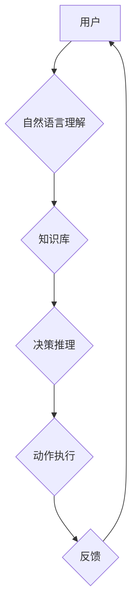
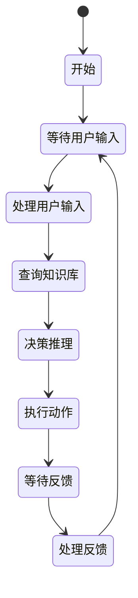
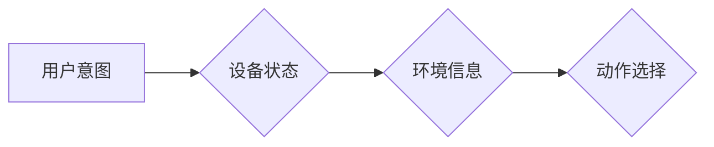
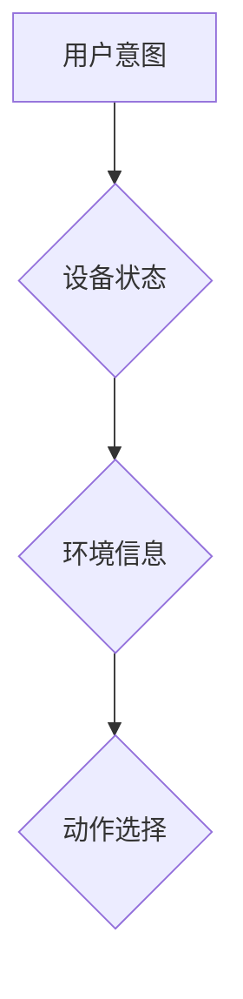

> 智能代理，智能家居，AI工作流，自然语言理解，机器学习，决策推理

## 1. 背景介绍

智能家居已成为现代生活的重要组成部分，它通过将各种智能设备连接起来，为用户提供更加便捷、舒适和安全的居住体验。然而，随着智能家居设备数量的不断增加和功能的不断复杂化，传统的控制方式已经难以满足用户的需求。智能代理作为一种新的交互方式，能够更好地理解用户的意图，并自动执行相应的操作，从而提升智能家居的智能化水平。

智能代理是一种能够自主学习、决策和执行任务的软件实体。它可以模拟人类的行为模式，并根据用户的需求和环境的变化进行智能决策。在智能家居领域，智能代理可以扮演多种角色，例如：

* **家居管家:** 负责管理和控制整个智能家居系统，例如调节温度、灯光、窗帘等。
* **生活助手:** 帮助用户完成日常任务，例如预约会议、提醒待办事项、播放音乐等。
* **个性化服务提供者:** 根据用户的喜好和习惯，提供个性化的服务，例如推荐电影、播放喜欢的音乐、调整家居环境等。

## 2. 核心概念与联系

智能代理工作流 (AI Agent WorkFlow) 是指智能代理在智能家居环境中执行任务的流程。它由一系列的步骤组成，每个步骤都由智能代理根据用户的意图和环境信息进行决策和执行。

**核心概念:**

* **智能代理 (AI Agent):** 能够自主学习、决策和执行任务的软件实体。
* **工作流 (Workflow):** 一系列有序的步骤，用于完成特定任务。
* **自然语言理解 (NLU):** 使计算机能够理解人类语言的能力。
* **机器学习 (ML):** 使计算机能够从数据中学习和改进的能力。
* **决策推理 (Decision Making & Reasoning):** 智能代理根据环境信息和用户意图进行决策的能力。

**架构图:**



## 3. 核心算法原理 & 具体操作步骤

### 3.1  算法原理概述

智能代理工作流的实现主要依赖于以下核心算法：

* **自然语言理解 (NLU):** 用于识别用户输入的意图和实体。常用的方法包括词嵌入、深度学习等。
* **知识图谱 (Knowledge Graph):** 用于存储和管理智能家居设备、场景和规则等信息。
* **决策树 (Decision Tree):** 用于根据用户意图和环境信息进行决策。
* **状态机 (State Machine):** 用于描述智能代理的工作流程和状态转换。

### 3.2  算法步骤详解

1. **用户输入:** 用户通过语音、文本或其他方式输入指令。
2. **自然语言理解:** NLU模型识别用户输入的意图和实体。例如，用户输入“打开客厅灯”，NLU模型识别出意图是“打开灯”，实体是“客厅灯”。
3. **知识库查询:** 根据用户意图和实体，智能代理从知识库中查询相关设备和规则。例如，查询“客厅灯”的设备信息和控制规则。
4. **决策推理:** 智能代理根据用户意图、环境信息和规则进行决策，确定执行的操作。例如，决定打开客厅灯。
5. **动作执行:** 智能代理通过API或其他方式控制智能家居设备执行操作。例如，发送指令打开客厅灯。
6. **反馈处理:** 智能代理接收设备反馈信息，并根据反馈信息更新状态和进行后续决策。例如，接收“客厅灯已打开”的反馈信息。

### 3.3  算法优缺点

**优点:**

* **智能化:** 智能代理能够根据用户意图和环境信息进行智能决策，提升智能家居的智能化水平。
* **便捷性:** 用户可以通过自然语言或其他方式与智能代理交互，更加便捷地控制智能家居设备。
* **个性化:** 智能代理可以根据用户的喜好和习惯提供个性化的服务。

**缺点:**

* **复杂性:** 智能代理的开发和部署需要复杂的算法和技术，对开发人员的技术要求较高。
* **数据依赖:** 智能代理的性能依赖于训练数据的质量和数量。
* **安全问题:** 智能代理需要访问用户的个人信息和设备数据，因此需要采取相应的安全措施。

### 3.4  算法应用领域

智能代理工作流在智能家居领域之外，还具有广泛的应用前景，例如：

* **医疗保健:** 智能代理可以帮助医生诊断疾病、制定治疗方案、提醒患者服药等。
* **教育:** 智能代理可以作为个性化学习助手，根据学生的学习进度和能力提供定制化的学习内容和辅导。
* **金融:** 智能代理可以帮助用户管理财务、投资理财、防范金融风险等。

## 4. 数学模型和公式 & 详细讲解 & 举例说明

### 4.1  数学模型构建

智能代理工作流的决策过程可以抽象为一个状态机模型，其中每个状态代表智能代理的当前状态，每个状态转换代表智能代理根据环境信息和用户意图进行决策的结果。

**状态机模型:**



### 4.2  公式推导过程

决策推理过程可以使用概率论和决策理论来进行建模。例如，可以使用贝叶斯网络来表示智能代理对不同事件的概率信念，并使用决策树来确定最佳的行动策略。

**贝叶斯网络:**



**决策树:**



### 4.3  案例分析与讲解

例如，用户输入“打开客厅灯”，智能代理需要根据用户的意图、客厅灯的状态和环境信息进行决策。

* **用户意图:** 打开客厅灯
* **设备状态:** 客厅灯是否已打开
* **环境信息:** 是否是白天或晚上

根据这些信息，智能代理可以判断是否需要打开客厅灯，并选择相应的动作。

## 5. 项目实践：代码实例和详细解释说明

### 5.1  开发环境搭建

* 操作系统: Ubuntu 20.04
* Python 版本: 3.8
* 依赖库:

```
pip install requests numpy pandas tensorflow nltk
```

### 5.2  源代码详细实现

```python
# 智能代理工作流示例代码

import requests
import numpy as np
from tensorflow.keras.models import load_model

# 加载自然语言理解模型
nlu_model = load_model('nlu_model.h5')

# 智能家居设备API接口
device_api = 'http://localhost:8080/api/device'

def process_user_input(user_input):
    # 使用自然语言理解模型识别用户意图和实体
    intent, entities = nlu_model.predict(user_input)
    return intent, entities

def query_knowledge_base(intent, entities):
    # 根据用户意图和实体查询知识库
    # ...

def make_decision(intent, entities, knowledge):
    # 根据用户意图、实体和知识进行决策
    # ...

def execute_action(action):
    # 执行动作，例如控制智能家居设备
    # ...

# 主循环
while True:
    user_input = input('用户输入: ')
    intent, entities = process_user_input(user_input)
    knowledge = query_knowledge_base(intent, entities)
    action = make_decision(intent, entities, knowledge)
    execute_action(action)
```

### 5.3  代码解读与分析

* **自然语言理解:** 使用预训练的深度学习模型进行自然语言理解，识别用户意图和实体。
* **知识库查询:** 根据用户意图和实体，从知识库中查询相关设备和规则。
* **决策推理:** 使用决策树或其他算法进行决策推理，确定执行的操作。
* **动作执行:** 通过API或其他方式控制智能家居设备执行操作。

### 5.4  运行结果展示

当用户输入“打开客厅灯”时，智能代理会识别出用户意图是“打开灯”，实体是“客厅灯”，并根据知识库和决策规则执行打开客厅灯的操作。

## 6. 实际应用场景

### 6.1  智能家居场景

* **场景一:** 用户回家后，智能代理可以根据用户的习惯自动打开灯光、调节温度、播放音乐等。
* **场景二:** 用户外出时，智能代理可以根据环境信息自动关闭灯光、空调等，节约能源。
* **场景三:** 用户生病时，智能代理可以提醒用户服药、监测体温、预约医生等。

### 6.2  其他应用场景

* **智能客服:** 智能代理可以作为智能客服，回答用户常见问题、处理简单的请求。
* **个性化推荐:** 智能代理可以根据用户的兴趣爱好和行为数据提供个性化的商品推荐。
* **自动驾驶:** 智能代理可以作为自动驾驶系统的决策模块，根据环境信息和驾驶规则进行决策。

### 6.4  未来应用展望

随着人工智能技术的不断发展，智能代理工作流将在更多领域得到应用，例如：

* **医疗保健:** 智能代理可以帮助医生进行诊断、治疗、护理等。
* **教育:** 智能代理可以作为个性化学习助手，帮助学生提高学习效率。
* **金融:** 智能代理可以帮助用户进行理财、投资、风险管理等。

## 7. 工具和资源推荐

### 7.1  学习资源推荐

* **书籍:**
    * 《人工智能：现代方法》
    * 《深度学习》
    * 《机器学习》
* **在线课程:**
    * Coursera: 人工智能课程
    * edX: 深度学习课程
    * Udacity: 机器学习工程师课程

### 7.2  开发工具推荐

* **Python:** 广泛用于人工智能开发的编程语言。
* **TensorFlow:** 深度学习框架。
* **PyTorch:** 深度学习框架。
* **NLTK:** 自然语言处理工具包。

### 7.3  相关论文推荐

* **《Attention Is All You Need》:** Transformer模型的论文。
* **《BERT: Pre-training of Deep Bidirectional Transformers for Language Understanding》:** BERT模型的论文。
* **《GPT-3: Language Models are Few-Shot Learners》:** GPT-3模型的论文。

## 8. 总结：未来发展趋势与挑战

### 8.1  研究成果总结

智能代理工作流在智能家居领域取得了显著的成果，能够有效提升智能家居的智能化水平。

### 8.2  未来发展趋势

* **更强大的自然语言理解能力:** 能够理解更复杂、更自然的人类语言。
* **更智能的决策推理能力:** 能够根据更复杂的场景和环境信息进行决策。
* **更个性化的服务体验:** 能够根据用户的喜好和习惯提供更个性化的服务。
* **更安全的智能代理系统:** 能够有效防止恶意攻击和数据泄露。

### 8.3  面临的挑战

* **数据安全和隐私保护:** 智能代理需要访问用户的个人信息和设备数据，因此需要采取相应的安全措施。
* **算法的解释性和可信度:** 智能代理的决策过程往往是复杂的，难以解释和理解，这可能会影响用户的信任。
* **算法的公平性和公正性:** 智能代理的决策