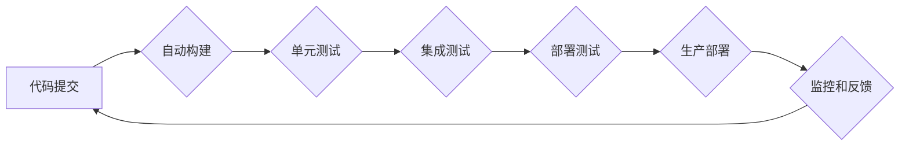

> AI代理，工作流，持续集成，持续交付，智能自动化，流程优化，机器学习，自然语言处理

## 1. 背景介绍

在当今数字化时代，企业面临着日益复杂的业务流程和不断增长的工作量。传统的人工处理方式已经难以满足效率和精度的要求。人工智能（AI）技术作为一种强大的工具，为企业提供了智能化自动化解决方案。其中，AI代理（AI Agent）作为一种新型的智能化工作流程处理方式，正在逐渐成为企业数字化转型的重要驱动力。

AI代理是一种能够自主执行特定任务的软件实体，它可以根据预先定义的规则或通过机器学习算法，从海量数据中学习并做出决策，从而自动完成各种工作流程环节。例如，AI代理可以自动处理客户服务请求、审批流程、数据分析等任务，从而解放人力资源，提高工作效率和准确性。

然而，传统的AI代理开发和部署方式往往存在着以下问题：

* **开发周期长:**  AI代理的开发需要涉及多个环节，包括数据收集、模型训练、算法优化等，整个开发周期较长，难以满足快速迭代的需求。
* **部署复杂:**  AI代理的部署需要涉及到硬件资源、软件环境、数据接口等多个方面，部署过程复杂，容易出现问题。
* **维护成本高:**  随着业务需求的变化，AI代理需要进行持续的维护和更新，维护成本较高。

为了解决这些问题，持续集成（CI）和持续交付（CD）理念被引入到AI代理的开发和部署流程中。CI/CD流程可以帮助企业实现自动化构建、测试、部署和监控，从而提高开发效率、降低部署风险和维护成本。

## 2. 核心概念与联系

**2.1 AI代理工作流**

AI代理工作流是指利用AI代理技术实现自动化处理的业务流程。它通常由多个步骤组成，每个步骤由一个或多个AI代理负责执行。

**2.2 持续集成（CI）**

持续集成是指将开发人员的代码频繁地合并到一个共享代码库中，并通过自动化构建和测试流程，确保代码质量和稳定性。

**2.3 持续交付（CD）**

持续交付是指将经过测试和验证的软件应用程序自动部署到生产环境中，从而实现快速交付和持续更新。

**2.4 AI代理工作流的CI/CD流程**

将CI/CD理念应用于AI代理工作流，可以实现以下流程：

1. **代码提交:** 开发人员将代码提交到共享代码库中。
2. **自动构建:** CI服务器自动构建AI代理应用程序。
3. **单元测试:** 自动执行单元测试，验证代码的正确性。
4. **集成测试:** 自动执行集成测试，验证不同AI代理之间的交互和数据流。
5. **部署测试:** 自动部署到测试环境，进行功能测试和性能测试。
6. **生产部署:** 通过CD服务器自动部署到生产环境。
7. **监控和反馈:** 持续监控AI代理的运行状态，收集用户反馈，并进行迭代更新。

**2.5 Mermaid 流程图**



## 3. 核心算法原理 & 具体操作步骤

**3.1 算法原理概述**

AI代理工作流的自动化处理主要依赖于以下核心算法：

* **规则引擎:**  根据预先定义的规则，自动执行特定任务。
* **机器学习:**  通过训练模型，从数据中学习并做出决策。
* **自然语言处理:**  理解和处理自然语言文本，例如客户服务请求。

**3.2 算法步骤详解**

1. **数据收集:** 收集相关业务数据，例如客户信息、订单数据、流程日志等。
2. **数据预处理:** 对数据进行清洗、转换和格式化，使其适合算法训练和使用。
3. **模型训练:** 使用机器学习算法，训练模型以识别模式和做出预测。
4. **规则定义:** 根据业务需求，定义规则引擎执行的规则。
5. **流程设计:** 设计AI代理工作流，明确每个步骤的执行逻辑和数据流。
6. **系统集成:** 将AI代理与现有系统集成，实现数据交换和业务流程自动化。

**3.3 算法优缺点**

* **优点:** 提高工作效率、降低人工成本、提高工作准确性、实现业务流程自动化。
* **缺点:**  算法训练需要大量数据，模型部署需要一定的技术门槛，算法解释性较差。

**3.4 算法应用领域**

* **客户服务:** 自动处理客户服务请求，例如常见问题解答、订单查询、投诉处理等。
* **审批流程:** 自动审批业务流程，例如合同审批、采购审批、请假审批等。
* **数据分析:** 自动分析数据，发现业务趋势和潜在问题。
* **内容创作:** 自动生成文本、图像、视频等内容。

## 4. 数学模型和公式 & 详细讲解 & 举例说明

**4.1 数学模型构建**

AI代理工作流的数学模型可以基于状态机、决策树或神经网络等构建。

**状态机模型:**

状态机模型将AI代理的工作流程表示为一系列状态和状态转换。每个状态代表一个工作流程环节，状态转换由触发条件和动作规则决定。

**决策树模型:**

决策树模型将AI代理的工作流程表示为一棵树形结构，每个节点代表一个决策，每个分支代表一个可能的决策结果。

**神经网络模型:**

神经网络模型可以学习复杂的决策规则，并根据输入数据做出预测。

**4.2 公式推导过程**

例如，在状态机模型中，我们可以使用以下公式来描述状态转换：

```
状态转换 = {触发条件, 动作规则}
```

其中，触发条件是指导致状态转换的事件或条件，动作规则是指状态转换执行的动作。

**4.3 案例分析与讲解**

假设我们有一个AI代理工作流用于处理客户服务请求。

* 状态机模型:

    * 状态: 等待请求、识别问题、提供解决方案、结束对话。
    * 触发条件: 客户发送请求、问题识别成功、解决方案提供成功。
    * 动作规则: 接收客户请求、分析客户问题、查找解决方案、回复客户。

* 决策树模型:

    * 根节点: 客户发送请求。
    * 子节点: 问题类型 (常见问题、订单问题、投诉问题)。
    * 叶节点: 解决方案 (自动回复、人工客服、投诉处理)。

**4.4 数学模型应用场景**

数学模型可以用于分析AI代理工作流的性能、优化工作流程设计、预测未来需求等。

## 5. 项目实践：代码实例和详细解释说明

**5.1 开发环境搭建**

* 操作系统: Ubuntu 20.04
* 编程语言: Python 3.8
* 框架: Flask
* 数据库: PostgreSQL

**5.2 源代码详细实现**

```python
from flask import Flask, request, jsonify

app = Flask(__name__)

# 模拟AI代理模型
def process_request(request_text):
    # 使用机器学习模型或规则引擎处理请求
    # 返回处理结果
    return "处理结果"

@app.route('/api/process', methods=['POST'])
def process():
    request_data = request.get_json()
    request_text = request_data.get('text')
    result = process_request(request_text)
    return jsonify({'result': result})

if __name__ == '__main__':
    app.run(debug=True)
```

**5.3 代码解读与分析**

* 该代码实现了一个简单的AI代理API，使用Flask框架构建。
* `process_request()`函数模拟AI代理模型，实际应用中需要使用机器学习模型或规则引擎进行处理。
* `/api/process`接口接收客户请求，并调用`process_request()`函数进行处理，返回处理结果。

**5.4 运行结果展示**

运行代码后，访问`http://localhost:5000/api/process`接口，发送JSON格式的请求，例如:

```json
{
  "text": "我的订单状态如何？"
}
```

API将返回处理结果，例如:

```json
{
  "result": "您的订单已发货。"
}
```

## 6. 实际应用场景

**6.1 客户服务自动化**

AI代理可以自动处理客户服务请求，例如常见问题解答、订单查询、投诉处理等，提高客户服务效率和满意度。

**6.2 审批流程自动化**

AI代理可以自动审批业务流程，例如合同审批、采购审批、请假审批等，简化审批流程，提高审批效率。

**6.3 数据分析自动化**

AI代理可以自动分析数据，发现业务趋势和潜在问题，为企业决策提供支持。

**6.4 未来应用展望**

随着AI技术的不断发展，AI代理工作流将在更多领域得到应用，例如：

* **个性化推荐:**  根据用户的行为数据，推荐个性化的产品或服务。
* **智能教育:**  提供个性化的学习辅导和评估。
* **医疗诊断:**  辅助医生进行疾病诊断和治疗方案制定。

## 7. 工具和资源推荐

**7.1 学习资源推荐**

* **书籍:**
    * 《人工智能：一种现代方法》
    * 《深度学习》
* **在线课程:**
    * Coursera: 人工智能
    * edX: 深度学习
* **社区:**
    * TensorFlow社区
    * PyTorch社区

**7.2 开发工具推荐**

* **机器学习框架:** TensorFlow, PyTorch
* **自然语言处理库:** NLTK, spaCy
* **云平台:** AWS, Azure, GCP

**7.3 相关论文推荐**

* **Reinforcement Learning: An Introduction**
* **Deep Learning**
* **Attention Is All You Need**

## 8. 总结：未来发展趋势与挑战

**8.1 研究成果总结**

AI代理工作流技术取得了显著进展，在客户服务、审批流程、数据分析等领域取得了成功应用。

**8.2 未来发展趋势**

* **更智能的AI代理:**  利用更先进的机器学习算法，开发更智能、更灵活的AI代理。
* **更广泛的应用场景:**  AI代理工作流将应用于更多领域，例如个性化推荐、智能教育、医疗诊断等。
* **更强大的自动化能力:**  AI代理将能够处理更复杂的任务，实现更全面的自动化。

**8.3 面临的挑战**

* **数据安全和隐私保护:**  AI代理需要处理大量数据，需要确保数据安全和隐私保护。
* **算法解释性和可信度:**  AI代理的决策过程往往难以解释，需要提高算法的解释性和可信度。
* **技术人才短缺:**  AI代理开发和维护需要专业的技术人才，技术人才短缺是制约发展的一大挑战。

**8.4 研究展望**

未来，我们将继续致力于AI代理工作流技术的研发和应用，探索更智能、更安全、更可靠的AI代理解决方案，为企业数字化转型提供更强大的支持。

## 9. 附录：常见问题与解答

**9.1 如何选择合适的AI代理模型？**

选择合适的AI代理模型需要根据具体业务需求和数据情况进行评估。

**9.2 如何保证AI代理的准确性和可靠性？**

需要不断收集和更新数据，并对AI代理模型进行测试和优化，以提高其准确性和可靠性。

**9.3 如何解决AI代理工作流中的安全问题？**

需要采取相应的安全措施，例如数据加密、身份验证、访问控制等，以保障AI代理工作流的安全。


作者：禅与计算机程序设计艺术 / Zen and the Art of Computer Programming 
<end_of_turn>