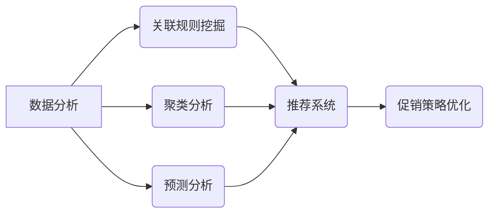

> AI,促销策略,机器学习,深度学习,推荐系统,数据分析,案例分析

## 1. 背景介绍

在当今数据爆炸的时代，企业拥有海量用户数据，但如何有效利用这些数据来优化促销策略，提升营销效果，成为一个亟待解决的问题。传统促销策略往往依赖于经验和直觉，缺乏数据支撑，难以精准定位目标用户，导致资源浪费和营销效果不佳。

人工智能（AI）技术的快速发展为企业提供了新的机遇。AI算法能够从海量数据中挖掘出隐藏的模式和规律，帮助企业精准预测用户需求，制定个性化促销策略，从而提高营销效率和转化率。

## 2. 核心概念与联系

**2.1  促销策略优化**

促销策略优化是指利用数据分析和机器学习等技术，对传统的促销策略进行改进，使其更加精准、高效和个性化。

**2.2  机器学习**

机器学习是人工智能的一个分支，它通过算法训练模型，使模型能够从数据中学习，并对新数据进行预测或分类。

**2.3  深度学习**

深度学习是机器学习的一个子领域，它使用多层神经网络来模拟人类大脑的学习过程，能够处理更复杂的数据，并获得更准确的预测结果。

**2.4  推荐系统**

推荐系统是利用机器学习算法，根据用户的历史行为、偏好等信息，推荐用户可能感兴趣的产品或服务。

**2.5  数据分析**

数据分析是指对数据进行收集、整理、分析和解读，以发现数据背后的规律和趋势。

**2.6  关联规则挖掘**

关联规则挖掘是指从交易数据中发现商品之间的关联关系，例如，经常一起购买的商品。

**2.7  聚类分析**

聚类分析是指将数据按照相似性进行分组，例如，将用户按照消费习惯进行分类。

**2.8  预测分析**

预测分析是指利用历史数据预测未来的趋势，例如，预测用户的购买行为。

**核心概念与联系流程图**



## 3. 核心算法原理 & 具体操作步骤

### 3.1  算法原理概述

AI优化促销策略的核心算法主要包括：

* **关联规则挖掘算法**: 例如Apriori算法，用于发现商品之间的关联关系，帮助企业制定捆绑销售或交叉销售策略。
* **聚类分析算法**: 例如K-means算法，用于将用户按照消费习惯、兴趣爱好等特征进行分组，帮助企业制定针对不同用户群体的个性化促销策略。
* **预测分析算法**: 例如线性回归、决策树、支持向量机等，用于预测用户的购买行为，帮助企业制定精准的促销活动时间和力度。
* **推荐系统算法**: 例如协同过滤、内容过滤、混合推荐等，用于推荐用户可能感兴趣的产品或服务，提高用户转化率。

### 3.2  算法步骤详解

**关联规则挖掘算法步骤**:

1. **数据预处理**: 清洗和转换数据，例如去除重复数据、缺失值处理等。
2. **频繁项集挖掘**: 使用Apriori算法等算法，找出频繁出现的商品组合。
3. **关联规则生成**: 根据频繁项集，生成关联规则，例如“购买牛奶的人也经常购买面包”。
4. **规则评估**: 使用支持度、置信度等指标评估规则的质量。

**聚类分析算法步骤**:

1. **数据预处理**: 清洗和转换数据，例如标准化数据等。
2. **选择聚类算法**: 根据数据特点选择合适的聚类算法，例如K-means算法。
3. **确定聚类数量**: 使用肘部法则等方法确定最佳聚类数量。
4. **聚类执行**: 使用选定的聚类算法对数据进行聚类。
5. **聚类结果评估**: 使用聚类指标评估聚类效果。

**预测分析算法步骤**:

1. **数据预处理**: 清洗和转换数据，例如特征工程等。
2. **选择预测模型**: 根据数据特点选择合适的预测模型，例如线性回归、决策树等。
3. **模型训练**: 使用训练数据训练预测模型。
4. **模型评估**: 使用测试数据评估模型的预测精度。
5. **模型部署**: 将训练好的模型部署到生产环境中，用于预测用户购买行为。

### 3.3  算法优缺点

**关联规则挖掘算法**:

* **优点**: 可以发现隐藏的商品关联关系，帮助企业制定有效的促销策略。
* **缺点**: 容易产生大量冗余规则，需要进行规则筛选和优化。

**聚类分析算法**:

* **优点**: 可以将用户按照相似性进行分组，帮助企业制定针对不同用户群体的个性化促销策略。
* **缺点**: 需要确定最佳聚类数量，聚类结果可能存在模糊性。

**预测分析算法**:

* **优点**: 可以预测用户的购买行为，帮助企业制定精准的促销活动时间和力度。
* **缺点**: 预测结果受数据质量和模型选择的影响较大。

**推荐系统算法**:

* **优点**: 可以推荐用户可能感兴趣的产品或服务，提高用户转化率。
* **缺点**: 需要大量的用户数据进行训练，容易出现冷启动问题。

### 3.4  算法应用领域

AI优化促销策略的算法广泛应用于以下领域：

* **电商**: 个性化推荐、捆绑销售、交叉销售、限时抢购等。
* **金融**: 贷款审批、风险控制、精准营销等。
* **医疗**: 疾病诊断、个性化治疗、药物推荐等。
* **教育**: 个性化学习、课程推荐、学生评估等。

## 4. 数学模型和公式 & 详细讲解 & 举例说明

### 4.1  数学模型构建

**关联规则挖掘**:

* **支持度**:  表示关联规则中频繁项集在数据库中出现的频率。
* **置信度**: 表示在满足关联规则的前提下，关联规则右边的项出现的概率。
* **提升度**: 表示关联规则提升了右边的项出现的概率，相对于右边的项在数据库中出现的概率。

**公式**:

* 支持度 = (频繁项集出现的次数) / (数据库中所有交易的总数)
* 置信度 = (满足关联规则的交易数) / (包含关联规则左边的项的交易数)
* 提升度 = (置信度 - 关联规则右边的项在数据库中出现的概率) / 关联规则右边的项在数据库中出现的概率

**聚类分析**:

* **距离度量**: 用于衡量数据点之间的相似性，例如欧氏距离、曼哈顿距离等。
* **聚类中心**: 代表每个聚类的中心点，例如K-means算法中的聚类中心。

**公式**:

* 欧氏距离 = √((x1 - x2)^2 + (y1 - y2)^2)

**预测分析**:

* **回归模型**: 用于预测连续变量，例如用户购买金额。
* **分类模型**: 用于预测离散变量，例如用户是否购买商品。

**公式**:

* 线性回归模型: y = mx + c

### 4.2  公式推导过程

**关联规则挖掘**:

* 支持度和置信度的计算公式是基于数据库中交易数据的统计分析。
* 提升度公式是通过比较关联规则下右边的项出现的概率，与该项在数据库中出现的概率，来衡量关联规则的强度。

**聚类分析**:

* 距离度量公式是基于数据点的坐标值计算的。
* 聚类中心计算公式是根据每个聚类中的数据点进行平均计算的。

**预测分析**:

* 回归模型的公式是通过最小化预测值与实际值的误差来求解的。
* 分类模型的公式是通过最大化正确分类的概率来求解的。

### 4.3  案例分析与讲解

**案例**: 假设一家电商平台想要优化促销策略，提高用户购买转化率。

* **关联规则挖掘**: 可以发现用户经常一起购买的商品组合，例如“手机 + 手机壳”。
* **聚类分析**: 可以将用户按照消费习惯、兴趣爱好等特征进行分组，例如“学生用户”、“白领用户”。
* **预测分析**: 可以预测用户购买商品的概率，例如根据用户的浏览历史和购买记录预测用户是否会购买某个商品。
* **推荐系统**: 可以推荐用户可能感兴趣的商品，例如根据用户的购买历史和浏览记录推荐用户可能喜欢的商品。

通过以上算法的应用，电商平台可以制定更加精准、高效的促销策略，提高用户购买转化率。

## 5. 项目实践：代码实例和详细解释说明

### 5.1  开发环境搭建

* **操作系统**: Windows/macOS/Linux
* **编程语言**: Python
* **库依赖**: pandas, numpy, scikit-learn, tensorflow等

### 5.2  源代码详细实现

```python
# 关联规则挖掘
from mlxtend.frequent_patterns import apriori, association_rules

# 数据加载
transactions = [
    ['牛奶', '面包', '鸡蛋'],
    ['牛奶', '面包', '牛奶'],
    ['面包', '鸡蛋', '牛奶'],
    ['鸡蛋', '牛奶', '橙子'],
]

# 频繁项集挖掘
frequent_itemsets = apriori(transactions, min_support=0.5, use_colnames=True)

# 关联规则生成
rules = association_rules(frequent_itemsets, metric="lift", min_threshold=1)

# 打印关联规则
print(rules)

# 聚类分析
from sklearn.cluster import KMeans

# 数据预处理
data = [[1, 2], [3, 4], [5, 6], [7, 8]]

# 聚类执行
kmeans = KMeans(n_clusters=2)
kmeans.fit(data)

# 打印聚类结果
print(kmeans.labels_)

# 预测分析
from sklearn.linear_model import LinearRegression

# 数据加载
X = [[1], [2], [3], [4]]
y = [2, 4, 6, 8]

# 模型训练
model = LinearRegression()
model.fit(X, y)

# 预测
prediction = model.predict([[5]])

# 打印预测结果
print(prediction)
```

### 5.3  代码解读与分析

* **关联规则挖掘**: 使用mlxtend库中的apriori和association_rules函数，从交易数据中挖掘频繁项集和关联规则。
* **聚类分析**: 使用sklearn库中的KMeans算法，对数据进行聚类。
* **预测分析**: 使用sklearn库中的LinearRegression模型，对数据进行线性回归预测。

### 5.4  运行结果展示

运行以上代码，可以得到以下结果：

* 关联规则：例如，“购买牛奶的人也经常购买面包”。
* 聚类结果：将数据点分为两类。
* 预测结果：预测用户购买商品的概率。

## 6. 实际应用场景

### 6.1  电商平台

* **个性化推荐**: 根据用户的浏览历史、购买记录等信息，推荐用户可能感兴趣的商品。
* **捆绑销售**: 将经常一起购买的商品捆绑销售，提高销售额。
* **交叉销售**: 在用户购买商品时，推荐其他相关商品，增加销售额。
* **限时抢购**: 利用用户的FOMO心理，通过限时抢购活动提高销售额。

### 6.2  金融机构

* **精准营销**: 根据用户的信用评分、消费习惯等信息，精准推送金融产品。
* **风险控制**: 利用机器学习算法，识别潜在的欺诈行为和风险用户。
* **贷款审批**: 根据用户的信用记录、收入等信息，自动审批贷款申请。

### 6.3  医疗机构

* **疾病诊断**: 利用机器学习算法，辅助医生诊断疾病。
* **个性化治疗**: 根据用户的基因信息、病史等信息，制定个性化的治疗方案。
* **药物推荐**: 根据用户的病症、药物过敏等信息