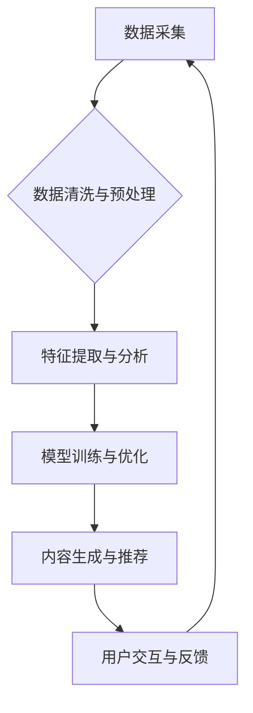

> AI，出版业，数据驱动，场景创新，内容生成，个性化推荐，智能编辑，版权保护

## 1. 背景介绍

出版业作为文化传播的重要载体，在信息时代面临着前所未有的挑战和机遇。传统出版模式的弊端，如生产周期长、成本高、读者触达受限等，逐渐暴露出来。而人工智能（AI）技术的快速发展，为出版业带来了颠覆性的变革，为构建更加高效、智能、个性化的出版生态提供了强有力的技术支撑。

近年来，AI技术在出版业的应用日益广泛，涵盖内容创作、编辑排版、营销推广、读者服务等多个环节。从AI辅助写作、智能校对到个性化内容推荐、虚拟出版平台，AI正在深刻地改变着出版业的运作模式和用户体验。

## 2. 核心概念与联系

**2.1 数据驱动出版**

数据驱动是AI出版的核心理念。通过收集、分析和利用海量出版数据，如读者阅读行为、市场趋势、内容偏好等，可以洞察读者需求，优化内容生产，提高出版效率。

**2.2 场景创新出版**

场景创新是指根据不同的用户需求和场景，定制化开发AI出版解决方案。例如，针对教育领域，可以开发AI辅助教学的智能教材平台；针对企业，可以开发AI生成营销文案的工具；针对个人，可以开发AI辅助写作的创作平台。

**2.3 AI出版架构**



## 3. 核心算法原理 & 具体操作步骤

**3.1 算法原理概述**

AI出版的核心算法主要包括自然语言处理（NLP）、机器学习（ML）和深度学习（DL）。

* **NLP**：用于理解和生成人类语言，例如文本分类、情感分析、机器翻译等。
* **ML**：通过训练模型，从数据中学习规律，进行预测和决策，例如内容推荐、用户画像等。
* **DL**：一种更高级的机器学习方法，利用多层神经网络模拟人类大脑的学习过程，例如图像识别、语音识别等。

**3.2 算法步骤详解**

1. **数据收集与预处理**: 收集出版相关的各种数据，如书籍内容、读者评论、市场数据等，并进行清洗、格式化、标注等预处理工作。
2. **特征提取与分析**: 从数据中提取有价值的特征，例如关键词、主题、情感等，并进行分析和挖掘，以发现潜在的规律和模式。
3. **模型训练与优化**: 选择合适的算法模型，并利用训练数据进行模型训练，不断调整模型参数，提高模型的准确性和性能。
4. **内容生成与推荐**: 利用训练好的模型，进行内容生成、个性化推荐等任务，为读者提供更加精准、丰富的阅读体验。
5. **用户交互与反馈**: 收集用户对内容的反馈，并将其反馈回模型训练环节，不断优化模型，提升服务质量。

**3.3 算法优缺点**

* **优点**: 
    * 自动化生产，提高效率
    * 个性化推荐，提升用户体验
    * 数据驱动决策，降低风险
* **缺点**: 
    * 数据依赖性强，需要大量高质量数据
    * 模型训练成本高
    * 算法解释性差，难以理解模型决策

**3.4 算法应用领域**

* 内容创作：AI辅助写作、智能编辑、内容生成
* 内容推荐：个性化推荐、内容分类、主题发现
* 读者服务：智能客服、个性化阅读建议、阅读习惯分析
* 市场营销：精准广告投放、用户画像分析、市场趋势预测

## 4. 数学模型和公式 & 详细讲解 & 举例说明

**4.1 数学模型构建**

在AI出版中，常用的数学模型包括：

* **协同过滤**: 用于推荐用户可能感兴趣的内容，基于用户的历史行为和与其他用户的相似度进行预测。
* **内容基准**: 基于内容的主题、关键词等特征进行匹配和推荐。
* **深度学习**: 利用神经网络模型，从海量数据中学习复杂的模式，进行内容生成、分类、推荐等任务。

**4.2 公式推导过程**

协同过滤算法中常用的公式包括：

* **相似度计算**: 使用余弦相似度、皮尔逊相关系数等方法计算用户或物品之间的相似度。
* **预测评分**: 使用预测公式，根据用户的历史行为和与其他用户的相似度，预测用户对特定内容的评分。

**4.3 案例分析与讲解**

例如，在推荐系统中，可以使用协同过滤算法，根据用户的阅读历史和与其他用户的相似度，推荐用户可能感兴趣的书籍。

假设用户A阅读了书籍1、2、3，用户B阅读了书籍2、3、4，则可以计算用户A和用户B之间的相似度。如果相似度较高，则可以认为用户A和用户B的阅读口味相似，因此可以推荐用户A书籍4。

## 5. 项目实践：代码实例和详细解释说明

**5.1 开发环境搭建**

* 操作系统：Windows/macOS/Linux
* Python版本：3.6+
* 必要的库：pandas, numpy, scikit-learn, tensorflow等

**5.2 源代码详细实现**

```python
# 协同过滤推荐算法示例

import pandas as pd
from sklearn.metrics.pairwise import cosine_similarity

# 加载用户评分数据
ratings = pd.read_csv('ratings.csv')

# 计算用户之间的相似度
user_similarity = cosine_similarity(ratings)

# 获取用户A的ID
user_a_id = 1

# 获取用户A已评分的书籍ID
rated_books = ratings[ratings['user_id'] == user_a_id]['book_id'].tolist()

# 计算用户A与其他用户的相似度
similar_users = user_similarity[user_a_id]

# 找到与用户A相似度最高的N个用户
top_n_similar_users = similar_users.argsort()[-5:][::-1]

# 获取相似用户评分的书籍
similar_users_ratings = ratings[ratings['user_id'].isin(top_n_similar_users)]

# 过滤掉用户A已评分的书籍
unrated_books = similar_users_ratings['book_id'].drop(rated_books)

# 计算用户A可能感兴趣的书籍评分
predicted_ratings = similar_users_ratings.groupby('book_id')['rating'].mean()

# 获取用户A可能感兴趣的书籍
recommended_books = predicted_ratings.sort_values(ascending=False).head(10).index.tolist()

# 输出推荐结果
print(f'推荐给用户{user_a_id}的书籍：{recommended_books}')
```

**5.3 代码解读与分析**

该代码示例展示了如何使用协同过滤算法进行书籍推荐。

首先，加载用户评分数据，并计算用户之间的相似度。然后，根据用户A的已评分书籍，找到与用户A相似度最高的N个用户。

接下来，获取相似用户评分的书籍，并过滤掉用户A已评分的书籍。最后，计算用户A可能感兴趣的书籍评分，并输出推荐结果。

**5.4 运行结果展示**

运行该代码后，将输出用户A可能感兴趣的书籍列表。

## 6. 实际应用场景

**6.1 教育出版**

* AI辅助教学：生成个性化学习内容、智能批改作业、提供实时反馈。
* 智能教材平台：根据学生学习进度和能力，推荐合适的学习资源。
* 在线教育平台：提供AI驱动的虚拟辅导、个性化学习路径规划。

**6.2 企业出版**

* AI生成营销文案：根据目标客户和产品特点，自动生成吸引人的广告文案。
* 智能报告生成：自动提取数据，生成简洁明了的报告。
* 内部知识库：利用AI技术构建智能知识库，方便员工查找和共享信息。

**6.3 个人出版**

* AI辅助写作：帮助用户克服写作障碍，提高写作效率。
* 智能编辑工具：自动检查语法错误、标点符号错误等。
* 个人博客平台：提供AI驱动的文章推荐、内容创作建议等服务。

**6.4 未来应用展望**

* **沉浸式阅读体验**: 利用VR/AR技术，打造沉浸式的阅读体验，让读者身临其境地感受故事。
* **个性化内容定制**: 基于用户的阅读习惯和偏好，定制化生成个性化的内容，满足用户的个性化需求。
* **跨语言出版**: 利用机器翻译技术，打破语言障碍，实现跨语言的出版和传播。

## 7. 工具和资源推荐

**7.1 学习资源推荐**

* **书籍**:
    * 《深度学习》
    * 《自然语言处理》
    * 《机器学习实战》
* **在线课程**:
    * Coursera
    * edX
    * Udacity

**7.2 开发工具推荐**

* **Python**: 广泛应用于AI开发，拥有丰富的库和工具。
* **TensorFlow**: 开源深度学习框架，用于构建和训练神经网络模型。
* **PyTorch**: 另一个流行的深度学习框架，以其灵活性和易用性而闻名。

**7.3 相关论文推荐**

* **BERT**: Bidirectional Encoder Representations from Transformers
* **GPT**: Generative Pre-trained Transformer
* **Transformer**: Attention Is All You Need

## 8. 总结：未来发展趋势与挑战

**8.1 研究成果总结**

AI技术在出版业的应用取得了显著成果，例如内容生成、个性化推荐、智能编辑等，为出版业带来了新的机遇和挑战。

**8.2 未来发展趋势**

* **更智能的AI模型**: 随着深度学习技术的不断发展，AI模型将更加智能，能够更好地理解和生成人类语言，提供更精准的推荐和服务。
* **更个性化的阅读体验**: AI将根据用户的阅读习惯和偏好，定制化生成个性化的内容，提供更加沉浸式的阅读体验。
* **更广泛的应用场景**: AI技术将应用于出版业的各个环节，例如内容创作、编辑排版、营销推广、读者服务等，全面提升出版效率和用户体验。

**8.3 面临的挑战**

* **数据安全和隐私保护**: AI出版需要大量用户数据，如何保障数据安全和隐私保护是一个重要的挑战。
* **算法解释性和可信度**: 许多AI算法的决策过程难以解释，如何提高算法的透明度和可信度是一个需要解决的问题。
* **伦理和社会影响**: AI技术的发展可能带来一些伦理和社会问题，例如内容偏见、信息茧房等，需要引起重视和探讨。

**8.4 研究展望**

未来，AI出版领域的研究将更加注重以下几个方面：

* **开发更安全、更可靠的AI模型**: 提高算法的透明度和可解释性，保障数据安全和隐私保护。
* **探索更丰富的应用场景**: 将AI技术应用于出版业的各个环节，探索新的出版模式和服务模式。
* **研究AI技术对出版业的社会影响**: 关注AI技术带来的伦理和社会问题，制定相应的规范和政策。

## 9. 附录：常见问题与解答

**9.1 如何选择合适的AI出版工具？**

选择合适的AI出版工具需要根据具体的应用场景和需求进行选择。

例如，如果需要进行内容生成，可以选择GPT-3等文本生成模型；如果需要进行个性化推荐，可以选择协同过滤算法或内容基准模型。

**9.2 如何保障数据安全和隐私保护？**

在使用AI出版工具时，需要采取以下措施保障数据安全和隐私保护：

* 使用加密技术保护数据传输和存储。
* 遵循数据隐私法规，获取用户同意后才收集和使用用户数据。
* 定期对数据安全进行评估和测试。

**9.3 如何提高AI模型的准确性和性能？**

提高AI模型的