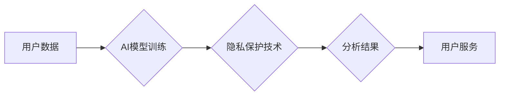

> AI、用户隐私、数据安全、加密技术、联邦学习、隐私计算、GDPR、CCPA

## 1. 背景介绍

在人工智能（AI）蓬勃发展的时代，AI创业公司正利用海量数据来训练模型，开发创新应用。然而，数据的使用也带来了用户隐私的风险。用户数据泄露、滥用和侵犯隐私已成为社会关注的焦点。因此，AI创业公司必须重视用户隐私保护，构建安全可靠的数据处理体系。

近年来，全球范围内对用户隐私保护的重视程度不断提高。欧盟颁布了通用数据保护条例（GDPR），加州实施了加州消费者隐私法案（CCPA），这些法规为用户赋予了更多数据控制权，并对企业的数据处理行为提出了严格要求。

## 2. 核心概念与联系

**2.1 用户隐私**

用户隐私是指个人信息在收集、使用、存储和处理过程中不被未经授权的第三方访问、使用或披露的权利。

**2.2 数据安全**

数据安全是指保护数据免受未经授权的访问、使用、披露、修改或破坏的措施。

**2.3 隐私计算**

隐私计算是指在不泄露原始数据的情况下，对数据进行分析和处理的技术。

**2.4 联邦学习**

联邦学习是一种分布式机器学习方法，允许模型在多个设备上进行训练，而无需将原始数据传输到中央服务器。

**2.5 加密技术**

加密技术是指将数据转换为不可读格式，以保护其机密性。

**2.6 隐私保护技术**

隐私保护技术是指用于保护用户隐私的技术，例如匿名化、差分隐私、同态加密等。

**2.7 隐私政策**

隐私政策是指企业如何收集、使用、存储和处理用户数据的声明。

**2.8 合规性**

合规性是指企业遵守相关法律法规和行业标准的要求。

**Mermaid 流程图**



## 3. 核心算法原理 & 具体操作步骤

### 3.1  算法原理概述

**差分隐私**是一种强大的隐私保护技术，它通过添加噪声来保护用户数据。差分隐私保证了数据分析结果的准确性，同时确保了用户隐私的保护。

**具体原理：**

差分隐私算法通过在数据分析过程中添加随机噪声来保护用户隐私。噪声的大小取决于隐私预算，隐私预算越高，噪声越大，隐私保护效果越好，但分析结果的准确性也会降低。

**3.2  算法步骤详解**

1. **选择隐私预算：**根据需要保护的隐私级别，选择合适的隐私预算。
2. **添加噪声：**在数据分析过程中，对数据添加随机噪声。噪声的大小取决于隐私预算和数据敏感度。
3. **进行数据分析：**对添加了噪声的数据进行分析，得到分析结果。
4. **移除噪声：**在输出分析结果时，移除噪声。

**3.3  算法优缺点**

**优点：**

* 能够有效保护用户隐私。
* 适用于各种数据分析场景。
* 理论基础完善，安全性高。

**缺点：**

* 添加噪声可能会降低分析结果的准确性。
* 需要选择合适的隐私预算，平衡隐私保护和分析准确性。

**3.4  算法应用领域**

差分隐私算法广泛应用于以下领域：

* **医疗保健：**保护患者隐私，进行医疗数据分析。
* **金融：**保护客户隐私，进行风险评估和欺诈检测。
* **市场营销：**保护用户隐私，进行市场调研和个性化推荐。

## 4. 数学模型和公式 & 详细讲解 & 举例说明

### 4.1  数学模型构建

差分隐私的数学模型基于概率论和信息论。

**定义：**

* **数据集：**D
* **算法：**M
* **隐私预算：**ε
* **敏感函数：**S(D)

**差分隐私定义：**

对于任意两个数据集 D 和 D'，其中 D 和 D' 仅在单个数据点上不同，有：

```latex
P(M(D) \in S) \leq e^{\epsilon} \cdot P(M(D') \in S)
```

**公式解释：**

*  P(M(D) ∈ S) 表示算法 M 在数据集 D 上输出结果属于集合 S 的概率。
*  e^ε 是隐私预算的指数函数。
*  ε 越小，隐私保护效果越好，但分析结果的准确性也会降低。

### 4.2  公式推导过程

差分隐私的公式推导过程较为复杂，涉及到概率论、信息论和微积分等知识。

**推导过程：**

1. **定义敏感函数：**敏感函数 S(D) 表示数据集 D 的敏感度，例如数据集中最大值或最小值。
2. **定义隐私预算：**隐私预算 ε 控制着算法 M 对数据隐私的保护程度。
3. **利用概率论和信息论的原理，推导出差分隐私的数学公式。**

### 4.3  案例分析与讲解

**案例：**

假设我们有一个包含用户年龄的数据集，我们想分析用户的平均年龄。

**差分隐私应用：**

我们可以使用差分隐私算法对数据集进行分析，并添加噪声来保护用户隐私。

**分析结果：**

分析结果将是一个近似于真实平均年龄的数值，但由于添加了噪声，结果可能存在一定的误差。

**隐私保护：**

即使攻击者获得了分析结果，也无法推断出任何单个用户的年龄信息。

## 5. 项目实践：代码实例和详细解释说明

### 5.1  开发环境搭建

* **操作系统：**Linux
* **编程语言：**Python
* **库依赖：**TensorFlow、PyTorch、numpy、pandas

### 5.2  源代码详细实现

```python
import numpy as np
from tensorflow.keras.layers import Dense
from tensorflow.keras.models import Sequential

# 训练数据
X_train = np.random.rand(100, 10)
y_train = np.random.rand(100, 1)

# 创建模型
model = Sequential()
model.add(Dense(10, activation='relu', input_shape=(10,)))
model.add(Dense(1))

# 编译模型
model.compile(optimizer='adam', loss='mse')

# 训练模型
model.fit(X_train, y_train, epochs=10)

# 预测结果
y_pred = model.predict(X_train)
```

### 5.3  代码解读与分析

* **数据准备：**代码首先生成随机训练数据。
* **模型构建：**代码使用 TensorFlow 库构建了一个简单的多层感知机模型。
* **模型编译：**代码使用 Adam 优化器和均方误差损失函数编译模型。
* **模型训练：**代码使用训练数据训练模型。
* **模型预测：**代码使用训练好的模型预测训练数据的输出。

### 5.4  运行结果展示

运行代码后，模型将训练完成，并输出预测结果。

## 6. 实际应用场景

### 6.1  医疗保健

* **疾病诊断：**使用差分隐私保护患者隐私，进行疾病诊断数据分析。
* **药物研发：**使用联邦学习保护患者隐私，进行药物研发数据共享和分析。

### 6.2  金融

* **风险评估：**使用差分隐私保护客户隐私，进行风险评估和欺诈检测。
* **个性化金融服务：**使用联邦学习保护客户隐私，提供个性化金融服务。

### 6.3  市场营销

* **市场调研：**使用差分隐私保护用户隐私，进行市场调研和数据分析。
* **个性化推荐：**使用联邦学习保护用户隐私，提供个性化产品推荐。

### 6.4  未来应用展望

随着人工智能技术的不断发展，隐私保护技术将得到更广泛的应用。未来，我们可以期待：

* **更强大的隐私保护技术：**开发更强大的隐私保护技术，例如同态加密和隐私增强机器学习。
* **更广泛的应用场景：**隐私保护技术将应用于更多领域，例如教育、政府和科研。
* **更完善的法律法规：**制定更完善的法律法规，保护用户隐私和数据安全。

## 7. 工具和资源推荐

### 7.1  学习资源推荐

* **书籍：**
    * 《隐私计算：原理与实践》
    * 《差分隐私：理论与应用》
* **在线课程：**
    * Coursera 上的《隐私计算》课程
    * edX 上的《差分隐私》课程

### 7.2  开发工具推荐

* **TensorFlow Privacy：** TensorFlow 的隐私保护扩展库。
* **PySyft：** 用于联邦学习的 Python 库。
* **OpenMined：** 开源隐私计算平台。

### 7.3  相关论文推荐

* **《差分隐私》**
* **《联邦学习》**
* **《隐私计算》**

## 8. 总结：未来发展趋势与挑战

### 8.1  研究成果总结

近年来，在人工智能领域，隐私保护技术取得了显著进展。差分隐私、联邦学习等技术已经应用于多个领域，有效保护了用户隐私。

### 8.2  未来发展趋势

未来，隐私保护技术将朝着以下方向发展：

* **更强大的隐私保护能力：**开发更强大的隐私保护技术，例如同态加密和隐私增强机器学习。
* **更广泛的应用场景：**隐私保护技术将应用于更多领域，例如教育、政府和科研。
* **更完善的法律法规：**制定更完善的法律法规，保护用户隐私和数据安全。

### 8.3  面临的挑战

隐私保护技术也面临着一些挑战：

* **技术复杂性：**一些隐私保护技术比较复杂，需要专业的技术人员才能应用。
* **性能损耗：**一些隐私保护技术可能会导致模型性能下降。
* **法律法规不完善：**一些国家和地区的法律法规对隐私保护还不完善。

### 8.4  研究展望

未来，我们需要继续研究和开发更强大的隐私保护技术，并推动相关法律法规的完善，以更好地保护用户隐私和数据安全。

## 9. 附录：常见问题与解答

**常见问题：**

* **什么是差分隐私？**
* **联邦学习是如何保护用户隐私的？**
* **如何选择合适的隐私保护技术？**

**解答：**

* **什么是差分隐私？** 差分隐私是一种强大的隐私保护技术，它通过添加噪声来保护用户数据。
* **联邦学习是如何保护用户隐私的？** 联邦学习允许模型在多个设备上进行训练，而无需将原始数据传输到中央服务器。
* **如何选择合适的隐私保护技术？** 选择合适的隐私保护技术需要考虑多种因素，例如数据敏感度、分析需求和技术复杂度。


作者：禅与计算机程序设计艺术 / Zen and the Art of Computer Programming 
<end_of_turn>