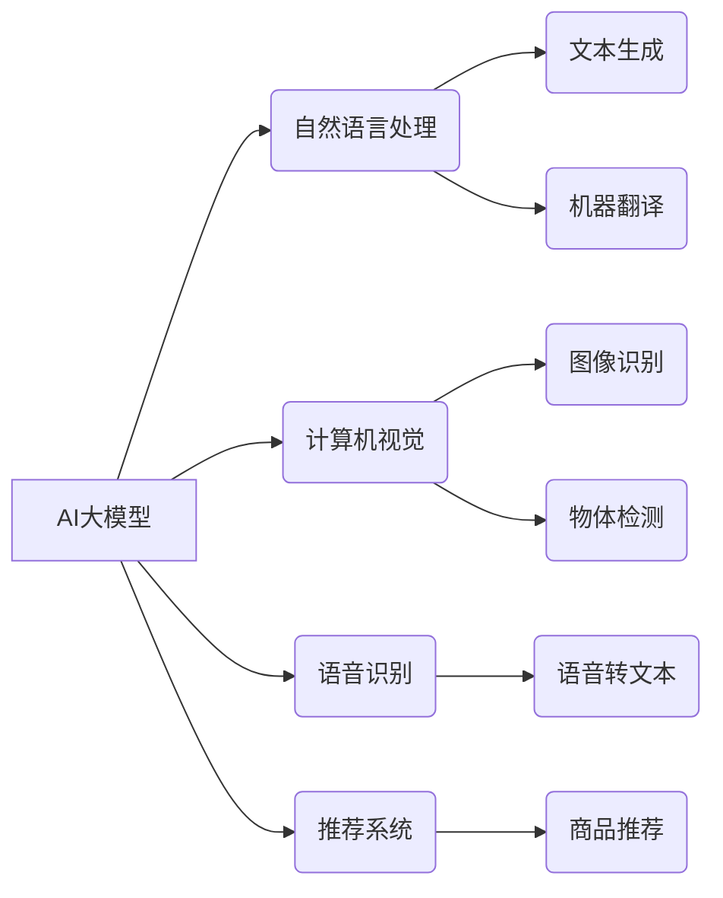

> AI大模型、创业、应用开发、商业模式、技术趋势、未来趋势

## 1. 背景介绍

人工智能（AI）技术近年来发展迅速，特别是大模型的涌现，为各行各业带来了前所未有的机遇。大模型，是指参数规模庞大、训练数据海量的人工智能模型，具备强大的泛化能力和学习能力，能够在自然语言处理、计算机视觉、语音识别等领域取得突破性进展。

随着大模型技术的成熟，越来越多的创业者看到了其中的商机，纷纷涌入AI大模型创业领域。然而，仅仅拥有强大的技术能力还不够，想要打造出爆款应用，还需要深入理解用户需求、构建合理的商业模式，并紧跟技术发展趋势。

## 2. 核心概念与联系

**2.1 AI大模型的定义与特点**

AI大模型是指参数规模庞大、训练数据海量的人工智能模型，其核心特点包括：

* **规模化：** 大模型拥有数亿甚至数十亿的参数，使其能够学习更复杂的模式和关系。
* **泛化能力强：** 由于训练数据量大，大模型能够更好地泛化到未知的数据集，表现出更强的适应性和鲁棒性。
* **多模态学习：** 一些大模型能够处理多种数据类型，例如文本、图像、音频等，实现跨模态的理解和生成。

**2.2 大模型应用场景**

AI大模型在各个领域都有广泛的应用场景，例如：

* **自然语言处理：** 文本生成、机器翻译、问答系统、情感分析等。
* **计算机视觉：** 图像识别、物体检测、图像分割、视频分析等。
* **语音识别：** 语音转文本、语音合成、语音助手等。
* **推荐系统：** 商品推荐、内容推荐、个性化服务等。

**2.3 大模型创业机会**

AI大模型的快速发展为创业者带来了诸多机会：

* **开发垂直领域的AI应用：** 将大模型技术应用于特定行业，例如医疗、教育、金融等，开发针对性强的解决方案。
* **提供大模型服务：** 为企业提供大模型的API接口，帮助他们快速集成AI功能。
* **构建AI平台：** 开发AI开发平台，提供大模型训练、部署、管理等服务。

**2.4  核心概念关系图**



## 3. 核心算法原理 & 具体操作步骤

**3.1 算法原理概述**

大模型的训练主要基于深度学习算法，其中Transformer模型是目前最主流的架构。Transformer模型的核心思想是利用注意力机制，能够捕捉文本序列中长距离依赖关系，从而实现更准确的理解和生成。

**3.2 算法步骤详解**

大模型的训练过程可以概括为以下步骤：

1. **数据预处理：** 将原始数据进行清洗、格式化、编码等操作，使其能够被模型理解。
2. **模型构建：** 根据具体的应用场景选择合适的模型架构，例如Transformer、BERT等。
3. **模型训练：** 使用训练数据对模型进行训练，调整模型参数，使其能够准确地完成预设的任务。
4. **模型评估：** 使用测试数据对模型进行评估，衡量模型的性能，例如准确率、召回率等。
5. **模型部署：** 将训练好的模型部署到生产环境中，提供服务给用户。

**3.3 算法优缺点**

**优点：**

* 泛化能力强，能够处理复杂的任务。
* 学习能力强，能够从海量数据中提取有价值的信息。
* 可迁移性强，可以应用于不同的领域和任务。

**缺点：**

* 训练成本高，需要大量的计算资源和数据。
* 模型解释性差，难以理解模型的决策过程。
* 容易受到数据偏差的影响。

**3.4 算法应用领域**

大模型算法广泛应用于以下领域：

* 自然语言处理：机器翻译、文本摘要、问答系统等。
* 计算机视觉：图像识别、物体检测、图像生成等。
* 语音识别：语音转文本、语音合成等。
* 医疗诊断：疾病预测、影像分析等。
* 金融分析：风险评估、欺诈检测等。

## 4. 数学模型和公式 & 详细讲解 & 举例说明

**4.1 数学模型构建**

大模型的训练过程本质上是一个优化问题，目标是找到模型参数，使得模型在训练数据上的损失函数最小。损失函数通常是模型预测值与真实值的差值，例如均方误差（MSE）或交叉熵损失（Cross-Entropy Loss）。

**4.2 公式推导过程**

假设模型的输出为y，真实值是t，损失函数为L(y,t)。模型参数为θ，则模型训练的目标是：

```latex
\theta = \arg \min_{\theta} \sum_{i=1}^{N} L(y_i, t_i)
```

其中N是训练数据的数量。

为了找到最优的θ，可以使用梯度下降算法，不断更新模型参数，使其朝着损失函数最小化的方向前进。梯度下降算法的更新公式为：

```latex
\theta = \theta - \eta \nabla_{\theta} L(y, t)
```

其中η是学习率，∇θL(y,t)是损失函数关于模型参数θ的梯度。

**4.3 案例分析与讲解**

例如，在机器翻译任务中，模型的输出是翻译后的文本，真实值是目标语言的文本。损失函数可以是交叉熵损失，它衡量模型预测的概率分布与真实概率分布之间的差异。

通过梯度下降算法，不断更新模型参数，使得模型能够将源语言文本翻译成目标语言文本，并最小化翻译错误率。

## 5. 项目实践：代码实例和详细解释说明

**5.1 开发环境搭建**

* 操作系统：Linux或macOS
* Python版本：3.7或更高版本
* 深度学习框架：TensorFlow或PyTorch
* 其他依赖库：numpy、pandas、matplotlib等

**5.2 源代码详细实现**

以下是一个使用TensorFlow框架训练一个简单的文本分类模型的代码示例：

```python
import tensorflow as tf

# 定义模型结构
model = tf.keras.models.Sequential([
    tf.keras.layers.Embedding(input_dim=10000, output_dim=128),
    tf.keras.layers.LSTM(units=64),
    tf.keras.layers.Dense(units=2, activation='softmax')
])

# 编译模型
model.compile(optimizer='adam',
              loss='sparse_categorical_crossentropy',
              metrics=['accuracy'])

# 训练模型
model.fit(x_train, y_train, epochs=10)

# 评估模型
loss, accuracy = model.evaluate(x_test, y_test)
print('Loss:', loss)
print('Accuracy:', accuracy)
```

**5.3 代码解读与分析**

* 首先，定义了一个简单的文本分类模型，包含嵌入层、LSTM层和全连接层。
* 嵌入层将单词转换为向量表示。
* LSTM层用于捕捉文本序列中的长距离依赖关系。
* 全连接层用于分类。
* 然后，使用Adam优化器、交叉熵损失函数和准确率指标编译模型。
* 最后，使用训练数据训练模型，并使用测试数据评估模型性能。

**5.4 运行结果展示**

训练完成后，可以查看模型的损失值和准确率，评估模型的性能。

## 6. 实际应用场景

**6.1 文本生成**

* 自动生成新闻报道、小说、诗歌等文本。
* 为聊天机器人提供自然语言对话能力。
* 自动生成代码、文档等技术文本。

**6.2 计算机视觉**

* 自动识别图像中的物体、场景、人物等。
* 自动生成图像、视频等多媒体内容。
* 用于医疗影像分析，辅助医生诊断疾病。

**6.3 语音识别**

* 语音转文本，用于语音助手、语音搜索等应用。
* 语音合成，用于语音播报、语音聊天等应用。
* 用于语音识别技术，例如语音密码验证、语音控制等。

**6.4 未来应用展望**

随着大模型技术的不断发展，其应用场景将更加广泛，例如：

* 个性化教育：根据学生的学习情况，提供个性化的学习内容和辅导。
* 智能客服：提供更加智能、人性化的客户服务体验。
* 自动驾驶：辅助驾驶员进行决策，提高驾驶安全性和效率。

## 7. 工具和资源推荐

**7.1 学习资源推荐**

* **书籍：**
    * 《深度学习》
    * 《自然语言处理》
    * 《机器学习》
* **在线课程：**
    * Coursera
    * edX
    * Udacity

**7.2 开发工具推荐**

* **深度学习框架：** TensorFlow、PyTorch、Keras
* **云计算平台：** AWS、Azure、Google Cloud
* **数据处理工具：** Pandas、NumPy

**7.3 相关论文推荐**

* 《Attention Is All You Need》
* 《BERT: Pre-training of Deep Bidirectional Transformers for Language Understanding》
* 《GPT-3: Language Models are Few-Shot Learners》

## 8. 总结：未来发展趋势与挑战

**8.1 研究成果总结**

近年来，AI大模型取得了显著的进展，在自然语言处理、计算机视觉等领域取得了突破性成果。大模型的泛化能力强、学习能力强、可迁移性强，为人工智能的广泛应用提供了基础。

**8.2 未来发展趋势**

* **模型规模化：** 大模型的规模将继续扩大，参数量将达到数万亿甚至更高。
* **多模态学习：** 大模型将能够处理多种数据类型，实现跨模态的理解和生成。
* **可解释性增强：** 研究人员将致力于提高大模型的可解释性，使其决策过程更加透明。
* **边缘计算：** 大模型将部署到边缘设备，实现更低延迟、更高效率的应用。

**8.3 面临的挑战**

* **数据获取和隐私保护：** 大模型训练需要海量数据，如何获取高质量数据并保护用户隐私是一个挑战。
* **计算资源需求：** 大模型训练需要大量的计算资源，如何降低训练成本是一个关键问题。
* **模型安全性和可靠性：** 大模型容易受到攻击和操纵，如何保证模型的安全性和可靠性是一个重要课题。

**8.4 研究展望**

未来，AI大模型将继续朝着更强大、更智能、更安全的方向发展，为人类社会带来更多福祉。


## 9. 附录：常见问题与解答

**9.1 如何选择合适的AI大模型？**

选择合适的AI大模型需要根据具体的应用场景和需求进行考虑，例如：

* **任务类型：** 不同的任务类型需要不同的模型架构，例如文本分类、机器翻译、图像识别等。
* **数据规模：** 模型的规模需要与训练数据的规模相匹配。
* **计算资源：** 模型的训练和部署需要足够的计算资源。

**9.2 如何训练自己的AI大模型？**

训练自己的AI大模型需要具备一定的深度学习知识和经验，以及充足的计算资源和数据。

* **数据准备：** 收集、清洗、格式化训练数据。
* **模型选择：** 选择合适的模型架构和参数设置。
* **模型训练：** 使用深度学习框架训练模型，并进行调参优化。
* **模型评估：** 使用测试数据评估模型性能，并进行迭代改进。

**9.3 如何部署AI大模型？**

部署