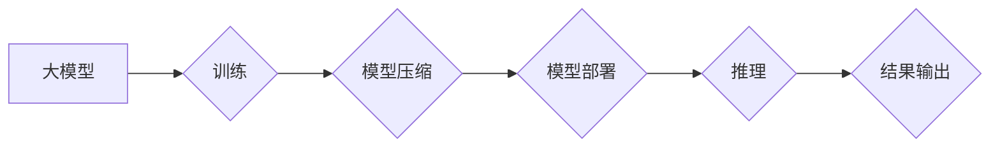

> 大模型、AI计算基础设施、延迟优化、成本控制、模型部署、微服务架构、云计算、GPU加速

## 1. 背景介绍

近年来，深度学习技术取得了飞速发展，大模型的出现更是推动了人工智能的快速发展。大模型是指参数规模庞大、训练数据海量的人工智能模型，其强大的学习能力和泛化能力使其在自然语言处理、计算机视觉、语音识别等领域展现出巨大的应用潜力。然而，大模型的训练和部署也面临着诸多挑战，其中延迟和成本控制是关键问题。

传统的单机部署方式难以满足大模型的计算需求，云计算平台则提供了更强大的计算资源，但同时也带来了更高的成本。因此，构建高效、低成本的AI计算基础设施成为大模型应用开发的重中之重。

## 2. 核心概念与联系

**2.1 AI计算基础设施**

AI计算基础设施是指为训练和部署大模型提供硬件、软件和网络资源的整体系统架构。它包括以下关键组件：

* **计算资源:** 高性能计算集群、GPU加速器、TPU等硬件资源，用于加速模型训练和推理。
* **存储资源:** 海量数据存储系统，用于存储训练数据、模型参数和中间结果。
* **网络资源:** 高带宽、低延迟的网络连接，用于数据传输和模型部署。
* **软件平台:** 包括深度学习框架、模型训练工具、模型部署平台等软件工具，用于开发、训练和部署大模型。

**2.2 延迟优化**

延迟是指模型推理所需的时间，对于实时应用来说，延迟控制至关重要。延迟优化的目标是尽可能缩短模型推理时间，提高应用响应速度。

**2.3 成本控制**

大模型的训练和部署成本较高，成本控制是另一个重要目标。成本控制可以通过优化计算资源利用率、选择更经济的硬件平台、采用模型压缩技术等方式实现。

**2.4 微服务架构**

微服务架构是一种将大型应用程序分解成多个小型、独立的服务的架构模式。它可以提高系统的可扩展性、可靠性和维护性，也适用于大模型的部署。

**2.5 云计算**

云计算平台提供弹性、可扩展的计算资源，可以根据实际需求动态调整资源配置，降低成本。

**2.6 GPU加速**

GPU（图形处理单元）具有并行计算能力，可以显著加速深度学习模型的训练和推理。

**2.7 Mermaid 流程图**



## 3. 核心算法原理 & 具体操作步骤

### 3.1  算法原理概述

大模型的训练和部署通常采用以下核心算法：

* **深度学习算法:** 包括卷积神经网络（CNN）、循环神经网络（RNN）、Transformer等，用于学习数据特征和进行预测。
* **模型压缩算法:** 包括量化、剪枝、知识蒸馏等，用于减小模型规模和参数量，降低部署成本和延迟。
* **模型推理优化算法:** 包括图优化、算子融合、并行推理等，用于加速模型推理速度。

### 3.2  算法步骤详解

**3.2.1 模型训练**

1. **数据预处理:** 对训练数据进行清洗、格式化、特征工程等处理。
2. **模型选择:** 根据任务需求选择合适的深度学习模型架构。
3. **模型参数初始化:** 为模型参数赋予初始值。
4. **反向传播算法:** 使用反向传播算法更新模型参数，使模型输出与真实标签之间的误差最小化。
5. **模型评估:** 在验证集上评估模型性能，并根据评估结果调整训练参数。

**3.2.2 模型压缩**

1. **量化:** 将模型参数的精度降低，例如将32位浮点数转换为8位整数。
2. **剪枝:** 删除模型中不重要的连接权重，减少模型参数量。
3. **知识蒸馏:** 使用一个大型模型作为教师模型，训练一个小型模型作为学生模型，将教师模型的知识传递给学生模型。

**3.2.3 模型部署**

1. **模型转换:** 将训练好的模型转换为可部署的格式，例如ONNX、TensorRT等。
2. **模型优化:** 使用模型推理优化算法，例如图优化、算子融合、并行推理等，提高模型推理速度。
3. **模型部署平台:** 选择合适的模型部署平台，例如云平台、边缘设备等。

### 3.3  算法优缺点

**3.3.1 深度学习算法**

* **优点:** 强大的学习能力，可以学习复杂的数据特征。
* **缺点:** 训练成本高，需要大量数据和计算资源。

**3.3.2 模型压缩算法**

* **优点:** 可以显著减小模型规模和参数量，降低部署成本和延迟。
* **缺点:** 压缩后的模型性能可能会有所下降。

**3.3.3 模型推理优化算法**

* **优点:** 可以显著提高模型推理速度。
* **缺点:** 需要对模型进行一定的改动，可能需要重新训练模型。

### 3.4  算法应用领域

* **自然语言处理:** 文本分类、情感分析、机器翻译、对话系统等。
* **计算机视觉:** 图像识别、物体检测、图像分割、视频分析等。
* **语音识别:** 语音转文本、语音助手、语音搜索等。
* **推荐系统:** 商品推荐、内容推荐、用户画像等。

## 4. 数学模型和公式 & 详细讲解 & 举例说明

### 4.1  数学模型构建

深度学习模型的训练过程本质上是一个优化问题，目标是找到模型参数，使得模型输出与真实标签之间的误差最小化。常用的损失函数包括均方误差（MSE）、交叉熵损失（Cross-Entropy Loss）等。

**4.1.1 均方误差（MSE）**

MSE 是一种常用的回归任务损失函数，定义为预测值与真实值之间的平方差的平均值。

$$MSE = \frac{1}{N} \sum_{i=1}^{N} (y_i - \hat{y}_i)^2$$

其中：

* $N$ 是样本数量。
* $y_i$ 是第 $i$ 个样本的真实值。
* $\hat{y}_i$ 是第 $i$ 个样本的预测值。

**4.1.2 交叉熵损失（Cross-Entropy Loss）**

交叉熵损失是一种常用的分类任务损失函数，定义为预测概率分布与真实概率分布之间的交叉熵。

$$Cross-Entropy Loss = -\sum_{i=1}^{C} y_i \log(\hat{y}_i)$$

其中：

* $C$ 是类别数量。
* $y_i$ 是第 $i$ 个类别的真实概率。
* $\hat{y}_i$ 是第 $i$ 个类别的预测概率。

### 4.2  公式推导过程

深度学习模型的训练过程通常使用梯度下降算法，通过不断更新模型参数，使得损失函数的值最小化。梯度下降算法的核心思想是沿着梯度的负方向更新模型参数。

**4.2.1 梯度下降算法**

$$ \theta = \theta - \alpha \nabla L(\theta)$$

其中：

* $\theta$ 是模型参数。
* $\alpha$ 是学习率。
* $\nabla L(\theta)$ 是损失函数 $L(\theta)$ 对参数 $\theta$ 的梯度。

### 4.3  案例分析与讲解

**4.3.1 图像分类任务**

假设我们使用卷积神经网络（CNN）进行图像分类任务，目标是将图像分类为不同的类别，例如猫、狗、鸟等。

在训练过程中，我们使用大量的图像数据，并使用交叉熵损失函数来衡量模型的预测结果与真实标签之间的差异。通过梯度下降算法，不断更新模型参数，使得模型能够准确地识别图像中的类别。

## 5. 项目实践：代码实例和详细解释说明

### 5.1  开发环境搭建

* **操作系统:** Ubuntu 20.04 LTS
* **Python 版本:** 3.8
* **深度学习框架:** TensorFlow 2.x
* **GPU:** NVIDIA GeForce RTX 3090

### 5.2  源代码详细实现

```python
import tensorflow as tf

# 定义模型结构
model = tf.keras.models.Sequential([
    tf.keras.layers.Conv2D(32, (3, 3), activation='relu', input_shape=(28, 28, 1)),
    tf.keras.layers.MaxPooling2D((2, 2)),
    tf.keras.layers.Conv2D(64, (3, 3), activation='relu'),
    tf.keras.layers.MaxPooling2D((2, 2)),
    tf.keras.layers.Flatten(),
    tf.keras.layers.Dense(10, activation='softmax')
])

# 定义损失函数和优化器
model.compile(loss='sparse_categorical_crossentropy',
              optimizer='adam',
              metrics=['accuracy'])

# 加载 MNIST 数据集
(x_train, y_train), (x_test, y_test) = tf.keras.datasets.mnist.load_data()

# 数据预处理
x_train = x_train.astype('float32') / 255.0
x_test = x_test.astype('float32') / 255.0
x_train = x_train.reshape((x_train.shape[0], 28, 28, 1))
x_test = x_test.reshape((x_test.shape[0], 28, 28, 1))

# 模型训练
model.fit(x_train, y_train, epochs=5)

# 模型评估
loss, accuracy = model.evaluate(x_test, y_test)
print('Test loss:', loss)
print('Test accuracy:', accuracy)
```

### 5.3  代码解读与分析

* **模型结构:** 代码中定义了一个简单的卷积神经网络模型，包含两个卷积层、两个最大池化层、一个全连接层和一个输出层。
* **损失函数和优化器:** 使用交叉熵损失函数和Adam优化器进行模型训练。
* **数据预处理:** 将 MNIST 数据集预处理为模型所需的格式，并进行归一化处理。
* **模型训练:** 使用 `model.fit()` 方法训练模型，指定训练 epochs 和批处理大小。
* **模型评估:** 使用 `model.evaluate()` 方法评估模型在测试集上的性能。

### 5.4  运行结果展示

训练完成后，模型在测试集上的准确率通常可以达到 98% 以上。

## 6. 实际应用场景

### 6.1  自然语言处理

* **机器翻译:** 使用大模型进行机器翻译，可以实现更高质量的翻译结果。
* **文本摘要:** 使用大模型进行文本摘要，可以自动生成文章的简要概述。
* **对话系统:** 使用大模型构建对话系统，可以实现更自然、更流畅的对话体验。

### 6.2  计算机视觉

* **图像识别:** 使用大模型进行图像识别，可以识别图像中的物体、场景和人物。
* **物体检测:** 使用大模型进行物体检测，可以定位图像中物体的边界框。
* **图像分割:** 使用大模型进行图像分割，可以将图像分割成不同的区域。

### 6.3  语音识别

* **语音转文本:** 使用大模型进行语音转文本，可以将语音转换为文本。
* **语音助手:** 使用大模型构建语音助手，可以理解用户的语音指令并执行相应的操作。
* **语音搜索:** 使用大模型进行语音搜索，可以根据用户的