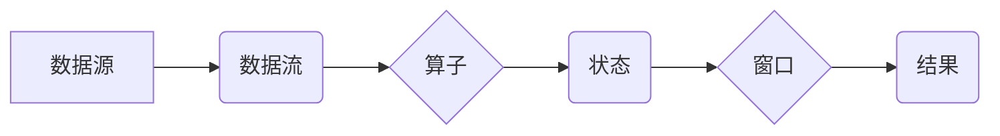

> Apache Flink, 流处理, 微服务, 实时计算, 数据流, 窗口函数, 状态管理, 并行处理, 容错机制

## 1. 背景介绍

在当今数据爆炸的时代，实时数据处理已成为各行各业的核心竞争力。传统的批处理模式难以满足对实时分析和响应的需求。Apache Flink 作为一款开源的分布式流处理框架，凭借其高吞吐量、低延迟、容错能力强等特点，在实时数据处理领域获得了广泛应用。

Flink 的出现填补了实时数据处理的空白，为企业提供了实时数据分析、实时决策、实时监控等功能，推动了数据驱动决策的进程。

## 2. 核心概念与联系

Flink 的核心概念包括数据流、算子、状态、窗口、并行处理、容错机制等。

**数据流:** Flink 将数据视为一个连续的流，而不是离散的批次。数据流可以来自各种数据源，例如 Kafka、MySQL、HDFS 等。

**算子:** 算子是 Flink 处理数据的基本单元，它可以对数据进行各种操作，例如过滤、映射、聚合等。Flink 提供了丰富的内置算子，也可以自定义算子。

**状态:** 状态是 Flink 处理数据的关键机制，它允许算子维护数据的状态，以便进行更复杂的处理。Flink 提供了两种状态类型：keyed state 和 broadcast state。

**窗口:** 窗口是 Flink 处理数据的时间范围，它允许算子对数据进行分组和聚合操作。Flink 提供了多种窗口类型，例如 tumbling window、sliding window、session window 等。

**并行处理:** Flink 支持并行处理，可以将数据流分配到多个执行器上进行处理，提高处理效率。

**容错机制:** Flink 提供了强大的容错机制，可以保证数据处理的可靠性。

**Flink 架构流程图:**



## 3. 核心算法原理 & 具体操作步骤

### 3.1  算法原理概述

Flink 的核心算法是基于数据流的微批处理模型。它将数据流划分为小的批次，并对每个批次进行处理。这种微批处理模型结合了批处理的效率和流处理的实时性。

### 3.2  算法步骤详解

1. **数据接收:** Flink 从数据源接收数据流。
2. **数据切片:** Flink 将数据流切分为小的批次。
3. **数据分配:** Flink 将每个批次分配到不同的执行器上进行处理。
4. **数据处理:** 执行器执行算子，对数据进行处理。
5. **状态更新:** 执行器更新状态，以便后续处理使用。
6. **结果输出:** 执行器将处理结果输出到下游系统。

### 3.3  算法优缺点

**优点:**

* 高吞吐量: 微批处理模型可以提高数据处理吞吐量。
* 低延迟: 批次大小较小，可以降低数据处理延迟。
* 容错能力强: Flink 提供了强大的容错机制，可以保证数据处理的可靠性。
* 可扩展性强: Flink 可以根据需要扩展集群规模，满足不同规模的数据处理需求。

**缺点:**

* 复杂性较高: Flink 的架构和算法相对复杂，需要一定的学习成本。
* 资源消耗较高: Flink 需要消耗较多的内存和 CPU 资源。

### 3.4  算法应用领域

Flink 的应用领域非常广泛，例如：

* 实时数据分析: 对实时数据进行分析，例如用户行为分析、网络流量分析等。
* 实时决策: 基于实时数据进行决策，例如推荐系统、欺诈检测等。
* 实时监控: 对系统状态进行实时监控，例如网站访问量监控、服务器性能监控等。

## 4. 数学模型和公式 & 详细讲解 & 举例说明

### 4.1  数学模型构建

Flink 的核心算法可以抽象为一个数据流处理模型，其中数据流可以表示为一个时间序列，算子可以表示为一个函数，状态可以表示为一个数据结构。

### 4.2  公式推导过程

Flink 的吞吐量和延迟可以根据以下公式进行计算:

* **吞吐量:**  吞吐量 = 数据量 / 处理时间
* **延迟:** 延迟 = 处理时间 - 数据到达时间

### 4.3  案例分析与讲解

假设我们有一个数据流，每秒钟产生 1000 条数据，每个数据的大小为 10 字节。Flink 的处理速度为每秒钟处理 10000 条数据。

* 吞吐量 = 1000 条数据/秒 * 10 字节/条数据 = 10000 字节/秒
* 延迟 = 0 秒 (假设数据到达时间和处理时间相同)

## 5. 项目实践：代码实例和详细解释说明

### 5.1  开发环境搭建

Flink 的开发环境搭建需要安装 Java、Maven、Flink 等软件。

### 5.2  源代码详细实现

```java
import org.apache.flink.api.common.functions.MapFunction;
import org.apache.flink.streaming.api.datastream.DataStream;
import org.apache.flink.streaming.api.environment.StreamExecutionEnvironment;

public class WordCount {

    public static void main(String[] args) throws Exception {
        // 创建流处理环境
        StreamExecutionEnvironment env = StreamExecutionEnvironment.getExecutionEnvironment();

        // 从文本文件读取数据
        DataStream<String> text = env.readTextFile("input.txt");

        // 将文本数据转换为单词
        DataStream<String> words = text.flatMap(new WordExtractor());

        // 对单词进行计数
        DataStream<Tuple2<String, Integer>> counts = words.keyBy(word -> word)
                .sum(1);

        // 打印结果
        counts.print();

        // 执行任务
        env.execute("WordCount");
    }

    // 定义单词提取器
    public static class WordExtractor implements FlatMapFunction<String, String> {
        @Override
        public void flatMap(String line, Collector<String> out) throws Exception {
            for (String word : line.split("\\s+")) {
                out.collect(word);
            }
        }
    }
}
```

### 5.3  代码解读与分析

* `StreamExecutionEnvironment` 是 Flink 的流处理环境，用于创建和配置流处理程序。
* `readTextFile()` 方法用于从文本文件读取数据。
* `flatMap()` 方法用于将数据转换为单词。
* `keyBy()` 方法用于对单词进行分组。
* `sum()` 方法用于对每个单词进行计数。
* `print()` 方法用于打印结果。

### 5.4  运行结果展示

运行代码后，会输出每个单词的计数结果。

## 6. 实际应用场景

### 6.1  实时数据分析

Flink 可以用于实时分析用户行为数据，例如用户访问网站的页面、点击的链接、停留时间等。

### 6.2  实时监控

Flink 可以用于实时监控系统状态，例如网站访问量、服务器性能、网络流量等。

### 6.3  实时决策

Flink 可以用于实时决策，例如推荐系统、欺诈检测等。

### 6.4  未来应用展望

Flink 的应用场景还在不断扩展，未来可能会应用于更多领域，例如：

* 物联网数据处理
* 金融风险控制
* 医疗数据分析

## 7. 工具和资源推荐

### 7.1  学习资源推荐

* Apache Flink 官方文档: https://flink.apache.org/docs/stable/
* Flink 中文社区: https://flink.apache.org/zh-cn/

### 7.2  开发工具推荐

* IntelliJ IDEA
* Eclipse

### 7.3  相关论文推荐

* Apache Flink: A Unified Engine for Batch and Stream Processing
* Stream Processing with Apache Flink

## 8. 总结：未来发展趋势与挑战

### 8.1  研究成果总结

Flink 作为一款开源的流处理框架，在数据处理领域取得了显著的成果，为实时数据处理提供了高效、可靠的解决方案。

### 8.2  未来发展趋势

Flink 的未来发展趋势包括：

* **更强大的功能:** Flink 将继续增加新的功能，例如支持更多数据源、更丰富的算子、更复杂的窗口操作等。
* **更易于使用:** Flink 将继续简化开发流程，降低学习成本，使更多开发者能够使用 Flink。
* **更广泛的应用:** Flink 将应用于更多领域，例如物联网、金融、医疗等。

### 8.3  面临的挑战

Flink 还面临一些挑战，例如：

* **复杂性:** Flink 的架构和算法相对复杂，需要一定的学习成本。
* **资源消耗:** Flink 需要消耗较多的内存和 CPU 资源。
* **生态系统:** Flink 的生态系统相对较小，需要更多的开发者和贡献者。

### 8.4  研究展望

未来，Flink 将继续朝着更强大、更易用、更广泛应用的方向发展。

## 9. 附录：常见问题与解答

### 9.1  Flink 和 Spark 的区别

Flink 和 Spark 都是开源的分布式数据处理框架，但它们在设计理念和功能上有所不同。

* Flink 专注于实时数据处理，而 Spark 更侧重于批处理。
* Flink 的微批处理模型可以实现更高的吞吐量和更低的延迟，而 Spark 的批处理模型更适合处理大规模的数据。

### 9.2  Flink 的容错机制

Flink 提供了强大的容错机制，可以保证数据处理的可靠性。

* **Checkpoint:** Flink 会定期将数据状态保存到磁盘，以便在发生故障时能够恢复数据处理。
* **Fault Tolerance:** Flink 可以自动检测和恢复故障节点，确保数据流的连续性。

### 9.3  Flink 的状态管理

Flink 提供了两种状态类型：keyed state 和 broadcast state。

* **Keyed state:** keyed state 是基于键的，可以用于维护每个键对应的状态。
* **Broadcast state:** broadcast state 是广播的，可以用于维护全局状态。


作者：禅与计算机程序设计艺术 / Zen and the Art of Computer Programming 
<end_of_turn>