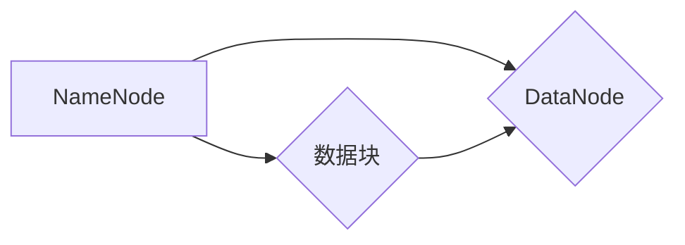

> Hadoop, HDFS, 分布式文件系统, 数据存储, 数据处理, 大数据, 容错, 高可用性

## 1. 背景介绍

随着互联网和移动互联网的蓬勃发展，海量数据量的产生日益剧增。传统的集中式文件系统已经难以满足大规模数据存储和处理的需求。分布式文件系统 (Distributed File System, DFS)应运而生，它将数据存储在多个节点上，并通过网络进行访问和管理，从而能够有效地应对海量数据带来的挑战。

Hadoop Distributed File System (HDFS) 是 Apache Hadoop 生态系统中最重要的组件之一，它是一个高可靠、高吞吐量的分布式文件系统，专门为大数据处理而设计。HDFS 的核心设计理念是将数据存储在多个节点上，并通过数据分片和副本机制保证数据的可靠性和可用性。

## 2. 核心概念与联系

HDFS 的核心概念包括：

* **NameNode:** HDFS 的元数据管理节点，负责管理文件系统元数据，如文件路径、文件大小、数据块位置等。
* **DataNode:** HDFS 的数据存储节点，负责存储数据块，并提供数据读取和写入服务。
* **数据块:** HDFS 将文件分割成多个数据块，每个数据块的大小为 128MB。
* **副本机制:** HDFS 将每个数据块复制到多个 DataNode 上，以保证数据的可靠性。默认情况下，每个数据块会复制三个副本。
* **文件系统树:** HDFS 的文件系统结构类似于传统的文件系统树，用户可以通过文件路径访问和操作文件。

**HDFS 架构流程图:**



## 3. 核心算法原理 & 具体操作步骤

### 3.1  算法原理概述

HDFS 的核心算法包括数据分片、数据副本、数据块分配和数据恢复等。

* **数据分片:** 将文件分割成多个数据块，每个数据块的大小为 128MB。
* **数据副本:** 将每个数据块复制到多个 DataNode 上，以保证数据的可靠性。
* **数据块分配:** 将数据块分配到不同的 DataNode 上，以提高数据访问效率。
* **数据恢复:** 当某个 DataNode 发生故障时，HDFS 会从其他 DataNode 上恢复数据块。

### 3.2  算法步骤详解

1. **文件上传:** 用户将文件上传到 HDFS 时，NameNode 会将文件分割成多个数据块，并分配到不同的 DataNode 上。
2. **数据块复制:** DataNode 将接收到的数据块复制到其他 DataNode 上，以保证数据的可靠性。
3. **文件访问:** 用户访问文件时，NameNode 会返回数据块所在的 DataNode 地址，用户可以从这些 DataNode 上读取数据块。
4. **数据块更新:** 当用户修改文件时，NameNode 会将修改的数据块更新到 DataNode 上。
5. **数据块恢复:** 当某个 DataNode 发生故障时，NameNode 会从其他 DataNode 上恢复数据块，并重新分配到其他 DataNode 上。

### 3.3  算法优缺点

**优点:**

* **高可靠性:** 数据副本机制保证了数据的可靠性。
* **高吞吐量:** 数据分片和并行读取机制提高了数据访问效率。
* **可扩展性:** HDFS 可以轻松扩展到更大的集群规模。

**缺点:**

* **数据访问延迟:** 数据块需要从多个 DataNode 上读取，可能会导致数据访问延迟。
* **管理复杂度:** HDFS 的管理复杂度较高，需要专业的运维人员进行维护。

### 3.4  算法应用领域

HDFS 广泛应用于大数据处理、机器学习、数据分析等领域。

## 4. 数学模型和公式 & 详细讲解 & 举例说明

### 4.1  数学模型构建

HDFS 的数据存储和复制机制可以抽象为一个数学模型，其中：

* **N:** 数据节点总数
* **k:** 数据块副本数
* **f:** 数据块大小
* **p:** 数据块在每个 DataNode 上的存储比例

**数据存储模型:**

```latex
Total Storage = N * f * p
```

**数据可靠性模型:**

```latex
Reliability = 1 - (1 - (1/N))^k
```

### 4.2  公式推导过程

* **数据存储模型:** 每个 DataNode 存储的数据量为 f * p，因此总存储量为 N * f * p。
* **数据可靠性模型:** 每个数据块需要在 k 个 DataNode 上存储，如果一个 DataNode 发生故障，数据块仍然可以从其他 DataNode 上恢复。因此，数据可靠性为 1 减去所有 DataNode 发生故障的概率。

### 4.3  案例分析与讲解

假设一个 HDFS 集群有 10 个 DataNode，每个数据块大小为 128MB，数据块副本数为 3，则：

* **总存储量:** 10 * 128MB * 0.5 = 640MB
* **数据可靠性:** 1 - (1 - (1/10))^3 = 0.97

## 5. 项目实践：代码实例和详细解释说明

### 5.1  开发环境搭建

HDFS 的开发环境搭建需要以下软件：

* Hadoop
* Java Development Kit (JDK)
* Apache Maven

### 5.2  源代码详细实现

以下是一个简单的 HDFS 数据块存储和读取的 Java 代码示例：

```java
import org.apache.hadoop.conf.Configuration;
import org.apache.hadoop.fs.FileSystem;
import org.apache.hadoop.fs.Path;

public class HDFSExample {

    public static void main(String[] args) throws Exception {
        // 配置 HDFS 连接信息
        Configuration conf = new Configuration();
        conf.set("fs.defaultFS", "hdfs://localhost:9000");

        // 获取 HDFS 文件系统
        FileSystem fs = FileSystem.get(conf);

        // 上传文件到 HDFS
        Path src = new Path("local/input.txt");
        Path dst = new Path("hdfs/output.txt");
        fs.copyFromLocalFile(src, dst);

        // 读取文件从 HDFS
        Path readPath = new Path("hdfs/output.txt");
        fs.copyToLocalFile(readPath, new Path("local/output.txt"));

        // 关闭 HDFS 连接
        fs.close();
    }
}
```

### 5.3  代码解读与分析

* **配置 HDFS 连接信息:** 使用 `Configuration` 对象配置 HDFS 连接信息，包括 namenode 地址等。
* **获取 HDFS 文件系统:** 使用 `FileSystem.get(conf)` 方法获取 HDFS 文件系统对象。
* **上传文件到 HDFS:** 使用 `fs.copyFromLocalFile(src, dst)` 方法将本地文件上传到 HDFS。
* **读取文件从 HDFS:** 使用 `fs.copyToLocalFile(readPath, new Path("local/output.txt"))` 方法将 HDFS 文件复制到本地。
* **关闭 HDFS 连接:** 使用 `fs.close()` 方法关闭 HDFS 连接。

### 5.4  运行结果展示

运行上述代码后，将本地文件 `input.txt` 上传到 HDFS，并将其复制到本地文件 `output.txt`。

## 6. 实际应用场景

HDFS 在各种大数据处理场景中都有广泛的应用，例如：

* **日志分析:** 将海量日志数据存储在 HDFS 中，并使用 Hadoop 的 MapReduce 或 Spark 等框架进行分析。
* **图像处理:** 将海量图像数据存储在 HDFS 中，并使用 Hadoop 的 MapReduce 或 Spark 等框架进行图像识别、分类等处理。
* **机器学习:** 将海量数据存储在 HDFS 中，并使用机器学习框架进行模型训练和预测。

### 6.4  未来应用展望

随着大数据量的不断增长，HDFS 将继续在以下领域发挥重要作用：

* **云计算:** HDFS 将成为云计算平台的核心存储系统。
* **物联网:** HDFS 将用于存储和处理海量物联网数据。
* **人工智能:** HDFS 将用于存储和处理海量人工智能训练数据。

## 7. 工具和资源推荐

### 7.1  学习资源推荐

* **Hadoop 官方文档:** https://hadoop.apache.org/docs/
* **HDFS 官方文档:** https://hadoop.apache.org/docs/current/hdfs/
* **Hadoop 中文社区:** http://hadoop.apache.org/zh-cn/

### 7.2  开发工具推荐

* **Eclipse:** https://www.eclipse.org/
* **IntelliJ IDEA:** https://www.jetbrains.com/idea/

### 7.3  相关论文推荐

* **The Hadoop Distributed File System:** https://www.usenix.org/system/files/conference/osdi08/osdi08-brown.pdf

## 8. 总结：未来发展趋势与挑战

### 8.1  研究成果总结

HDFS 作为一种高可靠、高吞吐量的分布式文件系统，在处理海量数据方面取得了显著的成果。它为大数据处理提供了坚实的基础，推动了大数据应用的快速发展。

### 8.2  未来发展趋势

HDFS 将继续朝着以下方向发展：

* **更高的可靠性和可用性:** 通过改进数据副本机制、数据块分配算法等，提高 HDFS 的可靠性和可用性。
* **更强的性能:** 通过优化数据访问路径、数据块大小等，提高 HDFS 的性能。
* **更灵活的架构:** 支持多种数据存储模式，例如对象存储、键值存储等，满足不同应用场景的需求。

### 8.3  面临的挑战

HDFS 也面临着一些挑战：

* **数据安全:** 如何保证 HDFS 数据的安全性和隐私性。
* **数据管理:** 如何高效地管理海量数据，例如数据备份、数据恢复、数据压缩等。
* **成本控制:** 如何降低 HDFS 的部署和维护成本。

### 8.4  研究展望

未来，HDFS 的研究方向将集中在以下几个方面：

* **数据安全:** 研究新的数据加密和访问控制机制，保障 HDFS 数据的安全性和隐私性。
* **数据管理:** 研究新的数据管理工具和技术，提高 HDFS 数据的管理效率。
* **性能优化:** 研究新的数据访问算法和数据块分配算法，提高 HDFS 的性能。

## 9. 附录：常见问题与解答

**常见问题:**

* **HDFS 的数据块大小如何设置？**

**解答:** HDFS 的数据块大小默认是 128MB，可以通过配置参数 `dfs.blocksize` 来设置。

* **HDFS 的数据副本数如何设置？**

**解答:** HDFS 的数据副本数默认是 3，可以通过配置参数 `dfs.replication` 来设置。

* **如何监控 HDFS 的运行状态？**

**解答:** 可以使用 HDFS 的 Web UI 或命令行工具来监控 HDFS 的运行状态。


作者：禅与计算机程序设计艺术 / Zen and the Art of Computer Programming 
<end_of_turn>