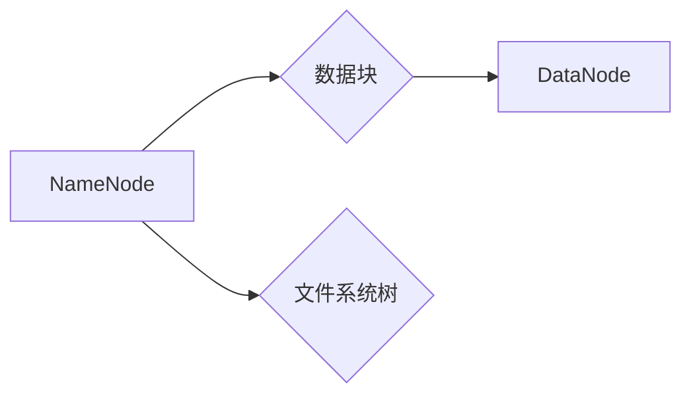

> Hadoop, HDFS, 分布式文件系统, 数据存储, 数据处理, 大数据, 编程, 代码实例

## 1. 背景介绍

在当今数据爆炸的时代，海量数据的存储和处理成为一个巨大的挑战。传统的集中式文件系统已经难以满足对高吞吐量、高可用性和高可靠性的需求。分布式文件系统 (Distributed File System, DFS)应运而生，它将文件存储在多个节点上，并通过分布式架构实现数据冗余和容错，从而提高了系统的可靠性和可扩展性。

Hadoop Distributed File System (HDFS) 是 Apache Hadoop 生态系统中最重要的组件之一，它是一个高性能、高可靠的分布式文件系统，专门为大数据处理而设计。HDFS 采用分层存储架构，将数据存储在多个节点上，并通过数据块的复制和分布实现数据冗余和容错。

## 2. 核心概念与联系

HDFS 的核心概念包括：

* **NameNode:** HDFS 的元数据管理节点，负责管理文件系统元数据，如文件路径、文件大小、数据块位置等。
* **DataNode:** HDFS 的数据存储节点，负责存储数据块，并提供数据读取和写入服务。
* **数据块:** HDFS 将文件分割成多个数据块，每个数据块的大小为 128MB。
* **副本:** HDFS 将每个数据块复制到多个 DataNode 上，以实现数据冗余和容错。
* **文件系统树:** HDFS 文件系统采用树状结构，根目录为 /，用户可以创建和管理子目录和文件。

**HDFS 架构流程图:**



## 3. 核心算法原理 & 具体操作步骤

### 3.1  算法原理概述

HDFS 的核心算法包括数据块分配、数据块复制和数据块恢复等。

* **数据块分配:** 当用户写入文件时，NameNode 会将文件分割成数据块，并根据 DataNode 的可用空间和网络带宽等因素，将数据块分配到不同的 DataNode 上。
* **数据块复制:** HDFS 会将每个数据块复制到多个 DataNode 上，以实现数据冗余和容错。复制因子决定了每个数据块的副本数量。
* **数据块恢复:** 当 DataNode 发生故障时，NameNode 会根据元数据信息，从其他 DataNode 上恢复数据块。

### 3.2  算法步骤详解

**数据块分配步骤:**

1. 用户向 NameNode 请求写入文件。
2. NameNode 将文件分割成数据块。
3. NameNode 根据 DataNode 的可用空间和网络带宽等因素，选择合适的 DataNode 存储数据块。
4. NameNode 将数据块分配给选定的 DataNode，并更新元数据信息。

**数据块复制步骤:**

1. 当数据块被分配到 DataNode 上后，NameNode 会向其他 DataNode 发送复制请求。
2. 接收复制请求的 DataNode 会从源 DataNode 下载数据块，并将其存储到本地。
3. NameNode 会更新元数据信息，记录每个数据块的副本数量和位置。

**数据块恢复步骤:**

1. 当 DataNode 发生故障时，NameNode 会检测到该 DataNode 的状态异常。
2. NameNode 会根据元数据信息，找到该数据块的副本节点。
3. NameNode 会向副本节点发送数据块恢复请求。
4. 接收恢复请求的 DataNode 会将数据块发送给 NameNode。
5. NameNode 会将数据块存储到新的 DataNode 上，并更新元数据信息。

### 3.3  算法优缺点

**优点:**

* 高可靠性: 数据块复制和分布式存储机制提高了系统的可靠性。
* 高吞吐量: 数据块的并行读取和写入提高了系统的吞吐量。
* 高可扩展性: 通过增加 DataNode 节点，可以轻松扩展系统的存储容量和处理能力。

**缺点:**

* 低随机读写性能: HDFS 采用块式存储，随机读写性能相对较低。
* 复杂管理: HDFS 的管理和维护相对复杂。

### 3.4  算法应用领域

HDFS 广泛应用于大数据处理、数据仓库、日志分析、机器学习等领域。

## 4. 数学模型和公式 & 详细讲解 & 举例说明

### 4.1  数学模型构建

HDFS 的数据块分配和复制算法可以抽象为一个数学模型，其中：

* **N:** 数据节点总数
* **B:** 数据块大小
* **R:** 副本因子
* **S:** 文件系统总存储容量

**数据块分配模型:**

```
data_block_allocation = function(N, B, S)
  # 根据数据节点可用空间和网络带宽等因素，分配数据块到不同的数据节点
```

**数据块复制模型:**

```
data_block_replication = function(R, N)
  # 将每个数据块复制到 R 个数据节点上
```

### 4.2  公式推导过程

**数据块复制的存储空间需求:**

```
storage_space_requirement = B * R
```

**文件系统总存储容量的利用率:**

```
utilization_rate = (B * R * file_count) / S
```

其中，file_count 是文件系统中文件总数。

### 4.3  案例分析与讲解

假设一个 HDFS 集群有 10 个 DataNode，每个 DataNode 的存储容量为 1TB，文件系统总存储容量为 10TB，副本因子为 3。

* 每个数据块的大小为 128MB。
* 每个数据块需要复制到 3 个 DataNode 上。
* 文件系统总存储容量的利用率为：

```
utilization_rate = (128MB * 3 * file_count) / 10TB
```

## 5. 项目实践：代码实例和详细解释说明

### 5.1  开发环境搭建

* Java Development Kit (JDK) 8 或更高版本
* Apache Hadoop 3.x 或更高版本
* 集群环境 (例如，虚拟机或云平台)

### 5.2  源代码详细实现

以下代码示例演示了如何使用 Java API 读取 HDFS 文件：

```java
import org.apache.hadoop.conf.Configuration;
import org.apache.hadoop.fs.FileSystem;
import org.apache.hadoop.fs.Path;
import java.io.IOException;

public class ReadHDFSFile {

    public static void main(String[] args) throws IOException {
        // 配置 HDFS 连接信息
        Configuration conf = new Configuration();
        conf.set("fs.defaultFS", "hdfs://localhost:9000");

        // 获取 HDFS 文件系统对象
        FileSystem fs = FileSystem.get(conf);

        // 指定要读取的文件路径
        Path filePath = new Path("/user/example/data.txt");

        // 读取文件内容
        String fileContent = fs.toString(filePath);

        // 打印文件内容
        System.out.println(fileContent);

        // 关闭 HDFS 连接
        fs.close();
    }
}
```

### 5.3  代码解读与分析

* **配置 HDFS 连接信息:** 使用 `Configuration` 对象设置 HDFS 连接信息，包括 namenode 地址和端口号。
* **获取 HDFS 文件系统对象:** 使用 `FileSystem.get(conf)` 方法获取 HDFS 文件系统对象。
* **指定要读取的文件路径:** 使用 `Path` 对象指定要读取的文件路径。
* **读取文件内容:** 使用 `fs.toString(filePath)` 方法读取文件内容。
* **关闭 HDFS 连接:** 使用 `fs.close()` 方法关闭 HDFS 连接。

### 5.4  运行结果展示

运行上述代码后，将打印出 HDFS 文件的内容。

## 6. 实际应用场景

HDFS 在各种大数据处理场景中都有广泛的应用，例如：

* **数据仓库:** HDFS 可以存储海量的数据，并提供高吞吐量的数据读取和写入服务，满足数据仓库的存储和查询需求。
* **日志分析:** HDFS 可以存储来自各种应用程序和系统的日志数据，并提供高效的日志分析工具，帮助用户分析日志数据，发现问题和趋势。
* **机器学习:** HDFS 可以存储用于机器学习训练的数据集，并提供高效的数据访问服务，帮助用户加速机器学习模型的训练和部署。

### 6.4  未来应用展望

随着大数据技术的不断发展，HDFS 将在未来继续发挥重要作用。例如：

* **支持更复杂的查询:** HDFS 将支持更复杂的查询语言和分析工具，帮助用户更深入地分析数据。
* **提高数据安全性和隐私保护:** HDFS 将支持更强大的数据加密和访问控制机制，提高数据安全性和隐私保护。
* **与云计算平台集成:** HDFS 将与云计算平台更加紧密地集成，提供更灵活和可扩展的数据存储和处理服务。

## 7. 工具和资源推荐

### 7.1  学习资源推荐

* **Apache Hadoop 官方文档:** https://hadoop.apache.org/docs/
* **HDFS 权威指南:** https://www.oreilly.com/library/view/hadoop-the-definitive/9781449360307/

### 7.2  开发工具推荐

* **Eclipse IDE:** https://www.eclipse.org/
* **IntelliJ IDEA:** https://www.jetbrains.com/idea/

### 7.3  相关论文推荐

* **Hadoop: A Distributed File System for Reliable Data Storage:** https://www.usenix.org/system/files/conference/osdi08/osdi08-brown.pdf

## 8. 总结：未来发展趋势与挑战

### 8.1  研究成果总结

HDFS 作为一种高性能、高可靠的分布式文件系统，在处理海量数据方面取得了显著的成果。其分层存储架构、数据块复制和容错机制有效地提高了系统的可靠性和可扩展性。

### 8.2  未来发展趋势

HDFS 将继续朝着以下方向发展：

* **支持更复杂的查询:** HDFS 将支持更复杂的查询语言和分析工具，帮助用户更深入地分析数据。
* **提高数据安全性和隐私保护:** HDFS 将支持更强大的数据加密和访问控制机制，提高数据安全性和隐私保护。
* **与云计算平台集成:** HDFS 将与云计算平台更加紧密地集成，提供更灵活和可扩展的数据存储和处理服务。

### 8.3  面临的挑战

HDFS 也面临一些挑战，例如：

* **低随机读写性能:** HDFS 采用块式存储，随机读写性能相对较低。
* **复杂管理:** HDFS 的管理和维护相对复杂。

### 8.4  研究展望

未来，研究者将继续探索如何提高 HDFS 的性能、可靠性和安全性，并将其应用于更多的大数据处理场景。

## 9. 附录：常见问题与解答

**常见问题:**

* **HDFS 的数据块大小如何设置？**

**解答:** HDFS 的数据块大小默认是 128MB，可以通过配置参数 `dfs.blocksize` 来设置。

* **HDFS 的副本因子如何设置？**

**解答:** HDFS 的副本因子默认是 3，可以通过配置参数 `dfs.replication` 来设置。

* **如何监控 HDFS 的运行状态？**

**解答:** 可以使用 HDFS 的 Web UI 或命令行工具来监控 HDFS 的运行状态。


作者：禅与计算机程序设计艺术 / Zen and the Art of Computer Programming 
<end_of_turn>