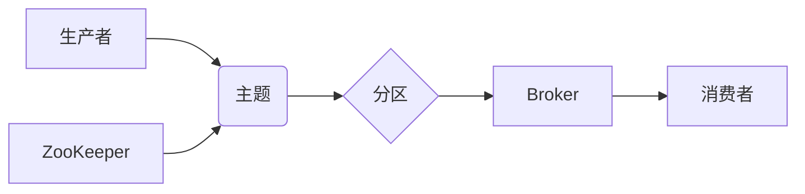

> Kafka,消息队列,分布式系统,流式处理,数据传输,消费者,生产者,分区,副本,ZooKeeper

## 1. 背景介绍

在当今数据爆炸的时代，高效、可靠的数据传输和处理能力至关重要。传统的数据库和消息队列系统难以满足现代应用对高吞吐量、低延迟和高可用性的需求。Apache Kafka 作为一款开源的分布式流式数据平台，凭借其强大的性能、可扩展性和容错性，迅速成为数据处理领域的热门选择。

Kafka 的核心思想是将数据流视为一个持续的、可变的序列，并通过一系列的主题、分区和消费者来进行管理和处理。它提供了一种高效、可靠的机制，用于将数据从生产者发送到消费者，并支持多种数据格式和处理方式。

## 2. 核心概念与联系

Kafka 的核心概念包括：

* **主题 (Topic):**  Kafka 中的数据流的抽象表示，类似于消息队列。每个主题可以包含多个分区。
* **分区 (Partition):** 主题的逻辑分割，数据被均匀地分配到不同的分区中。分区可以水平扩展，提高吞吐量。
* **副本 (Replica):**  每个分区可以有多个副本，用于保证数据的高可用性和容错性。
* **生产者 (Producer):** 向 Kafka 集群发送数据的应用程序。
* **消费者 (Consumer):** 从 Kafka 集群接收数据的应用程序。
* **Broker:** Kafka 集群中的节点，负责存储和转发数据。
* **ZooKeeper:** Kafka 集群的元数据管理系统，用于协调 Broker 之间的数据同步和管理。

**Kafka 架构流程图:**



## 3. 核心算法原理 & 具体操作步骤

### 3.1  算法原理概述

Kafka 的核心算法原理包括：

* **消息分片和复制:**  Kafka 将消息分片到不同的分区，并创建多个副本，以确保数据的高可用性和容错性。
* **消息持久化:** Kafka 将消息持久化到磁盘，即使 Broker 发生故障，也能保证消息不会丢失。
* **消息消费确认:** 消费者确认消息已消费，以防止消息重复消费。
* **数据同步:** Kafka 使用 ZooKeeper 来协调 Broker 之间的元数据同步和数据复制。

### 3.2  算法步骤详解

1. **生产者发送消息:** 生产者将消息发送到 Kafka 集群中的特定主题。
2. **消息分片和复制:** Kafka 将消息根据主题和分区规则进行分片，并复制到多个 Broker 节点。
3. **消息持久化:** Kafka 将消息持久化到磁盘，以确保数据可靠性。
4. **消费者订阅主题:** 消费者订阅特定的主题，并指定消费的分区。
5. **消息消费:** 消费者从指定的分区中拉取消息并进行处理。
6. **消息确认:** 消费者确认消息已消费，以防止消息重复消费。

### 3.3  算法优缺点

**优点:**

* 高吞吐量和低延迟
* 高可用性和容错性
* 可扩展性强
* 支持多种数据格式和处理方式

**缺点:**

* 学习曲线相对陡峭
* 需要配置和管理 ZooKeeper

### 3.4  算法应用领域

Kafka 的应用领域非常广泛，包括：

* **实时数据流处理:**  例如，日志分析、事件处理、实时监控等。
* **消息队列:**  例如，异步任务处理、服务间通信等。
* **数据管道:**  例如，将数据从一个系统传输到另一个系统。
* **微服务架构:**  Kafka 可以作为微服务之间的消息传递机制。

## 4. 数学模型和公式 & 详细讲解 & 举例说明

### 4.1  数学模型构建

Kafka 的核心算法可以抽象为一个消息传递模型，其中包括生产者、消费者、主题、分区和副本等角色和组件。

**消息传递模型:**

```
P -> T -> P'
```

其中：

* P 代表生产者
* T 代表主题
* P' 代表消费者

### 4.2  公式推导过程

Kafka 的吞吐量和延迟可以根据以下公式进行估算：

* **吞吐量:**  吞吐量 = 消息发送速率 / 消息大小
* **延迟:**  延迟 = 消息发送时间 + 消息传输时间 + 消息处理时间

### 4.3  案例分析与讲解

假设一个 Kafka 集群有 3 个 Broker 节点，每个主题有 3 个分区，每个分区有 3 个副本。生产者发送消息速率为 1000 条/秒，每个消息大小为 1KB。

根据上述公式，我们可以估算 Kafka 集群的吞吐量和延迟。

## 5. 项目实践：代码实例和详细解释说明

### 5.1  开发环境搭建

* Java Development Kit (JDK) 8 或更高版本
* Apache Kafka 集群
* ZooKeeper 集群

### 5.2  源代码详细实现

```java
// 生产者代码示例
import org.apache.kafka.clients.producer.KafkaProducer;
import org.apache.kafka.clients.producer.ProducerConfig;
import org.apache.kafka.clients.producer.ProducerRecord;

import java.util.Properties;

public class KafkaProducerExample {

    public static void main(String[] args) {
        Properties props = new Properties();
        props.put(ProducerConfig.BOOTSTRAP_SERVERS_CONFIG, "localhost:9092");
        props.put(ProducerConfig.KEY_SERIALIZER_CLASS_CONFIG, "org.apache.kafka.common.serialization.StringSerializer");
        props.put(ProducerConfig.VALUE_SERIALIZER_CLASS_CONFIG, "org.apache.kafka.common.serialization.StringSerializer");

        KafkaProducer<String, String> producer = new KafkaProducer<>(props);

        for (int i = 0; i < 10; i++) {
            ProducerRecord<String, String> record = new ProducerRecord<>("my-topic", "key" + i, "value" + i);
            producer.send(record);
        }

        producer.close();
    }
}

// 消费者代码示例
import org.apache.kafka.clients.consumer.ConsumerConfig;
import org.apache.kafka.clients.consumer.ConsumerRecord;
import org.apache.kafka.clients.consumer.ConsumerRecords;
import org.apache.kafka.clients.consumer.KafkaConsumer;
import org.apache.kafka.common.serialization.StringDeserializer;

import java.time.Duration;
import java.util.Collections;
import java.util.Properties;

public class KafkaConsumerExample {

    public static void main(String[] args) {
        Properties props = new Properties();
        props.put(ConsumerConfig.BOOTSTRAP_SERVERS_CONFIG, "localhost:9092");
        props.put(ConsumerConfig.GROUP_ID_CONFIG, "my-group");
        props.put(ConsumerConfig.KEY_DESERIALIZER_CLASS_CONFIG, StringDeserializer.class.getName());
        props.put(ConsumerConfig.VALUE_DESERIALIZER_CLASS_CONFIG, StringDeserializer.class.getName());

        KafkaConsumer<String, String> consumer = new KafkaConsumer<>(props);
        consumer.subscribe(Collections.singletonList("my-topic"));

        while (true) {
            ConsumerRecords<String, String> records = consumer.poll(Duration.ofMillis(100));
            for (ConsumerRecord<String, String> record : records) {
                System.out.println("Received message: " + record.value());
            }
        }
    }
}
```

### 5.3  代码解读与分析

* **生产者代码:**  生产者代码使用 KafkaProducer 类发送消息到指定主题。
* **消费者代码:**  消费者代码使用 KafkaConsumer 类订阅指定主题，并消费消息。

### 5.4  运行结果展示

运行上述代码后，生产者会将 10 条消息发送到名为 "my-topic" 的主题。消费者会订阅该主题，并打印接收到的消息。

## 6. 实际应用场景

Kafka 在各种实际应用场景中发挥着重要作用，例如：

* **日志分析:**  收集和分析应用程序、系统和网络日志，用于监控和故障排除。
* **事件处理:**  处理实时事件，例如用户行为、传感器数据等，用于触发自动化任务或更新数据分析模型。
* **实时监控:**  收集和分析实时数据，用于监控系统性能、用户行为和业务指标。
* **数据管道:**  将数据从一个系统传输到另一个系统，例如将数据库数据传输到数据仓库。

### 6.4  未来应用展望

随着数据量的不断增长和实时处理需求的增加，Kafka 的应用场景将更加广泛。未来，Kafka 可能在以下领域发挥更大的作用：

* **物联网:**  处理海量物联网设备产生的数据，用于智能家居、智能城市等应用。
* **金融科技:**  处理金融交易数据，用于风险控制、欺诈检测等应用。
* **医疗保健:**  处理医疗数据，用于疾病诊断、个性化医疗等应用。

## 7. 工具和资源推荐

### 7.1  学习资源推荐

* **Apache Kafka 官方文档:** https://kafka.apache.org/documentation/
* **Kafka 入门指南:** https://www.confluent.io/blog/kafka-tutorial-part-1-getting-started-with-apache-kafka/
* **Kafka 实战指南:** https://www.oreilly.com/library/view/kafka-in-action/9781492039937/

### 7.2  开发工具推荐

* **Kafka 命令行工具:**  用于管理 Kafka 集群和消费消息。
* **Confluent Platform:**  基于 Apache Kafka 的商业平台，提供更丰富的功能和支持。
* **Kafka Connect:**  用于将数据从外部系统传输到 Kafka 集群。

### 7.3  相关论文推荐

* **Kafka: A Distributed Streaming Platform:** https://static.confluent.io/downloads/white-papers/Kafka-Whitepaper.pdf
* **Building a Real-Time Data Pipeline with Apache Kafka:** https://www.oreilly.com/library/view/building-a-real-time/9781492039937/

## 8. 总结：未来发展趋势与挑战

### 8.1  研究成果总结

Kafka 作为一款成熟的分布式流式数据平台，已经取得了显著的成果，并在各种应用场景中得到广泛应用。

### 8.2  未来发展趋势

未来，Kafka 将继续朝着以下方向发展：

* **更强大的性能和可扩展性:**  Kafka 将继续优化其算法和架构，以提高吞吐量、降低延迟和支持更大的数据规模。
* **更丰富的功能和生态系统:**  Kafka 的生态系统将不断扩展，提供更多功能和工具，例如更强大的数据分析、机器学习和实时处理能力。
* **更广泛的应用场景:**  Kafka 将应用于更多领域，例如物联网、金融科技和医疗保健等。

### 8.3  面临的挑战

Kafka 也面临一些挑战，例如：

* **复杂性:**  Kafka 的架构和功能相对复杂，需要一定的学习成本。
* **安全性和隐私性:**  Kafka 需要确保数据安全性和隐私性，例如防止未授权访问和数据泄露。
* **运维成本:**  Kafka 集群的部署和维护需要一定的运维成本。

### 8.4  研究展望

未来，研究者将继续探索 Kafka 的新应用场景、优化其性能和功能，并解决其面临的挑战。


## 9. 附录：常见问题与解答

**常见问题:**

* **Kafka 的吞吐量和延迟如何？**
* **Kafka 如何保证数据可靠性？**
* **Kafka 如何实现高可用性？**
* **如何部署和管理 Kafka 集群？**

**解答:**

* **Kafka 的吞吐量和延迟取决于集群配置、数据大小和网络带宽等因素。**
*