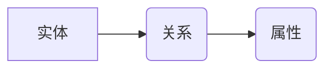

> Knowledge Graph,知识图谱,RDF,SPARQL,Neo4j,图数据库,机器学习,知识表示,数据挖掘

## 1. 背景介绍

在海量数据时代，单纯依靠传统的数据库结构难以有效地存储、管理和分析复杂、多维的知识。知识图谱 (Knowledge Graph, KG) 作为一种新型的知识表示形式，以图结构的形式存储和组织知识，能够更好地捕捉知识之间的关系和依赖性，为数据分析、推理和决策提供更强大的支持。

知识图谱的应用领域广泛，包括：

* **搜索引擎优化:** 通过理解用户查询背后的知识，提供更精准、更有针对性的搜索结果。
* **推荐系统:** 基于用户兴趣和商品属性之间的关系，推荐更符合用户需求的商品或服务。
* **问答系统:** 理解自然语言问题，并从知识图谱中获取相关信息，提供准确的答案。
* **医疗诊断:** 基于患者症状和疾病知识，辅助医生进行诊断和治疗方案制定。
* **金融风险管理:** 分析金融数据，识别潜在的风险和异常行为。

## 2. 核心概念与联系

知识图谱的核心概念包括实体、关系和属性。

* **实体 (Entity):** 表示现实世界中的事物或概念，例如人、地点、事件等。
* **关系 (Relation):** 描述实体之间的连接或关联，例如“出生于”、“工作于”、“拥有”等。
* **属性 (Property):** 描述实体的特征或属性，例如“姓名”、“年龄”、“职位”等。

知识图谱通常采用 RDF (Resource Description Framework) 格式进行存储和表示。RDF 是一个用于描述资源的标准模型，它使用三元组 (subject, predicate, object) 来表示知识。

**Mermaid 流程图:**



## 3. 核心算法原理 & 具体操作步骤

### 3.1  算法原理概述

知识图谱的构建主要涉及以下几个核心算法：

* **实体识别 (Entity Recognition):** 从文本数据中识别出实体，例如人名、地名、组织名称等。
* **关系抽取 (Relation Extraction):** 从文本数据中识别出实体之间的关系，例如“张三工作于百度”。
* **知识图谱推理 (Knowledge Graph Reasoning):** 基于知识图谱中的已知知识，推导出新的知识。

### 3.2  算法步骤详解

**实体识别算法步骤:**

1. **文本预处理:** 对文本数据进行清洗、分词、词性标注等预处理操作。
2. **特征提取:** 从预处理后的文本中提取实体相关的特征，例如词形、词性、上下文语义等。
3. **实体分类:** 使用机器学习模型对提取的特征进行分类，识别出实体。

**关系抽取算法步骤:**

1. **文本预处理:** 与实体识别类似，对文本数据进行预处理。
2. **依存句法分析:** 使用依存句法分析工具分析文本的句法结构，识别出实体之间的依存关系。
3. **关系分类:** 使用机器学习模型对依存关系进行分类，识别出实体之间的关系。

**知识图谱推理算法步骤:**

1. **规则定义:** 定义一组规则，用于描述知识图谱中的推理逻辑。
2. **规则匹配:** 将规则与知识图谱中的数据进行匹配，寻找满足规则的知识。
3. **推理结果生成:** 根据匹配的结果，生成新的知识。

### 3.3  算法优缺点

**实体识别算法:**

* **优点:** 能够识别出文本中的实体，为知识图谱构建提供基础数据。
* **缺点:** 识别精度受限于训练数据和算法模型，对于复杂、模糊的文本可能存在识别错误。

**关系抽取算法:**

* **优点:** 能够识别出实体之间的关系，丰富知识图谱的结构和内容。
* **缺点:** 关系抽取任务难度较高，需要考虑多种语义关系和上下文信息，识别精度仍然存在挑战。

**知识图谱推理算法:**

* **优点:** 能够基于已知知识推导出新的知识，扩展知识图谱的覆盖范围和深度。
* **缺点:** 推理规则的定义和匹配需要专业知识，推理结果的准确性依赖于规则的质量和知识图谱的完整性。

### 3.4  算法应用领域

* **搜索引擎:** 理解用户查询背后的知识，提供更精准的搜索结果。
* **推荐系统:** 基于用户兴趣和商品属性之间的关系，推荐更符合用户需求的商品或服务。
* **问答系统:** 理解自然语言问题，并从知识图谱中获取相关信息，提供准确的答案。
* **医疗诊断:** 基于患者症状和疾病知识，辅助医生进行诊断和治疗方案制定。
* **金融风险管理:** 分析金融数据，识别潜在的风险和异常行为。

## 4. 数学模型和公式 & 详细讲解 & 举例说明

### 4.1  数学模型构建

知识图谱可以表示为一个三元组图，其中每个三元组 (h, r, t) 表示实体 h 与实体 t 之间的关系 r。

* h: 主体实体
* r: 关系
* t: 对象实体

### 4.2  公式推导过程

**知识图谱推理:**

可以使用逻辑推理规则来推导出新的知识。例如，如果知识图谱中包含以下三元组:

* (张三, 工作于, 百度)
* (百度, 公司类型, 科技公司)

则可以推导出以下新的知识:

* (张三, 工作于, 科技公司)

### 4.3  案例分析与讲解

**案例:**

假设我们有一个关于人物关系的知识图谱，其中包含以下三元组:

* (李明, 父亲, 王强)
* (王强, 母亲, 张丽)

我们可以使用推理规则推导出以下新的知识:

* (李明, 祖父, 张丽)

**解释:**

根据“父亲”和“母亲”的关系，我们可以推断出李明是张丽的祖父。

## 5. 项目实践：代码实例和详细解释说明

### 5.1  开发环境搭建

* **操作系统:** Ubuntu 20.04 LTS
* **编程语言:** Python 3.8
* **数据库:** Neo4j 4.4

### 5.2  源代码详细实现

```python
# 连接 Neo4j 数据库
driver = GraphDatabase.driver("bolt://localhost:7687", auth=("neo4j", "password"))

# 定义查询语句
query = """
MATCH (n:Person)
RETURN n
"""

# 执行查询语句
with driver.session() as session:
    result = session.run(query)

    # 打印查询结果
    for record in result:
        print(record["n"])

# 关闭数据库连接
driver.close()
```

### 5.3  代码解读与分析

* **连接 Neo4j 数据库:** 使用 `GraphDatabase.driver()` 方法连接 Neo4j 数据库，并提供数据库地址和用户名密码。
* **定义查询语句:** 使用 Cypher 查询语言定义查询语句，查询所有 Person 节点。
* **执行查询语句:** 使用 `session.run()` 方法执行查询语句，获取查询结果。
* **打印查询结果:** 遍历查询结果，打印每个节点的信息。
* **关闭数据库连接:** 使用 `driver.close()` 方法关闭数据库连接。

### 5.4  运行结果展示

运行代码后，将打印出所有 Person 节点的名称。

## 6. 实际应用场景

### 6.1  搜索引擎优化

知识图谱可以帮助搜索引擎更好地理解用户查询背后的知识，提供更精准、更有针对性的搜索结果。例如，如果用户搜索“苹果公司”，搜索引擎可以利用知识图谱中的信息，返回苹果公司的相关信息，例如公司简介、产品列表、创始人等。

### 6.2  推荐系统

知识图谱可以帮助推荐系统更好地理解用户兴趣和商品属性之间的关系，推荐更符合用户需求的商品或服务。例如，如果用户购买了苹果手机，推荐系统可以利用知识图谱中的信息，推荐其他苹果产品，例如苹果手表、苹果耳机等。

### 6.3  问答系统

知识图谱可以帮助问答系统更好地理解自然语言问题，并从知识图谱中获取相关信息，提供准确的答案。例如，如果用户问“中国首都是哪里？”，问答系统可以利用知识图谱中的信息，回答“中国首都是北京”。

### 6.4  未来应用展望

知识图谱的应用前景广阔，未来将应用于更多领域，例如：

* **个性化教育:** 根据学生的学习情况和兴趣，提供个性化的学习内容和建议。
* **智能医疗:** 辅助医生进行诊断、治疗方案制定和疾病预测。
* **智慧城市:** 利用知识图谱分析城市数据，优化城市管理和服务。

## 7. 工具和资源推荐

### 7.1  学习资源推荐

* **书籍:**
    * 《知识图谱：原理与实践》
    * 《图数据库：原理与应用》
* **在线课程:**
    * Coursera: Knowledge Graphs
    * edX: Introduction to Knowledge Graphs

### 7.2  开发工具推荐

* **Neo4j:** 图数据库管理系统
* **RDF4J:** RDF 数据处理框架
* **Apache Jena:** Java 图数据库库

### 7.3  相关论文推荐

* **Knowledge Graph Embedding: A Survey**
* **A Survey on Knowledge Graph Completion**

## 8. 总结：未来发展趋势与挑战

### 8.1  研究成果总结

知识图谱技术近年来取得了显著进展，在实体识别、关系抽取、知识推理等方面取得了突破性进展。

### 8.2  未来发展趋势

* **知识图谱规模化构建:** 随着数据量的不断增长，知识图谱的规模将不断扩大，需要开发更有效的知识图谱构建方法。
* **知识图谱的动态更新:** 知识是动态变化的，需要开发更灵活的知识图谱更新机制，保证知识图谱的时效性。
* **知识图谱的跨语言融合:** 不同语言的知识图谱需要进行融合，才能构建更完整的知识体系。

### 8.3  面临的挑战

* **数据质量问题:** 知识图谱的构建依赖于高质量的数据，而现实世界的数据往往存在不完整、不一致、错误等问题。
* **知识表示问题:** 如何更好地表示复杂、多维的知识仍然是一个挑战。
* **推理能力提升:** 知识图谱的推理能力需要进一步提升，才能更好地支持复杂的任务。

### 8.4  研究展望

未来，知识图谱技术将继续朝着规模化、动态化、跨语言融合的方向发展，并将应用于更多领域，为人类社会带来更大的价值。

## 9. 附录：常见问题与解答

### 9.1  什么是知识图谱？

知识图谱是一种用于表示和组织知识的图结构数据模型。它以实体、关系和属性为基本单元，将知识表示为三元组，并通过图结构连接实体和关系，形成一个知识网络。

### 9.2  知识图谱有什么应用场景？

知识图谱的应用场景广泛，包括搜索引擎优化、推荐系统、问答系统、医疗诊断、金融风险管理等。

### 9.3  如何构建知识图谱？

知识图谱的构建主要涉及以下几个步骤：

1. 数据收集：收集相关数据，例如文本、结构化数据等。
2. 数据清洗：对收集到的数据进行清洗，去除噪声和错误数据。
3. 实体识别：识别出数据中的实体，例如人名、地名、组织名称等。
4. 关系抽取：识别出实体之间的关系，例如“工作于”、“出生于”等。
5. 知识图谱构建：将识别出的实体和关系存储到知识图谱中。


作者：禅与计算机程序设计艺术 / Zen and the Art of Computer Programming 
<end_of_turn>