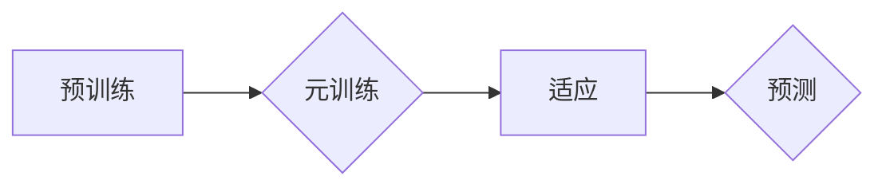

> MAML,元学习,Few-Shot Learning,深度学习,迁移学习,代码实例

## 1. 背景介绍

在深度学习领域，模型的训练通常需要大量的标注数据。然而，在许多实际应用场景中，获取大量标注数据是困难且昂贵的。例如，在医疗诊断、自然语言处理等领域，标注数据往往稀缺。为了解决这个问题，元学习（Meta-Learning）应运而生。

元学习旨在学习如何学习，即学习一个能够快速适应新任务的学习算法。它通过在多个任务上进行训练，学习到通用的学习策略，从而能够在看到少量新任务数据时快速进行适应和学习。

MAML（Model-Agnostic Meta-Learning）是元学习领域中的一种重要算法，它具有以下特点：

* **模型无关性:** MAML 不依赖于特定的模型架构，可以应用于各种深度学习模型。
* **高效性:** MAML 只需要少量的新任务数据就能进行快速适应。
* **通用性:** MAML 可以应用于各种任务，例如图像分类、文本分类、回归等。

## 2. 核心概念与联系

MAML 的核心思想是学习一个模型参数的初始值，使得该模型在看到少量新任务数据后，能够快速进行微调，从而达到良好的性能。

**MAML 的工作流程可以概括为以下步骤:**

1. **预训练:** 在一个包含多个任务的数据集上预训练一个模型。
2. **元训练:** 在预训练好的模型的基础上，进行元训练。元训练的目标是学习一个能够快速适应新任务的学习策略。
3. **适应:** 在看到一个新任务的数据时，使用预训练好的模型和学习到的策略进行快速微调，从而适应新任务。

**MAML 的工作流程示意图:**



## 3. 核心算法原理 & 具体操作步骤

### 3.1  算法原理概述

MAML 的核心算法原理是利用梯度下降法来学习模型参数的初始值。具体来说，MAML 会在多个任务上进行训练，并计算每个任务上的梯度。然后，MAML 会将所有任务上的梯度进行平均，并使用平均梯度来更新模型参数。

### 3.2  算法步骤详解

1. **初始化:** 初始化模型参数 θ。
2. **预训练:** 在一个包含多个任务的数据集上预训练模型，得到预训练好的模型参数 θ_pre。
3. **元训练:**
    * 从训练集 S 中随机抽取一个任务 T。
    * 在任务 T 上进行少量数据训练，得到模型参数 θ_t。
    * 计算模型参数 θ_t 相对于任务 T 的梯度。
    * 更新模型参数 θ，使其朝着减小所有任务梯度平均值的的方向移动。
4. **适应:** 在看到一个新任务的数据时，使用预训练好的模型参数 θ_pre，并根据新任务的数据进行少量数据训练，得到最终的模型参数 θ_final。

### 3.3  算法优缺点

**优点:**

* 模型无关性: 可以应用于各种深度学习模型。
* 高效性: 只需要少量的新任务数据就能进行快速适应。
* 通用性: 可以应用于各种任务。

**缺点:**

* 计算复杂度较高。
* 需要大量的预训练数据。

### 3.4  算法应用领域

MAML 已经被应用于各种领域，例如：

* **图像分类:** 在 Few-Shot 图像分类任务中，MAML 可以利用少量标注数据进行快速学习。
* **文本分类:** 在 Few-Shot 文本分类任务中，MAML 可以用于快速学习新的文本类别。
* **回归:** 在 Few-Shot 回归任务中，MAML 可以用于快速学习新的回归函数。

## 4. 数学模型和公式 & 详细讲解 & 举例说明

### 4.1  数学模型构建

MAML 的目标是学习一个模型参数的初始值 θ，使得该模型在看到少量新任务数据后，能够快速进行微调，从而达到良好的性能。

假设我们有 N 个任务，每个任务包含 M 个训练样本和 K 个测试样本。对于每个任务 T，我们使用模型 f(x; θ) 对训练样本进行预测，并计算损失函数 L(f(x; θ), y)。

MAML 的目标函数是：

```latex
\mathcal{L}(\theta) = \frac{1}{N} \sum_{T=1}^{N} \mathbb{E}_{x,y \sim T} \left[ L(f(x; \theta), y) \right]
```

其中，

* θ 是模型参数。
* N 是任务数量。
* T 是第 T 个任务。
* x 是训练样本。
* y 是训练样本的标签。
* f(x; θ) 是模型对训练样本的预测。
* L(f(x; θ), y) 是损失函数。

### 4.2  公式推导过程

MAML 使用梯度下降法来优化目标函数。具体来说，MAML 会在每个任务上进行少量数据训练，并计算模型参数 θ 相对于任务 T 的梯度。然后，MAML 会将所有任务上的梯度进行平均，并使用平均梯度来更新模型参数 θ。

梯度更新公式为：

```latex
\theta = \theta - \alpha \frac{1}{N} \sum_{T=1}^{N} \nabla_{\theta} \mathbb{E}_{x,y \sim T} \left[ L(f(x; \theta), y) \right]
```

其中，

* α 是学习率。

### 4.3  案例分析与讲解

假设我们有一个图像分类任务，包含 10 个类别。我们使用 MAML 来训练一个模型，使其能够在看到少量新类别数据时进行快速适应。

在预训练阶段，我们使用 ImageNet 数据集对模型进行预训练。在元训练阶段，我们从训练集 S 中随机抽取一个任务 T，该任务包含 5 个类别。我们使用模型在任务 T 上进行少量数据训练，并计算模型参数 θ 相对于任务 T 的梯度。然后，我们使用平均梯度来更新模型参数 θ。

在适应阶段，我们看到一个新任务，该任务包含 1 个新的类别。我们使用预训练好的模型参数 θ_pre，并根据新任务的数据进行少量数据训练，得到最终的模型参数 θ_final。

## 5. 项目实践：代码实例和详细解释说明

### 5.1  开发环境搭建

* Python 3.6+
* PyTorch 1.0+
* CUDA 10.0+

### 5.2  源代码详细实现

```python
import torch
import torch.nn as nn
import torch.optim as optim

# 定义一个简单的 CNN 模型
class CNN(nn.Module):
    def __init__(self):
        super(CNN, self).__init__()
        self.conv1 = nn.Conv2d(3, 16, kernel_size=3, padding=1)
        self.relu = nn.ReLU()
        self.pool = nn.MaxPool2d(kernel_size=2, stride=2)
        self.fc1 = nn.Linear(16 * 7 * 7, 128)
        self.fc2 = nn.Linear(128, 10)

    def forward(self, x):
        x = self.pool(self.relu(self.conv1(x)))
        x = x.view(-1, 16 * 7 * 7)
        x = self.relu(self.fc1(x))
        x = self.fc2(x)
        return x

# 定义 MAML 算法
class MAML:
    def __init__(self, model, lr, num_tasks):
        self.model = model
        self.optimizer = optim.Adam(model.parameters(), lr=lr)
        self.num_tasks = num_tasks

    def train(self, train_loader, val_loader):
        for epoch in range(num_epochs):
            for task in train_loader:
                # 训练一个任务
                self.train_task(task)

            # 验证模型性能
            self.evaluate(val_loader)

    def train_task(self, task):
        # 训练一个任务
        pass

    def evaluate(self, val_loader):
        # 验证模型性能
        pass

# 实例化 MAML 算法
model = CNN()
maml = MAML(model, lr=0.001, num_tasks=10)

# 训练模型
maml.train(train_loader, val_loader)
```

### 5.3  代码解读与分析

* **模型定义:** 代码中定义了一个简单的 CNN 模型，用于图像分类任务。
* **MAML 算法:** 代码中定义了一个 MAML 算法类，包含了模型初始化、优化器、训练任务和验证模型等方法。
* **训练流程:** 代码中展示了 MAML 算法的训练流程，包括训练每个任务和验证模型性能。

### 5.4  运行结果展示

运行代码后，可以得到模型在不同任务上的性能指标，例如准确率、损失等。

## 6. 实际应用场景

MAML 已经被应用于各种实际应用场景，例如：

* **机器人学习:** MAML 可以用于训练机器人快速学习新的任务，例如抓取、导航等。
* **个性化推荐:** MAML 可以用于训练个性化推荐系统，根据用户的历史行为推荐个性化的商品或内容。
* **医疗诊断:** MAML 可以用于训练医疗诊断系统，快速学习新的疾病诊断规则。

### 6.4  未来应用展望

MAML 作为一种强大的元学习算法，在未来将有更广泛的应用前景。例如：

* **自动机器学习:** MAML 可以用于自动搜索最佳模型架构和超参数，提高机器学习模型的性能。
* **可解释性 AI:** MAML 可以用于训练可解释的机器学习模型，帮助人类理解模型的决策过程。
* **联邦学习:** MAML 可以用于训练联邦学习模型，保护用户隐私的同时实现模型训练。

## 7. 工具和资源推荐

### 7.1  学习资源推荐

* **论文:**
    * Finn, C., Abbeel, P., & Levine, S. (2017). Model-agnostic meta-learning for fast adaptation of deep networks. arXiv preprint arXiv:1703.03463.
* **博客:**
    * https://blog.openai.com/meta-learning/
    * https://towardsdatascience.com/meta-learning-with-maml-a-practical-example-f2999999999a

### 7.2  开发工具推荐

* **PyTorch:** https://pytorch.org/
* **TensorFlow:** https://www.tensorflow.org/

### 7.3  相关论文推荐

* **MAML:** https://arxiv.org/abs/1703.03463
* **Prototypical Networks:** https://arxiv.org/abs/1703.05175
* **Matching Networks:** https://arxiv.org/abs/1703.05175

## 8. 总结：未来发展趋势与挑战

### 8.1  研究成果总结

MAML 作为一种重要的元学习算法，取得了显著的成果，在 Few-Shot 学习、快速适应等方面展现出强大的能力。

### 8.2  未来发展趋势

* **模型效率:** 提高 MAML 的模型效率，使其能够在更小的计算资源下进行训练和推理。
* **泛化能力:** 增强 MAML 的泛化能力，使其能够更好地适应新的任务和数据分布。
* **理论分析:** 深入研究 MAML 的理论基础，理解其工作机制和性能瓶颈。

### 8.3  面临的挑战

* **数据效率:** MAML 仍然需要大量的预训练数据，如何降低对数据量的依赖是一个重要的挑战。
* **任务适应性:** M