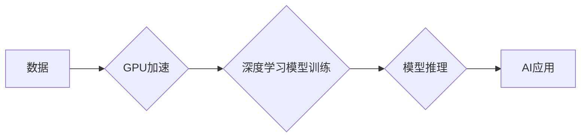

> NVIDIA, AI, GPU, 深度学习, 算力, CUDA, Tensor Core, Transformer, 

## 1. 背景介绍

人工智能（AI）的蓬勃发展，催生了对海量数据处理和复杂模型训练的巨大需求。算力成为AI发展的关键瓶颈，而NVIDIA作为GPU领域的领军者，凭借其强大的GPU架构和软件生态系统，在AI算力进化中扮演着至关重要的角色。

从早期GPU加速科学计算到如今深度学习的爆发式增长，NVIDIA不断推动着AI算力的发展，并构建了一个完整的AI生态系统，为开发者和研究者提供了一系列工具和资源。

## 2. 核心概念与联系

**2.1 GPU架构与AI计算**

传统CPU架构以其精细的指令集和流水线设计，擅长处理顺序性任务。然而，深度学习算法通常涉及大量的并行计算，例如矩阵乘法和卷积运算。GPU凭借其并行计算能力，能够高效地处理这些计算密集型任务，从而加速深度学习模型的训练和推理。

**2.2 CUDA平台与GPU编程**

NVIDIA CUDA平台为开发者提供了编程GPU的工具和框架。CUDA允许开发者将程序中的部分任务分配到GPU上执行，从而充分利用GPU的并行计算能力。

**2.3 Tensor Core与深度学习加速**

Tensor Core是NVIDIA最新一代GPU架构中引入的专用加速器，专门针对深度学习算法进行优化。Tensor Core能够高效地执行矩阵乘法和其他深度学习运算，显著提升模型训练速度和性能。

**2.4 AI生态系统与软件工具**

NVIDIA构建了一个完整的AI生态系统，包括硬件平台、软件工具、云服务和社区支持。这些工具和资源为开发者和研究者提供了从数据预处理到模型部署的完整解决方案。

**Mermaid 流程图**



## 3. 核心算法原理 & 具体操作步骤

**3.1 算法原理概述**

深度学习算法的核心是多层神经网络，通过学习数据中的特征表示，实现对复杂数据的理解和预测。常见的深度学习算法包括卷积神经网络（CNN）、循环神经网络（RNN）和Transformer等。

**3.2 算法步骤详解**

1. **数据预处理:** 将原始数据转换为深度学习模型可以理解的格式，例如归一化、编码和特征提取。
2. **模型构建:** 根据任务需求选择合适的深度学习模型架构，并定义模型参数。
3. **模型训练:** 使用训练数据训练模型，通过反向传播算法调整模型参数，使模型输出与真实标签尽可能接近。
4. **模型评估:** 使用验证数据评估模型的性能，例如准确率、召回率和F1-score等指标。
5. **模型部署:** 将训练好的模型部署到实际应用场景中，用于预测或分类新数据。

**3.3 算法优缺点**

**优点:**

* 能够学习复杂数据中的非线性关系。
* 具有强大的泛化能力，能够对未知数据进行预测。
* 随着数据量的增加，模型性能不断提升。

**缺点:**

* 训练过程需要大量的计算资源和时间。
* 模型参数众多，需要大量的训练数据才能有效训练。
* 对数据质量要求较高，数据噪声和偏差会影响模型性能。

**3.4 算法应用领域**

深度学习算法已广泛应用于各个领域，例如：

* **计算机视觉:** 图像识别、物体检测、图像分割、人脸识别等。
* **自然语言处理:** 文本分类、机器翻译、情感分析、对话系统等。
* **语音识别:** 语音转文本、语音合成等。
* **医疗诊断:** 病理图像分析、疾病预测等。
* **金融分析:** 风险评估、欺诈检测等。

## 4. 数学模型和公式 & 详细讲解 & 举例说明

**4.1 数学模型构建**

深度学习模型本质上是一个复杂的数学模型，其核心是神经网络的结构和参数。神经网络由多个层组成，每层包含多个神经元。每个神经元接收来自上一层的输入信号，并通过激活函数进行处理，输出到下一层。

**4.2 公式推导过程**

深度学习模型的训练过程基于梯度下降算法。梯度下降算法的目标是找到模型参数的最佳值，使得模型输出与真实标签之间的误差最小化。

**损失函数:** 用于衡量模型预测结果与真实标签之间的差异。常见的损失函数包括均方误差（MSE）、交叉熵损失（Cross-Entropy Loss）等。

**梯度:** 损失函数对模型参数的偏导数，表示模型参数变化对损失函数的影响。

**更新规则:** 根据梯度信息，更新模型参数，使损失函数逐渐减小。

**4.3 案例分析与讲解**

以卷积神经网络（CNN）为例，其核心操作是卷积和池化。

**卷积操作:** 使用卷积核对输入图像进行滑动计算，提取图像特征。

**池化操作:** 对卷积后的特征图进行降维，减少计算量并提高模型鲁棒性。

## 5. 项目实践：代码实例和详细解释说明

**5.1 开发环境搭建**

使用Python语言和深度学习框架TensorFlow或PyTorch进行开发。

**5.2 源代码详细实现**

```python
import tensorflow as tf

# 定义模型结构
model = tf.keras.models.Sequential([
    tf.keras.layers.Conv2D(32, (3, 3), activation='relu', input_shape=(28, 28, 1)),
    tf.keras.layers.MaxPooling2D((2, 2)),
    tf.keras.layers.Conv2D(64, (3, 3), activation='relu'),
    tf.keras.layers.MaxPooling2D((2, 2)),
    tf.keras.layers.Flatten(),
    tf.keras.layers.Dense(10, activation='softmax')
])

# 编译模型
model.compile(optimizer='adam',
              loss='sparse_categorical_crossentropy',
              metrics=['accuracy'])

# 训练模型
model.fit(x_train, y_train, epochs=5)

# 评估模型
loss, accuracy = model.evaluate(x_test, y_test)
print('Test loss:', loss)
print('Test accuracy:', accuracy)
```

**5.3 代码解读与分析**

代码定义了一个简单的卷积神经网络模型，用于手写数字识别任务。模型包含两层卷积层、两层池化层、一层全连接层和一层输出层。

**5.4 运行结果展示**

训练完成后，模型可以用于预测新的手写数字图像。

## 6. 实际应用场景

**6.1 医疗诊断**

使用深度学习算法分析医学图像，辅助医生诊断疾病，例如癌症、心血管疾病等。

**6.2 自动驾驶**

使用深度学习算法训练自动驾驶汽车，实现车辆感知、决策和控制。

**6.3 机器翻译**

使用深度学习算法实现机器翻译，将一种语言翻译成另一种语言。

**6.4 个性化推荐**

使用深度学习算法分析用户行为数据，提供个性化商品推荐。

**6.5 语音助手**

使用深度学习算法实现语音识别和自然语言理解，开发语音助手，例如Siri、Alexa等。

**6.4 未来应用展望**

随着AI算力的不断提升，深度学习算法将在更多领域得到应用，例如：

* **药物研发:** 使用深度学习算法加速药物研发，发现新的药物和治疗方案。
* **材料科学:** 使用深度学习算法设计新的材料，例如高强度轻质材料、导电材料等。
* **气候变化预测:** 使用深度学习算法分析气候数据，预测气候变化趋势。

## 7. 工具和资源推荐

**7.1 学习资源推荐**

* **深度学习课程:** Coursera、edX、Udacity等平台提供丰富的深度学习课程。
* **深度学习书籍:** 《深度学习》、《动手学深度学习》等书籍。
* **在线社区:** TensorFlow、PyTorch等深度学习框架的官方社区。

**7.2 开发工具推荐**

* **深度学习框架:** TensorFlow、PyTorch、Keras等。
* **GPU加速平台:** NVIDIA CUDA、cuDNN等。
* **云计算平台:** AWS、Azure、Google Cloud等。

**7.3 相关论文推荐**

* **ImageNet Classification with Deep Convolutional Neural Networks**
* **Attention Is All You Need**
* **BERT: Pre-training of Deep Bidirectional Transformers for Language Understanding**

## 8. 总结：未来发展趋势与挑战

**8.1 研究成果总结**

NVIDIA在AI算力发展中取得了显著成就，其GPU架构、CUDA平台和Tensor Core等技术推动了深度学习的快速发展。

**8.2 未来发展趋势**

* **算力继续提升:** GPU架构不断演进，算力将继续提升，支持更复杂和规模更大的深度学习模型。
* **模型架构创新:** 新的深度学习模型架构将不断涌现，例如Transformer、Generative Adversarial Networks（GAN）等。
* **边缘计算:** 将深度学习模型部署到边缘设备，实现更低延迟和更高效率的AI应用。

**8.3 面临的挑战**

* **数据获取和隐私保护:** 深度学习算法依赖于海量数据，数据获取和隐私保护是重要的挑战。
* **模型可解释性:** 深度学习模型的决策过程难以解释，提高模型可解释性是重要的研究方向。
* **能源消耗:** 深度学习训练过程消耗大量能源，降低能源消耗是重要的挑战。

**8.4 研究展望**

未来，AI算力将继续发展，深度学习算法将应用于更多领域，为人类社会带来更多福祉。


## 9. 附录：常见问题与解答

**9.1 如何选择合适的GPU？**

选择合适的GPU取决于具体的应用场景和预算。NVIDIA提供多种类型的GPU，例如GeForce、Quadro和Tesla等，可以根据不同的需求进行选择。

**9.2 如何使用CUDA编程？**

NVIDIA提供CUDA Toolkit，包含了开发GPU程序所需的工具和库。可以通过CUDA文档和教程学习CUDA编程。

**9.3 如何训练深度学习模型？**

可以使用深度学习框架，例如TensorFlow或PyTorch，训练深度学习模型。框架提供了丰富的API和工具，简化了模型训练过程。


作者：禅与计算机程序设计艺术 / Zen and the Art of Computer Programming 
<end_of_turn>