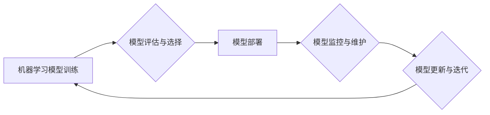

> 机器学习，模型部署，规模化运维，Python，Docker，Kubernetes，TensorFlow，PyTorch

## 1. 背景介绍

机器学习（Machine Learning，ML）作为人工智能（Artificial Intelligence，AI）的核心技术之一，近年来发展迅速，在各个领域取得了令人瞩目的成就。从图像识别、自然语言处理到推荐系统、金融风险控制，机器学习算法正在改变着我们的生活方式。然而，仅仅训练出高精度的机器学习模型还不够，将模型部署到生产环境中，并实现规模化运维，才是真正将机器学习技术应用于实际场景的关键。

随着机器学习模型的规模和复杂度不断增加，传统的部署方式已经难以满足需求。传统的部署方式通常依赖于手动配置和维护，效率低下，难以保证模型的稳定性和可扩展性。因此，需要采用更先进的工具和技术来解决机器学习模型的部署和运维挑战。

## 2. 核心概念与联系

### 2.1 机器学习模型部署

机器学习模型部署是指将训练好的机器学习模型从开发环境迁移到生产环境，使其能够接受实时数据输入，并输出预测结果。部署的目标是将模型转化为可供用户使用的应用程序或服务。

### 2.2 规模化运维

规模化运维是指能够根据业务需求动态调整模型的资源配置，并保证模型的稳定运行和高可用性。

### 2.3 关键技术

* **容器化技术（Containerization）：** 使用 Docker 等工具将应用程序及其依赖环境打包成容器，方便部署和管理。
* **编排工具（Orchestration）：** 使用 Kubernetes 等工具管理和调度容器，实现自动化部署、滚动更新和故障恢复。
* **模型服务框架（Model Serving Framework）：** 使用 TensorFlow Serving、TorchServe 等框架提供模型接口，方便应用程序调用模型进行预测。

**核心概念与联系流程图**

## 3. 核心算法原理 & 具体操作步骤

### 3.1  算法原理概述

本节将介绍机器学习模型部署和规模化运维中常用的算法原理，例如：

* **容器化技术原理：** 容器化技术通过将应用程序及其依赖环境打包成容器，实现应用程序的隔离和可移植性。
* **编排工具原理：** 编排工具通过定义应用程序的部署和运行策略，自动管理容器的创建、启动、停止和更新。
* **模型服务框架原理：** 模型服务框架提供模型接口，方便应用程序调用模型进行预测，并提供模型管理和监控功能。

### 3.2  算法步骤详解

* **容器化部署：** 使用 Dockerfile 定义应用程序的构建环境和运行依赖，并使用 Docker 命令构建容器镜像。
* **编排部署：** 使用 Kubernetes 定义应用程序的部署策略，例如副本数、资源限制等，并使用 kubectl 命令部署应用程序到 Kubernetes 集群。
* **模型服务部署：** 使用 TensorFlow Serving 或 TorchServe 等框架部署模型，并配置模型接口和访问权限。

### 3.3  算法优缺点

* **容器化技术：** 优点：提高应用程序的隔离性和可移植性，简化部署和管理。缺点：容器镜像的体积较大，需要额外的存储空间。
* **编排工具：** 优点：自动化部署和管理容器，提高效率和可靠性。缺点：学习曲线较陡，需要一定的运维经验。
* **模型服务框架：** 优点：提供模型接口和管理功能，方便应用程序调用模型。缺点：需要额外的配置和维护。

### 3.4  算法应用领域

* **金融领域：** 风险控制、欺诈检测、信用评分
* **医疗领域：** 疾病诊断、药物研发、患者画像
* **电商领域：** 商品推荐、用户画像、个性化营销
* **交通领域：** 交通预测、智能驾驶、路线规划

## 4. 数学模型和公式 & 详细讲解 & 举例说明

### 4.1  数学模型构建

在机器学习模型部署和规模化运维中，常用的数学模型包括：

* **容器资源分配模型：** 用于根据应用程序的资源需求和集群的资源可用性，分配容器的资源。
* **模型服务请求调度模型：** 用于根据模型的负载和请求的优先级，调度模型服务请求。

### 4.2  公式推导过程

* **容器资源分配模型：** 可以使用线性规划模型来优化容器资源分配，目标是最大化容器的利用率，同时满足应用程序的资源需求。
* **模型服务请求调度模型：** 可以使用队列调度算法来调度模型服务请求，例如优先级队列、公平队列等。

### 4.3  案例分析与讲解

* **容器资源分配案例：** 假设一个 Kubernetes 集群有 10 个节点，每个节点有 4 核 CPU 和 8 GB 内存。有 5 个应用程序需要部署到集群中，每个应用程序的资源需求如下：应用程序 A 需要 2 核 CPU 和 4 GB 内存，应用程序 B 需要 1 核 CPU 和 2 GB 内存，应用程序 C 需要 3 核 CPU 和 6 GB 内存，应用程序 D 需要 2 核 CPU 和 4 GB 内存，应用程序 E 需要 1 核 CPU 和 2 GB 内存。可以使用线性规划模型来分配容器的资源，使得所有应用程序都能正常运行，并最大化集群的资源利用率。

## 5. 项目实践：代码实例和详细解释说明

### 5.1  开发环境搭建

* 安装 Python 3.x
* 安装 Docker 和 Docker Compose
* 安装 Kubernetes

### 5.2  源代码详细实现

* 使用 Dockerfile 定义应用程序的构建环境和运行依赖。
* 使用 Kubernetes YAML 文件定义应用程序的部署策略。
* 使用 TensorFlow Serving 或 TorchServe 等框架部署模型。

### 5.3  代码解读与分析

* 解释 Dockerfile 中的命令和配置。
* 解释 Kubernetes YAML 文件中的配置参数。
* 解释模型服务框架的配置和使用方法。

### 5.4  运行结果展示

* 展示应用程序在容器和 Kubernetes 集群中的运行结果。
* 展示模型服务接口的调用结果。

## 6. 实际应用场景

### 6.1  金融领域

* **欺诈检测：** 使用机器学习模型分析交易数据，识别异常交易行为，防止欺诈行为发生。
* **信用评分：** 使用机器学习模型评估客户的信用风险，为贷款和保险等金融产品提供风险评估依据。

### 6.2  医疗领域

* **疾病诊断：** 使用机器学习模型分析患者的病历、影像数据等信息，辅助医生进行疾病诊断。
* **药物研发：** 使用机器学习模型分析药物分子结构和生物活性数据，加速药物研发过程。

### 6.3  电商领域

* **商品推荐：** 使用机器学习模型分析用户的购买历史和浏览记录，推荐用户可能感兴趣的商品。
* **用户画像：** 使用机器学习模型分析用户的行为数据，构建用户画像，为个性化营销提供支持。

### 6.4  未来应用展望

* **边缘计算：** 将机器学习模型部署到边缘设备，实现实时数据处理和决策。
* **联邦学习：** 在不共享原始数据的情况下，通过模型参数的更新迭代，实现模型训练和更新。

## 7. 工具和资源推荐

### 7.1  学习资源推荐

* **书籍：**
    * 《机器学习实战》
    * 《深度学习》
* **在线课程：**
    * Coursera 上的机器学习课程
    * edX 上的深度学习课程

### 7.2  开发工具推荐

* **容器化工具：** Docker
* **编排工具：** Kubernetes
* **模型服务框架：** TensorFlow Serving, TorchServe

### 7.3  相关论文推荐

* **容器化技术：**
    * Docker: A Platform for Packaging and Shipping Software
* **编排工具：**
    * Kubernetes: Container Orchestration
* **模型服务框架：**
    * TensorFlow Serving: A High-Performance Serving System for Machine Learning Models

## 8. 总结：未来发展趋势与挑战

### 8.1  研究成果总结

机器学习模型的部署和规模化运维已经取得了显著进展，容器化技术、编排工具和模型服务框架等技术为机器学习模型的部署提供了强大的支持。

### 8.2  未来发展趋势

* **模型可解释性：** 提高机器学习模型的可解释性，帮助用户理解模型的决策过程。
* **模型安全性：** 加强机器学习模型的安全性，防止模型被攻击或利用。
* **模型效率：** 提高机器学习模型的效率，降低模型的计算成本和部署成本。

### 8.3  面临的挑战

* **模型复杂度：** 机器学习模型的复杂度不断增加，部署和运维难度也随之提高。
* **数据安全：** 机器学习模型的训练和部署需要大量数据，数据安全问题需要得到重视。
* **人才缺口：** 机器学习领域的专业人才需求量大，人才缺口仍然存在。

### 8.4  研究展望

未来，机器学习模型的部署和规模化运维将继续朝着更自动化、更智能、更安全的方向发展。

## 9. 附录：常见问题与解答

* **Q1：如何选择合适的容器化工具？**
* **A1：** 选择容器化工具时，需要考虑应用程序的特性、集群规模和运维经验等因素。

* **Q2：如何部署机器学习模型到 Kubernetes 集群？**
* **A2：** 使用 Kubernetes YAML 文件定义应用程序的部署策略，并使用 kubectl 命令部署应用程序到 Kubernetes 集群。

* **Q3：如何监控机器学习模型的性能？**
* **A3：** 使用模型服务框架提供的监控功能，或者使用第三方监控工具监控模型的性能指标。

作者：禅与计算机程序设计艺术 / Zen and the Art of Computer Programming 
<end_of_turn>