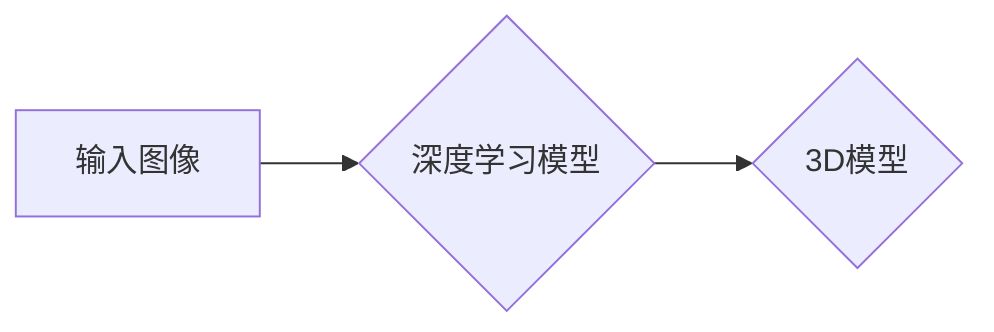

> 3D图像重建, 深度学习, 神经网络, Python, OpenCV, TensorFlow, PyTorch

## 1. 背景介绍

随着计算机视觉技术的飞速发展，3D图像重建技术已成为一个重要的研究领域，它在虚拟现实、增强现实、机器人视觉、自动驾驶等领域有着广泛的应用前景。传统的3D图像重建方法通常依赖于结构光、激光扫描等硬件设备，成本高昂，且受限于环境条件。而深度学习技术的出现为3D图像重建带来了新的机遇。

深度学习模型能够从2D图像中学习到3D空间的信息，并生成高质量的3D模型。近年来，基于深度学习的3D图像重建方法取得了显著的进展，例如单图像3D重建、多视图3D重建、视频3D重建等。这些方法利用卷积神经网络（CNN）、生成对抗网络（GAN）等深度学习架构，能够有效地学习3D空间的几何结构和纹理细节。

## 2. 核心概念与联系

### 2.1 3D图像重建

3D图像重建是指从2D图像或多幅图像中恢复三维场景的几何结构和纹理信息的过程。

### 2.2 深度学习

深度学习是一种机器学习的子领域，它利用多层神经网络来学习数据中的复杂模式。深度学习模型能够从海量数据中自动提取特征，并进行高层次的语义理解。

### 2.3 神经网络

神经网络是一种模仿人脑神经元结构的计算模型。它由多个层级的神经元组成，每个神经元接收来自前一层神经元的输入，并通过激活函数进行处理，然后将处理后的结果传递给下一层神经元。

### 2.4 3D图像重建的深度学习架构

常用的3D图像重建深度学习架构包括：

* **卷积神经网络（CNN）:** CNN能够有效地学习图像的局部特征，并进行特征提取和分类。
* **生成对抗网络（GAN）:** GAN由生成器和判别器两个网络组成，生成器生成3D模型，判别器判断模型的真实性。GAN能够生成逼真的3D模型。
* **编码器-解码器网络:** 编码器将输入图像编码成低维特征向量，解码器将特征向量解码成3D模型。

**Mermaid 流程图**



## 3. 核心算法原理 & 具体操作步骤

### 3.1  算法原理概述

基于深度学习的3D图像重建算法的核心原理是利用深度学习模型从2D图像中学习到3D空间的信息。

这些模型通常由多个卷积层、池化层和全连接层组成，能够学习图像的特征和关系，并将其映射到3D空间。

### 3.2  算法步骤详解

1. **数据预处理:** 将输入图像进行预处理，例如裁剪、缩放、归一化等操作，以提高模型的训练效率和性能。
2. **模型训练:** 使用深度学习框架（例如TensorFlow或PyTorch）训练深度学习模型，训练数据通常包括2D图像和对应的3D模型。
3. **模型评估:** 使用测试数据评估模型的性能，常用的评估指标包括平均绝对误差（MAE）、平均平方误差（MSE）等。
4. **3D模型生成:** 将训练好的模型应用于新的2D图像，生成对应的3D模型。

### 3.3  算法优缺点

**优点:**

* **高精度:** 深度学习模型能够学习到复杂的3D空间信息，生成高质量的3D模型。
* **鲁棒性:** 深度学习模型对噪声和模糊图像具有较强的鲁棒性。
* **自动化:** 深度学习模型的训练和应用过程相对自动化，无需人工干预。

**缺点:**

* **数据依赖:** 深度学习模型需要大量的训练数据，否则性能会下降。
* **计算资源:** 训练深度学习模型需要大量的计算资源，例如GPU。
* **可解释性:** 深度学习模型的决策过程难以解释，难以理解模型是如何生成3D模型的。

### 3.4  算法应用领域

* **虚拟现实 (VR) 和增强现实 (AR):** 生成逼真的3D场景，用于VR和AR应用。
* **机器人视觉:** 帮助机器人理解周围环境，进行导航和操作。
* **自动驾驶:** 生成车辆周围的3D地图，用于自动驾驶决策。
* **医学成像:** 从医学图像中重建人体器官的3D模型，用于诊断和治疗。

## 4. 数学模型和公式 & 详细讲解 & 举例说明

### 4.1  数学模型构建

3D图像重建的深度学习模型通常采用编码器-解码器架构。

* **编码器:** 将输入图像编码成低维特征向量，提取图像的语义信息。
* **解码器:** 将特征向量解码成3D模型，重建3D空间的几何结构和纹理细节。

### 4.2  公式推导过程

编码器和解码器通常由多个卷积层、池化层和全连接层组成。

卷积层用于提取图像的局部特征，池化层用于降低特征图的维度，全连接层用于将特征映射到3D空间。

具体的公式推导过程较为复杂，涉及到卷积运算、激活函数、池化操作等数学概念。

### 4.3  案例分析与讲解

例如，在单图像3D重建任务中，可以使用深度学习模型从单幅图像中预测深度图，然后根据深度图重建3D模型。

深度图表示每个像素点到摄像机的距离，可以利用深度学习模型学习到深度图与图像之间的映射关系。

## 5. 项目实践：代码实例和详细解释说明

### 5.1  开发环境搭建

* **操作系统:** Ubuntu 18.04
* **Python版本:** 3.7
* **深度学习框架:** TensorFlow 2.0
* **其他库:** OpenCV, NumPy, Matplotlib

### 5.2  源代码详细实现

```python
import tensorflow as tf
from tensorflow.keras.layers import Input, Conv2D, MaxPooling2D, UpSampling2D, concatenate

def build_unet(input_shape):
    inputs = Input(input_shape)
    
    # 编码器部分
    conv1 = Conv2D(64, 3, activation='relu', padding='same')(inputs)
    conv1 = Conv2D(64, 3, activation='relu', padding='same')(conv1)
    pool1 = MaxPooling2D(pool_size=(2, 2))(conv1)

    conv2 = Conv2D(128, 3, activation='relu', padding='same')(pool1)
    conv2 = Conv2D(128, 3, activation='relu', padding='same')(conv2)
    pool2 = MaxPooling2D(pool_size=(2, 2))(conv2)

    conv3 = Conv2D(256, 3, activation='relu', padding='same')(pool2)
    conv3 = Conv2D(256, 3, activation='relu', padding='same')(conv3)
    pool3 = MaxPooling2D(pool_size=(2, 2))(conv3)

    conv4 = Conv2D(512, 3, activation='relu', padding='same')(pool3)
    conv4 = Conv2D(512, 3, activation='relu', padding='same')(conv4)
    pool4 = MaxPooling2D(pool_size=(2, 2))(conv4)

    # 解码器部分
    up5 = UpSampling2D(size=(2, 2))(conv4)
    merge5 = concatenate([up5, conv3], axis=3)
    conv5 = Conv2D(256, 3, activation='relu', padding='same')(merge5)
    conv5 = Conv2D(256, 3, activation='relu', padding='same')(conv5)

    up6 = UpSampling2D(size=(2, 2))(conv5)
    merge6 = concatenate([up6, conv2], axis=3)
    conv6 = Conv2D(128, 3, activation='relu', padding='same')(merge6)
    conv6 = Conv2D(128, 3, activation='relu', padding='same')(conv6)

    up7 = UpSampling2D(size=(2, 2))(conv6)
    merge7 = concatenate([up7, conv1], axis=3)
    conv7 = Conv2D(64, 3, activation='relu', padding='same')(merge7)
    conv7 = Conv2D(64, 3, activation='relu', padding='same')(conv7)

    outputs = Conv2D(1, 1, activation='sigmoid')(conv7)

    model = tf.keras.Model(inputs=inputs, outputs=outputs)
    return model

# 构建模型
model = build_unet(input_shape=(256, 256, 3))

# 打印模型结构
model.summary()

# 编译模型
model.compile(optimizer='adam', loss='binary_crossentropy', metrics=['accuracy'])

# 训练模型
model.fit(train_data, train_labels, epochs=10)

# 保存模型
model.save('3d_reconstruction_model.h5')
```

### 5.3  代码解读与分析

* **构建U-Net模型:** 代码首先定义了一个U-Net模型的构建函数`build_unet`，该函数接受输入图像的形状作为参数，并构建了编码器和解码器部分。
* **编码器部分:** 编码器部分由多个卷积层、池化层组成，用于提取图像的特征。
* **解码器部分:** 解码器部分通过上采样操作和卷积层，将编码器提取的特征映射回原始图像的尺寸，并生成深度图。
* **模型编译和训练:** 代码编译了模型，并使用训练数据进行训练。
* **模型保存:** 训练完成后，将模型保存为`3d_reconstruction_model.h5`文件。

### 5.4  运行结果展示

运行代码后，模型将生成深度图，可以根据深度图重建3D模型。

## 6. 实际应用场景

### 6.1  虚拟现实 (VR) 和增强现实 (AR)

3D图像重建技术在VR和AR领域有着广泛的应用，例如：

* **生成逼真的3D场景:** 用于VR游戏、虚拟旅游、虚拟培训等应用。
* **增强现实叠加:** 将虚拟物体叠加到现实世界中，例如AR导航、AR购物等应用。

### 6.2  机器人视觉

3D图像重建技术可以帮助机器人理解周围环境，例如：

* **环境建模:** 生成机器人周围的3D地图，用于导航和避障。
* **物体识别:** 从3D模型中识别物体，例如抓取、搬运等操作。

### 6.3  自动驾驶

3D图像重建技术在自动驾驶领域中用于：

* **生成车辆周围的3D地图:** 用于路径规划、障碍物检测等决策。
* **感知环境:** 识别道路、行人、车辆等物体，提高自动驾驶系统的安全性。

### 6.4  未来应用展望

随着深度学习技术的不断发展，3D图像重建技术将有更广泛的应用前景，例如：

* **医学成像:** 从医学图像中重建人体器官的3D模型，用于诊断和治疗。
* **建筑设计:** 生成建筑物的3D模型，用于设计和模拟。
* **文物保护:** 从文物照片中重建3D模型，用于文物保护和研究。

## 7. 工具和资源推荐

### 7.1  学习资源推荐

* **书籍:**
    * 《深度学习》 - Ian Goodfellow, Yoshua Bengio, Aaron Courville
    *