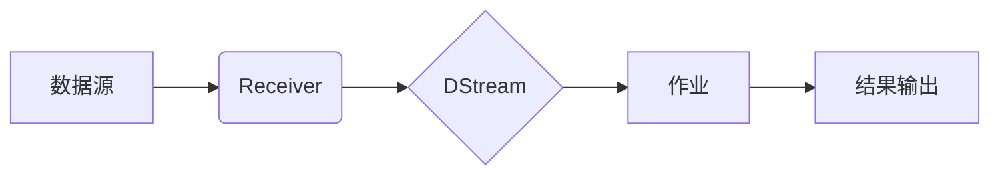

> Spark Streaming, 微批处理, DStream, Receiver, 容错机制, 代码实例

## 1. 背景介绍

随着互联网技术的快速发展，海量数据实时采集和处理的需求日益增长。传统的批处理模式无法满足实时分析的需要，因此，实时数据处理技术成为热门研究方向。Apache Spark Streaming作为一款开源的实时数据处理框架，凭借其高性能、易用性和灵活性，在实时数据分析领域得到了广泛应用。

Spark Streaming基于微批处理思想，将实时数据流划分为一个个小的批次，并对每个批次进行离线式处理。这种微批处理模式能够兼顾实时性和性能，同时利用Spark强大的计算能力进行高效的数据处理。

## 2. 核心概念与联系

Spark Streaming的核心概念包括：

* **DStream (Discretized Stream)：**  DStream是Spark Streaming中的核心数据结构，它代表一个连续的数据流，由一系列微批次组成。每个微批次包含了在特定时间窗口内采集到的数据。
* **Receiver：** Receiver是Spark Streaming用于接收实时数据的组件。它负责从数据源（如Kafka、Flume等）接收数据并将其转换为DStream。
* **作业（Job）：** Spark Streaming作业包含了对DStream进行操作的代码，例如转换、聚合、过滤等。作业会被调度执行，并对每个微批次进行处理。
* **容错机制：** Spark Streaming提供了强大的容错机制，能够确保数据处理的可靠性。例如，它支持数据恢复、故障转移等功能，能够应对数据源或计算节点的故障。

**Spark Streaming 架构流程图:**



## 3. 核心算法原理 & 具体操作步骤

### 3.1  算法原理概述

Spark Streaming的核心算法是微批处理。它将实时数据流划分为一个个小的批次，并对每个批次进行离线式处理。每个批次的大小和时间间隔可以根据实际需求进行配置。

微批处理的优势在于：

* **兼顾实时性和性能：** 微批处理能够在保证一定实时性的同时，充分利用Spark强大的计算能力进行高效的数据处理。
* **易于开发和维护：** Spark Streaming提供了丰富的API和工具，使得开发和维护实时数据处理应用程序变得更加容易。
* **容错性强：** Spark Streaming提供了强大的容错机制，能够确保数据处理的可靠性。

### 3.2  算法步骤详解

1. **数据接收：** Receiver从数据源接收实时数据，并将其转换为DStream。
2. **微批处理：** Spark Streaming将DStream划分为一个个小的批次，每个批次包含了在特定时间窗口内采集到的数据。
3. **数据处理：** 对每个微批次进行离线式处理，例如转换、聚合、过滤等。
4. **结果输出：** 将处理结果输出到指定的目的地，例如文件系统、数据库等。

### 3.3  算法优缺点

**优点：**

* 兼顾实时性和性能
* 易于开发和维护
* 容错性强

**缺点：**

* 延迟相对较高
* 对数据源的处理能力要求较高

### 3.4  算法应用领域

Spark Streaming广泛应用于以下领域：

* **实时日志分析：** 实时监控和分析应用程序日志，及时发现问题并进行处理。
* **实时用户行为分析：** 实时分析用户行为数据，例如点击、浏览、购买等，以便更好地了解用户需求并提供个性化服务。
* **实时社交媒体监控：** 实时监控社交媒体平台上的话题和趋势，以便及时了解舆情变化。
* **实时金融交易监控：** 实时监控金融交易数据，例如股票价格、交易量等，以便及时发现异常交易并进行风险控制。

## 4. 数学模型和公式 & 详细讲解 & 举例说明

### 4.1  数学模型构建

Spark Streaming的微批处理算法可以抽象为一个数学模型：

```
DStream = {B1, B2, B3, ...}
```

其中：

* DStream表示一个连续的数据流。
* Bi表示第i个微批次，包含在时间窗口[ti, ti+1)内采集到的数据。

### 4.2  公式推导过程

假设数据流的采集频率为f，每个微批次的长度为T，则：

```
ti = i * T
ti+1 = (i + 1) * T
```

其中：

* i表示微批次序号。
* T表示每个微批次的长度。

### 4.3  案例分析与讲解

例如，假设数据流的采集频率为每秒采集一次，每个微批次的长度为1秒，则：

* 第1个微批次包含在时间窗口[0, 1)内采集到的数据。
* 第2个微批次包含在时间窗口[1, 2)内采集到的数据。
* 第3个微批次包含在时间窗口[2, 3)内采集到的数据。

## 5. 项目实践：代码实例和详细解释说明

### 5.1  开发环境搭建

* 安装Java JDK
* 安装Scala
* 安装Apache Spark

### 5.2  源代码详细实现

```scala
import org.apache.spark.SparkConf
import org.apache.spark.streaming.{Seconds, StreamingContext}

object SparkStreamingWordCount {
  def main(args: Array[String]): Unit = {
    // 创建SparkConf配置
    val conf = new SparkConf().setAppName("SparkStreamingWordCount").setMaster("local[*]")

    // 创建StreamingContext
    val ssc = new StreamingContext(conf, Seconds(5))

    // 从网络流接收数据
    val lines = ssc.socketTextStream("localhost", 9999)

    // 将数据转换为单词
    val words = lines.flatMap(_.split(" "))

    // 计算单词计数
    val wordCounts = words.map(x => (x, 1)).reduceByKey(_ + _)

    // 打印结果
    wordCounts.print()

    // 启动Spark Streaming应用程序
    ssc.start()
    ssc.awaitTermination()
  }
}
```

### 5.3  代码解读与分析

* `SparkConf`配置Spark应用程序的运行环境。
* `StreamingContext`是Spark Streaming的核心组件，用于管理数据流的接收、处理和输出。
* `socketTextStream`用于从网络流接收数据。
* `flatMap`用于将数据转换为单词。
* `map`用于将单词转换为元组(单词, 1)。
* `reduceByKey`用于计算单词计数。
* `print`用于打印结果。

### 5.4  运行结果展示

运行代码后，程序会从网络流接收数据，并实时计算单词计数，并将结果打印到控制台。

## 6. 实际应用场景

Spark Streaming在实际应用场景中具有广泛的应用价值，例如：

* **实时用户行为分析：** 

    * 监控用户访问网站的页面、点击的链接、停留的时间等行为数据，以便了解用户兴趣和偏好。
    * 分析用户在社交媒体平台上的互动行为，例如点赞、评论、转发等，以便了解用户对内容的反馈和影响力。

* **实时金融交易监控：**

    * 实时监控股票价格、交易量、交易金额等数据，以便及时发现异常交易并进行风险控制。
    * 分析用户在金融平台上的交易行为，例如投资、借贷、转账等，以便提供个性化的金融服务。

* **实时日志分析：**

    * 实时监控应用程序的日志数据，例如错误日志、性能日志、安全日志等，以便及时发现问题并进行处理。
    * 分析用户行为日志，例如访问记录、操作记录等，以便了解用户使用情况和需求。

### 6.4  未来应用展望

随着数据量的不断增长和实时分析需求的不断提升，Spark Streaming在未来将有更广泛的应用前景，例如：

* **实时机器学习：** 利用Spark Streaming的实时数据处理能力，实现实时机器学习模型的训练和更新，以便及时适应数据变化和用户需求。
* **实时数据可视化：** 将Spark Streaming处理的结果实时可视化，以便用户直观地了解数据趋势和变化。
* **边缘计算：** 将Spark Streaming部署到边缘设备上，实现数据在边缘端的实时处理和分析，降低数据传输成本和延迟。

## 7. 工具和资源推荐

### 7.1  学习资源推荐

* **Spark Streaming官方文档：** https://spark.apache.org/docs/latest/streaming-programming-guide.html
* **Spark Streaming教程：** https://www.tutorialspoint.com/spark/spark_streaming.htm
* **Spark Streaming书籍：** 《Spark Streaming实战》

### 7.2  开发工具推荐

* **IntelliJ IDEA：** https://www.jetbrains.com/idea/
* **Eclipse：** https://www.eclipse.org/

### 7.3  相关论文推荐

* **Spark Streaming: Leveraging the Power of Apache Spark for Real-Time Data Processing:** https://dl.acm.org/doi/10.1145/2809206.2809217

## 8. 总结：未来发展趋势与挑战

### 8.1  研究成果总结

Spark Streaming作为一款开源的实时数据处理框架，在实时数据分析领域取得了显著的成果。它提供了高效、灵活、易用的实时数据处理解决方案，并得到了广泛的应用。

### 8.2  未来发展趋势

未来，Spark Streaming将继续朝着以下方向发展：

* **更强大的容错机制：** 提高数据处理的可靠性和稳定性。
* **更低延迟的处理：** 缩短数据处理的延迟时间，满足更严格的实时性要求。
* **更丰富的功能支持：** 提供更多的数据处理功能，例如机器学习、数据可视化等。
* **更广泛的应用场景：** 应用于更多领域，例如边缘计算、物联网等。

### 8.3  面临的挑战

Spark Streaming也面临着一些挑战：

* **数据处理效率：** 随着数据量的不断增长，如何提高数据处理效率成为一个关键问题。
* **资源管理：** 如何高效地管理Spark Streaming的资源，例如CPU、内存、磁盘等，也是一个重要的挑战。
* **生态系统建设：** 完善Spark Streaming的生态系统，例如提供更多工具、库和服务，也是一个重要的方向。

### 8.4  研究展望

未来，我们将继续致力于Spark Streaming的研究和开发，努力解决上述挑战，并推动Spark Streaming在更多领域得到应用。

## 9. 附录：常见问题与解答

**问题：** Spark Streaming的延迟是多少？

**答案：** Spark Streaming的延迟取决于微批处理的长度和数据处理的复杂度。一般来说，延迟在几秒到几十秒之间。

**问题：** Spark Streaming如何保证数据的可靠性？

**答案：** Spark Streaming提供了强大的容错机制，例如数据恢复、故障转移等，能够确保数据处理的可靠性。

**问题：** Spark Streaming如何与其他系统集成？

**答案：** Spark Streaming提供了丰富的API和工具，可以与其他系统集成，例如Kafka、Flume、HBase等。


作者：禅与计算机程序设计艺术 / Zen and the Art of Computer Programming 
<end_of_turn>