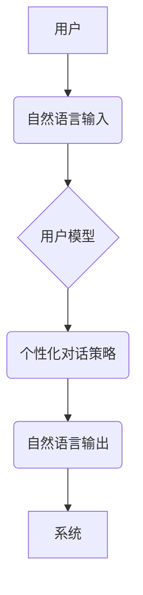

> CUI交互体验、个性化定制、人工智能、自然语言处理、机器学习、用户行为分析、数据驱动、用户模型

## 1. 背景介绍

随着科技的飞速发展，用户对交互体验的要求越来越高。传统的命令行界面 (CLI) 和图形用户界面 (GUI) 已经无法满足用户日益增长的个性化需求。因此，个性化 CUI 交互体验成为一个重要的研究方向。

CUI (Conversational User Interface) 是一种以自然语言对话为核心的交互方式，它更接近人类的自然沟通方式，能够提供更直观、更便捷的用户体验。然而，传统的 CUI 系统往往缺乏个性化定制，无法根据用户的具体需求和偏好进行调整。

个性化 CUI 交互体验是指根据用户的个人特征、行为模式和偏好，定制化的提供个性化的对话体验。它可以帮助用户更轻松地完成任务，提高工作效率，并提供更人性化的服务体验。

## 2. 核心概念与联系

**2.1 核心概念**

* **个性化:** 根据用户的独特需求和偏好进行定制化。
* **CUI 交互体验:** 以自然语言对话为核心的交互方式。
* **用户模型:**  用于存储和管理用户相关信息的模型，包括用户偏好、行为模式、历史对话等。
* **机器学习:**  用于从用户数据中学习用户行为模式和偏好的算法。
* **自然语言处理 (NLP):** 用于理解和生成自然语言的算法。

**2.2 架构图**



**2.3 核心联系**

个性化 CUI 交互体验的核心是建立一个准确的用户模型，并根据用户模型生成个性化的对话策略。用户模型可以利用机器学习算法从用户的历史对话、行为模式等数据中学习，并不断更新和完善。个性化对话策略则根据用户的个人特征和偏好，选择合适的对话内容和方式，提供更符合用户需求的交互体验。

## 3. 核心算法原理 & 具体操作步骤

**3.1 算法原理概述**

个性化 CUI 交互体验的核心算法主要包括：

* **用户行为分析:**  分析用户的对话历史、点击行为、偏好设置等数据，识别用户的兴趣、需求和行为模式。
* **用户模型构建:**  基于用户行为分析结果，构建一个包含用户特征、偏好、行为模式等信息的模型。
* **个性化对话策略生成:**  根据用户模型，选择合适的对话内容、语气、风格等，生成个性化的对话策略。

**3.2 算法步骤详解**

1. **数据收集:** 收集用户的对话历史、点击行为、偏好设置等数据。
2. **数据预处理:** 对收集到的数据进行清洗、格式化、标注等预处理操作。
3. **用户行为分析:** 利用机器学习算法，分析用户的对话历史、点击行为等数据，识别用户的兴趣、需求和行为模式。
4. **用户模型构建:**  基于用户行为分析结果，构建一个包含用户特征、偏好、行为模式等信息的模型。
5. **个性化对话策略生成:**  根据用户模型，选择合适的对话内容、语气、风格等，生成个性化的对话策略。
6. **对话系统运行:**  根据生成的个性化对话策略，与用户进行自然语言对话。
7. **模型更新:**  根据用户对话反馈，不断更新和完善用户模型。

**3.3 算法优缺点**

* **优点:**
    * 可以提供更个性化的用户体验。
    * 可以提高用户满意度和使用效率。
    * 可以帮助企业更好地了解用户需求。
* **缺点:**
    * 需要大量的用户数据进行训练。
    * 需要复杂的算法模型和技术支持。
    * 可能存在隐私安全问题。

**3.4 算法应用领域**

* **客服机器人:** 提供个性化的客户服务体验。
* **智能助手:**  根据用户的需求提供个性化的帮助和服务。
* **教育系统:**  根据学生的学习进度和能力提供个性化的学习内容和辅导。
* **娱乐系统:**  根据用户的兴趣爱好提供个性化的娱乐内容推荐。

## 4. 数学模型和公式 & 详细讲解 & 举例说明

**4.1 数学模型构建**

用户模型可以采用多种数学模型进行构建，例如：

* **贝叶斯网络:**  用于表示用户特征之间的依赖关系。
* **隐马尔可夫模型 (HMM):**  用于建模用户的行为序列。
* **深度神经网络 (DNN):**  用于学习用户行为模式的复杂非线性关系。

**4.2 公式推导过程**

例如，使用贝叶斯网络构建用户模型，可以根据用户的历史对话和行为数据，推导用户对不同主题的兴趣概率。

假设用户对主题 A 和主题 B 的兴趣概率分别为 P(A) 和 P(B)。用户在对话中提到了主题 A，则根据贝叶斯定理，可以更新用户对主题 A 的兴趣概率：

```latex
P(A|D) = \frac{P(D|A)P(A)}{P(D)}
```

其中：

* P(A|D) 是用户对主题 A 的兴趣概率，已知用户在对话中提到了主题 A。
* P(D|A) 是用户在对话中提到主题 A 的概率，假设为已知值。
* P(A) 是用户对主题 A 的初始兴趣概率。
* P(D) 是用户在对话中提到任何主题的概率。

**4.3 案例分析与讲解**

例如，假设用户在对话中提到了“电影”和“音乐”这两个主题，并且我们知道用户对电影的兴趣概率为 0.6，对音乐的兴趣概率为 0.4。如果用户在对话中提到了“电影”，则根据贝叶斯定理，我们可以更新用户对电影的兴趣概率。

```latex
P(电影|电影) = \frac{P(电影|电影)P(电影)}{P(电影)}
```

由于用户提到了“电影”，所以 P(电影|电影) 可以假设为 1。因此，更新后的用户对电影的兴趣概率为：

```latex
P(电影|电影) = \frac{1 * 0.6}{P(电影)}
```

为了计算 P(电影)，我们需要考虑用户提到的所有主题的概率，例如：

```latex
P(电影) = P(电影) + P(音乐)
```

最终，我们可以得到更新后的用户对电影的兴趣概率。

## 5. 项目实践：代码实例和详细解释说明

**5.1 开发环境搭建**

* 操作系统: Ubuntu 20.04
* Python 版本: 3.8
* 必要的库: NLTK, SpaCy, TensorFlow, PyTorch

**5.2 源代码详细实现**

```python
# 用户模型构建
class UserModel:
    def __init__(self):
        self.user_profile = {}

    def update_profile(self, user_input):
        # 使用 NLP 算法分析用户输入，更新用户模型
        pass

# 个性化对话策略生成
class DialogueStrategy:
    def __init__(self, user_model):
        self.user_model = user_model

    def generate_response(self, user_input):
        # 根据用户模型生成个性化对话回复
        pass

# 主程序
if __name__ == "__main__":
    user_model = UserModel()
    dialogue_strategy = DialogueStrategy(user_model)

    while True:
        user_input = input("用户: ")
        response = dialogue_strategy.generate_response(user_input)
        print("系统: ", response)
```

**5.3 代码解读与分析**

* `UserModel` 类负责存储和管理用户的个人信息，例如姓名、年龄、兴趣爱好等。
* `DialogueStrategy` 类负责根据用户模型生成个性化的对话回复。
* 主程序首先创建 `UserModel` 和 `DialogueStrategy` 对象，然后进入循环，接收用户的输入，并根据用户输入生成个性化的回复。

**5.4 运行结果展示**

```
用户: 你好
系统: 你好！很高兴认识你。请问有什么可以帮你的吗？
用户: 我喜欢看电影
系统: 了解了，你喜欢看电影。你喜欢什么类型的电影？
```

## 6. 实际应用场景

**6.1 个性化客服机器人**

个性化客服机器人可以根据用户的历史对话、购买记录等数据，提供更精准、更有效的客户服务。例如，如果用户之前购买过手机，客服机器人可以根据用户的购买记录，推荐相关的手机配件或售后服务。

**6.2 智能个人助理**

智能个人助理可以根据用户的日程安排、偏好设置等数据，提供个性化的提醒、计划和建议。例如，如果用户明天有会议，智能个人助理可以提醒用户准备会议资料，并根据用户的交通习惯，推荐最佳出行路线。

**6.3 个性化教育系统**

个性化教育系统可以根据学生的学习进度、能力水平等数据，提供个性化的学习内容和辅导。例如，如果学生在数学方面有困难，教育系统可以提供针对性的数学辅导，并根据学生的学习进度，调整学习内容的难度。

**6.4 个性化娱乐系统**

个性化娱乐系统可以根据用户的兴趣爱好、观看历史等数据，推荐个性化的电影、音乐、游戏等娱乐内容。例如，如果用户喜欢看科幻电影，娱乐系统可以推荐相关的科幻电影，并根据用户的观看历史，推荐类似风格的电影。

**6.5 未来应用展望**

随着人工智能技术的不断发展，个性化 CUI 交互体验将在更多领域得到应用，例如：

* **医疗保健:** 提供个性化的医疗诊断和治疗方案。
* **金融服务:** 提供个性化的理财建议和投资方案。
* **交通出行:** 提供个性化的导航和出行建议。
* **社交互动:** 提供个性化的社交推荐和互动体验。

## 7. 工具和资源推荐

**7.1 学习资源推荐**

* **书籍:**
    * 《深度学习》
    * 《自然语言处理》
    * 《机器学习》
* **在线课程:**
    * Coursera: 深度学习、自然语言处理
    * edX: 机器学习、人工智能
* **开源项目:**
    * Rasa: 开源对话机器人平台
    * Dialogflow: Google 开发的对话平台

**7.2 开发工具推荐**

* **Python:** 广泛应用于人工智能和自然语言处理领域。
* **TensorFlow:** Google 开发的开源机器学习框架。
* **PyTorch:** Facebook 开发的开源机器学习框架。
* **NLTK:** 自然语言处理工具包。
* **SpaCy:** 高性能自然语言处理库。

**7.3 相关论文推荐**

* 《BERT: Pre-training of Deep Bidirectional Transformers for Language Understanding》
* 《GPT-3: Language Models are Few-Shot Learners》
* 《Attention Is All You Need》

## 8. 总结：未来发展趋势与挑战

**8.1 研究成果总结**

近年来，个性化 CUI 交互体验领域取得了显著进展，例如：

* 自然语言处理技术的不断进步，使得 CUI 系统能够更好地理解用户的意图和需求。
* 机器学习算法的不断发展，使得 CUI 系统能够更准确地预测用户的行为模式和偏好。
* 硬件设备的不断升级，使得 CUI 系统能够提供更丰富的交互体验。

**8.2 未来发展趋势**

* **更智能的对话系统:**  CUI 系统将更加智能，能够更好地理解用户的复杂意图和情感。
* **更个性化的交互体验:**  CUI 系统将更加个性化，能够根据用户的具体需求和偏好提供定制化的交互体验。
* **跨平台的 CUI 系统:**  CUI 系统将不再局限于单一平台，而是能够跨平台运行，提供更便捷的用户体验。

**8.3 面临的挑战**

* **数据隐私安全:**  个性化 CUI 交互体验需要收集大量的用户数据，如何保护用户数据隐私安全是一个重要的挑战。
* **算法公平性:**  C