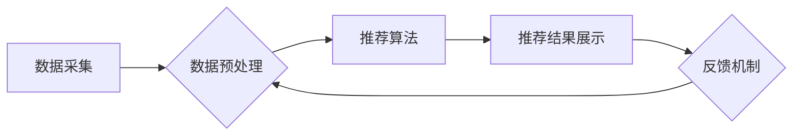

> 个性化推荐, 商业价值, 算法原理, 数据挖掘, 用户行为分析, 协同过滤, 内容过滤, 深度学习, 模型评估, 案例分析

## 1. 背景介绍

在当今数据爆炸的时代，个性化推荐已成为各大互联网平台的核心竞争力。从电商平台的商品推荐到视频网站的影视内容推荐，从社交媒体的个性化内容推送到音乐流媒体的歌曲推荐，个性化推荐无处不在，深刻地影响着用户体验和商业发展。

个性化推荐的核心目标是根据用户的历史行为、偏好和兴趣，预测用户对特定商品、内容或服务的潜在需求，并提供精准的推荐结果。这不仅可以提升用户满意度和粘性，还能有效提高转化率和商业收益。

## 2. 核心概念与联系

**2.1 个性化推荐的定义**

个性化推荐是指根据用户的个人特征、行为模式和偏好，为用户提供定制化的产品、服务或内容的推荐系统。其目标是提高用户体验，增强用户粘性，并最终促进商业目标的实现。

**2.2 个性化推荐的类型**

个性化推荐主要分为以下几种类型：

* **基于内容的推荐 (Content-Based Filtering):** 根据用户的历史行为和偏好，推荐与之相似的商品、内容或服务。
* **基于协同过滤的推荐 (Collaborative Filtering):** 根据其他用户相似行为的推荐，预测用户对特定商品、内容或服务的兴趣。
* **混合推荐 (Hybrid Recommender):** 将基于内容的推荐和基于协同过滤的推荐相结合，以获得更精准的推荐结果。
* **深度学习推荐 (Deep Learning Recommender):** 利用深度学习算法，从海量用户数据中挖掘更深层的用户特征和偏好，实现更精准的个性化推荐。

**2.3 个性化推荐的架构**

个性化推荐系统通常由以下几个主要模块组成：

* **数据采集模块:** 收集用户行为数据、用户属性数据和商品/内容信息数据。
* **数据预处理模块:** 对收集到的数据进行清洗、转换和特征提取。
* **推荐算法模块:** 根据用户数据和商品/内容信息，使用不同的推荐算法生成推荐结果。
* **推荐结果展示模块:** 将推荐结果以用户友好的方式展示给用户。
* **反馈机制模块:** 收集用户对推荐结果的反馈，并将其用于算法模型的优化和改进。

**2.4 Mermaid 流程图**



## 3. 核心算法原理 & 具体操作步骤

### 3.1 算法原理概述

个性化推荐算法的核心是根据用户的历史行为和偏好，预测用户对特定商品、内容或服务的潜在需求。常见的个性化推荐算法包括基于内容的推荐、基于协同过滤的推荐和深度学习推荐。

* **基于内容的推荐:** 这种方法根据用户的历史行为和偏好，推荐与之相似的商品、内容或服务。例如，如果用户经常购买电子产品，那么系统会推荐其他电子产品。
* **基于协同过滤的推荐:** 这种方法根据其他用户相似行为的推荐，预测用户对特定商品、内容或服务的兴趣。例如，如果用户A和用户B都喜欢同一类型的电影，那么系统会推荐用户A其他用户B喜欢的电影。
* **深度学习推荐:** 这种方法利用深度学习算法，从海量用户数据中挖掘更深层的用户特征和偏好，实现更精准的个性化推荐。例如，可以使用深度神经网络学习用户对不同电影类型、演员、导演的偏好，并根据这些偏好推荐更精准的电影。

### 3.2 算法步骤详解

**基于内容的推荐算法步骤:**

1. **数据收集:** 收集用户历史行为数据，例如用户购买记录、浏览记录、评分记录等。
2. **特征提取:** 从用户行为数据中提取用户特征，例如用户喜欢的商品类别、品牌、价格等。
3. **商品特征提取:** 从商品信息中提取商品特征，例如商品类别、品牌、价格、描述等。
4. **相似度计算:** 计算用户特征与商品特征之间的相似度，例如使用余弦相似度或皮尔逊相关系数。
5. **推荐结果生成:** 根据用户特征与商品特征的相似度，推荐与用户特征相似的商品。

**基于协同过滤的推荐算法步骤:**

1. **用户-商品矩阵构建:** 将用户和商品信息构建成一个用户-商品矩阵，其中每个元素表示用户对商品的评分或购买行为。
2. **相似用户/商品计算:** 计算用户之间的相似度或商品之间的相似度，例如使用余弦相似度或皮尔逊相关系数。
3. **推荐结果生成:** 根据用户与相似用户的行为或商品与相似商品的关联性，推荐用户可能感兴趣的商品。

**深度学习推荐算法步骤:**

1. **数据预处理:** 对用户行为数据和商品信息数据进行预处理，例如特征提取、数据归一化等。
2. **模型构建:** 使用深度学习模型，例如多层感知机 (MLP)、卷积神经网络 (CNN) 或循环神经网络 (RNN)，学习用户特征和商品特征之间的关系。
3. **模型训练:** 使用训练数据训练深度学习模型，并使用验证数据评估模型性能。
4. **推荐结果生成:** 将训练好的模型应用于新的用户数据和商品数据，预测用户对特定商品的兴趣，并生成推荐结果。

### 3.3 算法优缺点

**基于内容的推荐:**

* **优点:** 能够根据用户的具体偏好进行推荐，推荐结果更精准。
* **缺点:** 需要大量的商品信息和用户行为数据，且容易陷入“冷启动”问题，即对于新用户和新商品难以进行推荐。

**基于协同过滤的推荐:**

* **优点:** 可以发现用户之间潜在的关联性，推荐更丰富的商品。
* **缺点:** 容易受到数据稀疏性的影响，且难以解释推荐结果的逻辑。

**深度学习推荐:**

* **优点:** 可以学习更深层的用户特征和商品特征，实现更精准的个性化推荐。
* **缺点:** 需要大量的训练数据和计算资源，且模型训练过程复杂。

### 3.4 算法应用领域

个性化推荐算法广泛应用于以下领域：

* **电商平台:** 商品推荐、用户画像、精准营销
* **视频网站:** 视频推荐、内容分类、用户行为分析
* **音乐流媒体:** 歌曲推荐、音乐分类、用户偏好分析
* **社交媒体:** 内容推送、用户匹配、兴趣圈构建
* **新闻资讯:** 新闻推荐、个性化订阅、内容聚合

## 4. 数学模型和公式 & 详细讲解 & 举例说明

### 4.1 数学模型构建

**基于协同过滤的推荐算法**通常使用用户-商品矩阵来表示用户对商品的评分或购买行为。

假设用户集合为U，商品集合为I，则用户-商品矩阵R可以表示为一个m×n的矩阵，其中m=|U|，n=|I|。

R(u,i)表示用户u对商品i的评分或购买行为。

**目标:** 预测用户u对商品i的评分或购买行为R(u,i)。

### 4.2 公式推导过程

**协同过滤算法**通常使用以下公式来预测用户对商品的评分：

```
R(u,i) =  ∑_{v∈N(u)} R(v,i) * w(u,v) / ∑_{v∈N(u)} w(u,v)
```

其中：

* R(u,i) 是用户u对商品i的评分或购买行为。
* N(u) 是用户u的邻居用户集合。
* R(v,i) 是用户v对商品i的评分或购买行为。
* w(u,v) 是用户u和用户v之间的相似度。

### 4.3 案例分析与讲解

**举例说明:**

假设用户A和用户B都喜欢电影类型A，并且对电影类型A的电影评分都较高。

如果用户A对电影X的评分为5，用户B对电影X的评分为4，那么根据协同过滤算法，可以预测用户A对电影X的评分为4.5。

## 5. 项目实践：代码实例和详细解释说明

### 5.1 开发环境搭建

* **操作系统:** Ubuntu 20.04 LTS
* **编程语言:** Python 3.8
* **库依赖:** pandas, numpy, scikit-learn, matplotlib

### 5.2 源代码详细实现

```python
import pandas as pd
from sklearn.metrics.pairwise import cosine_similarity

# 加载用户-商品矩阵数据
data = pd.read_csv('user_item_matrix.csv', index_col='user_id')

# 计算用户之间的余弦相似度
user_similarity = cosine_similarity(data)

# 获取用户A的邻居用户
user_a_id = 1
user_a_neighbors = [i for i in range(len(user_similarity)) if i != user_a_id and user_similarity[user_a_id, i] > 0.8]

# 预测用户A对商品X的评分
item_x_id = 10
predicted_rating = sum([data.loc[neighbor, item_x_id] * user_similarity[user_a_id, neighbor] for neighbor in user_a_neighbors]) / sum([user_similarity[user_a_id, neighbor] for neighbor in user_a_neighbors])

print(f'Predicted rating for user {user_a_id} on item {item_x_id}: {predicted_rating}')
```

### 5.3 代码解读与分析

* **数据加载:** 使用pandas库加载用户-商品矩阵数据。
* **相似度计算:** 使用scikit-learn库的cosine_similarity函数计算用户之间的余弦相似度。
* **邻居用户获取:** 根据用户之间的相似度，获取用户A的邻居用户。
* **评分预测:** 使用协同过滤算法，预测用户A对商品X的评分。

### 5.4 运行结果展示

运行上述代码后，将输出用户A对商品X的预测评分。

## 6. 实际应用场景

### 6.1 电商平台

个性化推荐在电商平台的应用场景非常广泛，例如：

* **商品推荐:** 根据用户的浏览历史、购买记录和评分等信息，推荐用户可能感兴趣的商品。
* **用户画像:** 通过分析用户的购买行为和浏览习惯，构建用户画像，以便进行精准营销。
* **精准营销:** 根据用户的兴趣爱好和需求，推送个性化的广告和促销信息。

### 6.2 视频网站

个性化推荐在视频网站的应用场景主要包括：

* **视频推荐:** 根据用户的观看历史、点赞记录和评论等信息，推荐用户可能感兴趣的视频。
* **内容分类:** 根据视频的主题、类型和标签等信息，将视频进行分类，方便用户查找。
* **用户行为分析:** 分析用户的观看习惯和偏好，了解用户对不同类型的视频的兴趣。

### 6.3 音乐流媒体

个性化推荐在音乐流媒体的应用场景主要包括：

* **歌曲推荐:** 根据用户的播放历史、收藏记录和点赞等信息，推荐用户可能喜欢的歌曲。
* **音乐分类:** 根据歌曲的风格、类型和艺术家等信息，将歌曲进行分类，方便用户查找。
* **用户偏好分析:** 分析用户的音乐偏好，了解用户对不同类型的音乐的兴趣。

### 6.4 未来应用展望

随着人工智能技术的不断发展，个性化推荐的应用场景将更加广泛，例如：

* **教育领域:** 根据学生的学习进度和兴趣爱好，推荐个性化的学习内容和学习路径。
* **医疗领域:** 根据患者的病史和症状，推荐个性化的治疗方案和健康建议。
* **金融领域:** 根据用户的投资风险偏好和财务状况，推荐个性化的投资产品和理财方案。

## 7. 工具和资源推荐

### 7.1 学习资源推荐

* **书籍:**
    * 《推荐系统》 by  Koren,