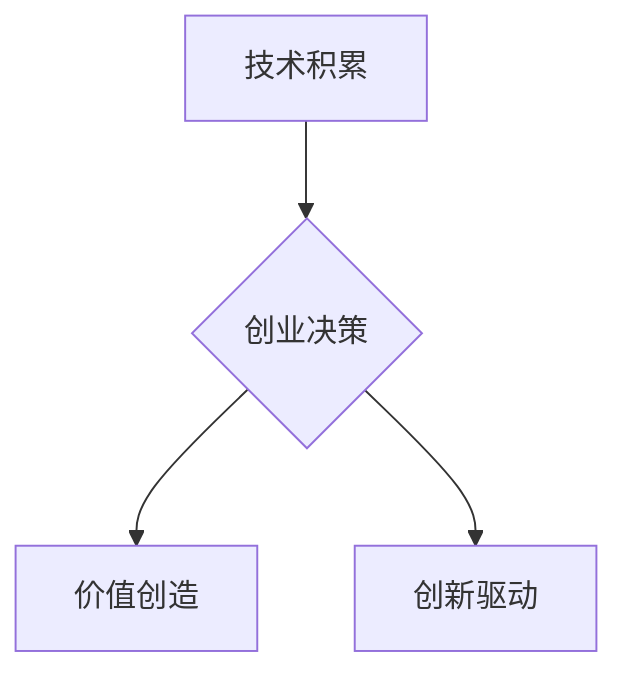

> 贾扬清，阿里巴巴，创业，技术架构，分布式系统，云计算，大数据

## 1. 背景介绍

贾扬清，一位在阿里巴巴担任多年技术架构师的资深工程师，以其在分布式系统、云计算和大数据领域的深厚功底而闻名。他曾参与阿里巴巴众多核心系统的架构设计和开发，包括淘宝、天猫、支付宝等。然而，在2016年，贾扬清选择离开阿里巴巴，创办了自己的公司——“云栖”。

贾扬清的职业转折引发了业界广泛的关注和讨论。对于一位在互联网巨头拥有如此辉煌成就的技术专家来说，选择创业意味着放弃了稳定和舒适的生活，而要面对未知的风险和挑战。那么，是什么驱使贾扬清做出这样的决定？他希望通过创业实现什么样的目标？

## 2. 核心概念与联系

贾扬清的职业转折可以从以下几个核心概念来理解：

* **技术积累**: 贾扬清在阿里巴巴多年的工作经历，让他积累了丰富的技术经验和架构设计能力。他深刻理解了互联网技术的发展趋势，并对分布式系统、云计算和大数据等领域有着深入的见解。
* **创新驱动**: 贾扬清始终保持着对技术的热情和探索精神。他相信，技术创新是推动社会进步的强大引擎，而创业正是实现技术创新的最佳平台。
* **价值创造**: 贾扬清希望通过创业，为社会创造更大的价值。他认为，技术可以解决很多现实问题，并提升人们的生活质量。

**Mermaid 流程图**



## 3. 核心算法原理 & 具体操作步骤

贾扬清在创业过程中，需要运用各种算法和技术手段来解决实际问题。例如，在云栖公司，他带领团队开发了一套基于云计算的分布式数据处理平台，该平台利用了大数据处理算法和分布式存储技术，能够高效地处理海量数据。

### 3.1  算法原理概述

该平台的核心算法原理是基于 MapReduce 和 Spark 等大数据处理框架，利用并行计算和数据分片技术，将大数据任务分解成多个子任务，并分别在不同的节点上进行处理，最终将结果汇总在一起。

### 3.2  算法步骤详解

1. 数据分片：将原始数据按照一定的规则进行分割，并将每个数据片段分配到不同的节点上。
2. 数据映射：每个节点对分配到的数据片段进行处理，并将处理结果输出到一个中间存储系统中。
3. 数据聚合：将中间存储系统中的数据进行聚合，例如分组、排序、求和等操作，最终生成最终结果。

### 3.3  算法优缺点

**优点：**

* 并行处理能力强，能够高效地处理海量数据。
* 容错性高，即使部分节点出现故障，也能保证整体系统的正常运行。
* 可扩展性强，可以根据需要增加节点数量，提高处理能力。

**缺点：**

* 编程复杂度较高，需要对大数据处理框架有深入的了解。
* 数据传输成本较高，需要频繁地进行数据交换。

### 3.4  算法应用领域

该算法广泛应用于各种大数据处理场景，例如：

* 搜索引擎：分析用户搜索行为，推荐相关结果。
* 电子商务：分析用户购买行为，进行商品推荐和营销活动。
* 社交网络：分析用户关系和社交行为，提供个性化服务。

## 4. 数学模型和公式 & 详细讲解 & 举例说明

在构建大数据处理平台时，需要利用数学模型和公式来描述数据流、计算过程和资源分配等方面。例如，可以利用概率论和统计学来分析数据分布，并根据数据特征进行数据分片和聚合操作。

### 4.1  数学模型构建

假设数据集中有 N 个数据点，每个数据点的大小为 S，需要将其分片到 M 个节点上。可以利用以下公式来计算每个节点分配的数据量：

```latex
data_size = N * S / M
```

### 4.2  公式推导过程

该公式的推导过程如下：

1. 数据总量：N * S
2. 节点数量：M
3. 每个节点分配的数据量： (N * S) / M

### 4.3  案例分析与讲解

例如，假设一个数据集中有 1000 个数据点，每个数据点的大小为 1KB，需要将其分片到 10 个节点上。根据上述公式，每个节点分配的数据量为：

```latex
data_size = 1000 * 1KB / 10 = 100KB
```

## 5. 项目实践：代码实例和详细解释说明

在实际开发过程中，需要使用编程语言来实现上述算法和数据处理流程。例如，可以使用 Python 和 Spark 来开发大数据处理平台。

### 5.1  开发环境搭建

需要安装 Python、Spark 和相关库，并配置开发环境。

### 5.2  源代码详细实现

```python
from pyspark.sql import SparkSession

# 创建 SparkSession
spark = SparkSession.builder.appName("DataProcessing").getOrCreate()

# 读取数据
data = spark.read.csv("data.csv", header=True)

# 数据处理操作
processed_data = data.groupBy("category").agg({"value": "sum"})

# 保存结果
processed_data.write.csv("output.csv", header=True)

# 关闭 SparkSession
spark.stop()
```

### 5.3  代码解读与分析

这段代码首先创建了一个 SparkSession，然后读取数据文件，并对数据进行分组和求和操作。最后，将处理结果保存到另一个文件。

### 5.4  运行结果展示

运行代码后，将生成一个名为 "output.csv" 的文件，其中包含每个类别的数据总和。

## 6. 实际应用场景

贾扬清的云栖公司利用其开发的云计算平台，为众多企业提供大数据处理、人工智能和云服务等解决方案。例如，可以帮助电商平台分析用户行为，进行精准营销；帮助金融机构进行风险评估和欺诈检测；帮助医疗机构进行疾病诊断和治疗方案推荐。

### 6.4  未来应用展望

随着云计算、大数据和人工智能技术的不断发展，云栖公司的平台将有更广泛的应用场景，例如：

* 智能制造：利用大数据和人工智能技术，实现生产过程的智能化和自动化。
* 智能城市：利用大数据和人工智能技术，提高城市管理效率和居民生活质量。
* 智能交通：利用大数据和人工智能技术，优化交通流量和提高道路安全。

## 7. 工具和资源推荐

### 7.1  学习资源推荐

* **书籍:**
    * 《分布式系统的设计与实现》
    * 《Spark编程指南》
    * 《深度学习》
* **在线课程:**
    * Coursera 上的分布式系统课程
    * Udacity 上的机器学习课程

### 7.2  开发工具推荐

* **Spark:** 大数据处理框架
* **Hadoop:** 分布式存储和处理框架
* **Kubernetes:** 集群管理平台

### 7.3  相关论文推荐

* 《MapReduce: Simplified Data Processing on Large Clusters》
* 《Spark: Cluster Computing with Working Sets》
* 《Deep Learning》

## 8. 总结：未来发展趋势与挑战

贾扬清的职业转折，体现了技术人才不断追求创新和价值创造的动力。云栖公司在云计算、大数据和人工智能领域的探索，也为未来技术发展指明了方向。

### 8.1  研究成果总结

贾扬清的团队在云计算平台的开发和应用方面取得了显著成果，为企业提供了一套高效、可靠的大数据处理解决方案。

### 8.2  未来发展趋势

云计算、大数据和人工智能技术的未来发展趋势是不断融合和演进，将形成更加强大的技术生态系统。

### 8.3  面临的挑战

云栖公司面临着技术创新、市场竞争和人才培养等挑战。

### 8.4  研究展望

未来，云栖公司将继续致力于云计算、大数据和人工智能技术的研发和应用，为社会创造更大的价值。

## 9. 附录：常见问题与解答

**常见问题:**

* 云栖公司的云计算平台有哪些优势？
* 云栖公司的服务有哪些？
* 如何联系云栖公司？

**解答:**

* 云栖公司的云计算平台具有高性能、高可靠性和高扩展性等优势。
* 云栖公司提供云计算、大数据处理、人工智能和云服务等解决方案。
* 可以通过云栖公司的官网或联系方式与他们联系。


作者：禅与计算机程序设计艺术 / Zen and the Art of Computer Programming 
<end_of_turn>