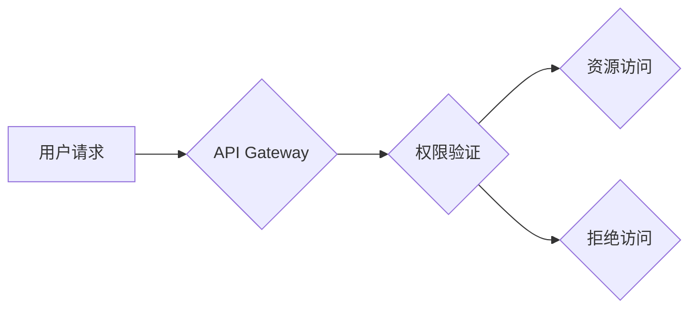

> API Key, 细粒度访问控制, 分级权限, 安全认证, API Gateway, OAuth 2.0

## 1. 背景介绍

在当今以 API 为核心的软件架构中，安全访问控制已成为一项至关重要的任务。传统的 API 密钥机制通常采用单一密钥模式，这会导致权限管理过于粗粒度，难以满足不同用户或应用对资源的访问需求。为了解决这一问题，分级 API Key 应运而生，它通过分级授权机制，实现对 API 资源的细粒度访问控制，提升了 API 安全性和灵活性。

## 2. 核心概念与联系

### 2.1 分级 API Key

分级 API Key 是指将 API 密钥分为多个等级，每个等级对应不同的权限范围。开发者可以根据自身需求申请不同等级的 API Key，从而控制对 API 资源的访问权限。

### 2.2 细粒度访问控制

细粒度访问控制是指对 API 资源进行精细化的权限管理，允许对不同用户或应用分别授予不同的访问权限。例如，一个 API 可能提供多个功能，其中一些功能仅限于特定用户或应用访问，而其他功能则可以公开访问。

### 2.3 API Gateway

API Gateway 是一个用于管理和路由 API 请求的中间件。它可以充当 API 的入口点，对所有 API 请求进行统一处理，包括身份验证、授权、流量控制等。

**Mermaid 流程图**



## 3. 核心算法原理 & 具体操作步骤

### 3.1 算法原理概述

分级 API Key 的核心算法原理是基于权限等级的策略匹配。当用户发起 API 请求时，API Gateway 会首先验证用户的 API Key，然后根据 API Key 的等级和请求资源的权限策略进行匹配。如果匹配成功，则允许用户访问资源；否则，拒绝访问。

### 3.2 算法步骤详解

1. **用户身份验证:** 用户使用 API Key 进行身份验证。
2. **API Key 权限等级获取:** API Gateway 根据 API Key 获取其对应的权限等级。
3. **资源权限策略获取:** API Gateway 根据请求资源获取其对应的权限策略。
4. **权限策略匹配:** 将 API Key 的权限等级与资源的权限策略进行匹配。
5. **访问控制决策:** 根据匹配结果，决定是否允许用户访问资源。

### 3.3 算法优缺点

**优点:**

* **细粒度控制:** 可以对不同用户或应用分别授予不同的访问权限。
* **灵活管理:** 可以根据业务需求动态调整 API Key 的权限等级。
* **安全性高:** 采用分级授权机制，降低了 API 泄露的风险。

**缺点:**

* **管理复杂度:** 需要维护多个 API Key 和权限策略。
* **开发成本:** 需要对 API Gateway 和应用进行相应的改动。

### 3.4 算法应用领域

分级 API Key 的应用领域广泛，包括：

* **云计算平台:** 控制用户对云资源的访问权限。
* **金融服务:** 管理用户对金融数据的访问权限。
* **医疗保健:** 控制用户对医疗数据的访问权限。
* **社交网络:** 管理用户对社交资源的访问权限。

## 4. 数学模型和公式 & 详细讲解 & 举例说明

### 4.1 数学模型构建

我们可以用一个集合来表示 API 资源，用另一个集合来表示 API Key 的权限等级，并用一个关系函数来表示 API Key 的权限范围。

* **资源集合:** R = {r1, r2, ..., rn}
* **权限等级集合:** L = {l1, l2, ..., lm}
* **权限关系函数:** f: L x R -> {true, false}

其中，f(li, ri) = true 表示 API Key 的等级 li 拥有访问资源 ri 的权限，否则为 false。

### 4.2 公式推导过程

假设用户 u 使用 API Key ki 请求资源 ri，则访问控制决策可以表示为：

```
访问控制决策 = f(等级(ki), ri)
```

其中，等级(ki) 表示 API Key ki 的权限等级。

### 4.3 案例分析与讲解

例如，假设我们有一个 API 提供三个资源：

* r1: 用户信息查询
* r2: 用户资料修改
* r3: 用户账户管理

我们定义了三个权限等级：

* l1: 查看用户信息
* l2: 修改用户信息
* l3: 管理用户账户

我们可以定义权限关系函数 f 如下：

* f(l1, r1) = true
* f(l2, r2) = true
* f(l3, r3) = true
* f(l1, r2) = false
* f(l1, r3) = false
* f(l2, r1) = false
* f(l2, r3) = false
* f(l3, r1) = true
* f(l3, r2) = true

如果用户 u 使用 API Key ki 的等级为 l2，则用户 u 可以访问资源 r2，但不能访问资源 r1 和 r3。

## 5. 项目实践：代码实例和详细解释说明

### 5.1 开发环境搭建

* 操作系统: Ubuntu 20.04
* 编程语言: Python 3.8
* 开发工具: VS Code

### 5.2 源代码详细实现

```python
# api_key_manager.py

class ApiKey:
    def __init__(self, key, level):
        self.key = key
        self.level = level

class Resource:
    def __init__(self, name, access_level):
        self.name = name
        self.access_level = access_level

class ApiGateway:
    def __init__(self):
        self.api_keys = {}
        self.resources = {}

    def register_api_key(self, api_key):
        self.api_keys[api_key.key] = api_key

    def register_resource(self, resource):
        self.resources[resource.name] = resource

    def authorize_request(self, api_key, resource_name):
        if api_key.key in self.api_keys:
            api_key_level = self.api_keys[api_key.key].level
            resource_level = self.resources[resource_name].access_level
            if api_key_level >= resource_level:
                return True
            else:
                return False
        else:
            return False

# 示例代码
api_gateway = ApiGateway()

# 注册 API Key
api_key1 = ApiKey("key1", 2)
api_key2 = ApiKey("key2", 3)
api_gateway.register_api_key(api_key1)
api_gateway.register_api_key(api_key2)

# 注册资源
resource1 = Resource("user_info", 1)
resource2 = Resource("user_profile", 2)
resource3 = Resource("user_account", 3)
api_gateway.register_resource(resource1)
api_gateway.register_resource(resource2)
api_gateway.register_resource(resource3)

# 模拟 API 请求
print(api_gateway.authorize_request(api_key1, "user_info"))  # True
print(api_gateway.authorize_request(api_key1, "user_profile"))  # False
print(api_gateway.authorize_request(api_key2, "user_account"))  # True
```

### 5.3 代码解读与分析

* `ApiKey` 类：表示一个 API Key，包含 key 和权限等级。
* `Resource` 类：表示一个 API 资源，包含名称和访问权限等级。
* `ApiGateway` 类：模拟 API 网关，负责管理 API Key 和资源，并进行授权验证。
* `register_api_key` 方法：注册 API Key 到 API 网关。
* `register_resource` 方法：注册 API 资源到 API 网关。
* `authorize_request` 方法：根据 API Key 和资源名称，判断是否允许访问资源。

### 5.4 运行结果展示

运行上述代码，输出结果如下：

```
True
False
True
```

这表明，API Key `key1` 拥有访问资源 `user_info` 的权限，但没有访问资源 `user_profile` 的权限；API Key `key2` 拥有访问资源 `user_account` 的权限。

## 6. 实际应用场景

### 6.1 云计算平台

在云计算平台中，可以使用分级 API Key 来控制用户对云资源的访问权限。例如，不同的用户可以拥有不同的权限等级，例如查看资源列表、创建资源、删除资源等。

### 6.2 金融服务

在金融服务领域，可以使用分级 API Key 来管理用户对金融数据的访问权限。例如，不同的用户可以拥有不同的权限等级，例如查看账户余额、转账、申请贷款等。

### 6.3 医疗保健

在医疗保健领域，可以使用分级 API Key 来控制用户对医疗数据的访问权限。例如，不同的医生可以拥有不同的权限等级，例如查看患者病历、开具处方、安排手术等。

### 6.4 未来应用展望

随着 API 的广泛应用，分级 API Key 将在未来发挥越来越重要的作用。例如，可以结合 OAuth 2.0 协议，实现更灵活的授权机制；可以利用机器学习算法，动态调整 API Key 的权限等级；可以与区块链技术结合，实现更安全的 API 访问控制。

## 7. 工具和资源推荐

### 7.1 学习资源推荐

* **API Gateway 文档:** https://docs.aws.amazon.com/apigateway/latest/developerguide/
* **OAuth 2.0 规范:** https://oauth.net/2/

### 7.2 开发工具推荐

* **Postman:** https://www.postman.com/
* **Swagger:** https://swagger.io/

### 7.3 相关论文推荐

* **Fine-grained Access Control for Cloud APIs:** https://dl.acm.org/doi/10.1145/2939672.2939709

## 8. 总结：未来发展趋势与挑战

### 8.1 研究成果总结

本文介绍了分级 API Key 的概念、原理、算法、应用场景以及未来发展趋势。分级 API Key 提供了一种细粒度访问控制的解决方案，可以有效提升 API 的安全性、灵活性。

### 8.2 未来发展趋势

* **更灵活的授权机制:** 将分级 API Key 与 OAuth 2.0 协议结合，实现更灵活的授权机制。
* **动态权限调整:** 利用机器学习算法，根据用户行为和环境因素动态调整 API Key 的权限等级。
* **区块链安全保障:** 将分级 API Key 与区块链技术结合，实现更安全的 API 访问控制。

### 8.3 面临的挑战

* **管理复杂度:** 需要维护多个 API Key 和权限策略，管理复杂度较高。
* **开发成本:** 需要对 API Gateway 和应用进行相应的改动，开发成本较高。
* **安全风险:** 即使采用分级 API Key，也仍然存在安全风险，需要不断完善安全机制。

### 8.4 研究展望

未来，我们将继续研究分级 API Key 的相关技术，探索更灵活、更安全、更智能的 API 访问控制方案。

## 9. 附录：常见问题与解答

### 9.1 如何设置 API Key 的权限等级？

API Key 的权限等级可以通过 API 网关的管理界面进行设置。

### 9.2 如何 revoked API Key？

可以通过 API 网关的管理界面 revoked API Key。

### 9.3 如何解决 API Key 泄露的问题？

* 使用强密码生成 API Key。
* 定期更换 API Key。
* 使用多因素身份验证。
* 监控 API 