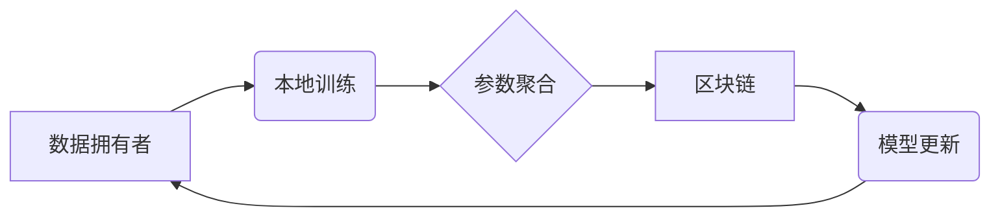

> 区块链，联邦学习，隐私保护，数据安全，去中心化

## 1. 背景介绍

随着人工智能技术的飞速发展，机器学习算法在各个领域取得了显著的成果。然而，训练这些算法通常需要海量的数据，而这些数据往往分散在不同的机构或个人手中。传统的集中式机器学习模型需要将所有数据集中到一个中心服务器上进行训练，这带来了数据隐私泄露、数据安全和数据垄断等问题。

联邦学习（Federated Learning，FL）作为一种去中心化的机器学习方法，旨在解决这些问题。它允许模型在各个数据拥有者本地进行训练，并将模型参数进行聚合更新，从而实现模型训练和参数更新的去中心化。

然而，联邦学习也面临着一些挑战，例如：

* **数据安全和隐私保护：** 虽然联邦学习避免了数据集中，但模型参数的传输和聚合过程仍然存在潜在的隐私泄露风险。
* **模型攻击和恶意参与：** 恶意参与者可能通过攻击模型参数或数据来破坏模型训练过程。
* **通信成本和网络延迟：** 联邦学习需要频繁地传输模型参数，这可能会导致通信成本高昂和网络延迟。

区块链技术作为一种去中心化、透明和不可篡改的分布式账本技术，可以有效地解决联邦学习中的这些挑战。

## 2. 核心概念与联系

### 2.1 联邦学习

联邦学习是一种分布式机器学习方法，它允许模型在各个数据拥有者本地进行训练，并将模型参数进行聚合更新，从而实现模型训练和参数更新的去中心化。

**联邦学习流程：**

1. **模型初始化：** 中央服务器将初始模型参数分发给各个数据拥有者。
2. **本地训练：** 数据拥有者在本地数据上训练模型，并更新模型参数。
3. **参数聚合：** 数据拥有者将更新后的模型参数发送回中央服务器。
4. **模型更新：** 中央服务器对所有数据拥有者的模型参数进行聚合，并更新全局模型参数。
5. **模型分发：** 中央服务器将更新后的全局模型参数分发给各个数据拥有者。

### 2.2 区块链技术

区块链是一种分布式、去中心化的、透明的账本技术。它由一系列相互连接的区块组成，每个区块包含一组交易记录。区块链的特点包括：

* **去中心化：** 区块链没有中心服务器，数据分布在所有节点上。
* **透明：** 所有交易记录都公开透明，任何人都可以查看。
* **不可篡改：** 由于区块链的加密机制，任何交易记录都无法被篡改。

**区块链架构：**

* **节点：** 区块链网络中的参与者，每个节点都维护一份完整的区块链副本。
* **区块：** 区块链中的基本单位，包含一组交易记录和前一个区块的哈希值。
* **哈希值：** 用于验证区块链数据的唯一标识符。
* **共识机制：** 用于验证交易和生成新区块的算法。

### 2.3 区块链与联邦学习的结合

区块链技术可以为联邦学习提供安全、透明和不可篡改的平台，从而解决联邦学习中的数据安全和隐私保护问题。

**区块链在联邦学习中的应用场景：**

* **模型参数安全存储：** 将模型参数存储在区块链上，可以确保模型参数的安全性和不可篡改性。
* **数据隐私保护：** 使用区块链技术可以实现数据加密和匿名化，保护数据隐私。
* **模型训练过程透明化：** 区块链可以记录模型训练过程中的所有操作，保证模型训练过程的透明性和可追溯性。

**区块链与联邦学习的架构：**



## 3. 核心算法原理 & 具体操作步骤

### 3.1  算法原理概述

区块链技术与联邦学习的结合主要体现在以下几个方面：

* **模型参数安全存储：** 将模型参数存储在区块链上，可以确保模型参数的安全性和不可篡改性。
* **数据隐私保护：** 使用区块链技术可以实现数据加密和匿名化，保护数据隐私。
* **模型训练过程透明化：** 区块链可以记录模型训练过程中的所有操作，保证模型训练过程的透明性和可追溯性。

### 3.2  算法步骤详解

1. **模型初始化：** 中央服务器将初始模型参数存储在区块链上。
2. **本地训练：** 数据拥有者从区块链上获取模型参数，在本地数据上训练模型，并更新模型参数。
3. **参数加密和签名：** 数据拥有者将更新后的模型参数进行加密和签名，以保证参数的安全性。
4. **参数提交到区块链：** 数据拥有者将加密后的模型参数提交到区块链上，并等待区块链验证和确认。
5. **参数聚合：** 当区块链验证和确认了所有数据拥有者的参数提交后，中央服务器将所有加密后的模型参数进行聚合，并生成新的全局模型参数。
6. **全局模型参数存储：** 中央服务器将新的全局模型参数存储在区块链上。

### 3.3  算法优缺点

**优点：**

* **数据安全和隐私保护：** 区块链技术可以确保模型参数和数据隐私的安全性。
* **模型训练过程透明化：** 区块链可以记录模型训练过程中的所有操作，保证模型训练过程的透明性和可追溯性。
* **去中心化：** 区块链技术可以实现模型训练和参数更新的去中心化。

**缺点：**

* **性能问题：** 区块链的验证和确认过程可能会导致模型训练速度变慢。
* **网络延迟：** 区块链网络的延迟可能会影响模型训练的效率。
* **技术复杂性：** 区块链技术和联邦学习的结合需要一定的技术复杂性。

### 3.4  算法应用领域

* **医疗保健：** 使用区块链技术和联邦学习可以训练医疗模型，例如疾病诊断和药物研发，同时保护患者隐私。
* **金融服务：** 使用区块链技术和联邦学习可以训练金融模型，例如欺诈检测和风险评估，同时保障金融数据的安全。
* **物联网：** 使用区块链技术和联邦学习可以训练物联网模型，例如设备故障预测和智能家居控制，同时保证设备数据的安全和隐私。

## 4. 数学模型和公式 & 详细讲解 & 举例说明

### 4.1  数学模型构建

在联邦学习中，每个数据拥有者都训练一个本地模型，并将其更新后的模型参数发送回中央服务器。中央服务器将所有数据拥有者的模型参数进行聚合，并更新全局模型参数。

假设有N个数据拥有者，每个数据拥有者拥有Di个数据样本，模型参数为θ。

* **本地模型训练：** 数据拥有者i使用本地数据Di训练模型，得到更新后的模型参数θi。

* **参数聚合：** 中央服务器将所有数据拥有者的模型参数θi进行平均聚合，得到全局模型参数θ全局。

**公式：**

$$
\theta_{global} = \frac{1}{N} \sum_{i=1}^{N} \theta_i
$$

### 4.2  公式推导过程

公式推导过程：

1. 假设每个数据拥有者i的模型参数为θi，全局模型参数为θ全局。
2. 中央服务器将所有数据拥有者的模型参数进行平均聚合，得到全局模型参数θ全局。
3. 公式：

$$
\theta_{global} = \frac{1}{N} \sum_{i=1}^{N} \theta_i
$$

### 4.3  案例分析与讲解

**案例：**

假设有3个数据拥有者，每个数据拥有者拥有100个数据样本。每个数据拥有者训练模型后，得到以下更新后的模型参数：

* 数据拥有者1：θ1 = [0.1, 0.2, 0.3]
* 数据拥有者2：θ2 = [0.2, 0.3, 0.4]
* 数据拥有者3：θ3 = [0.3, 0.4, 0.5]

**计算全局模型参数：**

$$
\theta_{global} = \frac{1}{3} \sum_{i=1}^{3} \theta_i = \frac{1}{3} ([0.1, 0.2, 0.3] + [0.2, 0.3, 0.4] + [0.3, 0.4, 0.5]) = [0.2, 0.3, 0.4]
$$

**分析：**

全局模型参数θ全局是所有数据拥有者的模型参数的平均值，它反映了所有数据拥有者的模型训练结果的综合。

## 5. 项目实践：代码实例和详细解释说明

### 5.1  开发环境搭建

* **操作系统：** Ubuntu 20.04 LTS
* **Python 版本：** 3.8
* **库依赖：** TensorFlow, PyTorch, Flask, Web3.py

### 5.2  源代码详细实现

```python
# 模型训练代码
import tensorflow as tf

# 定义模型
model = tf.keras.models.Sequential([
    tf.keras.layers.Dense(128, activation='relu', input_shape=(10,)),
    tf.keras.layers.Dense(64, activation='relu'),
    tf.keras.layers.Dense(10)
])

# 训练模型
model.compile(optimizer='adam', loss='mse')
model.fit(X_train, y_train, epochs=10)

# 模型参数加密
from cryptography.fernet import Fernet

# 生成密钥
key = Fernet.generate_key()
cipher = Fernet(key)

# 加密模型参数
encrypted_params = cipher.encrypt(model.get_weights().tobytes())

# 模型参数存储到区块链
from web3 import Web3

# 连接区块链网络
w3 = Web3(Web3.HTTPProvider('https://mainnet.infura.io/v3/YOUR_INFURA_PROJECT_ID'))

# 创建合约
contract = w3.eth.contract(abi=YOUR_CONTRACT_ABI, address=YOUR_CONTRACT_ADDRESS)

# 调用合约函数存储模型参数
tx_hash = contract.functions.storeModelParams(encrypted_params).transact()

# 等待交易确认
tx_receipt = w3.eth.waitForTransactionReceipt(tx_hash)

```

### 5.3  代码解读与分析

* **模型训练代码：** 使用TensorFlow框架训练一个简单的多层感知机模型。
* **模型参数加密：** 使用Fernet库对模型参数进行加密，确保模型参数的安全性和隐私性。
* **模型参数存储到区块链：** 使用Web3.py库连接区块链网络，并调用合约函数将加密后的模型参数存储到区块链上。

### 5.4  运行结果展示

运行代码后，模型参数将被加密并存储到区块链上。

## 6. 实际应用场景

### 6.1  医疗保健

* **疾病诊断：** 使用区块链技术和联邦学习可以训练疾病诊断模型，例如癌症检测和心血管疾病预测，同时保护患者隐私。
* **药物研发：** 使用区块链技术和联邦学习可以训练药物研发模型，例如药物发现和临床试验，同时保障药物研发数据的安全和隐私。

### 6.2  金融服务

* **欺诈检测：** 使用区块链技术和联邦学习可以训练欺诈检测模型，例如信用卡欺诈和网络钓鱼攻击，同时保障金融数据的安全和隐私。
* **风险评估：** 使用区块链技术和联邦学习可以训练风险评估模型，例如贷款风险评估和投资风险评估，同时保障金融数据的安全和隐私。

### 6.3  物联网