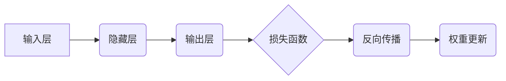

> 反向传播，神经网络，深度学习，梯度下降，优化算法，机器学习

## 1. 背景介绍

深度学习近年来取得了令人瞩目的成就，在图像识别、自然语言处理、语音识别等领域展现出强大的能力。而反向传播算法是深度学习的核心，它为训练复杂的深度神经网络提供了高效的学习机制。

传统的机器学习算法通常依赖于手工提取特征，而深度学习则能够自动学习特征，这使得其在处理复杂数据方面具有显著优势。然而，深度神经网络的训练过程非常复杂，需要大量的计算资源和时间。反向传播算法正是解决这一难题的关键。

## 2. 核心概念与联系

反向传播算法的核心思想是利用链式法则对损失函数进行反向传播，从而计算出每个神经元的权重和偏置的梯度。这些梯度可以用来更新权重和偏置，最终使模型的预测结果更加准确。

**Mermaid 流程图:**



## 3. 核心算法原理 & 具体操作步骤

### 3.1  算法原理概述

反向传播算法的基本原理是利用链式法则计算损失函数对每个神经元的权重和偏置的梯度。

1. **正向传播:** 将输入数据通过神经网络进行前向传播，计算输出结果。
2. **损失函数计算:** 计算输出结果与真实值的差异，即损失函数的值。
3. **反向传播:** 利用链式法则，将损失函数对输出层的误差反向传播到隐藏层，再反向传播到输入层。
4. **梯度计算:** 计算每个神经元的权重和偏置的梯度。
5. **权重更新:** 利用梯度下降算法，更新权重和偏置，使模型的预测结果更加准确。

### 3.2  算法步骤详解

1. **初始化:** 初始化神经网络的权重和偏置。
2. **正向传播:** 将输入数据输入到神经网络，逐层计算激活值，最终得到输出结果。
3. **损失函数计算:** 计算输出结果与真实值的差异，即损失函数的值。常用的损失函数包括均方误差、交叉熵等。
4. **反向传播:** 利用链式法则，计算损失函数对每个神经元的权重和偏置的梯度。
5. **梯度下降:** 利用梯度下降算法，更新权重和偏置，使模型的预测结果更加准确。

### 3.3  算法优缺点

**优点:**

* **高效:** 反向传播算法能够有效地利用梯度信息，使得模型的训练速度更快。
* **通用:** 反向传播算法可以应用于各种类型的深度神经网络，包括卷积神经网络、循环神经网络等。
* **可解释性:** 反向传播算法的原理相对简单，易于理解和解释。

**缺点:**

* **梯度消失/爆炸问题:** 在训练深层神经网络时，梯度可能会随着层数的增加而消失或爆炸，导致训练困难。
* **局部最优解:** 梯度下降算法可能会陷入局部最优解，导致模型的性能无法达到最佳。

### 3.4  算法应用领域

反向传播算法广泛应用于各种机器学习领域，例如：

* **图像识别:** 用于识别图像中的物体、场景和人脸。
* **自然语言处理:** 用于机器翻译、文本摘要、情感分析等任务。
* **语音识别:** 用于将语音转换为文本。
* **推荐系统:** 用于推荐用户感兴趣的内容。

## 4. 数学模型和公式 & 详细讲解 & 举例说明

### 4.1  数学模型构建

假设我们有一个具有 L 层的神经网络，其中第 l 层有 n_l 个神经元。输入数据为 x，输出为 y。

* **激活函数:** 每个神经元使用激活函数 f 来将输入信号转换为输出信号。
* **权重和偏置:** 每个连接都有一个权重 w，每个神经元都有一个偏置 b。

### 4.2  公式推导过程

1. **损失函数:** 损失函数 L(y, ŷ) 用于衡量模型预测结果 ŷ 与真实值 y 之间的差异。

2. **链式法则:** 利用链式法则，将损失函数对每个神经元的权重和偏置的梯度计算出来。

3. **梯度下降:** 利用梯度下降算法，更新权重和偏置，使模型的预测结果更加准确。

### 4.3  案例分析与讲解

假设我们有一个简单的两层神经网络，用于预测房价。输入特征包括房屋面积、房间数量等，输出为房价。

我们可以使用反向传播算法训练这个神经网络，并观察权重和偏置的变化。通过分析权重和偏置的变化，我们可以了解模型是如何学习房价预测规则的。

## 5. 项目实践：代码实例和详细解释说明

### 5.1  开发环境搭建

* Python 3.x
* TensorFlow 或 PyTorch 等深度学习框架

### 5.2  源代码详细实现

```python
import tensorflow as tf

# 定义模型
model = tf.keras.models.Sequential([
    tf.keras.layers.Dense(64, activation='relu', input_shape=(784,)),
    tf.keras.layers.Dense(10, activation='softmax')
])

# 编译模型
model.compile(optimizer='adam',
              loss='sparse_categorical_crossentropy',
              metrics=['accuracy'])

# 训练模型
model.fit(x_train, y_train, epochs=10)

# 评估模型
loss, accuracy = model.evaluate(x_test, y_test)
print('Loss:', loss)
print('Accuracy:', accuracy)
```

### 5.3  代码解读与分析

* **模型定义:** 使用 TensorFlow 的 Keras API 定义了一个简单的两层神经网络。
* **编译模型:** 使用 Adam 优化器、交叉熵损失函数和准确率指标编译模型。
* **训练模型:** 使用训练数据训练模型，设置训练轮数为 10。
* **评估模型:** 使用测试数据评估模型的性能，打印损失和准确率。

### 5.4  运行结果展示

训练完成后，我们可以观察模型的损失和准确率的变化趋势。如果模型训练成功，损失值会逐渐降低，准确率会逐渐提高。

## 6. 实际应用场景

反向传播算法在深度学习领域有着广泛的应用场景，例如：

* **图像识别:** 用于识别图像中的物体、场景和人脸。
* **自然语言处理:** 用于机器翻译、文本摘要、情感分析等任务。
* **语音识别:** 用于将语音转换为文本。
* **推荐系统:** 用于推荐用户感兴趣的内容。

### 6.4  未来应用展望

随着深度学习技术的不断发展，反向传播算法的应用场景将会更加广泛。例如，它可以应用于医疗诊断、药物研发、金融风险控制等领域。

## 7. 工具和资源推荐

### 7.1  学习资源推荐

* **书籍:**
    * 《深度学习》
    * 《神经网络与深度学习》
* **在线课程:**
    * Coursera: 深度学习
    * Udacity: 深度学习工程师
* **博客:**
    * TensorFlow Blog
    * PyTorch Blog

### 7.2  开发工具推荐

* **TensorFlow:** 开源深度学习框架
* **PyTorch:** 开源深度学习框架
* **Keras:** 高级深度学习API

### 7.3  相关论文推荐

* **《Gradient-Based Learning Applied to Document Recognition》**
* **《Backpropagation: A Review》**

## 8. 总结：未来发展趋势与挑战

### 8.1  研究成果总结

反向传播算法是深度学习的核心，它为训练复杂的深度神经网络提供了高效的学习机制。近年来，反向传播算法取得了显著的进展，例如：

* **梯度消失/爆炸问题:** 提出了一些解决梯度消失/爆炸问题的方案，例如残差网络、批量归一化等。
* **局部最优解:** 研究了如何避免梯度下降算法陷入局部最优解，例如随机梯度下降、动量法等。

### 8.2  未来发展趋势

未来，反向传播算法的研究方向将包括：

* **更高效的训练算法:** 研究更有效的梯度下降算法，例如自适应学习率算法、强化学习等。
* **更鲁棒的模型:** 研究更鲁棒的深度神经网络，能够更好地应对噪声数据和对抗攻击。
* **可解释性:** 研究如何提高深度神经网络的可解释性，以便更好地理解模型的决策过程。

### 8.3  面临的挑战

反向传播算法仍然面临一些挑战，例如：

* **计算复杂度:** 训练深层神经网络需要大量的计算资源和时间。
* **数据依赖性:** 深度学习模型的性能很大程度上依赖于训练数据的质量和数量。
* **可解释性:** 深度神经网络的决策过程难以理解，这可能会导致模型的应用受到限制。

### 8.4  研究展望

尽管面临挑战，但反向传播算法仍然是深度学习领域最重要的研究方向之一。随着技术的不断发展，我们相信反向传播算法将会取得更大的突破，为人工智能的发展做出更大的贡献。

## 9. 附录：常见问题与解答

* **什么是梯度下降？**

梯度下降是一种优化算法，用于找到函数的最小值。它通过迭代地更新参数，朝着梯度方向移动，最终找到最小值。

* **什么是链式法则？**

链式法则是一种微积分法则，用于计算复合函数的导数。它可以将复合函数的导数分解成多个简单函数的导数的乘积。

* **如何解决梯度消失/爆炸问题？**

一些方法可以解决梯度消失/爆炸问题，例如残差网络、批量归一化等。

* **如何提高模型的准确率？**

可以通过以下方法提高模型的准确率：

* 使用更大的数据集
* 使用更复杂的模型
* 使用更好的优化算法
* 使用正则化技术

作者：禅与计算机程序设计艺术 / Zen and the Art of Computer Programming


<end_of_turn>