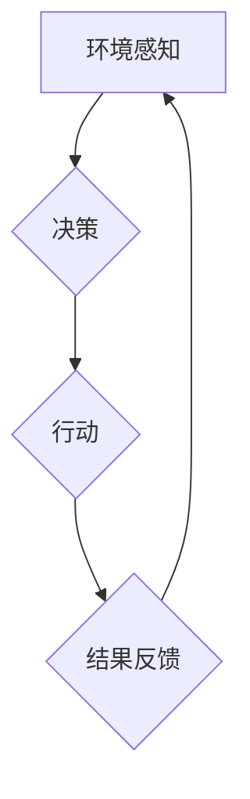

> 多智能体系统，协同机制，应用场景，算法原理，数学模型，项目实践，未来趋势

## 1. 背景介绍

随着人工智能技术的快速发展，多智能体系统 (Multi-Agent System，MAS) 作为一种新的计算范式，逐渐成为研究热点。MAS由多个相互独立、具有自主决策能力的智能体组成，它们通过交互和协作来完成复杂任务。

传统的单智能体系统难以应对复杂、动态的环境，而MAS则能够通过智能体的协同来克服这一局限性。每个智能体都拥有有限的感知能力和计算资源，但通过协同，它们可以共享信息、分工合作，从而实现比单个智能体更强大的整体性能。

## 2. 核心概念与联系

**2.1 多智能体系统 (MAS)**

MAS由多个独立的智能体组成，每个智能体都具有以下特征：

* **自主性:** 智能体能够独立地感知环境、做出决策并执行行动。
* **交互性:** 智能体之间可以通过通信和合作来实现协同。
* **学习能力:** 智能体能够从经验中学习，并不断改进自己的行为策略。

**2.2 协同机制**

协同机制是指智能体之间相互合作完成任务的规则和策略。常见的协同机制包括：

* **中心化控制:** 一个中央控制器协调所有智能体的行为。
* **分布式控制:** 智能体之间通过通信和协商来达成一致，无需中央控制器。
* **混合控制:** 将中心化控制和分布式控制相结合。

**2.3 应用场景**

MAS在各个领域都有广泛的应用，例如：

* **机器人协作:** 多个机器人协同完成复杂任务，例如搬运、组装等。
* **无人驾驶:** 多个无人车协同行驶，避免碰撞，提高效率。
* **网络安全:** 多个智能体协同防御网络攻击，提高安全防护能力。
* **金融交易:** 多个智能体协同进行交易，优化投资策略。

**2.4 Mermaid 流程图**



## 3. 核心算法原理 & 具体操作步骤

**3.1 算法原理概述**

多智能体协同机制的核心算法通常基于以下原理：

* **信息共享:** 智能体之间需要共享信息，以便了解彼此的状态和目标。
* **协商与决策:** 智能体需要通过协商和决策来达成一致，确定共同行动方案。
* **任务分配:** 需要将任务分配给不同的智能体，并协调它们的行动。
* **反馈与学习:** 智能体需要根据任务执行结果进行反馈和学习，不断改进自己的行为策略。

**3.2 算法步骤详解**

1. **环境感知:** 智能体感知周围环境，收集相关信息。
2. **状态更新:** 根据感知到的信息，智能体更新自身的状态。
3. **目标设定:** 智能体根据自身目标和环境信息设定目标。
4. **协商与决策:** 智能体之间进行协商，达成一致的行动方案。
5. **任务分配:** 根据协商结果，将任务分配给不同的智能体。
6. **行动执行:** 智能体执行分配的任务。
7. **结果反馈:** 智能体反馈任务执行结果。
8. **学习与优化:** 智能体根据反馈结果进行学习，优化自身行为策略。

**3.3 算法优缺点**

* **优点:**
    * 能够应对复杂、动态的环境。
    * 提高整体性能和效率。
    * 增强系统鲁棒性和可靠性。
* **缺点:**
    * 算法设计复杂，需要考虑多个智能体的交互和协作。
    * 需要大量的计算资源和通信带宽。
    * 难以保证所有智能体的行为一致性。

**3.4 算法应用领域**

* **机器人协作:** 多个机器人协同完成复杂任务，例如搬运、组装等。
* **无人驾驶:** 多个无人车协同行驶，避免碰撞，提高效率。
* **网络安全:** 多个智能体协同防御网络攻击，提高安全防护能力。
* **金融交易:** 多个智能体协同进行交易，优化投资策略。

## 4. 数学模型和公式 & 详细讲解 & 举例说明

**4.1 数学模型构建**

多智能体协同机制的数学模型通常基于博弈论和控制论。

* **博弈论:** 用于描述智能体之间的交互和竞争关系。
* **控制论:** 用于描述智能体如何根据环境信息和目标进行决策和行动。

**4.2 公式推导过程**

例如，在机器人协作任务中，可以使用马尔可夫决策过程 (MDP) 来建模智能体的行为。MDP包含以下要素：

* **状态空间:** 所有可能的机器人状态。
* **动作空间:** 每个机器人可以执行的动作。
* **转移概率:** 从一个状态到另一个状态的概率。
* **奖励函数:** 每个状态和动作的奖励值。

智能体的目标是找到一个最优策略，使得在执行该策略时获得最大的总奖励。

**4.3 案例分析与讲解**

假设有两个机器人需要协同完成搬运任务。可以使用MDP模型来建模他们的行为。

* **状态空间:** 包含机器人位置、物体位置等信息。
* **动作空间:** 包含移动、抓取、放下的动作。
* **转移概率:** 根据机器人的运动能力和环境因素确定。
* **奖励函数:** 根据任务完成情况和时间成本给予奖励。

通过求解MDP模型，可以得到两个机器人的最优策略，使得他们能够协同完成搬运任务。

## 5. 项目实践：代码实例和详细解释说明

**5.1 开发环境搭建**

* 操作系统: Ubuntu 20.04
* Python 版本: 3.8
* 必要的库: numpy, matplotlib, ROS

**5.2 源代码详细实现**

```python
# 智能体类
class Agent:
    def __init__(self, name, position):
        self.name = name
        self.position = position
        self.goal = None

    def perceive(self):
        # 感知环境信息
        pass

    def decide(self):
        # 根据感知信息和目标做出决策
        pass

    def act(self):
        # 执行决策
        pass

# 多智能体系统类
class MAS:
    def __init__(self, agents):
        self.agents = agents

    def run(self):
        while True:
            for agent in self.agents:
                agent.perceive()
                agent.decide()
                agent.act()

# 示例代码
if __name__ == "__main__":
    # 创建两个智能体
    agent1 = Agent("Agent1", (0, 0))
    agent2 = Agent("Agent2", (10, 0))

    # 创建多智能体系统
    mas = MAS([agent1, agent2])

    # 启动多智能体系统
    mas.run()
```

**5.3 代码解读与分析**

* `Agent` 类定义了单个智能体的行为，包括感知环境、做出决策和执行行动。
* `MAS` 类定义了多智能体系统的运行逻辑，包括循环遍历每个智能体，并调用其感知、决策和行动方法。
* 示例代码创建了两个智能体，并将其添加到多智能体系统中。

**5.4 运行结果展示**

运行代码后，两个智能体将根据环境信息和目标进行交互和协作，完成预定的任务。

## 6. 实际应用场景

**6.1 机器人协作**

在制造业中，多个机器人可以协同完成复杂的任务，例如组装、焊接、搬运等。

**6.2 无人驾驶**

多个无人车可以协同行驶，避免碰撞，提高交通效率。

**6.3 网络安全**

多个智能体可以协同防御网络攻击，提高网络安全防护能力。

**6.4 金融交易**

多个智能体可以协同进行交易，优化投资策略。

**6.5 未来应用展望**

随着人工智能技术的不断发展，多智能体协同机制将在更多领域得到应用，例如：

* **医疗保健:** 多个智能体可以协同诊断疾病、制定治疗方案。
* **教育:** 多个智能体可以协同提供个性化教育服务。
* **环境保护:** 多个智能体可以协同监测环境污染、进行环境治理。

## 7. 工具和资源推荐

**7.1 学习资源推荐**

* **书籍:**
    * Multi-Agent Systems: A Modern Approach
    * Introduction to Multiagent Systems
* **在线课程:**
    * Coursera: Multi-Agent Systems
    * edX: Introduction to Multi-Agent Systems

**7.2 开发工具推荐**

* **ROS (Robot Operating System):** 用于机器人开发的开源平台。
* **Gazebo:** 用于机器人仿真和测试的开源软件。
* **Python:** 用于多智能体系统开发的常用编程语言。

**7.3 相关论文推荐**

* **Multi-Agent Reinforcement Learning: A Survey**
* **A Survey of Multi-Agent Pathfinding**
* **Cooperative Multi-Agent Learning: A Survey**

## 8. 总结：未来发展趋势与挑战

**8.1 研究成果总结**

近年来，多智能体协同机制取得了显著进展，在多个领域得到了应用。

**8.2 未来发展趋势**

* **更智能的智能体:** 智能体将更加智能，能够更好地感知环境、做出决策和执行行动。
* **更复杂的协同机制:** 协同机制将更加复杂，能够应对更复杂的场景和任务。
* **更广泛的应用场景:** 多智能体协同机制将应用于更多领域，例如医疗保健、教育、环境保护等。

**8.3 面临的挑战**

* **算法设计复杂性:** 多智能体协同机制的算法设计非常复杂，需要考虑多个智能体的交互和协作。
* **计算资源需求:** 多智能体系统需要大量的计算资源和通信带宽。
* **安全性和可靠性:** 多智能体系统需要保证安全性和可靠性，防止恶意攻击和系统故障。

**8.4 研究展望**

未来，多智能体协同机制的研究将继续深入，探索更智能、更复杂、更广泛的应用场景。


## 9. 附录：常见问题与解答

**9.1 如何选择合适的协同机制？**

选择合适的协同机制取决于具体的应用场景和任务需求。

**9.2 如何保证多智能体系统的安全性和可靠性？**

可以通过以下措施保证多智能体系统的安全性和可靠性：

* 使用安全的通信协议。
* 对智能体进行身份验证和授权。
* 对系统进行故障检测和恢复。

**9.3 多智能体系统如何应对动态环境变化？**

可以通过以下方式使多智能体系统能够应对动态环境变化：

* 使用自适应算法，根据环境变化调整智能体的行为策略。
* 使用机器学习技术，使智能体能够从经验中学习，并适应环境变化。


作者：禅与计算机程序设计艺术 / Zen and the Art of Computer Programming 
<end_of_turn>