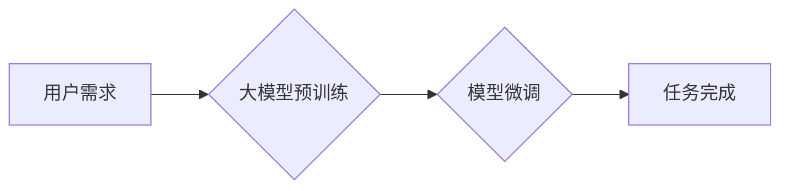

> 大模型，用户体验，市场推广，应用场景，技术挑战，未来趋势

## 1. 背景介绍

近年来，大模型技术蓬勃发展，其强大的泛化能力和应用潜力吸引了广泛关注。从文本生成、机器翻译到图像识别、语音合成，大模型在各个领域展现出令人瞩目的成果。然而，随着大模型规模的不断扩大，其用户体验和市场推广面临着新的挑战。

传统的软件开发模式难以满足大模型的复杂性和多样性需求。大模型的训练和部署需要大量的计算资源和专业知识，这使得其应用门槛较高。此外，大模型的输出结果往往缺乏针对性和个性化，难以满足用户多样化的需求。

## 2. 核心概念与联系

大模型是指参数量达到数亿甚至数千亿的大规模神经网络模型。其核心概念包括：

* **深度学习:** 大模型基于深度学习算法，通过多层神经网络结构学习复杂的特征表示。
* **Transformer架构:** Transformer是一种新型的神经网络架构，其自注意力机制能够有效捕捉文本序列中的长距离依赖关系，成为大模型的常用基础架构。
* **预训练与微调:** 大模型通常采用预训练与微调的方式进行训练。预训练阶段，模型在海量文本数据上进行无监督学习，学习到通用的语言表示；微调阶段，模型在特定任务数据上进行训练，使其能够完成特定任务。

**Mermaid 流程图:**



## 3. 核心算法原理 & 具体操作步骤

### 3.1  算法原理概述

大模型的核心算法原理是深度学习，特别是Transformer架构。Transformer通过自注意力机制学习文本序列中的长距离依赖关系，能够捕捉到文本的语义和结构信息。

### 3.2  算法步骤详解

1. **数据预处理:** 将文本数据进行清洗、分词、词向量化等预处理操作。
2. **模型构建:** 根据预定的模型架构，构建Transformer模型。
3. **预训练:** 在海量文本数据上进行无监督学习，训练模型学习通用的语言表示。
4. **微调:** 在特定任务数据上进行训练，调整模型参数，使其能够完成特定任务。
5. **推理:** 将输入文本数据输入到训练好的模型中，得到模型的输出结果。

### 3.3  算法优缺点

**优点:**

* 强大的泛化能力：大模型能够在多种任务上表现出色。
* 优秀的文本理解能力：大模型能够捕捉到文本的语义和结构信息。
* 可扩展性强：大模型可以根据需要增加模型参数和训练数据。

**缺点:**

* 计算资源消耗大：训练和部署大模型需要大量的计算资源。
* 训练时间长：大模型的训练时间通常很长。
* 缺乏透明度：大模型的决策过程难以解释。

### 3.4  算法应用领域

大模型在各个领域都有广泛的应用，例如：

* **自然语言处理:** 文本生成、机器翻译、问答系统、情感分析等。
* **计算机视觉:** 图像识别、物体检测、图像生成等。
* **语音识别:** 语音转文本、语音合成等。
* **推荐系统:** 商品推荐、内容推荐等。

## 4. 数学模型和公式 & 详细讲解 & 举例说明

### 4.1  数学模型构建

大模型的数学模型通常基于深度学习框架，例如TensorFlow或PyTorch。模型的结构由多个神经网络层组成，每层都包含多个神经元。神经元之间通过权重连接，权重决定了神经元之间的信息传递强度。

### 4.2  公式推导过程

大模型的训练过程基于反向传播算法，其核心公式是损失函数和梯度下降算法。

* **损失函数:** 用于衡量模型预测结果与真实结果之间的差异。常见的损失函数包括交叉熵损失函数和均方误差损失函数。

* **梯度下降算法:** 用于更新模型参数，使其能够最小化损失函数。梯度下降算法通过计算损失函数对模型参数的梯度，并根据梯度方向调整模型参数。

### 4.3  案例分析与讲解

例如，在文本生成任务中，可以使用交叉熵损失函数来衡量模型生成的文本与真实文本之间的差异。损失函数越小，模型生成的文本与真实文本越接近。

## 5. 项目实践：代码实例和详细解释说明

### 5.1  开发环境搭建

大模型的开发环境通常需要安装深度学习框架、编程语言和必要的库。例如，可以使用Python语言，并安装TensorFlow或PyTorch深度学习框架。

### 5.2  源代码详细实现

```python
# 使用TensorFlow构建一个简单的文本生成模型
import tensorflow as tf

# 定义模型结构
model = tf.keras.Sequential([
    tf.keras.layers.Embedding(input_dim=vocab_size, output_dim=embedding_dim),
    tf.keras.layers.LSTM(units=lstm_units),
    tf.keras.layers.Dense(units=vocab_size, activation='softmax')
])

# 编译模型
model.compile(optimizer='adam', loss='sparse_categorical_crossentropy', metrics=['accuracy'])

# 训练模型
model.fit(x_train, y_train, epochs=epochs)

# 推理模型
predictions = model.predict(x_test)
```

### 5.3  代码解读与分析

这段代码定义了一个简单的文本生成模型，使用LSTM网络结构。模型的输入是文本序列的词向量表示，输出是下一个词的概率分布。

### 5.4  运行结果展示

训练完成后，可以使用模型对新的文本进行生成。生成的文本会根据模型学习到的语言模式进行生成。

## 6. 实际应用场景

大模型在各个领域都有广泛的应用场景，例如：

### 6.1  自然语言处理

* **聊天机器人:** 大模型可以训练出能够进行自然对话的聊天机器人，例如客服机器人、陪伴机器人等。
* **文本摘要:** 大模型可以自动生成文本的摘要，例如新闻摘要、会议纪要等。
* **机器翻译:** 大模型可以实现高质量的机器翻译，例如将中文翻译成英文、英文翻译成中文等。

### 6.2  计算机视觉

* **图像识别:** 大模型可以识别图像中的物体、场景、人物等，例如用于自动驾驶、医疗诊断等。
* **图像生成:** 大模型可以生成逼真的图像，例如用于艺术创作、游戏开发等。

### 6.3  语音识别

* **语音转文本:** 大模型可以将语音转换为文本，例如用于语音助手、语音搜索等。
* **语音合成:** 大模型可以将文本转换为语音，例如用于语音播报、语音助手等。

### 6.4  未来应用展望

随着大模型技术的不断发展，其应用场景将会更加广泛，例如：

* **个性化教育:** 根据学生的学习情况，提供个性化的学习内容和辅导。
* **智能医疗:** 辅助医生诊断疾病、制定治疗方案。
* **科学研究:** 加速科学研究的进程，例如药物研发、材料科学等。

## 7. 工具和资源推荐

### 7.1  学习资源推荐

* **书籍:**
    * 《深度学习》
    * 《自然语言处理》
    * 《计算机视觉》
* **在线课程:**
    * Coursera
    * edX
    * Udacity

### 7.2  开发工具推荐

* **深度学习框架:** TensorFlow, PyTorch
* **编程语言:** Python
* **云计算平台:** AWS, Azure, Google Cloud

### 7.3  相关论文推荐

* **Attention Is All You Need**
* **BERT: Pre-training of Deep Bidirectional Transformers for Language Understanding**
* **GPT-3: Language Models are Few-Shot Learners**

## 8. 总结：未来发展趋势与挑战

### 8.1  研究成果总结

大模型技术取得了显著的进展，在各个领域展现出强大的应用潜力。

### 8.2  未来发展趋势

* **模型规模继续扩大:** 模型参数量将继续增加，模型能力将进一步提升。
* **多模态大模型:** 将文本、图像、音频等多种模态信息融合到一起，构建更强大的多模态大模型。
* **可解释性增强:** 研究大模型的决策过程，提高模型的透明度和可解释性。

### 8.3  面临的挑战

* **计算资源需求:** 训练和部署大模型需要大量的计算资源，成本较高。
* **数据安全和隐私:** 大模型的训练需要大量数据，如何保证数据安全和隐私是一个重要挑战。
* **伦理问题:** 大模型的应用可能会带来一些伦理问题，例如算法偏见、信息操纵等。

### 8.4  研究展望

未来，大模型技术将继续发展，并应用于更多领域。需要加强对大模型的理论研究，解决其面临的挑战，并确保其安全、可靠、可持续发展。

## 9. 附录：常见问题与解答

### 9.1  常见问题

* **大模型的训练需要多少计算资源？**
* **如何评估大模型的性能？**
* **如何防止大模型的算法偏见？**

### 9.2  解答

* 大模型的训练需要大量的计算资源，例如GPU集群。
* 大模型的性能可以评估其在特定任务上的准确率、召回率等指标。
* 可以通过使用多样化的训练数据、进行数据清洗和预处理等方法来防止大模型的算法偏见。


作者：禅与计算机程序设计艺术 / Zen and the Art of Computer Programming 
<end_of_turn>