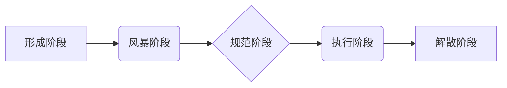

> 福格模型，团队效率，协作模式，沟通技巧，项目管理，软件开发

## 1. 背景介绍

在当今快速发展的科技时代，团队协作已成为企业成功的重要驱动力。高效的团队能够快速响应市场变化，快速交付高质量的产品，从而获得竞争优势。然而，团队协作并非易事，沟通障碍、角色冲突、目标不一致等问题常常阻碍团队效率的提升。

福格模型（Tuckman's Stages of Group Development）是一个经典的团队发展模型，它描述了团队从形成到成熟的五个阶段：

* **形成阶段（Forming）:** 团队成员刚开始接触，彼此陌生，处于试探和适应阶段。
* **风暴阶段（Storming）:** 团队成员开始表达自己的观点和想法，可能会出现冲突和争论。
* **规范阶段（Norming）:** 团队成员逐渐建立起共同的规则和规范，开始合作。
* **执行阶段（Performing）:** 团队成员高效协作，专注于完成目标。
* **解散阶段（Adjourning）:** 团队完成任务后解散。

了解福格模型可以帮助团队领导者更好地理解团队发展过程，并采取相应的措施引导团队走向高效协作。

## 2. 核心概念与联系

福格模型的核心概念是团队发展是一个循序渐进的过程，每个阶段都有其特点和挑战。团队需要经历不同的阶段才能最终达到高效协作的状态。

**福格模型流程图:**

## 3. 核心算法原理 & 具体操作步骤

福格模型本身不是一个算法，而是描述团队发展过程的模型。但是，我们可以利用福格模型的原理来设计一些算法和工具，帮助团队提高效率。

### 3.1  算法原理概述

福格模型的算法原理主要基于以下几个方面：

* **阶段识别:** 通过观察团队成员的行为和沟通模式，识别团队处于哪个阶段。
* **阶段引导:** 根据团队的阶段，采取相应的措施引导团队发展。
* **冲突管理:** 在风暴阶段，有效管理冲突，引导团队成员达成共识。
* **角色分配:** 在规范阶段，明确每个成员的角色和职责，提高团队协作效率。

### 3.2  算法步骤详解

利用福格模型提高团队效率的具体操作步骤如下：

1. **识别团队阶段:** 通过观察团队成员的行为和沟通模式，判断团队处于哪个阶段。可以使用问卷调查、访谈等方式收集数据。
2. **制定阶段性目标:** 根据团队的阶段，制定相应的阶段性目标。例如，在形成阶段，目标是建立团队信任关系；在风暴阶段，目标是解决冲突，达成共识；在规范阶段，目标是明确角色和职责。
3. **采取阶段性措施:** 根据团队的阶段，采取相应的措施引导团队发展。例如，在形成阶段，可以组织团队建设活动，增进成员之间的了解；在风暴阶段，可以组织团队成员进行沟通和协商，解决冲突；在规范阶段，可以制定团队规则和流程，提高团队协作效率。
4. **持续评估和调整:** 定期评估团队的进展情况，根据实际情况调整策略和措施。

### 3.3  算法优缺点

利用福格模型提高团队效率的算法具有以下优点：

* **科学性:** 基于团队发展理论，具有科学性和可操作性。
* **灵活性:** 可以根据团队的实际情况进行调整和优化。
* **可量化:** 可以通过问卷调查、访谈等方式收集数据，量化团队的进展情况。

但也存在一些缺点：

* **适用性:** 福格模型更适用于小型团队，对于大型团队的应用效果可能有限。
* **复杂性:** 识别团队阶段和制定阶段性措施需要一定的经验和技巧。

### 3.4  算法应用领域

利用福格模型提高团队效率的算法可以应用于各种团队，例如：

* 软件开发团队
* 项目管理团队
* 市场营销团队
* 研究开发团队

## 4. 数学模型和公式 & 详细讲解 & 举例说明

福格模型本身并不涉及复杂的数学模型和公式。但是，我们可以利用一些数学模型和统计方法来量化团队的进展情况，例如：

* **团队协作指数:** 可以通过分析团队成员之间的沟通频率、合作次数等指标，计算团队协作指数。
* **冲突解决效率:** 可以通过分析团队成员解决冲突的时间、方式等指标，计算冲突解决效率。

**举例说明:**

假设我们有一个软件开发团队，我们想通过数学模型来量化团队的协作效率。我们可以定义一个团队协作指数，该指数由以下几个指标组成：

* **沟通频率:** 团队成员之间每天的沟通次数。
* **合作次数:** 团队成员之间共同完成任务的次数。
* **代码合并次数:** 团队成员之间代码合并的次数。

我们可以将这些指标进行加权平均，得到团队协作指数。

## 5. 项目实践：代码实例和详细解释说明

由于福格模型本身不是一个算法，因此没有具体的代码实例。但是，我们可以利用福格模型的原理开发一些工具，帮助团队提高效率。例如，我们可以开发一个团队协作平台，该平台可以帮助团队成员进行沟通、协作、管理任务等。

## 6. 实际应用场景

福格模型在实际应用场景中非常广泛，例如：

* **软件开发团队:** 可以帮助团队领导者了解团队发展阶段，并采取相应的措施引导团队走向高效协作。
* **项目管理团队:** 可以帮助项目经理更好地管理项目团队，提高项目效率。
* **教育机构:** 可以帮助老师了解学生团队的发展阶段，并采取相应的教学策略。

### 6.4  未来应用展望

随着人工智能技术的不断发展，福格模型的应用场景将会更加广泛。例如，我们可以利用人工智能技术开发更智能的团队协作平台，帮助团队成员更好地沟通、协作、管理任务。

## 7. 工具和资源推荐

### 7.1  学习资源推荐

* Tuckman's Stages of Group Development: https://en.wikipedia.org/wiki/Tuckman%27s_stages_of_group_development
* The Five Stages of Team Development: https://www.mindtools.com/pages/article/newLDR_82.htm

### 7.2  开发工具推荐

* Slack: https://slack.com/
* Microsoft Teams: https://www.microsoft.com/en-us/microsoft-365/microsoft-teams/group-chat-software

### 7.3  相关论文推荐

* Tuckman, B. W. (1965). Developmental sequence in small groups. Psychological Bulletin, 63(6), 384-399.
* Gersick, C. J. (1988). Time and transition in work teams: Toward a new model of group development. Academy of Management Journal, 31(1), 9-41.

## 8. 总结：未来发展趋势与挑战

福格模型是一个经典的团队发展模型，它为我们理解团队发展过程提供了重要的理论基础。随着人工智能技术的不断发展，福格模型的应用场景将会更加广泛，未来发展趋势包括：

* **更智能的团队协作平台:** 利用人工智能技术，开发更智能的团队协作平台，帮助团队成员更好地沟通、协作、管理任务。
* **个性化团队发展指导:** 根据团队成员的个性特点和发展需求，提供个性化的团队发展指导。
* **跨文化团队协作:** 研究跨文化团队协作的规律，开发相应的团队发展模型和工具。

然而，福格模型也面临一些挑战：

* **模型的局限性:** 福格模型是一个宏观的团队发展模型，无法完全描述团队发展的复杂性。
* **数据收集和分析:** 利用福格模型进行数据分析需要收集大量的团队数据，这对于一些小型团队来说可能比较困难。
* **文化差异:** 福格模型主要基于西方文化背景，在应用于其他文化背景的团队时需要进行相应的调整。

## 9. 附录：常见问题与解答

**问题:** 福格模型适用于所有类型的团队吗？

**答案:** 福格模型更适用于小型团队，对于大型团队的应用效果可能有限。

**问题:** 如何判断团队处于哪个阶段？

**答案:** 可以通过观察团队成员的行为和沟通模式，判断团队处于哪个阶段。可以使用问卷调查、访谈等方式收集数据。

**问题:** 如何利用福格模型提高团队效率？

**答案:** 可以根据团队的阶段，制定相应的阶段性目标和措施，引导团队发展。

作者：禅与计算机程序设计艺术 / Zen and the Art of Computer Programming 
<end_of_turn>