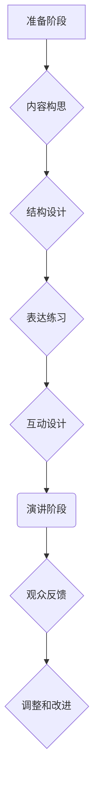

>  演讲技巧，有效表达，演讲准备，演讲内容，演讲技巧训练，自信表达，肢体语言，声音控制，观众互动

## 1. 背景介绍

在当今信息爆炸的时代，演讲已成为一种重要的沟通方式，它能够帮助我们传递信息、激发灵感、影响他人。然而，并非每个人都具备优秀的演讲能力。许多人面对演讲时感到紧张、焦虑，甚至难以组织语言，导致演讲效果不佳。因此，学习和掌握有效的演讲技巧，对于个人成长和职业发展都至关重要。

## 2. 核心概念与联系

有效的演讲并非仅仅是掌握语言表达技巧，更重要的是要能够清晰地传递信息，并与观众建立情感连接。

**演讲的核心概念包括：**

* **内容：**演讲内容是演讲的基础，它需要清晰、有逻辑、富有吸引力。
* **结构：**演讲结构决定了信息的组织方式，它需要清晰的开头、中间和结尾，并使用合适的过渡词语连接各个部分。
* **表达：**演讲表达包括语言、肢体语言和声音控制，它需要清晰、生动、富有感染力。
* **互动：**演讲互动是指与观众的交流，它可以帮助演讲者更好地了解观众的反应，并调整演讲内容和方式。

**演讲流程图：**

## 3. 核心算法原理 & 具体操作步骤

**3.1 算法原理概述**

有效的演讲技巧可以看作是一种算法，它需要遵循一定的步骤和原则，才能达到最佳效果。

**3.2 算法步骤详解**

1. **准备阶段：**
    * **确定演讲主题和目标：**明确演讲的主题和目标，才能更好地组织内容和设计结构。
    * **收集和整理资料：**收集相关资料，并进行整理和分析，形成演讲内容的框架。
    * **设计演讲结构：**将演讲内容按照逻辑顺序排列，并使用合适的过渡词语连接各个部分。
    * **练习演讲稿：**反复练习演讲稿，熟悉内容和节奏，并进行必要的修改和调整。

2. **演讲阶段：**
    * **开场白：**抓住观众的注意力，并明确演讲主题。
    * **主体部分：**清晰地阐述演讲内容，并使用合适的语言、肢体语言和声音控制来增强表达效果。
    * **结尾部分：**总结演讲内容，并提出呼吁或建议。
    * **互动环节：**与观众进行互动，回答问题，并收集反馈。

3. **调整和改进阶段：**
    * **总结演讲经验：**反思演讲过程中的不足，并进行总结和改进。
    * **收集观众反馈：**收集观众的反馈意见，并进行分析和改进。

**3.3 算法优缺点**

* **优点：**
    * 可以帮助演讲者提高演讲效果，并增强自信心。
    * 可以帮助演讲者更好地组织和表达信息。
    * 可以帮助演讲者与观众建立情感连接。
* **缺点：**
    * 需要花费时间和精力进行准备和练习。
    * 如果过于注重技巧，可能会导致演讲缺乏真诚和感染力。

**3.4 算法应用领域**

有效的演讲技巧可以应用于各种场合，例如：

* **商务演讲：**推销产品、介绍公司、进行谈判等。
* **学术演讲：**发表研究成果、分享专业知识等。
* **个人演讲：**自我介绍、表达观点、分享经验等。

## 4. 数学模型和公式 & 详细讲解 & 举例说明

**4.1 数学模型构建**

我们可以使用数学模型来描述演讲效果，例如：

* **演讲效果 = 内容质量 * 结构清晰度 * 表达能力 * 互动程度**

其中：

* **内容质量：**指演讲内容的深度、广度、新颖性和实用性。
* **结构清晰度：**指演讲内容的逻辑性和组织性。
* **表达能力：**指演讲者的语言表达能力、肢体语言和声音控制能力。
* **互动程度：**指演讲者与观众的交流程度。

**4.2 公式推导过程**

我们可以通过对上述模型进行分析和推导，得出以下结论：

* 提高演讲效果的关键在于提升各个因素的权重。
* 内容质量是演讲效果的基础，结构清晰度和表达能力是内容传递的关键，互动程度是增强观众参与度的关键。

**4.3 案例分析与讲解**

例如，一场关于人工智能的演讲，如果内容质量高，但结构混乱，表达能力不足，互动程度低，那么演讲效果就会很差。反之，如果内容质量一般，但结构清晰，表达能力强，互动程度高，那么演讲效果也会比较好。

## 5. 项目实践：代码实例和详细解释说明

**5.1 开发环境搭建**

为了更好地理解和实践演讲技巧，我们可以使用一些工具和平台来辅助我们的学习和练习。例如：

* **在线演讲平台：**例如TED、演讲王等，可以让我们观看优秀演讲的案例，并进行自我练习。
* **演讲练习软件：**例如Toastmasters等，可以帮助我们进行模拟演讲，并获得反馈意见。
* **视频录制软件：**例如OBS Studio等，可以让我们录制自己的演讲视频，并进行分析和改进。

**5.2 源代码详细实现**

由于演讲技巧是一个综合性的能力，无法用代码直接实现。但是，我们可以使用代码来辅助我们练习和分析演讲内容。例如：

* **文本分析工具：**可以分析演讲稿的语言风格、词汇量、句式结构等，帮助我们改进演讲内容。
* **语音识别工具：**可以识别演讲者的语音内容，并进行分析，例如语速、语调、音量等，帮助我们改进演讲表达。

**5.3 代码解读与分析**

通过分析代码的实现原理，我们可以更好地理解演讲技巧背后的逻辑和机制。例如，我们可以分析文本分析工具是如何识别关键词和情感倾向的，分析语音识别工具是如何识别语音信号的。

**5.4 运行结果展示**

通过运行代码，我们可以获得一些数据和分析结果，例如演讲稿的关键词频率、语音语速的分布等，这些结果可以帮助我们更好地理解自己的演讲特点，并进行改进。

## 6. 实际应用场景

**6.1 商业演讲**

在商业演讲中，演讲者需要能够清晰地表达产品或服务的价值，并说服观众进行购买或投资。

**6.2 学术演讲**

在学术演讲中，演讲者需要能够准确地传达研究成果，并与同行进行学术交流。

**6.3 个人演讲**

在个人演讲中，演讲者可以分享自己的经验、观点或故事，并与观众建立情感连接。

**6.4 未来应用展望**

随着人工智能技术的不断发展，演讲技巧的学习和实践将会更加便捷和高效。例如，我们可以使用人工智能辅助工具来进行演讲内容的创作、结构设计、表达练习等。

## 7. 工具和资源推荐

**7.1 学习资源推荐**

* **书籍：**《演讲的力量》、《如何赢得朋友和影响他人》
* **网站：**TED、演讲王、Toastmasters
* **课程：**Coursera、Udemy等平台上的演讲技巧课程

**7.2 开发工具推荐**

* **在线演讲平台：**TED、演讲王等
* **演讲练习软件：**Toastmasters等
* **视频录制软件：**OBS Studio等
* **文本分析工具：**NLTK、spaCy等
* **语音识别工具：**Google Cloud Speech-to-Text、Amazon Transcribe等

**7.3 相关论文推荐**

* **演讲效果评估模型：**
* **人工智能辅助演讲技巧：**

## 8. 总结：未来发展趋势与挑战

**8.1 研究成果总结**

通过对演讲技巧的研究，我们已经掌握了一些有效的学习和实践方法，并利用人工智能技术辅助我们的学习和练习。

**8.2 未来发展趋势**

未来，演讲技巧的研究将会更加深入，并与人工智能技术更加紧密地结合。例如，我们可以使用人工智能技术来个性化推荐演讲技巧，并根据用户的实际情况进行定制化训练。

**8.3 面临的挑战**

尽管演讲技巧的研究取得了进展，但仍然面临一些挑战，例如：

* 如何更好地评估演讲效果
* 如何将人工智能技术应用于演讲技巧的个性化训练
* 如何提高演讲技巧的普适性和可操作性

**8.4 研究展望**

未来，我们将继续致力于演讲技巧的研究，并探索人工智能技术在演讲领域的更多应用，以帮助人们更好地进行演讲和表达。

## 9. 附录：常见问题与解答

**常见问题：**

* 如何克服演讲恐惧？
* 如何设计一个吸引人的演讲结构？
* 如何提高演讲的表达能力？

**解答：**

* 克服演讲恐惧可以通过练习、准备和调整心态来实现。
* 设计一个吸引人的演讲结构需要遵循逻辑顺序，并使用合适的过渡词语连接各个部分。
* 提高演讲的表达能力可以通过练习语言表达、肢体语言和声音控制来实现。

作者：禅与计算机程序设计艺术 / Zen and the Art of Computer Programming 
<end_of_turn>