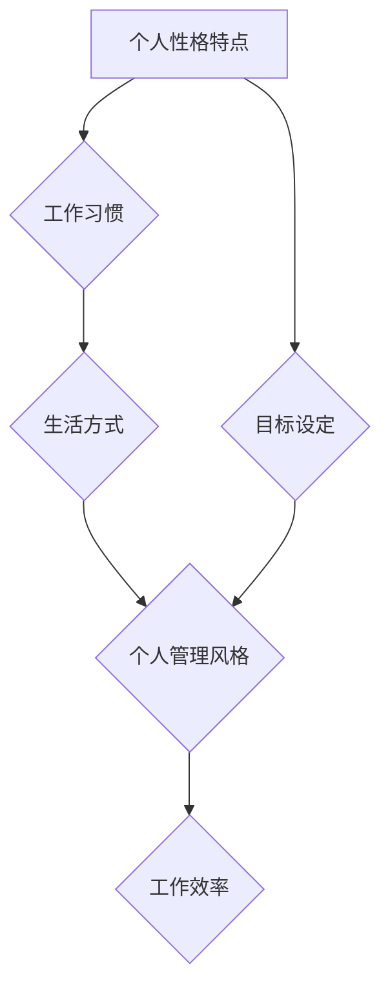

> 个人管理风格，高效工作，时间管理，任务管理，目标设定，工作流程，个人成长

## 1. 背景介绍

在当今快节奏的社会，高效地管理个人时间和任务显得尤为重要。每个人都有自己的工作方式和生活习惯，但缺乏一套适合自己的个人管理风格，往往会导致工作效率低下、目标难以达成，甚至影响身心健康。

个人管理风格是指一个人在工作和生活中，根据自身特点和需求，形成的一套独特的管理方法和习惯。它涵盖了时间管理、任务管理、目标设定、工作流程等多个方面。拥有高效的个人管理风格，可以帮助我们更好地规划时间，提高工作效率，实现个人目标，并获得更大的成就感和生活满足感。

## 2. 核心概念与联系

### 2.1 个人管理风格的构成要素

个人管理风格的形成是一个复杂的过程，受到多种因素的影响，包括：

* **性格特点：** 不同的性格类型，例如内向型、外向型、理性型、感性型等，对时间和任务的处理方式会有所不同。
* **工作习惯：** 每个人都有自己独特的习惯，例如喜欢集中精力完成任务，还是喜欢分阶段进行。
* **生活方式：** 生活节奏、家庭状况、兴趣爱好等都会影响个人管理风格。
* **目标设定：** 个人目标的明确程度和优先级，也会影响管理风格的选择。

### 2.2 个人管理风格与工作效率的关系

个人管理风格与工作效率有着密切的联系。高效的个人管理风格可以帮助我们：

* **合理规划时间：** 避免时间浪费，提高时间利用率。
* **有效管理任务：** 将任务分解成更小的步骤，并按优先级进行处理。
* **提高专注力：** 减少干扰，集中精力完成任务。
* **增强执行力：** 坚持执行计划，并不断优化管理方法。

### 2.3 个人管理风格的构建与优化

个人管理风格不是一成不变的，可以通过不断学习、实践和反思，不断优化和完善。

**Mermaid 流程图**



## 3. 核心算法原理 & 具体操作步骤

### 3.1 算法原理概述

个人管理风格的构建可以看作是一个算法的过程，需要根据个人特点和需求，选择合适的算法模型和操作步骤。

常见的个人管理风格算法模型包括：

* **番茄工作法：** 将工作时间划分为25分钟的间隔，每间隔结束后休息5分钟，可以提高专注力和效率。
* **Eisenhower矩阵：** 将任务按照重要性和紧急程度进行分类，帮助优先处理重要任务。
* **GTD方法：** 将任务分解成更小的步骤，并记录在清单中，可以帮助更好地管理和执行任务。

### 3.2 算法步骤详解

**以番茄工作法为例，具体操作步骤如下：**

1. **选择一个任务：** 确定要完成的任务。
2. **设定番茄时间：** 使用计时器设定25分钟的番茄时间。
3. **专注工作：** 在番茄时间内，集中精力完成任务，避免任何干扰。
4. **休息片刻：** 当番茄时间结束时，休息5分钟，可以起身活动一下，喝杯水，放松一下。
5. **重复步骤2-4：** 完成4个番茄时间后，休息15-20分钟。

### 3.3 算法优缺点

**番茄工作法优点：**

* 提高专注力
* 增强执行力
* 避免过度疲劳

**番茄工作法缺点：**

* 不适合所有类型的任务
* 需要严格遵守时间安排
* 可能导致任务中断

### 3.4 算法应用领域

番茄工作法适用于各种类型的任务，例如：

* 写作
* 学习
* 编程
* 设计

## 4. 数学模型和公式 & 详细讲解 & 举例说明

### 4.1 数学模型构建

个人管理风格的构建可以抽象为一个数学模型，其中：

* **输入变量：** 个人性格特点、工作习惯、生活方式、目标设定等。
* **输出变量：** 个人管理风格。
* **算法：** 根据输入变量，选择合适的算法模型进行处理。

### 4.2 公式推导过程

由于个人管理风格的构建是一个复杂的过程，难以用简单的公式进行精确描述。

### 4.3 案例分析与讲解

**案例：**

假设一个人性格内向，工作习惯喜欢集中精力完成任务，生活方式相对规律，目标设定明确。

根据上述信息，我们可以推断出，该个人可能更适合采用番茄工作法或GTD方法。

## 5. 项目实践：代码实例和详细解释说明

### 5.1 开发环境搭建

可以使用任何文本编辑器或代码编辑器进行开发，例如VS Code、Sublime Text等。

### 5.2 源代码详细实现

以下是一个简单的番茄工作法代码示例，使用Python语言实现：

```python
import time

def pomodoro():
    print("开始番茄工作时间...")
    time.sleep(25 * 60)  # 工作25分钟
    print("休息时间...")
    time.sleep(5 * 60)  # 休息5分钟

for i in range(4):
    pomodoro()
print("完成4个番茄工作周期，休息15分钟...")
time.sleep(15 * 60)
```

### 5.3 代码解读与分析

* `pomodoro()`函数模拟一个番茄工作周期，包括工作25分钟和休息5分钟。
* `for`循环执行4个番茄工作周期，然后休息15分钟。
* `time.sleep()`函数用于暂停程序执行，模拟时间间隔。

### 5.4 运行结果展示

运行代码后，程序会输出提示信息，并按照设定时间进行工作和休息。

## 6. 实际应用场景

### 6.1 个人学习

番茄工作法可以帮助学生集中注意力，提高学习效率。

### 6.2 工作效率提升

番茄工作法可以帮助职场人士更好地管理时间，提高工作效率。

### 6.3 创意写作

番茄工作法可以帮助作家克服写作瓶颈，提高创作效率。

### 6.4 未来应用展望

随着人工智能技术的不断发展，个人管理风格的构建将更加智能化和个性化。

## 7. 工具和资源推荐

### 7.1 学习资源推荐

* 书籍：《番茄工作法》、《Getting Things Done》
* 网站：番茄工作法官网、GTD官网

### 7.2 开发工具推荐

* 计时器：番茄工作器、Focus To-Do
* 任务管理工具：Todoist、Asana

### 7.3 相关论文推荐

* 《番茄工作法：提高工作效率的科学方法》
* 《Getting Things Done：高效工作方法》

## 8. 总结：未来发展趋势与挑战

### 8.1 研究成果总结

个人管理风格的构建是一个不断发展和完善的过程，已经取得了一定的成果。

### 8.2 未来发展趋势

未来，个人管理风格的构建将更加智能化和个性化，并与人工智能、大数据等技术深度融合。

### 8.3 面临的挑战

* 如何更好地理解和量化个人特点
* 如何开发更智能、更个性化的管理工具
* 如何提高个人管理风格的应用效果

### 8.4 研究展望

未来，我们将继续深入研究个人管理风格的构建，探索更有效、更智能的管理方法，帮助人们更好地管理时间、提高工作效率，实现个人价值。

## 9. 附录：常见问题与解答

**常见问题：**

* 如何选择适合自己的个人管理风格？
* 如何克服番茄工作法的缺点？
* 如何将个人管理风格与工作环境相结合？

**解答：**

* 选择适合自己的个人管理风格需要根据自身特点和需求进行尝试和调整。
* 可以尝试将番茄工作法与其他管理方法结合，例如GTD方法，以克服其缺点。
* 个人管理风格的应用需要与工作环境相结合，例如团队协作、项目管理等。


作者：禅与计算机程序设计艺术 / Zen and the Art of Computer Programming 
<end_of_turn>