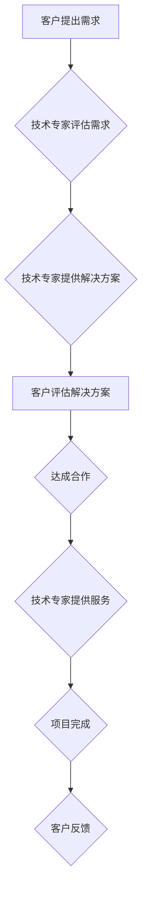

>  知识变现、人工智能、技术咨询、软件架构、技术博客、深度学习、机器学习

## 1. 背景介绍

在当今科技飞速发展的时代，知识已成为最宝贵的资源之一。如何有效地将知识变现，成为许多技术专家和学者关注的焦点。传统的知识变现方式，例如出版书籍、授课讲座等，虽然有效，但受限于时间和地域等因素。随着互联网和人工智能技术的快速发展，新的知识变现模式应运而生，其中技术咨询成为一种备受瞩目的选择。

技术咨询是指利用自身在特定技术领域积累的专业知识和经验，为企业或个人提供解决方案和建议的服务。随着科技创新日新月异，企业对技术人才的需求不断增加，技术咨询市场也呈现出蓬勃发展的态势。

## 2. 核心概念与联系

技术咨询的核心概念在于将个人知识转化为有价值的服务，并通过有效的沟通和协作，帮助客户解决实际问题。

**技术咨询的流程:**



**技术咨询的联系:**

技术咨询与其他知识变现方式存在着密切的联系。例如，技术博客可以作为技术咨询的平台，通过分享技术经验和案例，吸引潜在客户。技术书籍和课程可以为技术咨询提供理论基础和实践经验。

## 3. 核心算法原理 & 具体操作步骤

**3.1  算法原理概述**

技术咨询的核心算法原理在于信息获取、分析和转化。技术专家需要通过有效的沟通和调研，获取客户的需求和问题；然后利用自身的技术知识和经验，分析问题根源和解决方案；最后将分析结果转化为清晰易懂的建议和方案，并与客户进行沟通和协作，最终达成共识并解决问题。

**3.2  算法步骤详解**

1. **需求收集:** 技术专家通过与客户进行深入沟通，了解客户的具体需求、问题和目标。
2. **问题分析:** 技术专家根据收集到的信息，分析问题的根源、影响因素和潜在解决方案。
3. **方案设计:** 技术专家根据问题分析结果，设计出符合客户需求的解决方案，并进行详细的方案说明和演示。
4. **方案评估:** 客户对技术专家的方案进行评估，并提出反馈意见。
5. **方案调整:** 技术专家根据客户的反馈意见，对方案进行调整和优化，最终达成共识。
6. **方案实施:** 技术专家协助客户实施解决方案，并提供必要的技术支持和培训。
7. **项目评估:** 项目完成后，技术专家与客户进行项目评估，总结经验教训，并为后续项目提供参考。

**3.3  算法优缺点**

**优点:**

* **针对性强:** 技术咨询可以根据客户的具体需求和问题，提供定制化的解决方案。
* **效率高:** 技术专家可以利用自身的技术知识和经验，快速分析问题并提供解决方案。
* **效果显著:** 技术咨询可以帮助客户解决实际问题，提高效率和效益。

**缺点:**

* **成本较高:** 技术咨询的费用相对较高，需要客户有一定的预算。
* **依赖性强:** 技术咨询的成功与否，取决于技术专家的专业水平和沟通能力。
* **知识沉淀:** 技术咨询的知识沉淀相对较少，难以形成可持续的知识体系。

**3.4  算法应用领域**

技术咨询广泛应用于各个行业，例如：

* **软件开发:** 提供软件架构设计、代码开发、测试和维护等服务。
* **数据分析:** 提供数据挖掘、机器学习、数据可视化等服务。
* **云计算:** 提供云平台搭建、应用迁移、安全管理等服务。
* **人工智能:** 提供人工智能算法开发、模型训练、应用部署等服务。

## 4. 数学模型和公式 & 详细讲解 & 举例说明

**4.1  数学模型构建**

技术咨询的价值可以抽象为一个数学模型，其中涉及到以下几个关键因素：

* **客户需求价值 (C):** 客户的需求对他们来说有多重要，解决这些需求能为他们带来多少价值。
* **技术专家知识价值 (E):** 技术专家在特定领域拥有的知识和经验水平，以及他们能够解决客户问题的能力。
* **沟通效率 (K):** 技术专家与客户之间沟通的效率，以及他们能够理解和满足对方需求的能力。

**4.2  公式推导过程**

我们可以用以下公式来表示技术咨询的价值：

```latex
V = C * E * K
```

其中：

* **V:** 技术咨询的价值
* **C:** 客户需求价值
* **E:** 技术专家知识价值
* **K:** 沟通效率

**4.3  案例分析与讲解**

假设一家公司需要开发一个新的电商平台，他们面临着以下几个问题：

* **平台架构设计:** 如何设计一个高效、可扩展的电商平台架构。
* **用户体验优化:** 如何提升用户体验，提高用户粘性。
* **数据分析:** 如何利用数据分析，优化运营策略。

这家公司找到了一个经验丰富的技术专家，他拥有丰富的电商平台开发经验，并且能够快速理解客户的需求。

在这个案例中，客户的需求价值 (C) 较高，因为电商平台对他们的业务发展至关重要。技术专家的知识价值 (E) 也较高，因为他拥有丰富的经验和技术能力。沟通效率 (K) 也很高，因为技术专家能够与客户有效沟通，理解他们的需求。

因此，在这个案例中，技术咨询的价值 (V) 较高。

## 5. 项目实践：代码实例和详细解释说明

**5.1  开发环境搭建**

技术咨询项目通常需要搭建一个开发环境，以便技术专家能够与客户协作，开发和测试解决方案。开发环境的搭建需要根据项目的具体需求，选择合适的工具和技术。

**5.2  源代码详细实现**

技术咨询项目中，技术专家通常会编写一些源代码，以实现解决方案。源代码的实现需要根据项目的具体需求，选择合适的编程语言和框架。

**5.3  代码解读与分析**

技术专家需要对源代码进行详细的解读和分析，以便客户能够理解解决方案的原理和工作机制。

**5.4  运行结果展示**

技术专家需要将解决方案运行起来，并展示运行结果给客户，以便客户能够验证解决方案的有效性。

## 6. 实际应用场景

技术咨询在各个行业都有着广泛的应用场景，例如：

**6.1  软件开发公司:**

* 为客户提供软件架构设计、代码开发、测试和维护等服务。
* 帮助客户解决软件开发中的技术难题。
* 提供软件开发的最佳实践和经验分享。

**6.2  互联网公司:**

* 为客户提供云计算、大数据、人工智能等技术服务。
* 帮助客户优化网站性能、提升用户体验。
* 提供互联网技术趋势和发展方向的分析。

**6.3  金融机构:**

* 为客户提供金融科技解决方案，例如风险管理、欺诈检测、个性化金融服务等。
* 帮助客户提高运营效率、降低成本。
* 提供金融科技领域的最新技术和趋势分析。

**6.4  未来应用展望:**

随着人工智能、大数据等技术的不断发展，技术咨询的应用场景将会更加广泛，例如：

* **个性化咨询:** 利用人工智能技术，为每个客户提供个性化的技术咨询服务。
* **远程咨询:** 利用远程视频会议技术，为客户提供远程技术咨询服务。
* **自动化咨询:** 利用机器学习技术，自动生成技术咨询报告和解决方案。

## 7. 工具和资源推荐

**7.1  学习资源推荐:**

* **在线课程:** Coursera、edX、Udemy等平台提供丰富的技术课程。
* **技术博客:** Hacker News、Medium、GitHub等平台上有许多技术博客分享技术经验和案例。
* **技术书籍:** 许多优秀的技术书籍可以帮助你深入了解特定技术领域。

**7.2  开发工具推荐:**

* **代码编辑器:** VS Code、Sublime Text、Atom等代码编辑器可以提高你的开发效率。
* **版本控制系统:** Git是常用的版本控制系统，可以帮助你管理代码版本和协作开发。
* **调试工具:** 调试器可以帮助你查找和解决代码中的错误。

**7.3  相关论文推荐:**

* **人工智能领域:** arXiv、ACL Anthology等平台上有许多人工智能领域的最新论文。
* **软件工程领域:** IEEE Xplore、ACM Digital Library等平台上有许多软件工程领域的最新论文。

## 8. 总结：未来发展趋势与挑战

**8.1  研究成果总结**

技术咨询作为一种新的知识变现模式，具有广阔的发展前景。随着人工智能、大数据等技术的不断发展，技术咨询的应用场景将会更加广泛，服务内容也将更加丰富。

**8.2  未来发展趋势**

* **个性化咨询:** 利用人工智能技术，为每个客户提供个性化的技术咨询服务。
* **远程咨询:** 利用远程视频会议技术，为客户提供远程技术咨询服务。
* **自动化咨询:** 利用机器学习技术，自动生成技术咨询报告和解决方案。

**8.3  面临的挑战**

* **知识沉淀:** 技术咨询的知识沉淀相对较少，难以形成可持续的知识体系。
* **人才培养:** 技术咨询需要具备专业技术能力和沟通能力的复合型人才，人才培养是一个重要的挑战。
* **市场竞争:** 技术咨询市场竞争激烈，需要不断提升服务质量和竞争力。

**8.4  研究展望**

未来，我们需要进一步研究技术咨询的知识体系构建、人才培养模式和市场竞争机制，推动技术咨询行业健康发展。

## 9. 附录：常见问题与解答

**9.1  技术咨询的收费标准如何确定？**

技术咨询的收费标准通常根据以下因素确定：

* **项目复杂度:** 项目的复杂程度越高，收费标准越高。
* **技术难度:** 技术难度越高，收费标准越高。
* **服务内容:** 服务内容越丰富，收费标准越高。
* **市场行情:** 市场行情也会影响收费标准。

**9.2  如何选择合适的技术咨询专家？**

选择合适的技术咨询专家需要考虑以下因素：

* **专业领域:** 专家是否在你的项目领域拥有丰富的经验。
* **技术能力:** 专家是否具备解决你问题的技术能力。
* **沟通能力:** 专家是否能够与你有效沟通，理解你的需求。
* **口碑评价:** 专家是否有良好的口碑评价。

**9.3  技术咨询的项目流程如何进行？**

技术咨询的项目流程通常包括以下几个阶段：

* **需求收集:** 技术专家与客户沟通，了解客户的需求和问题。
* **方案设计:** 技术专家根据需求分析，设计出解决方案。
* **方案评估:** 客户对方案进行评估，并提出反馈意见。
* **方案调整:** 技术专家根据客户反馈，对方案进行调整和优化。
* **方案实施:** 技术专家协助客户实施解决方案。
* **项目评估:** 项目完成后，技术专家与客户进行项目评估。


作者：禅与计算机程序设计艺术 / Zen and the Art of Computer Programming 
<end_of_turn>