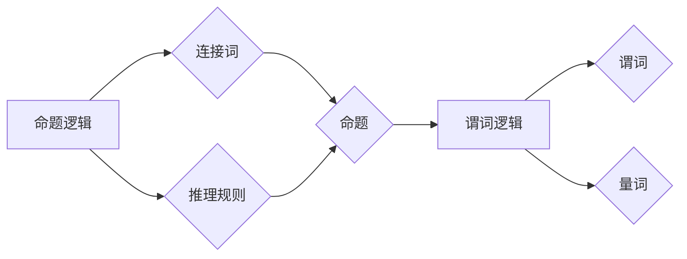

> 数理逻辑, 命题逻辑, 谓词逻辑, 推理, 证明, 算法, 数学模型, 代码实现

## 1. 背景介绍

数理逻辑作为计算机科学的基础理论之一，为我们理解和构建复杂的计算系统提供了坚实的逻辑框架。它不仅是人工智能、自动推理等领域的基石，也对软件开发、数据库设计等领域具有重要意义。

数理逻辑的核心在于用符号和规则来表达和推理知识。它提供了一种严谨的语言和方法，让我们能够清晰地描述问题、构建模型、进行推理和验证结论。

## 2. 核心概念与联系

数理逻辑主要分为两大类：命题逻辑和谓词逻辑。

**2.1 命题逻辑**

命题逻辑是数理逻辑的基础，它研究的是简单命题的组合和推理。

* **命题:** 一个可以被视为真或假的陈述。例如，“今天是星期天”是一个命题。
* **连接词:** 用于连接命题的逻辑运算符，例如“与”（∧）、“或”（∨）、“非”（¬）、“当且仅当”（↔）。
* **推理规则:** 用于从已知命题推导出新命题的规则，例如modus ponens、modus tollens等。

**2.2 谓词逻辑**

谓词逻辑是命题逻辑的扩展，它允许我们使用谓词来描述属性和关系，并对这些属性和关系进行量化。

* **谓词:** 一个可以接受一个或多个变量作为输入，并返回一个命题的函数。例如，“x是偶数”是一个谓词。
* **量词:** 用于描述变量范围的逻辑运算符，例如“存在”（∃）、“对于所有”（∀）。

**2.3 核心概念联系**

命题逻辑和谓词逻辑之间存在着密切的联系。我们可以将谓词逻辑看作是命题逻辑的推广，它允许我们用更抽象的方式表达和推理知识。



## 3. 核心算法原理 & 具体操作步骤

### 3.1 算法原理概述

数理逻辑的核心算法包括：

* **语义推导:** 根据命题的真值表，推导出新的命题的真值。
* **语法推导:** 根据逻辑规则，从已知命题推导出新的命题。
* **模型检验:** 检查一个模型是否满足给定的逻辑公式。

### 3.2 算法步骤详解

**3.2.1 语义推导**

1. 确定命题的真值表。
2. 根据连接词的真值表，计算组合命题的真值。
3. 通过重复步骤1和2，推导出新的命题的真值。

**3.2.2 语法推导**

1. 选择一个逻辑规则。
2. 找到满足规则条件的命题。
3. 根据规则，推导出新的命题。
4. 重复步骤1-3，直到推导出目标命题。

**3.2.3 模型检验**

1. 建立一个模型，该模型包含变量和关系。
2. 将逻辑公式转换为模型的语义。
3. 检查模型是否满足逻辑公式。

### 3.3 算法优缺点

**优点:**

* 严谨的逻辑推理，避免了人为错误。
* 可以处理复杂的逻辑问题。
* 广泛应用于人工智能、自动推理等领域。

**缺点:**

* 算法复杂度较高，计算量大。
* 难以处理不确定性和模糊性问题。

### 3.4 算法应用领域

* **人工智能:** 用于知识表示、推理、决策等。
* **自动推理:** 用于自动证明定理、发现新知识等。
* **软件开发:** 用于软件验证、代码分析等。
* **数据库设计:** 用于查询优化、数据完整性约束等。

## 4. 数学模型和公式 & 详细讲解 & 举例说明

### 4.1 数学模型构建

数理逻辑的数学模型通常使用集合论和关系论来描述。

* **集合:** 用于表示命题、变量、关系等概念。
* **关系:** 用于描述命题之间的逻辑关系，例如蕴涵、等价等。

### 4.2 公式推导过程

数理逻辑的公式推导过程通常遵循以下步骤:

1. **假设:** 提出一些初始命题作为假设。
2. **推理规则:** 使用逻辑规则从假设推导出新的命题。
3. **结论:** 推导出最终的结论。

### 4.3 案例分析与讲解

**例题:** 证明命题“如果今天是星期天，那么明天是星期一”。

**假设:**

* P: 今天是星期天。
* Q: 明天是星期一。

**推理规则:**

* 蕴涵规则: 如果 P 蕴涵 Q，那么 P 和 Q 都是真。

**推导过程:**

1. 假设 P 为真。
2. 根据蕴涵规则，Q 也是真。
3. 因此，如果今天是星期天，那么明天是星期一。

**公式:**

P → Q

**证明:**

P → Q ≡ ¬P ∨ Q

## 5. 项目实践：代码实例和详细解释说明

### 5.1 开发环境搭建

* 编程语言: Python
* 库: sympy

### 5.2 源代码详细实现

```python
from sympy import symbols, Eq, solve

# 定义变量
x = symbols('x')

# 定义逻辑公式
formula = Eq(x, 2)

# 求解公式
solution = solve(formula, x)

# 打印结果
print(solution)
```

### 5.3 代码解读与分析

* `symbols('x')`: 定义变量 x。
* `Eq(x, 2)`: 定义逻辑公式 x = 2。
* `solve(formula, x)`: 求解公式 x = 2 的解。
* `print(solution)`: 打印解集。

### 5.4 运行结果展示

```
[2]
```

## 6. 实际应用场景

数理逻辑在实际应用场景中具有广泛的应用前景，例如:

* **人工智能:** 用于构建智能聊天机器人、自动推理系统等。
* **自动驾驶:** 用于处理传感器数据、规划路径等。
* **医疗诊断:** 用于分析病历数据、辅助医生诊断等。

### 6.4 未来应用展望

随着人工智能技术的不断发展，数理逻辑在未来将发挥更加重要的作用。例如:

* **更复杂的逻辑推理:** 能够处理更复杂的逻辑问题，例如因果关系、时间推理等。
* **更强大的知识表示:** 能够更好地表示和处理知识，例如语义网络、知识图谱等。
* **更智能的应用:** 能够构建更智能的应用，例如自动学习、自动决策等。

## 7. 工具和资源推荐

### 7.1 学习资源推荐

* **书籍:**
    * 《数理逻辑基础》
    * 《人工智能：现代方法》
* **在线课程:**
    * Coursera: Logic and Reasoning
    * edX: Introduction to Logic

### 7.2 开发工具推荐

* **Prolog:** 一种专门用于逻辑编程的语言。
* **SymPy:** 一种Python符号计算库，可以用于数理逻辑的公式推导和验证。

### 7.3 相关论文推荐

* **The Logic of Programming Languages**
* **Automated Theorem Proving: A Survey**

## 8. 总结：未来发展趋势与挑战

### 8.1 研究成果总结

数理逻辑作为计算机科学的基础理论，取得了显著的成果。它为人工智能、自动推理等领域提供了坚实的理论基础和工具。

### 8.2 未来发展趋势

未来数理逻辑的研究将朝着以下方向发展:

* **更强大的逻辑推理能力:** 能够处理更复杂的逻辑问题，例如因果关系、时间推理等。
* **更灵活的知识表示:** 能够更好地表示和处理知识，例如语义网络、知识图谱等。
* **更智能的应用:** 能够构建更智能的应用，例如自动学习、自动决策等。

### 8.3 面临的挑战

数理逻辑的研究也面临着一些挑战:

* **复杂性:** 逻辑推理问题往往非常复杂，难以找到有效的算法。
* **不确定性和模糊性:** 现实世界中存在很多不确定性和模糊性问题，难以用传统的逻辑方法处理。
* **可解释性:** 逻辑推理过程往往难以解释，这限制了其在实际应用中的推广。

### 8.4 研究展望

尽管面临着挑战，但数理逻辑的研究前景依然广阔。随着人工智能技术的不断发展，数理逻辑将发挥更加重要的作用，为我们构建更智能、更安全的未来世界提供重要的理论基础和技术支撑。

## 9. 附录：常见问题与解答

**问题:** 数理逻辑和人工智能有什么关系？

**解答:** 数理逻辑是人工智能的基础理论之一，它为人工智能提供了逻辑推理、知识表示和决策等方面的理论基础和工具。

**问题:** 如何学习数理逻辑？

**解答:** 可以通过阅读相关书籍、参加在线课程、学习编程语言等方式学习数理逻辑。

**问题:** 数理逻辑有哪些应用场景？

**解答:** 数理逻辑在人工智能、自动驾驶、医疗诊断等领域都有广泛的应用场景。


作者：禅与计算机程序设计艺术 / Zen and the Art of Computer Programming 
<end_of_turn>