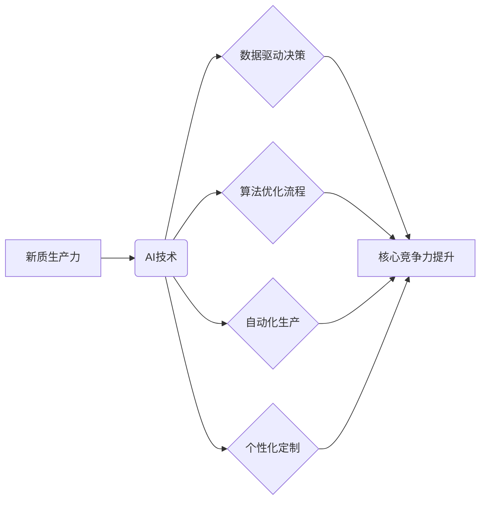

>人工智能、生产力提升、新质生产力、核心竞争力、算法优化、数据驱动、自动化、机器学习、深度学习

## 1. 背景介绍

在当今数字化时代，科技发展日新月异，人工智能（AI）技术作为科技发展的重要驱动力，正在深刻地改变着人类生产生活方式。AI技术的应用，不仅提升了生产效率，也催生了新的商业模式和产业生态。然而，单纯依靠AI技术本身并不能带来真正的生产力提升，更需要结合企业自身的资源优势和核心竞争力，才能实现可持续发展。

传统生产力提升主要依靠人力、资本和技术等要素的投入，而新质生产力则强调通过数据驱动、算法优化、自动化等手段，实现生产过程的智能化、高效化和可持续化。AI技术作为新质生产力的重要支撑，为企业提供了全新的生产力提升路径。

## 2. 核心概念与联系

**2.1 新质生产力**

新质生产力是指在信息化、数字化、智能化时代，通过数据驱动、算法优化、自动化等手段，实现生产过程的智能化、高效化和可持续化，从而提升生产效率、降低生产成本、创造新的价值。

**2.2 核心竞争力**

核心竞争力是指企业在市场竞争中能够持续保持优势的独特能力，是企业长期发展的关键驱动力。

**2.3 AI技术与核心竞争力提升**

AI技术可以帮助企业提升核心竞争力，主要体现在以下几个方面：

* **数据驱动决策:** AI技术可以帮助企业收集、分析和挖掘海量数据，为企业决策提供数据支持，提高决策的准确性和效率。
* **算法优化流程:** AI技术可以帮助企业优化生产流程、供应链管理、客户服务等环节，提高效率和降低成本。
* **自动化生产:** AI技术可以实现生产过程的自动化，减少人工干预，提高生产效率和产品质量。
* **个性化定制:** AI技术可以帮助企业提供个性化产品和服务，满足客户多样化的需求。

**2.4 AI技术与新质生产力提升**

AI技术是实现新质生产力的关键技术，它可以帮助企业实现以下目标：

* **提高生产效率:** 通过自动化、智能化等手段，提高生产效率和降低生产成本。
* **提升产品质量:** 通过数据分析和算法优化，提高产品质量和可靠性。
* **创造新的价值:** 通过数据挖掘和智能分析，发现新的市场需求和商业机会。

**2.5 核心概念关系图**



## 3. 核心算法原理 & 具体操作步骤

**3.1 算法原理概述**

深度学习算法是AI技术的重要组成部分，它能够通过多层神经网络结构，学习和提取数据中的复杂特征，从而实现对数据的理解和预测。深度学习算法的应用范围广泛，包括图像识别、自然语言处理、语音识别等领域。

**3.2 算法步骤详解**

深度学习算法的训练过程主要包括以下步骤：

1. **数据预处理:** 将原始数据进行清洗、转换和格式化，使其适合深度学习模型的训练。
2. **模型构建:** 根据具体任务需求，选择合适的深度学习模型架构，并设置模型参数。
3. **模型训练:** 使用训练数据对深度学习模型进行训练，调整模型参数，使其能够准确地预测目标变量。
4. **模型评估:** 使用测试数据对训练好的模型进行评估，评估模型的预测精度和泛化能力。
5. **模型部署:** 将训练好的模型部署到实际应用场景中，用于进行预测或决策。

**3.3 算法优缺点**

**优点:**

* **高精度:** 深度学习算法能够学习数据中的复杂特征，从而实现高精度的预测和识别。
* **自动化学习:** 深度学习算法能够自动学习数据特征，无需人工特征工程。
* **泛化能力强:** 深度学习算法能够对新的数据进行泛化，具有较强的推广能力。

**缺点:**

* **数据依赖:** 深度学习算法对数据量和数据质量有很高的要求。
* **计算资源消耗大:** 深度学习模型训练需要大量的计算资源。
* **可解释性差:** 深度学习模型的决策过程较为复杂，难以解释模型的决策结果。

**3.4 算法应用领域**

深度学习算法广泛应用于以下领域：

* **图像识别:** 人脸识别、物体检测、图像分类等。
* **自然语言处理:** 文本分类、情感分析、机器翻译等。
* **语音识别:** 语音转文本、语音助手等。
* **推荐系统:** 商品推荐、内容推荐等。
* **医疗诊断:** 疾病诊断、影像分析等。

## 4. 数学模型和公式 & 详细讲解 & 举例说明

**4.1 数学模型构建**

深度学习模型通常采用多层神经网络结构，每个神经元接收多个输入信号，并通过激活函数进行处理，输出一个信号。神经网络的训练过程就是通过调整神经元权重和偏置，使得网络输出与真实值之间的误差最小化。

**4.2 公式推导过程**

深度学习模型的训练过程通常使用反向传播算法，该算法通过计算误差梯度，反向传播到各层神经元，并更新神经元权重和偏置。

**损失函数:** 用于衡量模型预测结果与真实值的差异，常见的损失函数包括均方误差（MSE）、交叉熵损失（Cross-Entropy Loss）等。

**梯度下降:** 用于更新神经元权重和偏置，使其朝着降低损失函数的方向更新。

**激活函数:** 用于引入非线性，使得神经网络能够学习复杂的数据特征。常见的激活函数包括ReLU、Sigmoid、Tanh等。

**4.3 案例分析与讲解**

以图像分类为例，假设我们有一个包含猫和狗的图像数据集，目标是训练一个深度学习模型，能够识别图像中是猫还是狗。

1. **数据预处理:** 将图像数据进行裁剪、缩放、归一化等处理，使其适合模型训练。
2. **模型构建:** 选择合适的深度学习模型架构，例如卷积神经网络（CNN），并设置模型参数。
3. **模型训练:** 使用训练数据对模型进行训练，并使用损失函数和梯度下降算法更新模型参数。
4. **模型评估:** 使用测试数据对训练好的模型进行评估，评估模型的分类精度。
5. **模型部署:** 将训练好的模型部署到实际应用场景中，用于识别新的图像。

## 5. 项目实践：代码实例和详细解释说明

**5.1 开发环境搭建**

* 操作系统：Ubuntu 20.04
* Python 版本：3.8
* 深度学习框架：TensorFlow 2.0

**5.2 源代码详细实现**

```python
import tensorflow as tf

# 定义模型架构
model = tf.keras.models.Sequential([
    tf.keras.layers.Conv2D(32, (3, 3), activation='relu', input_shape=(28, 28, 1)),
    tf.keras.layers.MaxPooling2D((2, 2)),
    tf.keras.layers.Conv2D(64, (3, 3), activation='relu'),
    tf.keras.layers.MaxPooling2D((2, 2)),
    tf.keras.layers.Flatten(),
    tf.keras.layers.Dense(10, activation='softmax')
])

# 编译模型
model.compile(optimizer='adam',
              loss='sparse_categorical_crossentropy',
              metrics=['accuracy'])

# 加载数据集
(x_train, y_train), (x_test, y_test) = tf.keras.datasets.mnist.load_data()

# 数据预处理
x_train = x_train.astype('float32') / 255.0
x_test = x_test.astype('float32') / 255.0
x_train = x_train.reshape((x_train.shape[0], 28, 28, 1))
x_test = x_test.reshape((x_test.shape[0], 28, 28, 1))

# 模型训练
model.fit(x_train, y_train, epochs=5)

# 模型评估
loss, accuracy = model.evaluate(x_test, y_test)
print('Test loss:', loss)
print('Test accuracy:', accuracy)
```

**5.3 代码解读与分析**

这段代码实现了使用TensorFlow框架训练一个简单的图像分类模型。

* 首先定义了模型架构，包括卷积层、池化层和全连接层。
* 然后编译模型，指定优化器、损失函数和评价指标。
* 加载MNIST数据集，并对数据进行预处理。
* 最后训练模型，并评估模型的性能。

**5.4 运行结果展示**

训练完成后，模型能够达到较高的分类精度，例如在MNIST数据集上，模型的准确率可以达到98%以上。

## 6. 实际应用场景

**6.1 自动化生产**

AI技术可以实现生产过程的自动化，例如机器人手臂、自动导引车等，提高生产效率和降低生产成本。

**6.2 智能客服**

AI技术可以构建智能客服系统，例如聊天机器人，为客户提供24小时在线服务，提高客户满意度。

**6.3 个性化推荐**

AI技术可以分析用户的行为数据，提供个性化的产品和服务推荐，例如电商平台的商品推荐、视频平台的影视推荐等。

**6.4 医疗诊断**

AI技术可以辅助医生进行疾病诊断，例如图像分析、病理检测等，提高诊断准确率和效率。

**6.5 金融风险控制**

AI技术可以分析金融数据，识别潜在的风险，例如欺诈交易、信用风险等，降低金融机构的风险损失。

**6.4 未来应用展望**

随着AI技术的不断发展，其应用场景将更加广泛，例如：

* **自动驾驶:** AI技术将推动自动驾驶汽车的普及，改变交通出行方式。
* **个性化教育:** AI技术将提供个性化的教育方案，满足不同学生的学习需求。
* **智能城市:** AI技术将构建智能城市，提高城市管理效率和居民生活质量。

## 7. 工具和资源推荐

**7.1 学习资源推荐**

* **在线课程:** Coursera、edX、Udacity等平台提供丰富的AI课程。
* **书籍:** 《深度学习》、《机器学习》、《人工智能》等书籍。
* **开源项目:** TensorFlow、PyTorch、Keras等开源深度学习框架。

**7.2 开发工具推荐**

* **Python:** AI开发的主要编程语言。
* **Jupyter Notebook:** 用于代码编写、数据分析和可视化。
* **TensorFlow:** 深度学习框架。
* **PyTorch:** 深度学习框架。

**7.3 相关论文推荐**

* **《ImageNet Classification with Deep Convolutional Neural Networks》**
* **《Attention Is All You Need》**
* **《BERT: Pre-training of Deep Bidirectional Transformers for Language Understanding》**

## 8. 总结：未来发展趋势与挑战

**8.1 研究成果总结**

近年来，AI技术取得了长足的进步，在图像识别、自然语言处理、语音识别等领域取得了突破性进展。

**8.2 未来发展趋势**

* **模型规模化:** 模型规模将继续扩大，训练数据量和计算资源将进一步增加。
* **算法创新:** 新的AI算法将不断涌现，例如强化学习、联邦学习等。
* **跨领域融合:** AI技术将与其他领域融合，例如生物医学、金融、制造业等。

**8.3 面临的挑战**

* **数据安全和隐私保护:** AI模型训练需要大量数据，如何保证数据安全和隐私保护是一个重要挑战。