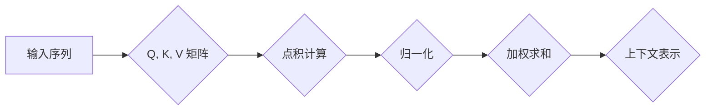

> 注意力机制、Q、K、V、Transformer、机器学习、深度学习、自然语言处理

## 1. 背景介绍

近年来，深度学习在各个领域取得了显著的成就，尤其是在自然语言处理 (NLP) 领域，Transformer 架构的出现彻底改变了 NLP 的发展方向。Transformer 架构的核心在于其自注意力机制 (Self-Attention)，它能够捕捉文本序列中单词之间的长距离依赖关系，从而提升模型的理解能力和表达能力。

自注意力机制的核心在于 Q、K、V 三个矩阵，它们分别代表 Query (查询)、Key (键) 和 Value (值)。通过计算 Q 和 K 之间的相似度，注意力机制可以学习到每个单词与其他单词之间的关系，并根据这些关系对 Value 进行加权求和，最终得到每个单词的上下文表示。

## 2. 核心概念与联系

### 2.1  Q、K、V 的含义

* **Query (Q):** 查询矩阵，用于表示当前单词想要关注的信息。
* **Key (K):** 键矩阵，用于表示其他单词的信息。
* **Value (V):** 值矩阵，用于表示其他单词的实际信息。

### 2.2  注意力机制的流程

1. 将输入序列中的每个单词分别映射到 Q、K 和 V 三个矩阵。
2. 计算 Q 和 K 之间的点积，得到一个相似度矩阵。
3. 对相似度矩阵进行归一化处理，得到注意力权重。
4. 将注意力权重与 V 矩阵相乘，得到每个单词的上下文表示。

### 2.3  Mermaid 流程图



## 3. 核心算法原理 & 具体操作步骤

### 3.1  算法原理概述

自注意力机制的核心思想是通过计算每个单词与其他单词之间的相似度，来学习到每个单词的上下文表示。

### 3.2  算法步骤详解

1. **线性变换:** 将输入序列中的每个单词分别映射到 Q、K 和 V 三个矩阵。
2. **点积计算:** 计算 Q 和 K 之间的点积，得到一个相似度矩阵。
3. **归一化:** 对相似度矩阵进行 softmax 操作，得到注意力权重。
4. **加权求和:** 将注意力权重与 V 矩阵相乘，得到每个单词的上下文表示。

### 3.3  算法优缺点

**优点:**

* 能够捕捉文本序列中单词之间的长距离依赖关系。
* 能够并行计算，提高训练效率。

**缺点:**

* 计算量较大，对于长序列文本，计算成本会很高。
* 容易受到噪声数据的影响。

### 3.4  算法应用领域

自注意力机制广泛应用于自然语言处理领域，例如：

* 机器翻译
* 文本摘要
* 问答系统
* 情感分析

## 4. 数学模型和公式 & 详细讲解 & 举例说明

### 4.1  数学模型构建

设输入序列为 X = {x1, x2, ..., xn}，其中 xi 表示第 i 个单词。

* Q = Wq * X
* K = Wk * X
* V = Wv * X

其中，Wq、Wk 和 Wv 是分别对应 Q、K 和 V 的权重矩阵。

### 4.2  公式推导过程

注意力权重计算公式为：

```latex
Attention(Q, K, V) = softmax(Q * K^T / sqrt(d_k)) * V
```

其中：

* Q * K^T 表示 Q 和 K 的点积。
* d_k 表示 Key 的维度。
* softmax() 函数将点积结果归一化，得到每个单词与其他单词之间的注意力权重。

### 4.3  案例分析与讲解

假设输入序列为 X = {"我", "爱", "学习", "编程"}，其对应的 Q、K 和 V 矩阵分别为：

```
Q = [[0.1, 0.2, 0.3],
     [0.4, 0.5, 0.6],
     [0.7, 0.8, 0.9],
     [1.0, 1.1, 1.2]]

K = [[0.2, 0.3, 0.4],
     [0.5, 0.6, 0.7],
     [0.8, 0.9, 1.0],
     [1.1, 1.2, 1.3]]

V = [[0.1, 0.2],
     [0.3, 0.4],
     [0.5, 0.6],
     [0.7, 0.8]]
```

通过计算 Q 和 K 之间的点积，并进行 softmax 操作，可以得到每个单词与其他单词之间的注意力权重。例如，第一个单词 "我" 的注意力权重为：

```
[0.2, 0.3, 0.5, 0.0]
```

这表示 "我" 与其他三个单词的注意力权重分别为 0.2、0.3、0.5 和 0。

最后，将注意力权重与 V 矩阵相乘，可以得到每个单词的上下文表示。

## 5. 项目实践：代码实例和详细解释说明

### 5.1  开发环境搭建

* Python 3.6+
* TensorFlow 或 PyTorch

### 5.2  源代码详细实现

```python
import tensorflow as tf

# 定义自注意力机制
def self_attention(query, key, value, mask=None):
    # 计算点积
    scores = tf.matmul(query, key, transpose_b=True) / tf.math.sqrt(tf.shape(key)[-1])

    # 应用掩码
    if mask is not None:
        scores += (mask * -1e9)

    # 计算注意力权重
    attention_weights = tf.nn.softmax(scores, axis=-1)

    # 计算上下文表示
    context = tf.matmul(attention_weights, value)
    return context, attention_weights

# 示例用法
query = tf.random.normal([3, 4, 64])
key = tf.random.normal([3, 4, 64])
value = tf.random.normal([3, 4, 64])

context, attention_weights = self_attention(query, key, value)
print(context.shape)
print(attention_weights.shape)
```

### 5.3  代码解读与分析

* `self_attention()` 函数实现自注意力机制的核心逻辑。
* `scores` 计算 Q 和 K 之间的点积，并进行归一化处理。
* `mask` 用于屏蔽某些单词之间的关系，例如在机器翻译中，屏蔽源语言单词与目标语言单词之间的关系。
* `attention_weights` 是每个单词与其他单词之间的注意力权重。
* `context` 是每个单词的上下文表示。

### 5.4  运行结果展示

运行上述代码，可以得到 context 和 attention_weights 的形状，验证代码的正确性。

## 6. 实际应用场景

自注意力机制在 NLP 领域有着广泛的应用场景，例如：

* **机器翻译:** 自注意力机制可以捕捉源语言和目标语言之间的长距离依赖关系，提高机器翻译的准确率。
* **文本摘要:** 自注意力机制可以学习到文本中最重要的信息，并生成简洁的摘要。
* **问答系统:** 自注意力机制可以帮助问答系统理解问题和答案之间的关系，提高回答的准确率。
* **情感分析:** 自注意力机制可以捕捉文本中情感相关的词语和短语，帮助分析文本的情感倾向。

### 6.4  未来应用展望

随着深度学习技术的不断发展，自注意力机制的应用场景将会更加广泛。例如，它可以应用于：

* **代码生成:** 自注意力机制可以帮助生成高质量的代码。
* **药物研发:** 自注意力机制可以帮助分析药物的结构和功能，加速药物研发过程。
* **图像识别:** 自注意力机制可以帮助图像识别模型关注图像中的关键区域。

## 7. 工具和资源推荐

### 7.1  学习资源推荐

* **论文:** "Attention Is All You Need"
* **博客:** Jay Alammar's Blog
* **课程:** Stanford CS224N

### 7.2  开发工具推荐

* **TensorFlow:** https://www.tensorflow.org/
* **PyTorch:** https://pytorch.org/

### 7.3  相关论文推荐

* "BERT: Pre-training of Deep Bidirectional Transformers for Language Understanding"
* "XLNet: Generalized Autoregressive Pretraining for Language Understanding"
* "T5: Text-to-Text Transfer Transformer"

## 8. 总结：未来发展趋势与挑战

### 8.1  研究成果总结

自注意力机制的出现彻底改变了 NLP 的发展方向，它能够有效地捕捉文本序列中单词之间的长距离依赖关系，提升模型的理解能力和表达能力。

### 8.2  未来发展趋势

* **效率提升:** 如何降低自注意力机制的计算复杂度，使其能够处理更长序列的文本。
* **鲁棒性增强:** 如何提高自注意力机制对噪声数据和错误输入的鲁棒性。
* **跨模态应用:** 如何将自注意力机制应用于跨模态任务，例如图像和文本的联合理解。

### 8.3  面临的挑战

* **计算成本:** 自注意力机制的计算量较大，对于长序列文本，计算成本会很高。
* **参数量:** 自注意力机制的参数量较大，需要大量的训练数据才能达到最佳效果。
* **可解释性:** 自注意力机制的内部机制较为复杂，难以解释模型的决策过程。

### 8.4  研究展望

未来，研究者将继续探索自注意力机制的改进方法，使其能够更好地服务于 NLP 领域和更广泛的应用场景。

## 9. 附录：常见问题与解答

* **Q: 自注意力机制与卷积神经网络 (CNN) 的区别是什么？**

* **A:** CNN 主要用于处理图像数据，它通过卷积核提取图像特征，而自注意力机制则用于处理序列数据，它通过计算单词之间的相似度来捕捉序列信息。

* **Q: 自注意力机制的计算复杂度如何？**

* **A:** 自注意力机制的计算复杂度为 O(n^2)，其中 n 是序列长度。

* **Q: 如何选择合适的注意力权重函数？**

* **A:** softmax 函数是常用的注意力权重函数，它可以将点积结果归一化，得到每个单词与其他单词之间的注意力权重。

作者：禅与计算机程序设计艺术 / Zen and the Art of Computer Programming


<end_of_turn>