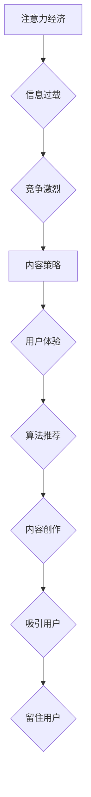

>  注意力经济、内容策略、用户体验、信息过载、深度学习、推荐算法、内容创作

## 1. 背景介绍

在当今信息爆炸的时代，人们每天接触的海量信息令人眼花缭乱。从社交媒体的动态推送到新闻网站的滚动条，从电子邮件的轰炸到广告的无处不在，信息无处不在，却难以抓住人们的注意力。这种现象被称为“注意力经济”，它指代着在信息过载的时代，人们对信息的获取和处理能力有限，而注意力成为了稀缺的资源。

在这个背景下，内容策略的重要性日益凸显。内容策略是指企业或个人在创作和传播内容时遵循的一套规划和原则，旨在吸引目标受众的注意力，并引导他们完成预期的行动。

## 2. 核心概念与联系

**2.1 注意力经济**

注意力经济的核心概念是：注意力是稀缺的资源，而信息是竞争的战场。在信息过载的时代，人们的注意力受到来自各个方向的竞争，因此，吸引和留住用户的注意力成为了企业和个人竞争的关键。

**2.2 内容策略**

内容策略是指企业或个人在创作和传播内容时遵循的一套规划和原则，旨在吸引目标受众的注意力，并引导他们完成预期的行动。

**2.3 用户体验**

用户体验是指用户与产品或服务的交互过程中的感受和体验。良好的用户体验可以帮助企业吸引和留住用户，提高用户满意度和忠诚度。

**2.4 算法推荐**

算法推荐是指利用机器学习算法，根据用户的历史行为和偏好，推荐他们可能感兴趣的内容。

**2.5 内容创作**

内容创作是指创作具有价值和吸引力的内容，例如文章、视频、音频等。

**Mermaid 流程图**



## 3. 核心算法原理 & 具体操作步骤

### 3.1 算法原理概述

内容推荐算法的核心原理是利用机器学习技术，分析用户的行为数据和内容特征，预测用户对特定内容的兴趣。常见的推荐算法包括：

* **协同过滤算法:** 基于用户的历史行为和相似用户对内容的喜好进行推荐。
* **内容基元分析算法:** 分析内容的主题、关键词、标签等特征，推荐与用户兴趣相符的内容。
* **深度学习算法:** 利用神经网络模型，学习用户和内容之间的复杂关系，进行更精准的推荐。

### 3.2 算法步骤详解

1. **数据收集:** 收集用户行为数据，例如浏览记录、点击记录、评分记录等，以及内容特征数据，例如标题、摘要、标签等。
2. **数据预处理:** 对收集到的数据进行清洗、转换和特征提取，以便于算法训练和使用。
3. **模型训练:** 选择合适的推荐算法，并利用训练数据训练模型。
4. **模型评估:** 使用测试数据评估模型的性能，例如准确率、召回率、覆盖率等。
5. **模型部署:** 将训练好的模型部署到线上环境，为用户提供个性化的内容推荐。

### 3.3 算法优缺点

**优点:**

* **个性化推荐:** 可以根据用户的兴趣和偏好，推荐更符合其需求的内容。
* **提高用户体验:** 可以帮助用户更快地找到感兴趣的内容，提高用户体验。
* **增加用户粘性:** 可以通过推荐更符合用户兴趣的内容，增加用户对平台的粘性。

**缺点:**

* **数据依赖:** 推荐算法需要大量的用户行为数据才能训练出准确的模型。
* **冷启动问题:** 当用户或内容的新颖度较高时，算法难以进行准确的推荐。
* **信息茧房效应:** 如果算法只推荐用户已经喜欢的类型的内容，可能会导致用户陷入信息茧房，缺乏多元化信息获取。

### 3.4 算法应用领域

内容推荐算法广泛应用于各个领域，例如：

* **电商平台:** 推荐商品、优惠券、促销活动等。
* **社交媒体平台:** 推荐好友、帖子、话题等。
* **视频网站:** 推荐视频、电视剧、电影等。
* **新闻网站:** 推荐新闻文章、视频、图片等。

## 4. 数学模型和公式 & 详细讲解 & 举例说明

### 4.1 数学模型构建

协同过滤算法的数学模型可以表示为用户-物品评分矩阵，其中每个元素代表用户对特定物品的评分。

**用户-物品评分矩阵:**

```
| 用户 | 物品1 | 物品2 | 物品3 |
|---|---|---|---|
| 用户1 | 5 | 3 | 4 |
| 用户2 | 4 | 5 | 2 |
| 用户3 | 3 | 4 | 5 |
```

### 4.2 公式推导过程

协同过滤算法的推荐公式可以根据用户的评分历史和相似用户的评分历史进行计算。

**相似度计算公式:**

```
相似度(用户1, 用户2) = ∑(用户1对物品i的评分 * 用户2对物品i的评分) / √(∑(用户1对物品i的评分)^2) * √(∑(用户2对物品i的评分)^2)
```

**推荐评分公式:**

```
推荐评分(用户1, 物品3) = 用户1对物品1的评分 * 相似度(用户1, 用户2) + 用户2对物品3的评分 * 相似度(用户1, 用户3)
```

### 4.3 案例分析与讲解

假设用户1对物品1和物品2的评分分别为5和3，用户2对物品1和物品3的评分分别为4和2。

根据相似度计算公式，可以计算出用户1和用户2的相似度。

然后，根据推荐评分公式，可以计算出用户1对物品3的推荐评分。

## 5. 项目实践：代码实例和详细解释说明

### 5.1 开发环境搭建

* Python 3.x
* Pandas
* Scikit-learn
* TensorFlow/PyTorch

### 5.2 源代码详细实现

```python
import pandas as pd
from sklearn.metrics.pairwise import cosine_similarity

# 加载用户-物品评分数据
ratings_data = pd.read_csv('ratings.csv')

# 计算用户之间的相似度
user_similarity = cosine_similarity(ratings_data.T)

# 获取用户1的相似用户
similar_users = user_similarity[0].argsort()[:-6:-1]

# 计算用户1对物品3的推荐评分
recommended_rating = 0
for user_id in similar_users:
    if ratings_data.loc[user_id, '物品3'] != 0:
        recommended_rating += ratings_data.loc[user_id, '物品3'] * user_similarity[0, user_id]

# 输出推荐评分
print(f'用户1对物品3的推荐评分: {recommended_rating}')
```

### 5.3 代码解读与分析

* 首先，加载用户-物品评分数据。
* 然后，使用cosine_similarity函数计算用户之间的相似度。
* 接着，获取用户1的相似用户。
* 最后，根据相似用户的评分历史，计算用户1对物品3的推荐评分。

### 5.4 运行结果展示

运行上述代码，可以得到用户1对物品3的推荐评分。

## 6. 实际应用场景

### 6.1 电商平台

电商平台可以利用内容推荐算法，推荐用户可能感兴趣的商品、优惠券、促销活动等。例如，当用户浏览了某个品牌的服装时，平台可以推荐该品牌的其它服装、配饰等。

### 6.2 社交媒体平台

社交媒体平台可以利用内容推荐算法，推荐用户可能感兴趣的帖子、话题、好友等。例如，当用户点赞了一条关于旅行的帖子时，平台可以推荐其它关于旅行的帖子、旅行攻略等。

### 6.3 视频网站

视频网站可以利用内容推荐算法，推荐用户可能感兴趣的视频、电视剧、电影等。例如，当用户观看了一部科幻电影时，平台可以推荐其它科幻电影、科幻电视剧等。

### 6.4 新闻网站

新闻网站可以利用内容推荐算法，推荐用户可能感兴趣的新闻文章、视频、图片等。例如，当用户阅读了一篇关于科技新闻时，平台可以推荐其它关于科技新闻、科技产品等。

### 6.5 未来应用展望

随着人工智能技术的不断发展，内容推荐算法将会更加智能化、个性化。未来，内容推荐算法可能会应用于更多领域，例如教育、医疗、金融等。

## 7. 工具和资源推荐

### 7.1 学习资源推荐

* **书籍:**
    * 《推荐系统实践》
    * 《机器学习》
* **在线课程:**
    * Coursera: Recommender Systems
    * Udacity: Machine Learning Engineer Nanodegree

### 7.2 开发工具推荐

* **Python:** 
    * Pandas
    * Scikit-learn
    * TensorFlow/PyTorch
* **Spark:** 
    * Apache Spark MLlib

### 7.3 相关论文推荐

* **Collaborative Filtering for Implicit Feedback Datasets**
* **Matrix Factorization Techniques for Recommender Systems**

## 8. 总结：未来发展趋势与挑战

### 8.1 研究成果总结

近年来，内容推荐算法取得了显著的进展，能够为用户提供更加个性化、精准的推荐。

### 8.2 未来发展趋势

* **更智能化的推荐:** 利用深度学习等先进算法，实现更智能化的推荐，例如理解用户的隐性需求、预测用户的未来行为等。
* **更个性化的推荐:** 基于用户的多方面特征，例如年龄、性别、兴趣爱好等，提供更加个性化的推荐。
* **更透明的推荐:** 解释推荐结果背后的逻辑，提高用户的信任度和理解。

### 8.3 面临的挑战

* **数据隐私:** 内容推荐算法需要大量用户数据，如何保护用户隐私是一个重要的挑战。
* **信息茧房效应:** 如果算法只推荐用户已经喜欢的类型的内容，可能会导致用户陷入信息茧房，缺乏多元化信息获取。
* **算法公平性:** 确保推荐算法公平公正，避免歧视或偏见。

### 8.4 研究展望

未来，内容推荐算法的研究将更加注重用户体验、数据隐私和算法公平性。


## 9. 附录：常见问题与解答

**Q1: 如何解决冷启动问题？**

**A1:** 可以利用用户提供的基本信息，例如兴趣爱好、职业等，进行初始化推荐。也可以利用内容本身的特征进行推荐。

**Q2: 如何避免信息茧房效应？**

**A2:** 可以通过推荐多样化的内容，例如跨领域、跨平台的内容。也可以通过引导用户探索新内容，例如推荐与用户兴趣相似的热门内容。

**Q3: 如何保证算法公平性？**

**A3:** 可以通过对算法进行公平性评估，例如使用公平性指标进行衡量。也可以通过设计公平性约束条件，例如限制推荐结果的偏差。


作者：禅与计算机程序设计艺术 / Zen and the Art of Computer Programming 
<end_of_turn>