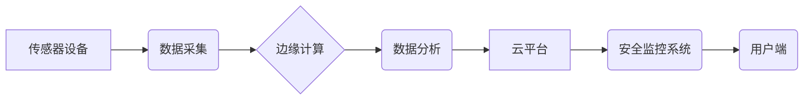

> 物联网(IoT)、传感器设备、安全监控、数据分析、机器学习、云计算、边缘计算、网络安全

## 1. 背景介绍

随着物联网(IoT)技术的快速发展，传感器设备的普及和网络连接的广泛应用，安全监控领域迎来了前所未有的机遇和挑战。物联网技术将传统安全监控系统与互联网、云计算、大数据分析等技术相结合，构建了更加智能、高效、全面的安全监控体系。

传统的安全监控系统主要依靠人工监控，存在效率低、成本高、反应慢等问题。而物联网技术则通过部署大量的传感器设备，实时采集各种安全信息，并利用云计算、大数据分析和机器学习等技术进行智能分析和处理，从而实现更加精准、高效的安全监控。

## 2. 核心概念与联系

**2.1 物联网(IoT)**

物联网是指将各种物理设备、传感器、软件和网络连接在一起，形成一个互联互通的智能网络。物联网的核心是传感器设备，它们可以收集各种物理环境信息，例如温度、湿度、光照、声音、图像等。

**2.2 传感器设备**

传感器设备是物联网的核心组成部分，它们负责收集各种物理环境信息并将其转换为数字信号。常见的传感器设备包括：

* **摄像头传感器:** 用于采集图像和视频信息。
* **麦克风传感器:** 用于采集声音信息。
* **温度传感器:** 用于采集温度信息。
* **湿度传感器:** 用于采集湿度信息。
* **运动传感器:** 用于检测物体运动。
* **门窗传感器:** 用于检测门窗的开关状态。

**2.3 安全监控**

安全监控是指通过各种技术手段，对人员、财产、设施等进行实时监控和保护，以防止犯罪、事故和灾害发生。

**2.4 架构图**



## 3. 核心算法原理 & 具体操作步骤

**3.1 算法原理概述**

物联网安全监控系统中常用的算法包括：

* **图像识别算法:** 用于识别图像中的目标，例如人脸、车辆、物体等。
* **行为分析算法:** 用于分析目标的行为模式，例如异常行为、入侵行为等。
* **异常检测算法:** 用于检测数据中的异常值，例如温度异常、流量异常等。
* **机器学习算法:** 用于训练模型，提高算法的准确性和效率。

**3.2 算法步骤详解**

以图像识别算法为例，其具体操作步骤如下：

1. **数据采集:** 通过摄像头传感器采集图像数据。
2. **数据预处理:** 对图像数据进行预处理，例如图像增强、尺寸调整等。
3. **特征提取:** 从图像数据中提取特征，例如颜色、纹理、形状等。
4. **模型训练:** 利用机器学习算法，对提取的特征进行训练，建立图像识别模型。
5. **目标识别:** 将新采集的图像数据输入到训练好的模型中，识别图像中的目标。
6. **报警处理:** 当识别到异常目标时，触发报警机制，例如发送警报短信、启动视频监控等。

**3.3 算法优缺点**

* **优点:** 准确率高、效率高、自动化程度高。
* **缺点:** 需要大量的训练数据、算法复杂度高、计算资源消耗大。

**3.4 算法应用领域**

* **人脸识别:** 用于身份验证、安全监控、人流统计等。
* **车辆识别:** 用于车辆管理、交通监控、违章停车识别等。
* **物体识别:** 用于货物管理、安防监控、环境监测等。

## 4. 数学模型和公式 & 详细讲解 & 举例说明

**4.1 数学模型构建**

在物联网安全监控系统中，可以使用数学模型来描述传感器数据采集、传输、分析和处理过程。例如，可以建立一个传感器数据采集模型，描述传感器数据采集的速率、精度和可靠性。

**4.2 公式推导过程**

假设传感器数据采集速率为R，数据精度为P，数据可靠性为Q，则传感器数据采集模型可以表示为：

```latex
D = R * P * Q
```

其中：

* D 表示传感器数据采集量。
* R 表示传感器数据采集速率。
* P 表示传感器数据精度。
* Q 表示传感器数据可靠性。

**4.3 案例分析与讲解**

假设一个安全监控系统部署了10个摄像头传感器，每个摄像头传感器的数据采集速率为10帧/秒，数据精度为95%，数据可靠性为99%。则根据上述公式，该系统每天可以采集的数据量为：

```latex
D = 10 * 10 * 60 * 60 * 24 * 0.95 * 0.99 = 831600 帧
```

## 5. 项目实践：代码实例和详细解释说明

**5.1 开发环境搭建**

* 操作系统: Ubuntu 20.04 LTS
* 编程语言: Python 3.8
* 开发工具: VS Code
* 库依赖: OpenCV, TensorFlow, Flask

**5.2 源代码详细实现**

```python
# 摄像头图像采集
import cv2

cap = cv2.VideoCapture(0)  # 使用默认摄像头

# 图像识别模型加载
model = tf.keras.models.load_model('object_detection_model.h5')

while True:
    ret, frame = cap.read()
    if not ret:
        break

    # 图像预处理
    frame = cv2.resize(frame, (300, 300))
    frame = cv2.cvtColor(frame, cv2.COLOR_BGR2RGB)

    # 图像识别
    predictions = model.predict(frame[None, ...])
    
    # 绘制识别结果
    for prediction in predictions:
        class_id = prediction[0]
        confidence = prediction[1]
        if confidence > 0.5:
            label = class_names[class_id]
            x1, y1, x2, y2 = prediction[2:]
            cv2.rectangle(frame, (int(x1), int(y1)), (int(x2), int(y2)), (0, 255, 0), 2)
            cv2.putText(frame, label, (int(x1), int(y1) - 10), cv2.FONT_HERSHEY_SIMPLEX, 0.5, (0, 255, 0), 2)

    cv2.imshow('Object Detection', frame)
    if cv2.waitKey(1) & 0xFF == ord('q'):
        break

cap.release()
cv2.destroyAllWindows()
```

**5.3 代码解读与分析**

* 代码首先使用 OpenCV 库打开摄像头，并读取摄像头图像数据。
* 然后，使用 TensorFlow 库加载预训练的图像识别模型。
* 代码循环读取摄像头图像数据，并对图像进行预处理，例如尺寸调整和颜色转换。
* 然后，将预处理后的图像数据输入到图像识别模型中，获取识别结果。
* 最后，根据识别结果，在图像上绘制识别框和标签。

**5.4 运行结果展示**

运行代码后，将显示一个窗口，显示摄像头图像和识别结果。当识别到目标时，将在图像上绘制识别框和标签。

## 6. 实际应用场景

物联网安全监控技术在各个领域都有广泛的应用，例如：

* **智能家居:** 通过部署传感器设备，实现对家居环境的实时监控，例如温度、湿度、烟雾、气体等，并根据监控数据自动调节设备，提高家居安全和舒适度。
* **智慧城市:** 通过部署摄像头、传感器等设备，实现对城市交通、环境、公共安全等方面的实时监控，提高城市管理效率和安全性。
* **工业安全:** 通过部署传感器设备，实现对工业设备、生产过程的实时监控，例如温度、压力、振动等，及时发现异常情况，避免事故发生。
* **医疗健康:** 通过部署传感器设备，实现对患者的实时健康监测，例如心率、血压、体温等，及时发现异常情况，提供及时医疗干预。

**6.4 未来应用展望**

随着物联网技术的不断发展，物联网安全监控技术将更加智能化、自动化、精准化。未来，物联网安全监控系统将更加注重以下方面：

* **人工智能技术:** 利用人工智能技术，例如机器学习、深度学习等，提高安全监控系统的智能化水平，例如更加精准的图像识别、行为分析、异常检测等。
* **边缘计算:** 将计算能力部署到边缘设备，实现更加实时、高效的安全监控。
* **云计算:** 利用云计算平台，实现安全监控数据的存储、分析和共享，提高安全监控系统的协同性和可扩展性。
* **网络安全:** 加强网络安全防护，防止安全监控系统被攻击和入侵。

## 7. 工具和资源推荐

**7.1 学习资源推荐**

* **书籍:**
    * 物联网技术入门
    * 深度学习
    * 机器学习
* **在线课程:**
    * Coursera: 物联网课程
    * edX: 深度学习课程
    * Udacity: 机器学习课程

**7.2 开发工具推荐**

* **物联网平台:**
    * AWS IoT
    * Azure IoT
    * Google Cloud IoT
* **开发环境:**
    * Arduino IDE
    * Raspberry Pi
    * Node-RED

**7.3 相关论文推荐**

* 物联网安全监控技术综述
* 基于机器学习的物联网安全监控系统
* 边缘计算在物联网安全监控中的应用

## 8. 总结：未来发展趋势与挑战

**8.1 研究成果总结**

物联网安全监控技术取得了显著的进展，例如图像识别、行为分析、异常检测等算法取得了突破性进展，并应用于各个领域。

**8.2 未来发展趋势**

未来，物联网安全监控技术将更加智能化、自动化、精准化，并更加注重人工智能技术、边缘计算、云计算和网络安全等方面的应用。

**8.3 面临的挑战**

物联网安全监控技术也面临着一些挑战，例如：

* **数据安全:** 物联网设备采集的大量数据需要进行安全保护，防止数据泄露和滥用。
* **隐私保护:** 物联网安全监控系统可能会收集到用户的个人信息，需要采取措施保护用户的隐私。
* **算法偏见:** 机器学习算法可能会存在偏见，导致安全监控系统出现不公平的决策。
* **网络安全:** 物联网设备容易受到网络攻击，需要加强网络安全防护。

**8.4 研究展望**

未来，需要进一步研究和解决上述挑战，推动物联网安全监控技术更加安全、可靠、可持续发展。

## 9. 附录：常见问题与解答

**9.1 如何选择合适的物联网安全监控系统？**

选择合适的物联网安全监控系统需要根据具体的应用场景、需求和预算进行综合考虑。

**9.2 如何保障物联网安全监控系统的安全性和可靠性？**

保障物联网安全监控系统的安全性和可靠性需要从以下几个方面入手：

* **硬件安全:** 选择安全可靠的硬件设备，并进行必要的物理安全防护。
* **软件安全:** 使用安全的软件系统，并定期更新软件版本。
* **网络安全:** 加强网络安全防护，防止网络攻击和数据泄露。
* **数据安全:** 对收集到的数据进行安全保护，防止数据泄露和滥用。

**9.3 如何解决物联网安全监控系统中的算法偏见问题？**

解决物联网安全监控系统中的算法偏见问题需要从以下几个方面入手：

* **数据多样化:** 使用更加多样化的训练数据，减少算法偏见