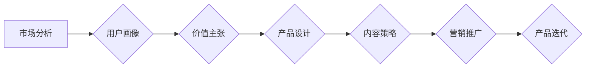

> 知识付费、产品定位、市场分析、用户画像、价值主张、内容策略、商业模式、运营策略

## 1. 背景介绍

知识付费行业近年来发展迅速，成为互联网经济的新增长点。随着人们对知识的需求不断增加，以及互联网技术的不断发展，知识付费模式也逐渐成熟，涌现出众多成功的案例。然而，知识付费市场竞争激烈，想要在激烈的市场竞争中脱颖而出，需要对产品定位进行深入思考和规划。

## 2. 核心概念与联系

**2.1 知识付费的核心概念**

知识付费是指通过付费的方式获取知识、技能或服务的商业模式。它以知识为核心，以付费为驱动，以用户需求为导向，通过线上平台提供知识产品和服务。

**2.2 产品定位的核心概念**

产品定位是指企业对目标市场和产品的清晰认识，并将其差异化优势和价值主张传达给目标用户。它是一个企业在市场竞争中生存和发展的关键策略。

**2.3 知识付费产品定位的联系**

知识付费产品定位是指在知识付费模式下，企业针对特定目标用户群体，通过产品设计、内容创作、营销推广等方式，明确产品的价值主张，并将其差异化优势传达给目标用户，从而获得市场认可和用户青睐。

**2.4 产品定位流程图**



## 3. 核心算法原理 & 具体操作步骤

**3.1 算法原理概述**

知识付费产品定位的核心算法原理是基于用户需求和市场分析，通过数据挖掘和分析，识别用户痛点和需求，并根据用户画像和价值主张，设计差异化产品和内容，最终实现用户价值最大化。

**3.2 算法步骤详解**

1. **市场分析:** 
    * 了解知识付费行业的整体发展趋势和市场规模。
    * 分析竞争对手的产品定位、内容策略和营销推广方式。
    * 识别市场空白和用户需求。
2. **用户画像:** 
    * 通过数据分析和用户调研，构建目标用户的画像，包括用户年龄、性别、职业、兴趣爱好、知识需求等。
    * 了解用户痛点、需求和期望。
3. **价值主张:** 
    * 明确产品的核心价值主张，即产品能够为用户提供哪些独特价值和解决哪些痛点。
    * 突出产品的差异化优势和竞争力。
4. **产品设计:** 
    * 根据用户画像和价值主张，设计产品功能、内容形式和交互体验。
    * 确保产品易用、易懂、易分享。
5. **内容策略:** 
    * 制定内容创作计划，确定内容主题、风格和频率。
    * 确保内容质量高、实用性强、吸引力强。
6. **营销推广:** 
    * 选择合适的营销渠道和推广方式，精准触达目标用户。
    * 利用社交媒体、搜索引擎优化、内容营销等方式进行推广。
7. **产品迭代:** 
    * 收集用户反馈，不断优化产品功能、内容和体验。
    * 保持产品新鲜感和竞争力。

**3.3 算法优缺点**

* **优点:** 
    * 基于数据分析和用户需求，能够更精准地定位产品。
    * 能够不断迭代优化，提升产品竞争力。
* **缺点:** 
    * 需要收集和分析大量数据，需要一定的技术和资源支持。
    * 用户需求和市场环境不断变化，需要持续跟踪和调整产品定位。

**3.4 算法应用领域**

* 知识付费平台
* 在线教育平台
* 内容创作平台
* 社交媒体平台

## 4. 数学模型和公式 & 详细讲解 & 举例说明

**4.1 数学模型构建**

知识付费产品定位可以构建一个数学模型，来衡量产品的价值和竞争力。

* **价值函数:**  V(p) = f(u, c, d)
    * V(p): 产品价值
    * u: 用户需求满足度
    * c: 产品成本
    * d: 产品差异化程度

* **竞争力函数:**  C(p) = g(v, m, n)
    * C(p): 产品竞争力
    * v: 产品价值
    * m: 市场竞争程度
    * n: 产品创新程度

**4.2 公式推导过程**

* 产品价值函数表明，产品的价值取决于用户需求满足度、产品成本和产品差异化程度。
* 产品竞争力函数表明，产品的竞争力取决于产品价值、市场竞争程度和产品创新程度。

**4.3 案例分析与讲解**

假设有两个知识付费产品，A和B。

* 产品A的价值函数为：V(A) = 0.8 * u + 0.1 * d - 0.1 * c
* 产品B的价值函数为：V(B) = 0.9 * u + 0.05 * d - 0.2 * c

假设用户需求满足度u为0.8，产品差异化程度d为0.2，产品成本c为0.1。

* 产品A的价值为：V(A) = 0.8 * 0.8 + 0.1 * 0.2 - 0.1 * 0.1 = 0.64 + 0.02 - 0.01 = 0.65
* 产品B的价值为：V(B) = 0.9 * 0.8 + 0.05 * 0.2 - 0.2 * 0.1 = 0.72 + 0.01 - 0.02 = 0.71

根据价值函数，产品B的价值高于产品A。

## 5. 项目实践：代码实例和详细解释说明

**5.1 开发环境搭建**

* 操作系统: Windows/macOS/Linux
* 编程语言: Python
* 开发工具: Jupyter Notebook/VS Code

**5.2 源代码详细实现**

```python
import pandas as pd

# 用户数据
user_data = pd.DataFrame({
    'age': [25, 30, 28, 35, 22],
    'gender': ['male', 'female', 'male', 'male', 'female'],
    'occupation': ['engineer', 'designer', 'student', 'manager', 'teacher'],
    'interest': ['technology', 'design', 'education', 'business', 'education']
})

# 产品信息
product_info = pd.DataFrame({
    'name': ['Python课程', 'UI设计教程', '英语学习软件'],
    'price': [100, 80, 120],
    'target_age': [25-35, 22-30, 20-40],
    'target_interest': ['technology', 'design', 'education']
})

# 用户画像分析
def user_portrait(user_data):
    # 计算用户年龄分布
    age_distribution = user_data['age'].value_counts()
    print("用户年龄分布:", age_distribution)

    # 计算用户性别分布
    gender_distribution = user_data['gender'].value_counts()
    print("用户性别分布:", gender_distribution)

    # 计算用户职业分布
    occupation_distribution = user_data['occupation'].value_counts()
    print("用户职业分布:", occupation_distribution)

    # 计算用户兴趣分布
    interest_distribution = user_data['interest'].value_counts()
    print("用户兴趣分布:", interest_distribution)

# 产品定位分析
def product_positioning(product_info, user_data):
    # 匹配用户画像和产品信息
    matched_products = product_info[
        (product_info['target_age'].apply(lambda x: x.contains(user_data['age'].astype(str)))) &
        (product_info['target_interest'].isin(user_data['interest']))
    ]
    print("匹配的产品:", matched_products)

# 主程序
user_portrait(user_data)
product_positioning(product_info, user_data)
```

**5.3 代码解读与分析**

* 该代码示例使用Python语言和Pandas库，实现了用户画像分析和产品定位分析的功能。
* 用户画像分析部分，通过计算用户年龄、性别、职业和兴趣的分布情况，构建用户画像。
* 产品定位分析部分，通过匹配用户画像和产品信息，识别用户可能感兴趣的产品。

**5.4 运行结果展示**

运行代码后，会输出用户画像分析和产品定位分析的结果。

## 6. 实际应用场景

**6.1 在线教育平台**

在线教育平台可以利用知识付费产品定位策略，针对不同用户群体，提供个性化的课程和学习方案。例如，针对初学者，可以提供基础入门课程；针对进阶用户，可以提供更深入的专业课程。

**6.2 内容创作平台**

内容创作平台可以利用知识付费产品定位策略，针对不同用户兴趣，创作不同类型的优质内容。例如，针对科技爱好者，可以创作科技资讯和技术教程；针对生活爱好者，可以创作生活技巧和美食食谱。

**6.3 社交媒体平台**

社交媒体平台可以利用知识付费产品定位策略，为用户提供付费会员服务，提供更优质的内容和功能。例如，提供独家视频、直播、互动社区等。

**6.4 未来应用展望**

随着人工智能、大数据等技术的不断发展，知识付费产品定位策略将更加精准化、个性化。未来，我们可以期待看到更多基于用户画像、行为分析和机器学习的知识付费产品，为用户提供更个性化、更优质的学习和成长体验。

## 7. 工具和资源推荐

**7.1 学习资源推荐**

* **书籍:**
    * 《产品经理的思维导图》
    * 《用户体验设计》
    * 《数据分析实战》
* **在线课程:**
    * Coursera: 产品管理课程
    * Udemy: 数据分析课程
    * edX: 用户体验设计课程

**7.2 开发工具推荐**

* **数据分析工具:**
    * Python: Pandas, NumPy, Scikit-learn
    * R: Tidyverse, ggplot2
* **用户画像分析工具:**
    * Google Analytics
    * Mixpanel
* **产品设计工具:**
    * Figma
    * Sketch

**7.3 相关论文推荐**

* **用户画像分析:**
    * "User Profiling: A Survey"
    * "A Survey on User Profiling Techniques"
* **产品定位策略:**
    * "Product Positioning: A Framework for Competitive Advantage"
    * "The Importance of Product Positioning in the Digital Age"

## 8. 总结：未来发展趋势与挑战

**8.1 研究成果总结**

本文介绍了知识付费产品定位策略的核心概念、算法原理、实践案例和未来发展趋势。通过数据分析和用户画像，可以更精准地定位产品，满足用户需求，提升产品竞争力。

**8.2 未来发展趋势**

* **更精准的个性化:** 利用人工智能和机器学习技术，实现更精准的个性化产品定位，为每个用户提供定制化的学习和成长体验。
* **更丰富的交互体验:** 利用虚拟现实、增强现实等技术，打造更丰富的交互体验，提升用户参与度和学习效果。
* **更完善的生态系统:** 建立更完善的知识付费生态系统，连接知识生产者、知识消费者和平台服务商，促进知识共享和价值创造。

**8.3 面临的挑战**

* **数据隐私保护:** 知识付费产品定位需要收集和分析大量用户数据，需要加强数据隐私保护，确保用户数据安全。
* **内容质量控制:** 知识付费产品需要提供高质量的内容，需要建立有效的审核机制，确保内容真实、可靠、有价值。
* **商业模式创新:** 知识付费行业竞争激烈，需要不断探索新的商业