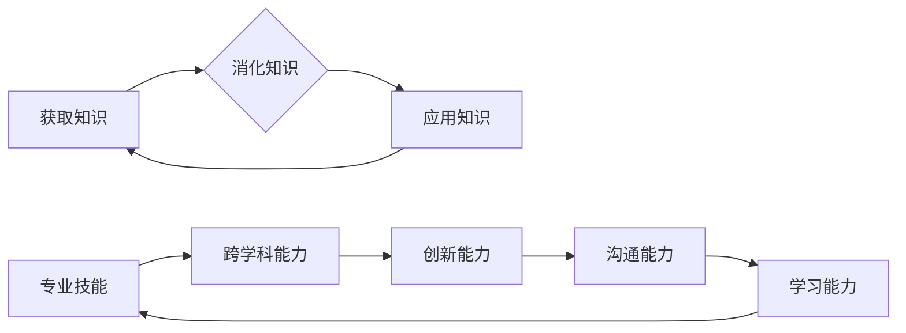

> 知识更新、个人核心竞争力、人工智能、机器学习、深度学习、数据分析、技术发展、职业发展

## 1. 背景介绍

在当今科技飞速发展的时代，知识更新的速度比以往任何时候都更快。新技术、新工具、新概念层出不穷，不断冲击着传统的认知模式和工作方式。在这种背景下，个人核心竞争力显得尤为重要。

个人核心竞争力是指一个人在特定领域或行业中能够持续保持优势、创造价值的能力。它包括知识、技能、经验、态度、价值观等多方面因素。在知识更新日新月异的时代，个人核心竞争力不再是静态的，而是需要不断学习、提升和更新才能保持竞争力。

## 2. 核心概念与联系

**2.1 知识更新**

知识更新是指个体不断获取、吸收、消化和应用新知识的过程。它是一个持续不断的循环，包括以下几个阶段：

* **获取知识:** 通过阅读、学习、交流、实践等方式获取新知识。
* **消化知识:** 将获取到的知识进行理解、吸收和整合，使其成为自己的知识体系的一部分。
* **应用知识:** 将掌握的知识应用到实际工作或生活中，并不断反思和改进。

**2.2 个人核心竞争力**

个人核心竞争力是个人在特定领域或行业中能够持续保持优势、创造价值的能力。它是一个多维度的概念，包括以下几个方面：

* **专业技能:** 掌握与所从事的行业或领域相关的专业知识和技能。
* **跨学科能力:** 能够将不同领域的知识和技能进行整合和应用。
* **创新能力:** 能够提出新的想法、解决问题和创造价值。
* **沟通能力:** 能够有效地与他人交流和合作。
* **学习能力:** 能够持续学习、提升和更新自己的知识和技能。

**2.3 知识更新与个人核心竞争力的联系**

知识更新是个人核心竞争力的基础和动力。只有不断学习和更新知识，才能保持竞争力，才能在快速变化的时代中立于不败之地。

**Mermaid 流程图**

## 3. 核心算法原理 & 具体操作步骤

**3.1 算法原理概述**

**3.2 算法步骤详解**

**3.3 算法优缺点**

**3.4 算法应用领域**

## 4. 数学模型和公式 & 详细讲解 & 举例说明

**4.1 数学模型构建**

**4.2 公式推导过程**

**4.3 案例分析与讲解**

## 5. 项目实践：代码实例和详细解释说明

**5.1 开发环境搭建**

**5.2 源代码详细实现**

**5.3 代码解读与分析**

**5.4 运行结果展示**

## 6. 实际应用场景

**6.1 应用场景介绍**

**6.2 案例分析**

**6.3 优势与局限性**

**6.4 未来应用展望**

## 7. 工具和资源推荐

**7.1 学习资源推荐**

**7.2 开发工具推荐**

**7.3 相关论文推荐**

## 8. 总结：未来发展趋势与挑战

**8.1 研究成果总结**

**8.2 未来发展趋势**

**8.3 面临的挑战**

**8.4 研究展望**

## 9. 附录：常见问题与解答

**9.1 常见问题**

**9.2 问题解答**

作者：禅与计算机程序设计艺术 / Zen and the Art of Computer Programming

<end_of_turn>