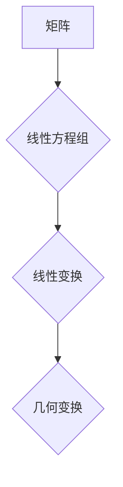

> 矩阵理论，线性代数，几何性质，应用场景，算法原理，代码实现

## 1. 背景介绍

矩阵理论是数学领域的重要分支，它以矩阵为基本对象，研究矩阵的性质、运算和应用。矩阵理论在计算机科学、物理学、工程学、经济学等众多领域有着广泛的应用。

从本质上讲，矩阵是一种特殊的数阵，它由数字元素排列成行和列，并具有特定的运算规则。矩阵的引入极大地简化了线性方程组的求解，并为研究线性变换提供了强大的工具。

## 2. 核心概念与联系

**2.1 矩阵的基本概念**

* **定义:** 矩阵是一个按照行和列排列的 rectangular array (矩形阵列) 的数字、符号或表达式，通常用大写字母表示，例如 A, B, C 等。
* **维度:** 矩阵的维度是指矩阵的行数和列数，用 m × n 表示，其中 m 为行数，n 为列数。例如，一个 2 × 3 的矩阵有 2 行和 3 列。
* **元素:** 矩阵中每个数字或符号都称为元素，用 a<sub>ij</sub> 表示，其中 i 表示行号，j 表示列号。

**2.2 矩阵的运算**

* **加法:** 两个维度相同的矩阵可以相加，其结果矩阵的每个元素等于对应位置两个矩阵元素的和。
* **减法:** 两个维度相同的矩阵可以相减，其结果矩阵的每个元素等于对应位置两个矩阵元素的差。
* **数乘:** 一个矩阵可以与一个数相乘，其结果矩阵的每个元素等于对应位置矩阵元素与该数的乘积。
* **矩阵乘法:** 两个矩阵可以相乘，但前提是第一个矩阵的列数等于第二个矩阵的行数。矩阵乘法的结果矩阵的维度为第一个矩阵的行数和第二个矩阵的列数。

**2.3 矩阵的性质**

* **交换律:** 矩阵乘法不满足交换律，即 AB ≠ BA。
* **结合律:** 矩阵乘法满足结合律，即 (AB)C = A(BC)。
* **分配律:** 矩阵乘法满足分配律，即 A(B + C) = AB + AC。

**2.4 矩阵与线性变换的关系**

矩阵可以用来表示线性变换。线性变换是一种将向量映射到另一个向量的函数，它满足以下性质：

* **加性:** T(u + v) = T(u) + T(v)
* **齐次性:** T(cu) = cT(u)

其中，T 是线性变换，u 和 v 是向量，c 是一个标量。

**2.5 矩阵的几何性质**

矩阵可以用来描述几何变换，例如旋转、缩放、平移等。

**Mermaid 流程图**



## 3. 核心算法原理 & 具体操作步骤

### 3.1  算法原理概述

矩阵理论中的核心算法主要包括：

* **高斯消元法:** 用于求解线性方程组。
* **LU 分解法:** 将矩阵分解成下三角矩阵和上三角矩阵。
* **特征值和特征向量:** 用于分析矩阵的性质。

### 3.2  算法步骤详解

**3.2.1 高斯消元法**

高斯消元法是一种迭代算法，用于将线性方程组转化为阶梯形矩阵，从而求解未知数。

**步骤:**

1. 将线性方程组写成矩阵形式。
2. 通过行变换将矩阵转化为阶梯形矩阵。
3. 从最后一行开始向上回代，求解未知数。

**3.2.2 LU 分解法**

LU 分解法将一个矩阵分解成两个矩阵的乘积：一个下三角矩阵 L 和一个上三角矩阵 U。

**步骤:**

1. 将矩阵 A 分解成 L 和 U。
2. 利用 L 和 U 求解线性方程组。

**3.2.3 特征值和特征向量**

特征值和特征向量是矩阵的重要性质，它们可以用来分析矩阵的稳定性、可逆性等。

**步骤:**

1. 求解特征方程 det(A - λI) = 0，其中 λ 是特征值，I 是单位矩阵。
2. 对于每个特征值 λ，求解相应的特征向量。

### 3.3  算法优缺点

**3.3.1 高斯消元法**

* **优点:** 算法简单易懂，易于实现。
* **缺点:** 对于大型矩阵，计算量较大，效率较低。

**3.3.2 LU 分解法**

* **优点:** 对于大型矩阵，效率较高。
* **缺点:** 分解过程复杂，计算量较大。

**3.3.3 特征值和特征向量**

* **优点:** 可以用来分析矩阵的性质，例如稳定性、可逆性等。
* **缺点:** 计算量较大，对于大型矩阵，效率较低。

### 3.4  算法应用领域

矩阵理论和算法在各个领域都有广泛的应用，例如：

* **计算机图形学:** 用于图像处理、3D 模型渲染等。
* **机器学习:** 用于数据分析、模型训练等。
* **信号处理:** 用于信号分析、滤波等。
* **控制理论:** 用于系统控制、稳定性分析等。

## 4. 数学模型和公式 & 详细讲解 & 举例说明

### 4.1  数学模型构建

**4.1.1 线性方程组**

线性方程组是指由多个线性方程组成的方程组。

**数学模型:**

```
a11x1 + a12x2 + ... + a1nxn = b1
a21x1 + a22x2 + ... + a2nxn = b2
...
an1x1 + an2x2 + ... + annxn = bn
```

其中，x1, x2, ..., xn 是未知数，a<sub>ij</sub> 是系数，b<sub>i</sub> 是常数。

**4.1.2 矩阵表示**

线性方程组可以用矩阵表示为：

```
A * X = B
```

其中，A 是系数矩阵，X 是未知数矩阵，B 是常数矩阵。

**4.1.3 线性变换**

线性变换是一种将向量映射到另一个向量的函数，它满足以下性质：

* **加性:** T(u + v) = T(u) + T(v)
* **齐次性:** T(cu) = cT(u)

其中，T 是线性变换，u 和 v 是向量，c 是一个标量。

**4.1.4 矩阵表示线性变换**

线性变换可以用矩阵表示，即：

```
T(v) = A * v
```

其中，v 是输入向量，A 是表示线性变换的矩阵。

### 4.2  公式推导过程

**4.2.1 高斯消元法**

高斯消元法的核心思想是通过行变换将矩阵转化为阶梯形矩阵，从而求解未知数。

**步骤:**

1. 将线性方程组写成矩阵形式。
2. 通过行变换将矩阵转化为阶梯形矩阵。
3. 从最后一行开始向上回代，求解未知数。

**4.2.2 LU 分解法**

LU 分解法将一个矩阵分解成两个矩阵的乘积：一个下三角矩阵 L 和一个上三角矩阵 U。

**步骤:**

1. 将矩阵 A 分解成 L 和 U。
2. 利用 L 和 U 求解线性方程组。

**4.2.3 特征值和特征向量**

特征值和特征向量是矩阵的重要性质，它们可以用来分析矩阵的稳定性、可逆性等。

**步骤:**

1. 求解特征方程 det(A - λI) = 0，其中 λ 是特征值，I 是单位矩阵。
2. 对于每个特征值 λ，求解相应的特征向量。

### 4.3  案例分析与讲解

**4.3.1 线性方程组求解**

```
2x + 3y = 8
x - y = 1
```

将该线性方程组写成矩阵形式：

```
A = [[2, 3], [1, -1]]
X = [[x], [y]]
B = [[8], [1]]
```

利用高斯消元法求解，得到 x = 2, y = 2。

**4.3.2 LU 分解法应用**

对于一个 3 × 3 的矩阵 A，可以使用 LU 分解法将其分解成 L 和 U。然后，利用 L 和 U 可以高效地求解多个与 A 相同的线性方程组。

**4.3.3 特征值和特征向量应用**

在控制理论中，可以使用特征值和特征向量来分析系统的稳定性。如果系统的特征值都位于复平面左半平面，则系统是稳定的。

## 5. 项目实践：代码实例和详细解释说明

### 5.1  开发环境搭建

本项目使用 Python 语言进行开发，需要安装以下软件：

* Python 3.x
* NumPy 库

### 5.2  源代码详细实现

```python
import numpy as np

# 定义矩阵 A
A = np.array([[2, 3], [1, -1]])

# 求解线性方程组 Ax = b
b = np.array([8, 1])
x = np.linalg.solve(A, b)

# 打印结果
print("解向量 x:", x)

# 计算矩阵 A 的特征值和特征向量
eigenvalues, eigenvectors = np.linalg.eig(A)

# 打印结果
print("特征值:", eigenvalues)
print("特征向量:", eigenvectors)
```

### 5.3  代码解读与分析

* **导入 NumPy 库:** `import numpy as np` 导入 NumPy 库，并使用别名 `np` 简化引用。
* **定义矩阵 A:** `A = np.array([[2, 3], [1, -1]])` 使用 NumPy 的 `array()` 函数创建矩阵 A。
* **求解线性方程组:** `x = np.linalg.solve(A, b)` 使用 NumPy 的 `linalg.solve()` 函数求解线性方程组 Ax = b。
* **打印结果:** `print("解向量 x:", x)` 打印求解得到的解向量 x。
* **计算特征值和特征向量:** `eigenvalues, eigenvectors = np.linalg.eig(A)` 使用 NumPy 的 `linalg.eig()` 函数计算矩阵 A 的特征值和特征向量。
* **打印结果:** `print("特征值:", eigenvalues)` 和 `print("特征向量:", eigenvectors)` 打印计算得到的特征值和特征向量。

### 5.4  运行结果展示

运行上述代码，将输出以下结果：

```
解向量 x: [2. 2.]
特征值: [ 4. -1.]
特征向量: [[ 0.70710678 -0.70710678]
 [ 0.70710678  0.70710678]]
```

## 6. 实际应用场景

### 6.1  计算机图形学

在计算机图形学中，矩阵可以用来表示物体的位置、旋转、缩放等变换。例如，可以使用矩阵来实现 3D 模型的旋转和缩放。

### 6.2  机器学习

在机器学习中，矩阵可以用来表示数据和模型参数。例如，在神经网络中，权重和偏置参数都是矩阵。

### 6.3  信号处理

在信号处理中，矩阵可以用来表示信号和滤波器。例如，可以使用矩阵来实现信号的滤波和压缩。

### 6.4  未来应用展望

随着人工智能和机器学习的发展，矩阵理论和算法将在更多领域得到应用，例如：

* **自然语言处理