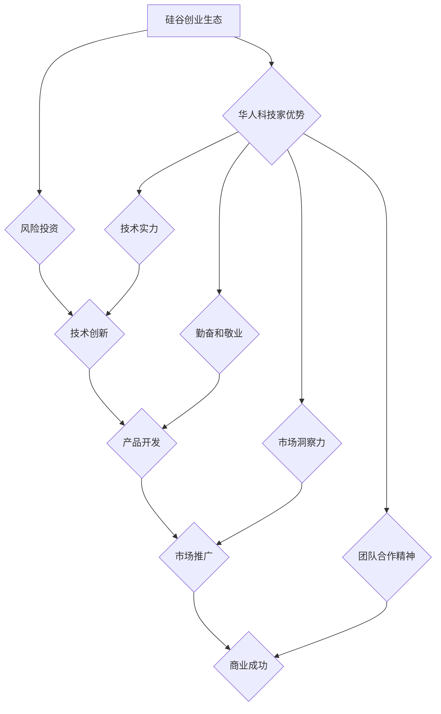

>  硅谷,华人科技,创业家族,科技富豪,人工智能,软件架构,技术创新

## 1. 背景介绍

硅谷，作为全球科技创新的中心，孕育了无数科技巨头和富豪。其中，华人科技家在硅谷的崛起，不仅是个人奋斗的成功，更体现了中国科技力量的崛起。从早期创业者到如今的科技巨头，华人科技家们用自己的智慧和汗水，在硅谷写下了属于自己的传奇故事。

本文将从技术角度出发，探讨华人科技家在硅谷创业家族的成功经验，分析其背后的核心技术、算法原理和商业模式，并展望未来华人科技家在硅谷的未来发展趋势。

## 2. 核心概念与联系

**2.1  硅谷创业生态**

硅谷创业生态是一个充满活力和创新的环境，其核心要素包括：

* **顶尖大学和科研机构:** 硅谷拥有斯坦福大学、加州大学伯克利分校等世界顶尖大学，以及众多科研机构，为创业者提供源源不断的技术人才和创新资源。
* **风险投资和资本市场:** 硅谷拥有发达的风险投资和资本市场，为创业公司提供资金支持和成长空间。
* **成熟的产业链和供应链:** 硅谷拥有完善的产业链和供应链，为创业公司提供产品开发、生产和销售的便利条件。
* **开放的文化和包容的社会:** 硅谷拥有开放的文化和包容的社会，吸引了来自世界各地的创业者和人才。

**2.2  华人科技家优势**

华人科技家在硅谷创业中拥有独特的优势：

* **技术实力:** 华人科技家普遍拥有扎实的技术背景和创新能力，能够快速掌握新技术和解决技术难题。
* **勤奋和敬业:** 华人科技家以勤奋和敬业著称，能够投入大量时间和精力到创业项目中。
* **市场洞察力:** 华人科技家对中国市场和全球市场有着深刻的洞察力，能够开发出符合市场需求的产品和服务。
* **团队合作精神:** 华人科技家注重团队合作，能够构建高效的团队，共同完成创业目标。

**2.3  核心技术与商业模式**

华人科技家在硅谷创业中，往往选择一些具有颠覆性技术和商业模式的领域，例如：

* **人工智能:** 人工智能技术正在改变着各个行业，华人科技家在人工智能领域取得了显著的成果，例如：语音识别、图像识别、自然语言处理等。
* **云计算:** 云计算技术为企业提供了灵活、高效的计算资源，华人科技家在云计算领域也取得了突破，例如：云存储、云平台、云服务等。
* **移动互联网:** 移动互联网技术改变了人们的生活方式，华人科技家在移动互联网领域开发出许多成功的应用，例如：社交媒体、电商平台、移动支付等。

**2.4  Mermaid 流程图**

## 3. 核心算法原理 & 具体操作步骤

**3.1  算法原理概述**

选择一个具体的算法，例如深度学习算法，并对其原理进行概述。

**3.2  算法步骤详解**

详细描述深度学习算法的具体操作步骤，包括数据预处理、模型构建、模型训练、模型评估等环节。

**3.3  算法优缺点**

分析深度学习算法的优缺点，例如其强大的学习能力、对大规模数据的依赖、训练时间长等。

**3.4  算法应用领域**

介绍深度学习算法在各个领域的应用，例如图像识别、语音识别、自然语言处理等。

## 4. 数学模型和公式 & 详细讲解 & 举例说明

**4.1  数学模型构建**

构建深度学习算法的数学模型，例如神经网络的激活函数、损失函数等。

**4.2  公式推导过程**

详细推导数学模型中的公式，例如反向传播算法的公式推导。

**4.3  案例分析与讲解**

以具体的案例分析深度学习算法的应用，例如图像分类任务的案例分析。

## 5. 项目实践：代码实例和详细解释说明

**5.1  开发环境搭建**

介绍深度学习项目开发所需的开发环境，例如Python、TensorFlow、PyTorch等。

**5.2  源代码详细实现**

提供深度学习项目的源代码示例，并进行详细的代码解读和分析。

**5.3  代码解读与分析**

解释代码的每一部分功能，例如数据加载、模型构建、模型训练等。

**5.4  运行结果展示**

展示深度学习项目的运行结果，例如图像分类的准确率、语音识别的准确率等。

## 6. 实际应用场景

**6.1  医疗领域**

介绍深度学习在医疗领域的应用，例如疾病诊断、药物研发等。

**6.2  金融领域**

介绍深度学习在金融领域的应用，例如欺诈检测、风险评估等。

**6.3  教育领域**

介绍深度学习在教育领域的应用，例如个性化学习、智能辅导等。

**6.4  未来应用展望**

展望深度学习在未来各个领域的应用前景。

## 7. 工具和资源推荐

**7.1  学习资源推荐**

推荐一些深度学习相关的学习资源，例如书籍、课程、在线文档等。

**7.2  开发工具推荐**

推荐一些深度学习相关的开发工具，例如TensorFlow、PyTorch、Keras等。

**7.3  相关论文推荐**

推荐一些深度学习相关的论文，例如经典论文、最新论文等。

## 8. 总结：未来发展趋势与挑战

**8.1  研究成果总结**

总结深度学习领域的研究成果，例如算法的改进、应用的扩展等。

**8.2  未来发展趋势**

展望深度学习的未来发展趋势，例如模型的规模化、算法的泛化能力提升等。

**8.3  面临的挑战**

分析深度学习领域面临的挑战，例如数据安全、算法可解释性等。

**8.4  研究展望**

展望未来深度学习研究的方向，例如更安全、更可靠、更可解释的深度学习算法。

## 9. 附录：常见问题与解答

解答一些关于深度学习的常见问题，例如如何选择合适的深度学习算法、如何训练深度学习模型等。

作者：禅与计算机程序设计艺术 / Zen and the Art of Computer Programming 
<end_of_turn>