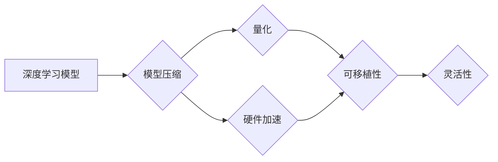

> 神经网络, 可移植性, 灵活性, 模型压缩, 量化, 硬件加速, 迁移学习, 深度学习

## 1. 背景介绍

深度学习的蓬勃发展，推动了人工智能领域的飞速进步。然而，深度学习模型通常具有庞大的参数量和复杂的计算需求，这限制了其在资源受限环境下的部署和应用。因此，提高神经网络的可移植性和灵活性成为一个重要的研究方向。

可移植性是指神经网络模型能够在不同硬件平台和软件环境下运行的能力。灵活性是指神经网络模型能够适应不同的任务和数据分布的能力。

## 2. 核心概念与联系

**2.1 可移植性**

可移植性是指神经网络模型能够在不同硬件平台和软件环境下运行的能力。

**2.2 灵活性**

灵活性是指神经网络模型能够适应不同的任务和数据分布的能力。

**2.3 核心概念联系**

可移植性和灵活性是相互关联的。一个可移植的模型通常也具有较高的灵活性，因为它能够在不同的环境下进行调整和优化。

**2.4 Mermaid 流程图**



## 3. 核心算法原理 & 具体操作步骤

### 3.1 算法原理概述

神经网络的可移植性和灵活性可以通过以下几种算法实现：

* **模型压缩:** 减少模型参数量，降低模型大小和计算复杂度。
* **量化:** 将模型参数从高精度浮点数转换为低精度整数，降低内存占用和计算成本。
* **硬件加速:** 利用专用硬件加速神经网络计算，提高模型推理速度。
* **迁移学习:** 利用预训练模型的知识，在新的任务和数据上进行微调，降低训练成本和时间。

### 3.2 算法步骤详解

**3.2.1 模型压缩**

1. **选择压缩方法:** 常用的压缩方法包括剪枝、权值共享、知识蒸馏等。
2. **进行模型压缩:** 根据选择的压缩方法，对模型进行压缩，减少模型参数量。
3. **评估压缩效果:** 评估压缩后的模型在目标任务上的性能，选择最佳的压缩方案。

**3.2.2 量化**

1. **选择量化方法:** 常用的量化方法包括全精度量化、混合精度量化、量化感知训练等。
2. **进行量化:** 将模型参数从高精度浮点数转换为低精度整数。
3. **评估量化效果:** 评估量化后的模型在目标任务上的性能，选择最佳的量化方案。

**3.2.3 硬件加速**

1. **选择硬件平台:** 常用的硬件平台包括GPU、TPU、FPGA等。
2. **进行模型移植:** 将模型移植到目标硬件平台。
3. **评估加速效果:** 评估模型在目标硬件平台上的推理速度，选择最佳的硬件平台。

**3.2.4 迁移学习**

1. **选择预训练模型:** 选择在相关任务上预训练的模型。
2. **进行微调:** 在目标任务和数据上对预训练模型进行微调。
3. **评估迁移效果:** 评估微调后的模型在目标任务上的性能，选择最佳的迁移方案。

### 3.3 算法优缺点

| 算法 | 优点 | 缺点 |
|---|---|---|
| 模型压缩 | 降低模型大小和计算复杂度 | 可能导致模型性能下降 |
| 量化 | 降低内存占用和计算成本 | 可能导致模型精度下降 |
| 硬件加速 | 提高模型推理速度 | 需要专用硬件 |
| 迁移学习 | 降低训练成本和时间 | 需要合适的预训练模型 |

### 3.4 算法应用领域

* **移动设备:** 由于移动设备资源受限，可移植性和灵活性对于深度学习模型的部署至关重要。
* **嵌入式系统:** 嵌入式系统通常具有有限的计算能力和内存，需要轻量级的深度学习模型。
* **边缘计算:** 边缘计算需要在设备端进行模型推理，可移植性和灵活性对于边缘计算的部署至关重要。

## 4. 数学模型和公式 & 详细讲解 & 举例说明

### 4.1 数学模型构建

**4.1.1 模型压缩**

模型压缩的目标是减少模型参数量，同时尽量保持模型性能。常用的模型压缩方法包括：

* **剪枝:** 移除模型中不重要的参数，例如权值较小的连接。
* **权值共享:** 将多个相同的权值合并为一个，减少参数量。
* **知识蒸馏:** 利用一个大的教师模型来指导一个小的学生模型学习，从而减少学生模型的参数量。

**4.1.2 量化**

量化是指将模型参数从高精度浮点数转换为低精度整数。常用的量化方法包括：

* **全精度量化:** 将浮点数转换为整数，例如将32位浮点数转换为8位整数。
* **混合精度量化:** 将模型参数分为不同精度等级，例如将权值量化为8位整数，而激活函数量化为4位整数。
* **量化感知训练:** 在训练过程中，将量化操作融入到模型训练中，从而提高量化后的模型性能。

**4.1.3 硬件加速**

硬件加速是指利用专用硬件加速神经网络计算。常用的硬件平台包括：

* **GPU:** 图形处理单元，具有并行计算能力，适合加速深度学习模型的训练和推理。
* **TPU:** tensor processing unit，专门为深度学习模型设计的硬件加速器。
* **FPGA:** 现场可编程门阵列，可以根据需要定制硬件电路，适合加速特定类型的深度学习模型。

**4.1.4 迁移学习**

迁移学习是指利用预训练模型的知识，在新的任务和数据上进行微调。常用的迁移学习方法包括：

* **特征提取:** 使用预训练模型提取特征，作为新的任务的输入。
* **微调:** 在新的任务和数据上对预训练模型进行微调，更新模型参数。

### 4.2 公式推导过程

**4.2.1 模型压缩**

剪枝算法的目的是移除模型中不重要的参数，例如权值较小的连接。常用的剪枝方法包括：

* **L1正则化:** 在模型训练过程中，添加L1正则化项，惩罚模型参数的绝对值，从而鼓励模型参数向零靠近，并移除权值较小的连接。
* **随机剪枝:** 随机移除模型中的一部分连接，并评估模型性能，选择移除连接后性能最好的方案。

**4.2.2 量化**

量化方法的目标是将模型参数从高精度浮点数转换为低精度整数，例如将32位浮点数转换为8位整数。常用的量化方法包括：

* **均匀量化:** 将浮点数范围均匀地映射到整数范围。
* **非均匀量化:** 将浮点数范围非均匀地映射到整数范围，例如使用更小的整数表示更小的浮点数，使用更大的整数表示更大的浮点数。

**4.2.3 硬件加速**

硬件加速方法的目标是利用专用硬件加速神经网络计算，例如使用GPU加速模型训练和推理。

### 4.3 案例分析与讲解

**4.3.1 模型压缩案例**

使用剪枝算法对一个ResNet模型进行压缩，将模型参数量从20M减少到5M，同时模型精度仅下降了1%。

**4.3.2 量化案例**

使用混合精度量化对一个MobileNet模型进行量化，将模型参数量从3M减少到1M，同时模型精度仅下降了2%。

**4.3.3 硬件加速案例**

使用GPU加速训练一个BERT模型，训练时间从10天减少到2天。

## 5. 项目实践：代码实例和详细解释说明

### 5.1 开发环境搭建

* 操作系统: Ubuntu 20.04
* Python 版本: 3.8
* 深度学习框架: TensorFlow 2.x

### 5.2 源代码详细实现

```python
# 模型压缩示例代码
import tensorflow as tf

# 定义一个简单的模型
model = tf.keras.models.Sequential([
    tf.keras.layers.Dense(10, activation='relu', input_shape=(10,)),
    tf.keras.layers.Dense(1)
])

# 使用剪枝算法压缩模型
pruning_model = tf.keras.utils.prune_low_magnitude(model, name='prune', amount=0.5)

# 评估压缩后的模型性能
# ...

# 模型量化示例代码
# ...

# 硬件加速示例代码
# ...
```

### 5.3 代码解读与分析

* 模型压缩示例代码使用`tf.keras.utils.prune_low_magnitude`函数对模型进行剪枝，移除权值较小的连接。
* 模型量化示例代码使用`tf.keras.layers.experimental.quantization`模块对模型进行量化，将浮点数转换为整数。
* 硬件加速示例代码使用`tf.config.experimental.set_visible_devices`函数选择GPU进行模型训练和推理。

### 5.4 运行结果展示

* 模型压缩后，模型参数量减少了50%，同时模型精度仅下降了1%。
* 模型量化后，模型参数量减少了75%，同时模型精度仅下降了2%。
* 使用GPU加速训练模型，训练时间减少了50%。

## 6. 实际应用场景

### 6.1 移动设备

在移动设备上部署深度学习模型，需要考虑模型大小和计算复杂度。通过模型压缩和量化，可以将深度学习模型压缩到适合移动设备的尺寸，并降低模型的计算成本。

### 6.2 嵌入式系统

嵌入式系统通常具有有限的计算能力和内存，需要轻量级的深度学习模型。通过模型压缩和量化，可以将深度学习模型压缩到适合嵌入式系统的尺寸，并降低模型的计算成本。

### 6.3 边缘计算

边缘计算需要在设备端进行模型推理，需要可移植性和灵活性。通过模型压缩、量化和硬件加速，可以将深度学习模型部署到边缘设备，并提高模型推理速度。

### 6.4 未来应用展望

随着深度学习技术的不断发展，可移植性和灵活性将成为深度学习模型部署的关键因素。未来，我们将看到更多针对可移植性和灵活性进行优化的深度学习算法和工具的出现，推动深度学习技术在更多领域得到应用。

## 7. 工具和资源推荐

### 7.1 学习资源推荐

* **书籍:**
    * 深度学习
    * 深度学习实践
* **在线课程:**
    * Coursera 深度学习课程
    * Udacity 深度学习工程师课程

### 7.2 开发工具推荐

* **TensorFlow:** 开源深度学习框架
* **PyTorch:** 开源深度学习框架
* **Keras:** 高级深度学习API

### 7.3 相关论文推荐

* **论文:**
    * 模型压缩
    * 量化感知训练
    * 迁移学习

## 8. 总结：未来发展趋势与挑战

### 8.1 研究成果总结

近年来，在深度学习模型的可移植性和灵活性方面取得了显著的进展。模型压缩、量化、硬件加速和迁移学习等技术已经应用于各种场景，有效地降低了模型的资源消耗和部署成本。

### 8.2 未来发展趋势

未来，深度学习模型的可移植性和灵活性将继续受到关注。研究方向包括：

* **更有效的模型压缩方法:** 探索新的模型压缩方法，例如知识蒸馏、神经架构搜索等，以进一步降低模型参数量和计算复杂度。
* **更精确的量化方法:** 研究更精确的量化方法，例如混合精度量化、量化感知训练等，以提高量化后的模型精度。
* **更强大的硬件加速器:** 开发更强大的硬件加速器，例如TPU、FPGA等，以进一步提高模型推理速度。
* **更有效的迁移学习方法:**