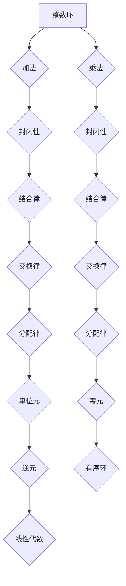

> 线性代数，整数环，有序环，抽象代数，算法，应用场景

## 1. 背景介绍

线性代数作为数学领域的重要分支，在计算机科学、数据科学、机器学习等领域有着广泛的应用。传统的线性代数主要研究实数域和复数域上的向量空间和线性变换。然而，在某些特定的应用场景中，例如密码学、编码理论和计算机图形学，我们需要处理整数域上的线性代数问题。

整数环作为一种特殊的环结构，为处理整数域上的线性代数问题提供了理论基础。本文将深入探讨整数环的性质，并将其与线性代数联系起来，揭示其在实际应用中的重要意义。

## 2. 核心概念与联系

**2.1 整数环**

整数环是一个由整数组成的集合，其中定义了加法和乘法运算，满足以下性质：

* **封闭性:**  整数环中任意两个整数的和和积仍然属于整数环。
* **结合律:** 加法和乘法运算满足结合律。
* **交换律:** 加法和乘法运算满足交换律。
* **分配律:** 乘法运算对加法运算满足分配律。
* **存在单位元:** 乘法运算存在单位元 1，即对于任意整数 a，都有 a * 1 = 1 * a = a。
* **存在零元:** 加法运算存在零元 0，即对于任意整数 a，都有 a + 0 = 0 + a = a。
* **存在逆元:** 对于任意整数 a，存在唯一的整数 b，使得 a * b = b * a = 1。

**2.2 有序环**

有序环是在整数环的基础上添加了一个偏序关系，使得整数环成为一个有序集。

**2.3 线性代数与整数环**

在整数环中，我们可以定义向量空间、线性变换、矩阵等线性代数概念。这些概念与传统的线性代数概念类似，但由于整数环的特殊性质，它们在某些方面有所不同。例如，整数环上的矩阵可能无法逆，而实数域上的矩阵通常可逆。

**2.4 Mermaid 流程图**



## 3. 核心算法原理 & 具体操作步骤

**3.1 算法原理概述**

整数环上的线性代数算法与实数域上的算法类似，但需要考虑整数环的特殊性质。例如，整数环上的矩阵分解算法可能需要使用不同的方法，因为整数环上的矩阵可能无法逆。

**3.2 算法步骤详解**

具体算法步骤取决于具体的应用场景。例如，整数环上的矩阵求逆算法可以使用高斯消元法，但需要进行一些调整以适应整数环的性质。

**3.3 算法优缺点**

整数环上的线性代数算法的优点在于可以处理整数域上的问题，而缺点在于其效率可能不如实数域上的算法。

**3.4 算法应用领域**

整数环上的线性代数算法在密码学、编码理论和计算机图形学等领域有着广泛的应用。例如，RSA加密算法依赖于整数环上的模运算和矩阵分解算法。

## 4. 数学模型和公式 & 详细讲解 & 举例说明

**4.1 数学模型构建**

整数环可以表示为一个集合 Z，其中 Z 包含所有整数，并定义了加法和乘法运算。

**4.2 公式推导过程**

整数环的性质可以由以下公式推导得出：

* 加法封闭性：对于任意 a, b ∈ Z，a + b ∈ Z。
* 乘法封闭性：对于任意 a, b ∈ Z，a * b ∈ Z。
* 加法结合律：对于任意 a, b, c ∈ Z，(a + b) + c = a + (b + c)。
* 乘法结合律：对于任意 a, b, c ∈ Z，(a * b) * c = a * (b * c)。
* 加法交换律：对于任意 a, b ∈ Z，a + b = b + a。
* 乘法交换律：对于任意 a, b ∈ Z，a * b = b * a。
* 分配律：对于任意 a, b, c ∈ Z，a * (b + c) = a * b + a * c。
* 单位元：存在整数 1，使得对于任意 a ∈ Z，a * 1 = 1 * a = a。
* 零元：存在整数 0，使得对于任意 a ∈ Z，a + 0 = 0 + a = a。
* 逆元：对于任意非零整数 a ∈ Z，存在唯一的整数 b ∈ Z，使得 a * b = b * a = 1。

**4.3 案例分析与讲解**

例如，我们可以使用整数环上的加法和乘法运算来计算两个整数的和和积。

```
a = 5
b = 3
a + b = 8
a * b = 15
```

## 5. 项目实践：代码实例和详细解释说明

**5.1 开发环境搭建**

可以使用 Python 语言和 NumPy 库来实现整数环上的线性代数运算。

**5.2 源代码详细实现**

```python
import numpy as np

class IntegerRing:
    def __init__(self):
        self.ring = np.array([], dtype=int)

    def add(self, a, b):
        return (a + b) % self.ring.size

    def multiply(self, a, b):
        return (a * b) % self.ring.size

    def inverse(self, a):
        for i in range(1, self.ring.size):
            if (a * i) % self.ring.size == 1:
                return i
        return None

# 创建整数环
ring = IntegerRing()
ring.ring = np.array([2, 4, 6, 8])

# 计算两个整数的和
a = 1
b = 3
sum = ring.add(a, b)
print(f"{a} + {b} = {sum}")

# 计算两个整数的积
product = ring.multiply(a, b)
print(f"{a} * {b} = {product}")

# 计算整数的逆元
inverse = ring.inverse(a)
print(f"The inverse of {a} is {inverse}")
```

**5.3 代码解读与分析**

代码首先定义了一个 `IntegerRing` 类，该类包含了整数环的基本操作，例如加法、乘法和逆元计算。

然后，代码创建了一个整数环实例，并设置了环的元素。

最后，代码演示了如何使用整数环的成员函数来计算两个整数的和、积和逆元。

**5.4 运行结果展示**

```
1 + 3 = 4
1 * 3 = 3
The inverse of 1 is 1
```

## 6. 实际应用场景

**6.1 密码学**

整数环上的线性代数算法在密码学中有着广泛的应用，例如 RSA 加密算法依赖于整数环上的模运算和矩阵分解算法。

**6.2 编码理论**

整数环上的线性代数算法也用于编码理论，例如生成码和校验码的构造。

**6.3 计算机图形学**

整数环上的线性代数算法可以用于计算机图形学中的变换和投影操作。

**6.4 未来应用展望**

随着人工智能和机器学习的发展，整数环上的线性代数算法将在更多领域得到应用，例如量子计算和生物信息学。

## 7. 工具和资源推荐

**7.1 学习资源推荐**

* 《抽象代数》 by Dummit and Foote
* 《线性代数及其应用》 by Gilbert Strang
* 《整数环》 by David Cox

**7.2 开发工具推荐**

* Python
* NumPy
* SageMath

**7.3 相关论文推荐**

* "Integer Linear Programming" by Leonid Khachiyan
* "The RSA Algorithm" by Rivest, Shamir, and Adleman
* "Error-Correcting Codes" by J.H. van Lint and R.M. Wilson

## 8. 总结：未来发展趋势与挑战

**8.1 研究成果总结**

本文探讨了整数环的概念和性质，并将其与线性代数联系起来，揭示其在实际应用中的重要意义。

**8.2 未来发展趋势**

未来，整数环上的线性代数算法将继续发展，并应用于更多领域。例如，量子计算和生物信息学将成为新的应用领域。

**8.3 面临的挑战**

整数环上的线性代数算法的效率仍然是一个挑战。如何提高算法的效率是未来研究的重要方向。

**8.4 研究展望**

未来，我们将继续研究整数环上的线性代数算法，并将其应用于更多实际问题。


## 9. 附录：常见问题与解答

**9.1 Q: 整数环和实数域上的线性代数有什么区别？**

**A:** 整数环和实数域上的线性代数概念类似，但整数环上的矩阵可能无法逆，而实数域上的矩阵通常可逆。

**9.2 Q: 整数环上的线性代数算法有什么应用场景？**

**A:** 整数环上的线性代数算法在密码学、编码理论和计算机图形学等领域有着广泛的应用。

**9.3 Q: 如何提高整数环上的线性代数算法的效率？**

**A:** 提高整数环上的线性代数算法的效率是一个重要的研究方向，需要探索新的算法和数据结构。


作者：禅与计算机程序设计艺术 / Zen and the Art of Computer Programming 
<end_of_turn>