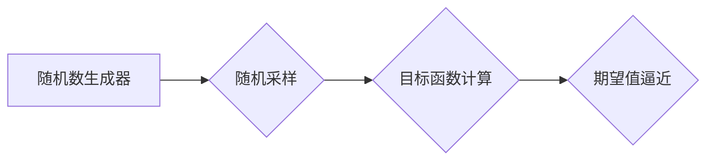

> 蒙特卡罗方法、随机模拟、概率统计、数值计算、算法原理、代码实例、Python

## 1. 背景介绍

蒙特卡罗方法，也称为随机模拟方法，是一种利用随机数进行数值计算的强大工具。它以其简单易懂、灵活应用的特点，在众多领域得到了广泛应用，例如金融建模、物理模拟、机器学习等。

蒙特卡罗方法的核心思想是通过大量随机采样，逼近目标函数或概率分布的期望值。这种方法的优势在于能够处理复杂、难以解析的系统，并提供近似但可接受的解决方案。

## 2. 核心概念与联系

### 2.1 核心概念

* **随机数:** 蒙特卡罗方法的基础是随机数生成器，它能够产生一系列看似随机的数字。
* **采样:** 从目标分布中随机抽取样本，这些样本代表了系统可能出现的各种状态。
* **期望值:** 蒙特卡罗方法的目标通常是计算目标函数或概率分布的期望值，即所有可能结果的平均值。

### 2.2 联系

蒙特卡罗方法将随机性与概率统计相结合，通过大量随机采样，逼近目标函数或概率分布的期望值。



## 3. 核心算法原理 & 具体操作步骤

### 3.1 算法原理概述

蒙特卡罗方法的基本原理是通过重复随机采样和计算，逐步逼近目标函数或概率分布的期望值。

假设我们想要计算一个函数 f(x) 在区间 [a, b] 上的期望值，我们可以采用以下步骤：

1. 在区间 [a, b] 中随机生成 N 个样本点 x1, x2, ..., xn。
2. 计算每个样本点对应的函数值 f(xi)。
3. 计算所有函数值的平均值，即：

```
期望值 ≈ (f(x1) + f(x2) + ... + f(xn)) / N
```

随着样本数量 N 的增加，期望值逼近的精度会提高。

### 3.2 算法步骤详解

1. **定义目标函数:** 首先需要明确要计算的目标函数 f(x)。
2. **确定采样范围:** 根据目标函数的定义，确定采样范围，例如区间 [a, b]。
3. **生成随机样本:** 使用随机数生成器在采样范围内生成 N 个随机样本点 x1, x2, ..., xn。
4. **计算函数值:** 对每个样本点 xi 计算函数值 f(xi)。
5. **计算期望值:** 计算所有函数值的平均值，作为目标函数在采样范围内的期望值。

### 3.3 算法优缺点

**优点:**

* **简单易懂:** 算法原理简单易懂，易于理解和实现。
* **灵活应用:** 可以应用于各种复杂问题，包括难以解析的系统。
* **无需解析式:** 不需要求解目标函数的解析式，直接通过采样逼近。

**缺点:**

* **精度依赖于样本数量:** 算法的精度取决于采样数量 N，需要足够多的样本才能获得较高的精度。
* **计算成本:** 对于高维问题，计算成本可能会很高。

### 3.4 算法应用领域

蒙特卡罗方法广泛应用于以下领域:

* **金融建模:** 估算期权价格、风险管理、投资组合优化等。
* **物理模拟:** 模拟粒子运动、流体流动、量子力学等。
* **机器学习:** 训练神经网络、贝叶斯推理等。
* **游戏开发:** 生成随机事件、模拟游戏世界等。

## 4. 数学模型和公式 & 详细讲解 & 举例说明

### 4.1 数学模型构建

假设我们想要计算一个函数 f(x) 在区间 [a, b] 上的期望值，我们可以使用以下数学模型：

```
E[f(x)] = ∫_a^b f(x) p(x) dx
```

其中：

* E[f(x)] 是函数 f(x) 在区间 [a, b] 上的期望值。
* p(x) 是函数 f(x) 在区间 [a, b] 上的概率密度函数。

### 4.2 公式推导过程

蒙特卡罗方法通过随机采样来逼近期望值。假设我们从区间 [a, b] 中随机抽取 N 个样本点 x1, x2, ..., xn，每个样本点对应的概率密度为 p(xi)。

则期望值的蒙特卡罗逼近公式为：

```
E[f(x)] ≈ (f(x1) + f(x2) + ... + f(xn)) / N
```

### 4.3 案例分析与讲解

**例子:** 计算函数 f(x) = x^2 在区间 [0, 1] 上的期望值。

1. **定义目标函数:** f(x) = x^2
2. **确定采样范围:** [0, 1]
3. **生成随机样本:** 从区间 [0, 1] 中随机生成 1000 个样本点。
4. **计算函数值:** 对每个样本点计算 f(xi) = xi^2。
5. **计算期望值:** 计算所有函数值的平均值，作为目标函数在区间 [0, 1] 上的期望值。

通过蒙特卡罗方法，我们可以得到函数 f(x) = x^2 在区间 [0, 1] 上的期望值近似值。

## 5. 项目实践：代码实例和详细解释说明

### 5.1 开发环境搭建

本示例使用 Python 语言进行实现。需要安装 Python 3.x 及相关库，例如 NumPy 和 Matplotlib。

### 5.2 源代码详细实现

```python
import numpy as np
import matplotlib.pyplot as plt

def monte_carlo_integration(f, a, b, n):
    """
    使用蒙特卡罗方法计算函数在区间 [a, b] 上的积分

    Args:
        f: 目标函数
        a: 区间下限
        b: 区间上限
        n: 采样数量

    Returns:
        函数在区间 [a, b] 上的积分近似值
    """
    x = np.random.uniform(a, b, n)
    y = f(x)
    integral = (b - a) * np.mean(y)
    return integral

# 定义目标函数
def f(x):
    return x**2

# 设置区间和采样数量
a = 0
b = 1
n = 1000

# 计算积分
integral = monte_carlo_integration(f, a, b, n)

# 打印结果
print(f"函数在区间 [{a}, {b}] 上的积分近似值为: {integral}")

# 可视化结果
x = np.linspace(a, b, 100)
y = f(x)
plt.plot(x, y)
plt.xlabel("x")
plt.ylabel("f(x)")
plt.title("目标函数和采样点")
plt.show()
```

### 5.3 代码解读与分析

* `monte_carlo_integration` 函数实现蒙特卡罗积分算法。
* `f` 函数定义目标函数。
* `a` 和 `b` 设置积分区间。
* `n` 设置采样数量。
* `np.random.uniform` 生成均匀分布的随机数。
* `np.mean` 计算样本值的平均值。
* `plt.plot` 绘制目标函数和采样点。

### 5.4 运行结果展示

运行代码后，会输出函数在区间 [0, 1] 上的积分近似值，并绘制目标函数和采样点的图形。

## 6. 实际应用场景

### 6.1 金融建模

蒙特卡罗方法广泛应用于金融建模，例如：

* **期权定价:** 估算期权价格，考虑各种市场风险因素。
* **风险管理:** 计算投资组合的风险暴露，评估潜在损失。
* **投资组合优化:** 构建最优投资组合，最大化收益并控制风险。

### 6.2 物理模拟

蒙特卡罗方法在物理模拟中用于模拟各种复杂现象，例如：

* **粒子运动:** 模拟粒子在电磁场中的运动轨迹。
* **流体流动:** 模拟流体在管道或容器中的流动。
* **量子力学:** 模拟原子和分子的行为。

### 6.3 机器学习

蒙特卡罗方法在机器学习中用于训练神经网络和贝叶斯推理，例如：

* **神经网络训练:** 使用蒙特卡罗采样来更新神经网络权重。
* **贝叶斯推理:** 使用蒙特卡罗方法来估计概率分布。

### 6.4 未来应用展望

随着计算能力的提升和算法的改进，蒙特卡罗方法将在更多领域得到应用，例如：

* **药物研发:** 模拟药物分子与蛋白质相互作用，加速药物发现。
* **气候模型:** 模拟气候变化，预测未来气候趋势。
* **人工智能:** 增强人工智能算法的鲁棒性和泛化能力。

## 7. 工具和资源推荐

### 7.1 学习资源推荐

* **书籍:**
    * 《蒙特卡罗方法》 -  Robert, S.M. & Casella, G.
    * 《随机模拟》 -  Law, A.M. & Kelton, W.D.
* **在线课程:**
    * Coursera: "Monte Carlo Methods"
    * edX: "Introduction to Monte Carlo Methods"

### 7.2 开发工具推荐

* **Python:** 广泛用于蒙特卡罗方法的实现，拥有丰富的库和工具。
* **R:** 统计分析语言，也支持蒙特卡罗方法的应用。

### 7.3 相关论文推荐

* "A Simple Monte Carlo Method for Estimating the Value of Options" - Black, F. & Scholes, M.
* "Monte Carlo Methods in Financial Engineering" - Glasserman, P.

## 8. 总结：未来发展趋势与挑战

### 8.1 研究成果总结

蒙特卡罗方法在过去几十年取得了显著进展，应用领域不断扩展，算法效率不断提高。

### 8.2 未来发展趋势

* **并行计算:** 利用并行计算技术加速蒙特卡罗方法的执行速度。
* **机器学习:** 将机器学习技术与蒙特卡罗方法相结合，提高算法的精度和效率。
* **量子计算:** 利用量子计算的优势，开发新的蒙特卡罗方法，解决传统方法难以处理的复杂问题。

### 8.3 面临的挑战

* **高维问题:** 对于高维问题，蒙特卡罗方法的计算成本会急剧增加。
* **样本效率:** 提高蒙特卡罗方法的样本效率，减少所需的采样数量。
* **理论分析:** 深入研究蒙特卡罗方法的理论性质，提高算法的可靠性和可解释性。

### 8.4 研究展望

未来，蒙特卡罗方法将继续发展，成为解决复杂问题的重要工具。

## 9. 附录：常见问题与解答

**问题 1:** 蒙特卡罗方法的精度如何？

**答案:** 蒙特卡罗方法的精度取决于采样数量 N。随着 N 的增加，精度会提高。

**问题 2:** 蒙特卡罗方法适用于哪些问题？

**答案:** 蒙特卡罗方法适用于各种复杂问题，包括难以解析的系统，例如金融建模、物理模拟、机器学习等。

**问题 3:** 蒙特卡罗方法的计算成本如何？

**答案:** 蒙特卡罗